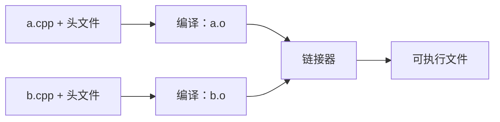
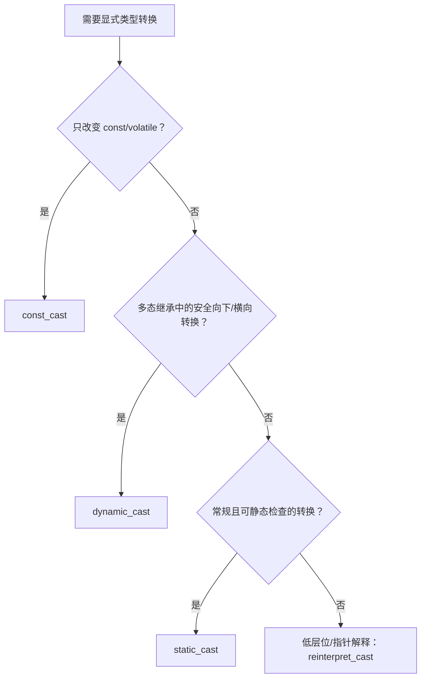

# C++ 基础知识复习笔记

> 本笔记根据 `01_base` 目录中的示例整理，目标是用于 C++ 面试前快速复习。内容不仅总结“怎么写”，也标出常见追问、易错点和更符合现代 C++ 的实践。

## 目录

- [1. C++ 输入输出与程序入口](#1-c-输入输出与程序入口)
- [2. 命名空间](#2-命名空间)
- [3. const 限定符](#3-const-限定符)
- [4. new 与 delete](#4-new-与-delete)
- [5. 引用](#5-引用)
- [6. C++ 类型转换](#6-c-类型转换)
- [7. 函数重载](#7-函数重载)
- [8. 默认参数](#8-默认参数)
- [9. bool 类型](#9-bool-类型)
- [10. 宏与 inline](#10-宏与-inline)
- [11. 高频面试题速答](#11-高频面试题速答)
- [12. 源码索引](#12-源码索引)

---

## 1. C++ 输入输出与程序入口

### 1.1 `iostream` 与流

```cpp
#include <iostream>

int main()
{
    int number{};
    std::cout << "请输入一个整数：";
    std::cin >> number;
    std::cout << "number = " << number << '\n';
}
```

- `std::cout`：标准输出流。
- `std::cin`：标准输入流。
- `<<`：流插入运算符，把数据写入输出流。
- `>>`：流提取运算符，从输入流读取数据。
- `std::cerr`：通常用于立即输出错误信息。
- `std::clog`：通常用于输出日志信息。

> [!NOTE]
> `std::endl` 不仅换行，还会刷新缓冲区；普通换行通常优先使用 `'\n'`，避免不必要的刷新。

### 1.2 `main` 的命令行参数

```cpp
int main(int argc, char* argv[])
{
    // argc：参数个数，至少为 1
    // argv[0]：通常是程序名或程序路径
    // argv[1] ... argv[argc - 1]：用户参数
}
```

访问 `argv[i]` 前必须保证 `i < argc`，否则会越界。标准允许的常见入口形式是 `int main()` 和 `int main(int argc, char* argv[])`。

---

## 2. 命名空间

### 2.1 为什么需要命名空间

命名空间用于组织代码、隔离名字，避免不同模块的变量、函数或类型重名。

```cpp
namespace company_a {
int number = 1;
void print() {}
}

namespace company_b {
int number = 2;
void print() {}
}

int main()
{
    company_a::print();
    company_b::print();
}
```

命名空间中可以定义变量、函数、类、枚举、类型别名以及嵌套命名空间等实体。

### 2.2 三种使用方式

```cpp
// 1. 作用域限定符：最明确
std::cout << company_a::number;

// 2. using 声明：只引入指定名字
using company_a::print;
print();

// 3. using 指令：引入整个命名空间中的候选名字
using namespace company_a;
print();
```

> [!IMPORTANT]
> 头文件中不要写 `using namespace std;`。它会污染所有包含该头文件的翻译单元，增加名字冲突和重载歧义。工程代码优先使用限定名，或在尽量小的局部作用域内使用 `using` 声明。

`using namespace` 并不是把所有声明“复制”到当前作用域，而是使名字查找时也考虑该命名空间，因此仍可能产生二义性：

```cpp
namespace a { int value = 1; }
namespace b { int value = 2; }

using namespace a;
using namespace b;

// std::cout << value; // 错误：value 有歧义
std::cout << a::value; // 正确
```

### 2.3 嵌套、合并与别名

```cpp
namespace outer {
namespace inner {
int value = 42;
}
}

// C++17 简写
namespace project::network {
void connect() {}
}

// 命名空间别名
namespace net = project::network;
```

同名命名空间可以分多次定义，这叫命名空间扩展：

```cpp
namespace app { void start(); }
namespace app { void stop(); }  // 与上面是同一个 app
```

但同一命名空间内不能重复定义同一个实体。

### 2.4 匿名命名空间与内部链接

```cpp
namespace {
int local_value = 100;
void helper() {}
}
```

匿名命名空间中的名字具有内部链接属性，只能在当前翻译单元中使用，常用于 `.cpp` 文件的私有实现。

> [!NOTE]
> 在 C++ 中，文件作用域的匿名命名空间通常比 `static` 全局函数/变量更统一；两者都可用于限制名字只在当前翻译单元可见。

### 2.5 `extern`、声明、定义与链接

多个源文件协作时，通常在头文件中放声明，在某一个 `.cpp` 中放唯一的定义：

```cpp
// counter.hpp
extern int counter;       // 声明
void increase();          // 函数声明本身就具有 extern 含义

// counter.cpp
int counter = 0;          // 定义并分配存储
void increase() { ++counter; }
```

- 声明：告诉编译器名字和类型，可以重复出现。
- 定义：创建实体或提供函数体；受单一定义规则（ODR）约束。
- `extern int counter;`：通常只是声明，不分配该变量的存储。
- `extern int counter = 0;`：带初始化器，因此是定义。

构建过程可简化为：



编译阶段需要看到合法声明；链接阶段负责把不同翻译单元中的引用与定义匹配起来。缺少定义常见报错是 `undefined reference`，重复定义常见报错是 `multiple definition`。

---

## 3. `const` 限定符

### 3.1 基础语义

```cpp
const int a = 10;
int const b = 20; // 与上一种写法等价
```

`const` 表示不能通过该名字或访问路径修改对象。它提供类型检查，比宏常量更安全，并保留类型和作用域信息。

```cpp
constexpr int max_count = 100; // 若值必须用于编译期语境，优先考虑 constexpr
```

> [!NOTE]
> `const` 不一定代表“编译期常量”；`constexpr` 才明确要求对象可用于常量表达式。二者关注点不同。

### 3.2 `const` 与指针

阅读方法：从变量名开始，向外结合；也可以观察 `const` 位于 `*` 的左侧还是右侧。

| 声明 | 指针能否改指向 | 能否通过指针改对象 | 含义 |
|---|---:|---:|---|
| `const int* p` | 能 | 不能 | 指向常量的指针 |
| `int const* p` | 能 | 不能 | 同上 |
| `int* const p = &x` | 不能 | 能 | 常量指针 |
| `const int* const p = &x` | 不能 | 不能 | 指向常量的常量指针 |

```cpp
int x = 1;
int y = 2;

const int* p1 = &x;
p1 = &y;       // 正确
// *p1 = 3;    // 错误

int* const p2 = &x;
*p2 = 3;       // 正确
// p2 = &y;    // 错误
```

> [!IMPORTANT]
> `const int*` 表示不能“通过该指针”修改对象，不保证对象本身永远不变。如果它实际指向一个非 `const` 对象，其他非 `const` 访问路径仍然可以修改该对象。

### 3.3 顶层 `const` 与底层 `const`

- 顶层 `const`：对象本身是常量，例如 `int* const p` 中的指针本身。
- 底层 `const`：指向或引用的对象受 `const` 限定，例如 `const int* p`。

按值传参会复制实参，所以形参的顶层 `const` 不参与函数类型区分：

```cpp
void f(int);
void f(const int); // 与上一声明是同一个函数，不能构成重载
```

而底层 `const` 可以区分重载：

```cpp
void f(int*);
void f(const int*); // 可以构成重载
```

---

## 4. `new` 与 `delete`

### 4.1 与 `malloc/free` 的区别

| 对比项 | `new/delete` | `malloc/free` |
|---|---|---|
| 所属语言 | C++ 运算符 | C 标准库函数 |
| 大小计算 | 根据类型自动计算 | 手动传字节数 |
| 返回类型 | 对应类型指针 | `void*` |
| 构造/析构 | 调用构造函数/析构函数 | 不调用 |
| 失败行为 | 默认抛出 `std::bad_alloc` | 返回空指针 |
| 能否混用 | 必须与对应的 `delete` 配对 | 必须与 `free` 配对 |

> [!CAUTION]
> `new` 得到的内存不能交给 `free`，`malloc` 得到的内存不能交给 `delete`。混用会导致未定义行为。

### 4.2 单个对象的初始化与释放

```cpp
int* p1 = new int;       // 默认初始化：值不确定
int* p2 = new int();     // 值初始化：0
int* p3 = new int{42};   // 列表初始化：42

delete p1;
delete p2;
delete p3;

p1 = p2 = p3 = nullptr;
```

`delete nullptr;` 是安全的，不执行任何操作。置空只能防止继续通过同一个指针误用；如果还有其他指针指向该内存，它们仍是悬空指针。

### 4.3 动态数组

```cpp
int* values = new int[3]{1, 2, 3};
// ...
delete[] values;
values = nullptr;
```

配对规则必须严格一致：

```text
new T       <-> delete
new T[n]    <-> delete[]
```

> [!CAUTION]
> 示例源码 `08_new_delete.cc` 中的 `new int[]{}` 没有可安全访问的元素，随后访问 `p2[0]`、`p2[1]`、`p2[2]` 属于越界访问，应改成 `new int[3]{}`。

### 4.4 常见内存问题

- 内存泄漏：申请后丢失地址，没有释放。
- 悬空指针：对象已销毁，指针仍保存旧地址。
- 重复释放：同一块内存释放两次。
- 越界访问：读写不属于该对象或数组的内存。
- `new/delete` 或 `new[]/delete[]` 不匹配。
- 使用未初始化指针或未初始化的基本类型对象。

现代 C++ 优先使用自动资源管理：

```cpp
#include <memory>
#include <vector>

auto value = std::make_unique<int>(42);
std::vector<int> values{1, 2, 3};
```

这体现了 RAII：资源的生命周期绑定到对象生命周期，离开作用域时自动释放。除非实现底层资源管理设施，一般业务代码应避免裸 `new/delete`。

---

## 5. 引用

### 5.1 基本概念

左值引用是已有对象的别名：

```cpp
int number = 1;
int& ref = number;

ref = 2; // 修改的就是 number
```

核心规则：

- 引用必须在定义时初始化。
- 普通引用绑定后不能改为引用另一个对象。
- 对引用赋值，是给被引用对象赋值，不是“重新绑定”。
- 普通非常量左值引用不能绑定临时量。
- 语言层面不存在可正常使用的“空引用”。

```cpp
int a = 1;
int b = 2;
int& ref = a;
ref = b; // 等价于 a = b；ref 仍然引用 a
```

> [!IMPORTANT]
> 面试中不要简单回答“引用就是常量指针”。引用和指针在编译器实现中可能采用相似机制，但 C++ 语言语义不同：引用是别名、必须初始化、不能重新绑定，也不需要显式解引用。

### 5.2 引用与指针对比

| 对比项 | 引用 | 指针 |
|---|---|---|
| 定义时初始化 | 必须 | 不必须，但应初始化 |
| 改变绑定/指向 | 不可以 | 可以 |
| 空值 | 正常语义下没有 | 可以是 `nullptr` |
| 使用对象 | 直接使用 | 通常需要 `*` 或 `->` |
| 多级形式 | 没有引用的引用 | 可以有多级指针 |
| 自身地址 | `&ref` 得到被引用对象地址 | `&p` 得到指针对象地址 |

选择原则：

- 参数必须代表一个有效对象且不需要重新绑定：优先引用。
- “没有对象”是合法状态，或需要改变指向：使用指针。

### 5.3 参数传递

```cpp
void by_value(int value);          // 复制，不能修改实参
void by_pointer(int* value);       // 可修改实参，可传 nullptr
void by_reference(int& value);     // 可修改实参，不复制 int
void read_only(const int& value);  // 只读引用，可避免大对象复制
```

对于 `int` 这类小型标量，按值传递通常最简单；`const T&` 主要适合复制成本较高且函数只读的对象。

```cpp
void swap(int& lhs, int& rhs)
{
    int temp = lhs;
    lhs = rhs;
    rhs = temp;
}
```

### 5.4 常量引用与临时对象

```cpp
const int& ref = 42; // 合法，临时对象的生命周期延长到 ref 的生命周期
```

常量引用既能绑定非常量对象，也能绑定常量对象和临时对象，因此经常用于只读参数。

### 5.5 引用作为返回值

```cpp
int global_value = 100;

int& get_global()
{
    return global_value; // 合法：对象在函数返回后仍存在
}
```

返回引用可以避免复制，并允许调用方修改被引用对象：

```cpp
get_global() = 200;
```

但绝不能返回局部自动变量的引用或指针：

```cpp
int& wrong()
{
    int local = 10;
    return local; // 错误：返回后 local 生命周期结束，引用悬空
}
```

> [!NOTE]
> “返回值一定发生复制”并不准确。现代 C++ 中可能发生返回值优化（RVO/NRVO），并且还存在移动语义；不要为了所谓“避免复制”盲目返回引用。

---

## 6. C++ 类型转换

C 风格强转 `(T)value` 表意不清，可能同时尝试多种转换。C++ 提供四种具名转换，使意图和风险更明确。

### 6.1 `static_cast`

用于编译期可检查的、关系明确的转换：

```cpp
double pi = 3.14;
int integer = static_cast<int>(pi); // 结果为 3，小数部分被截断

void* raw = nullptr;
int* p = static_cast<int*>(raw);
```

常见用途：

- 数值类型之间转换。
- `void*` 与具体对象指针之间转换。
- 有继承关系的指针/引用转换，但向下转换不做运行时检查，需自行保证真实类型正确。

不能用它在无关指针类型之间随意转换，例如 `double*` 转 `int*`。

### 6.2 `dynamic_cast`

用于多态继承体系中安全地向下转换或横向转换：

```cpp
struct Base { virtual ~Base() = default; };
struct Derived : Base {};

Base* base = new Derived;
Derived* derived = dynamic_cast<Derived*>(base);
```

- 对指针转换失败：返回 `nullptr`。
- 对引用转换失败：抛出 `std::bad_cast`。
- 源类型通常必须是多态类型，即至少有一个虚函数。

### 6.3 `const_cast`

只用于增加或移除底层 `const/volatile`：

```cpp
void legacy_api(char*);

void call(const char* text)
{
    legacy_api(const_cast<char*>(text));
}
```

> [!CAUTION]
> 去掉 `const` 不代表修改一定合法。如果对象最初就是 `const` 对象，通过转换后的路径修改它会产生未定义行为。`const_cast` 常用于兼容没有正确标注只读性的旧接口，而不是绕过类型系统。

### 6.4 `reinterpret_cast`

用于低层、实现相关的位模式或无关指针类型转换：

```cpp
std::uintptr_t address =
    reinterpret_cast<std::uintptr_t>(some_pointer);
```

风险最高，常见于系统编程、硬件接口、序列化底层实现。转换成功只表示语法允许，不代表解引用或使用结果就是安全的。

### 6.5 如何选择



---

## 7. 函数重载

### 7.1 定义与成立条件

同一作用域内，函数名相同而参数列表不同的一组函数叫函数重载。

```cpp
void print();
void print(int);
void print(double);
void print(int, double);
void print(double, int);
```

可以通过以下差异构成重载：

- 参数数量不同。
- 参数类型不同。
- 参数类型的排列顺序不同。
- 引用或指针指向类型的底层 `const` 不同。

以下情况不能仅凭此构成重载：

```cpp
int  calculate(int);
// double calculate(int); // 错误：不能只靠返回类型区分

void f(int);
// void f(const int);     // 错误：按值参数的顶层 const 不区分函数类型

void g(int[]);
// void g(int*);          // 错误：数组形参会调整为指针
```

### 7.2 重载决议

编译器先收集候选函数，再筛选可行函数，最后比较隐式转换序列，选出唯一的最佳匹配。常见转换优先级可粗略记为：

```text
精确匹配 > 类型提升 > 一般标准转换 > 用户自定义转换 > 省略号
```

```cpp
void print(int, double);
void print(double, int);

// print(1, 1); // 两个候选各有一个精确匹配和一个转换，没有唯一最佳项，调用有歧义
```

> [!IMPORTANT]
> “编译器按返回值选择重载”是错误说法，因为调用处可能不使用返回值，而且 C++ 的函数签名/重载决议不靠返回类型区分同参数列表的普通函数。

### 7.3 C++ 为什么支持重载

C++ 编译器通常通过名字修饰（name mangling）把函数名、命名空间和参数类型等信息编码进链接符号，使不同重载拥有不同符号。具体修饰规则由 ABI/编译器实现决定。

### 7.4 `extern "C"`

```cpp
extern "C" {
void c_api(int);
}
```

`extern "C"` 指定 C 语言链接方式，主要用于 C/C++ 互操作，避免 C++ 名字修饰造成链接不匹配。它不表示函数体改用 C 语法编译，也不能在同一个 C 链接名字下进行普通 C++ 函数重载。

常见跨语言头文件写法：

```cpp
#ifdef __cplusplus
extern "C" {
#endif

void c_api(int);

#ifdef __cplusplus
}
#endif
```

---

## 8. 默认参数

```cpp
void print(int a = 0, int b = 0);

print();      // a=0, b=0
print(1);     // a=1, b=0
print(1, 2);  // a=1, b=2
```

规则：

1. 默认实参必须从右向左连续提供。
2. 调用时只能从右侧省略参数，不能跳过中间参数。
3. 默认实参通常放在头文件中的函数声明处。
4. 在同一作用域中，同一个参数不能重复指定默认值。
5. 默认实参在调用点根据可见声明替换，不是函数内部运行时决定。

```cpp
void f(int x, int y = 10, int z = 20); // 正确
// void g(int x = 1, int y);           // 错误
```

### 默认参数与重载的歧义

```cpp
void print(int);
void print(int, int = 0);

// print(1); // 错误：两个函数都可行，调用有歧义
```

设计接口时应避免让默认参数和重载覆盖同一种调用形式。

---

## 9. `bool` 类型

`bool` 是 C++ 内置基本类型，只有两个值：`true` 和 `false`。

```cpp
bool a = true;
bool b = false;

std::cout << a;                  // 默认输出 1
std::cout << std::boolalpha << a; // 输出 true
```

### 9.1 与数值、指针的转换

- 整数或浮点数转换为 `bool`：零变为 `false`，非零变为 `true`。
- 指针转换为 `bool`：空指针为 `false`，非空指针为 `true`。
- `bool` 转换为整数：`false` 为 `0`，`true` 为 `1`。

```cpp
bool b1 = 0;        // false
bool b2 = -100;     // true
bool b3 = 3.14;     // true
bool b4{nullptr};   // false；nullptr 到 bool 的转换要求直接初始化
```

> [!NOTE]
> 在常见平台上 `sizeof(bool) == 1`，但标准只保证它至少能表示 `true` 和 `false`，不要依赖它的具体对象表示。多个 `bool` 也不一定被自动压缩成位。

---

## 10. 宏与 `inline`

### 10.1 宏函数的问题

```cpp
#define MAX(a, b) ((a) > (b) ? (a) : (b))
#define SQUARE(x) ((x) * (x))
```

宏在预处理阶段进行文本替换：

- 没有类型检查。
- 不遵守普通函数的作用域和语义规则。
- 调试不便。
- 参数可能被求值多次。
- 括号不足容易改变运算优先级。

```cpp
int i = 2;
// SQUARE(i++); // i++ 会执行两次，产生非预期结果
```

即使为宏参数和整个表达式添加括号，也不能解决重复求值问题。

### 10.2 内联函数

```cpp
inline int square(int x)
{
    return x * x;
}
```

内联函数具有函数的类型检查、作用域和单次参数求值语义。`inline` 只是允许/建议内联展开，编译器可以拒绝；没有写 `inline` 的函数也可能被优化器内联。

真正重要的语言含义是：`inline` 函数或变量可以在多个翻译单元中出现相同定义而不违反 ODR，因此其完整定义通常写在头文件中。

```cpp
// math.hpp
#pragma once

inline int square(int x)
{
    return x * x;
}
```

类定义内部定义的成员函数隐式具有 `inline` 属性。

> [!IMPORTANT]
> 不应把普通 `.cpp` 实现文件 `#include` 到头文件中。源码示例 `testInline/print.hpp` 包含 `print.cc` 虽能演示“让定义可见”，但工程中更推荐直接把短小的 `inline` 定义写在 `.hpp`，或把模板/内联实现放入专门的 `.tpp/.ipp` 文件。

### 10.3 宏、内联函数与模板

| 特性 | 函数式宏 | `inline` 函数 | 函数模板 |
|---|---|---|---|
| 处理阶段 | 预处理 | 编译 | 编译 |
| 类型检查 | 无 | 有 | 有 |
| 参数是否可能重复求值 | 可能 | 不会 | 不会 |
| 支持多种类型 | 文本替换 | 需重载 | 支持类型泛化 |
| 推荐场景 | 条件编译等少数场景 | 短小函数、头文件定义 | 类型无关算法 |

现代 C++ 中，计算类宏通常优先改写为 `inline`/`constexpr` 函数或函数模板：

```cpp
template <typename T>
constexpr T square(T value)
{
    return value * value;
}
```

---

## 11. 高频面试题速答

### 1. `const int* p` 和 `int* const p` 有什么区别？

前者是指向常量的指针，可以改指向，不能通过 `p` 改对象；后者是常量指针，不能改指向，但可以改所指的非 `const` 对象。

### 2. 引用和指针最核心的区别是什么？

引用在语言语义上是对象别名，必须初始化且不能重新绑定；指针是保存地址的独立对象，可以为空，也可以改变指向。不要只回答“引用底层是常量指针”。

### 3. 为什么不能返回局部变量的引用？

局部自动变量在函数返回时生命周期结束，返回的引用会悬空，之后使用产生未定义行为。

### 4. `new/delete` 和 `malloc/free` 的主要区别是什么？

`new/delete` 是 C++ 运算符，按类型分配并调用构造/析构；`malloc/free` 只管理原始字节，不调用构造/析构。二者不能交叉配对。

### 5. `delete` 后为什么常把指针置为 `nullptr`？

避免通过这个指针再次访问或释放已销毁对象。但它只能清理当前指针，无法让其他别名指针自动失效；更好的方案通常是使用 RAII 和智能指针。

### 6. 函数重载能否只靠返回类型区分？

不能。重载主要根据函数名和参数列表决议，返回类型不足以确定调用哪个函数。

### 7. `extern "C"` 有什么作用？

指定 C 语言链接方式，使 C++ 生成的链接符号能与 C 接口匹配。它不把 C++ 函数体变成 C 代码，也不等于动态链接。

### 8. `inline` 是否一定让函数在调用处展开？

不一定。是否展开由编译器决定；`inline` 更关键的标准语义是允许相同定义出现在多个翻译单元中。

### 9. `const_cast` 去掉 `const` 后就能安全修改吗？

不能。如果原对象本来就是 `const`，修改会产生未定义行为；只有原对象实际非 `const` 时，去掉访问路径上的 `const` 后修改才可能合法。

### 10. 默认参数是在声明处还是定义处指定？

通常在调用方可见的声明（一般是头文件）中指定，定义处不重复写。默认实参由编译器在调用点根据可见声明补齐。

### 11. 什么是 ODR？

ODR 是单一定义规则。类型、模板和 `inline` 实体可以在多个翻译单元中拥有满足要求的相同定义；普通非内联函数和具有外部链接的变量在整个程序中通常只能有一个定义。

### 12. 为什么头文件不能随意定义普通函数和全局变量？

头文件会被多个 `.cpp` 展开包含，普通定义可能出现在多个翻译单元，最终造成 ODR 违规或重复定义。应放声明，把唯一普通定义放入 `.cpp`；需要头文件定义时使用适当的 `inline`、模板或 C++17 内联变量。

---

## 12. 源码索引

| 主题 | 对应示例 |
|---|---|
| 输入输出、命令行参数 | `hello.cc` |
| 命名空间入门与使用 | `01_namespace_introduction.cc`、`02_namespace_use.cc` |
| 命名冲突、嵌套与匿名命名空间 | `03_namespace_problems.cc`、`04_special_namespace.cc` |
| 命名空间扩展、跨文件 `extern` | `05_namespace_expand.cc`、`testExtern/` |
| `const` 与指针 | `06_const_introduction.cc`、`07_const_pointer.cc` |
| 动态内存 | `08_new_delete.cc` |
| 引用及其应用 | `09_reference.cc`、`10_reference_use.cc` |
| C++ 类型转换 | `11_cast.cc` |
| 函数重载与 C 链接 | `12_overload.c`、`13_overload.cc`、`practice/01_overload.cc` |
| 默认参数 | `14_default_params.cc`、`practice/03_default_params.cc` |
| `bool` | `15_bool.cc` |
| 宏与内联函数 | `16_inline.cc`、`testInline/`、`practice/02_inline_macro.cc` |

> [!TIP]
> 复习时建议先遮住“高频面试题速答”的答案口述一遍，再回到对应章节补充规则、反例和工程实践。能够解释“为什么”以及指出未定义行为，通常比只背语法更有面试价值。
