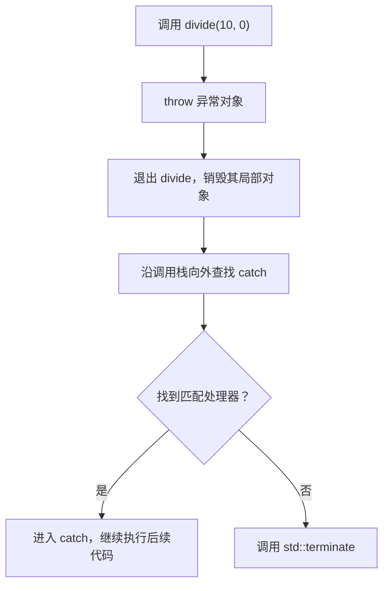
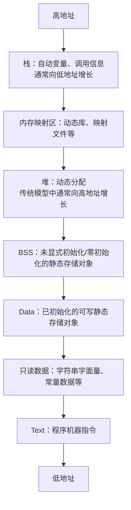

# C++ 面向对象基础复习笔记

> 本笔记根据 `02_base_oop` 目录中的示例整理，用于 C++ 面试前复习。除了基本语法，还补充了对象生命周期、资源管理、继承与动态多态等常见追问，并标出了示例代码中需要警惕的写法。

## 目录

- [1. 异常处理](#1-异常处理)
- [2. 程序内存与对象存储](#2-程序内存与对象存储)
- [3. C 风格字符串与 std::string](#3-c-风格字符串与-stdstring)
- [4. 面向对象与类](#4-面向对象与类)
- [5. 访问控制与封装](#5-访问控制与封装)
- [6. 继承](#6-继承)
- [7. 多态](#7-多态)
- [8. 类的声明、定义与成员函数](#8-类的声明定义与成员函数)
- [9. 资源型类与特殊成员函数](#9-资源型类与特殊成员函数)
- [10. struct 与 class](#10-struct-与-class)
- [11. 高频面试题速答](#11-高频面试题速答)
- [12. 源码索引与勘误](#12-源码索引与勘误)

---

## 1. 异常处理

### 1.1 基本语法

C++ 使用 `throw` 抛出异常、`try` 标记受监控的代码、`catch` 捕获并处理异常：

```cpp
#include <stdexcept>

int divide(int lhs, int rhs)
{
    if (rhs == 0) {
        throw std::invalid_argument{"除数不能为 0"};
    }
    return lhs / rhs;
}

int main()
{
    try {
        int result = divide(10, 0);
    } catch (const std::invalid_argument& error) {
        // error.what() 返回异常说明
    }
}
```

异常用于表达函数无法按约定完成任务。它与普通返回值的区别在于：异常会沿调用链向外传播，直到遇到匹配的处理器。



### 1.2 `catch` 的匹配规则

`catch` 按书写顺序匹配，匹配成功后不会再尝试后面的处理器。

```cpp
try {
    // ...
} catch (const std::invalid_argument& error) {
    // 先捕获具体派生异常
} catch (const std::exception& error) {
    // 再捕获标准异常基类
} catch (...) {
    // 捕获任意异常，但拿不到异常对象
}
```

重要规则：

- 通常要求抛出类型与 `catch` 类型匹配，或存在允许的派生类到基类等异常匹配关系。
- 捕获类类型异常时优先使用 `const T&`，避免复制和对象切片。
- 派生异常的处理器必须写在基类异常处理器之前。
- `catch (...)` 应放在最后。
- `throw;` 只能在异常处理上下文中重新抛出当前异常，并保留其动态类型。
- `throw error;` 会抛出一个新表达式结果，可能发生复制甚至切片。

```cpp
catch (const std::exception& error) {
    log(error.what());
    throw; // 原样继续传播
}
```

> [!IMPORTANT]
> 源码注释中的“只有 `catch` 类型与 `throw` 类型完全一致才匹配”过于绝对。异常匹配还支持派生类到无歧义公共基类、数组到指针、函数到指针等有限转换，但不会像普通函数调用那样任意执行数值转换。

### 1.3 标准异常类型

常见标准异常都派生自 `std::exception`：

```text
std::exception
├── std::logic_error
│   ├── std::invalid_argument
│   ├── std::domain_error
│   ├── std::length_error
│   └── std::out_of_range
└── std::runtime_error
    ├── std::range_error
    ├── std::overflow_error
    └── std::underflow_error
```

此外还常见：

- `std::bad_alloc`：普通 `new` 分配失败。
- `std::bad_cast`：对引用执行失败的 `dynamic_cast`。
- `std::bad_typeid`：某些无效的 `typeid` 操作。

相比抛出 `0` 或字符串字面量，抛出有语义的异常对象更容易统一处理：

```cpp
throw std::out_of_range{"数组下标越界"};
```

### 1.4 栈展开与 RAII

异常离开作用域时，已经完整构造的局部对象会按构造的逆序析构，这个过程叫栈展开。

```cpp
void process()
{
    std::vector<int> values(100);
    std::unique_ptr<Resource> resource = acquire();
    risky_operation(); // 即使抛异常，前两个对象也会自动清理
}
```

这也是 RAII 的重要价值：资源释放由析构函数完成，不依赖每条控制路径手写清理代码。

> [!CAUTION]
> 析构函数通常不应让异常逃逸。尤其在处理另一个异常的栈展开期间，如果析构函数再次抛出异常，程序通常会调用 `std::terminate`。析构函数默认也是 `noexcept` 语境。

### 1.5 `noexcept`

```cpp
void cleanup() noexcept;
```

`noexcept` 表示异常不应逃离该函数；若仍有异常逃出，程序调用 `std::terminate`。

常见场景：

- 析构函数和释放资源的函数。
- 确实不会失败的交换、移动操作。
- 标准容器可能根据移动构造是否 `noexcept` 决定扩容时使用移动还是复制。

> [!NOTE]
> 异常适合“无法在当前层处理的失败”，不适合代替普通分支、循环控制或高频可预期状态。是否使用异常还取决于项目规范和性能约束。

---

## 2. 程序内存与对象存储

### 2.1 常见的进程地址空间模型

教学中常把进程内存简化为以下区域：



这只是常见操作系统与 ABI 下的概念模型，不是 C++ 标准规定的固定物理布局。栈和堆的增长方向、各段是否合并、地址大小等都依赖平台和实现。

### 2.2 存储期比“内存区”更标准

C++ 更准确地按对象的存储期描述生命周期：

| 存储期 | 常见对象 | 生命周期特点 |
|---|---|---|
| 自动存储期 | 普通局部变量、按值形参 | 进入声明所在区域后创建，离开时销毁 |
| 静态存储期 | 全局变量、命名空间变量、`static` 局部变量 | 程序开始前或首次经过声明时初始化，程序结束时销毁 |
| 线程存储期 | `thread_local` 对象 | 每个线程各有一份，与线程生命周期相关 |
| 动态存储期 | `new` 创建的对象 | 由程序显式管理，或交给 RAII 包装 |

```cpp
int global_value = 100; // 静态存储期

void function()
{
    int local_value = 1;        // 自动存储期
    static int call_count = 0;  // 静态存储期
    auto value = new int{10};   // int 对象具有动态存储期
    delete value;
}
```

注意：局部指针变量 `value` 自己通常具有自动存储期，它指向的 `int` 才具有动态存储期。

### 2.3 字符串字面量

```cpp
const char* text = "hello";
```

字符串字面量具有静态存储期，类型是 `const char[N]`。它常位于只读数据区域，但标准关注的是类型和生命周期，不保证具体段名。

尝试修改字符串字面量是未定义行为：

```cpp
// char* text = "hello"; // C++ 中不应这样写
// text[0] = 'H';        // 未定义行为
```

### 2.4 函数指针

```cpp
void function() {}

void (*pointer)() = &function;
pointer(); // 等价于 (*pointer)()
```

声明可以借助类型别名提高可读性：

```cpp
using Function = void (*)();
Function pointer = function;
```

> [!CAUTION]
> 示例 `02_memory.cc` 使用 `cout << f` 输出函数指针时，标准流通常会把它转换成 `bool`，因此看到的可能是 `1`，不是函数地址。直接用 `printf("%p", f)` 也不具备可移植性，因为 `%p` 要求对应参数是 `void*`，而 C++ 不保证函数指针可以转换为对象指针。

---

## 3. C 风格字符串与 `std::string`

### 3.1 C 字符串的两种常见形式

C 风格字符串是以空字符 `'\0'` 结尾的字符序列。

```cpp
char first[] = "hello";                // 6 个字符，包含末尾 '\0'
char second[] = {'a', 'b', 'c', '\0'}; // 4 个字符
const char* third = "hello";            // 指向字符串字面量
```

数组和指针不是一回事：

```cpp
sizeof(first);       // 整个数组的字节数：6
sizeof(third);       // 指针自身大小，常见为 8，但不保证
std::strlen(first);  // 字符串长度：5，不包含 '\0'
```

> [!IMPORTANT]
> `strlen` 会一直寻找 `'\0'`。传入未正确终止的字符数组会越界读取并产生未定义行为。

### 3.2 复制与拼接

```cpp
const char* source = "hello";
char* copy = new char[std::strlen(source) + 1];
std::strcpy(copy, source);
delete[] copy;
```

拼接两个字符串时，需要为两段内容和末尾的 `'\0'` 分配空间：

```cpp
const char* lhs = "abc";
const char* rhs = "def";

char* result =
    new char[std::strlen(lhs) + std::strlen(rhs) + 1]{};
std::strcpy(result, lhs);
std::strcat(result, rhs);
delete[] result;
```

`strcpy`、`strcat` 不知道目标缓冲区容量，空间计算错误会导致缓冲区溢出。真实项目优先使用 `std::string` 或带边界信息的接口。

### 3.3 `std::string`

```cpp
#include <string>

std::string lhs = "abc";
std::string rhs = "def";
std::string result = lhs + rhs;

result.size();       // 字符个数
result.empty();      // 是否为空
result[0];           // 不检查越界
result.at(0);        // 越界时抛出 std::out_of_range
result.c_str();      // 获取以 '\0' 结尾的 const char*
```

对比：

| 对比项 | C 字符串 | `std::string` |
|---|---|---|
| 长度记录 | 依赖扫描 `'\0'` | 对象维护长度 |
| 内存管理 | 手动或固定数组 | 自动管理 |
| 拼接 | 计算容量后 `strcat` | `+`、`+=`、`append` |
| 越界检查 | 通常没有 | `at()` 可检查 |
| 复制语义 | 数组不能直接赋值 | 值语义，可直接复制 |

> [!NOTE]
> `c_str()` 返回的指针通常只应短期使用。对字符串执行可能重新分配或修改内容的操作后，之前取得的指针、迭代器和引用可能失效。

---

## 4. 面向对象与类

### 4.1 面向对象解决什么问题

将同一概念的状态和行为组合为一个类型，使代码更容易维护不变量和表达业务含义：

```cpp
class Dog
{
public:
    void bark() const
    {
        std::cout << name_ << "：汪！\n";
    }

private:
    int age_{};
    std::string color_;
    std::string name_;
};
```

- 类：用户定义类型，描述一类对象具有的数据和操作。
- 对象：类的实例，拥有自己的非静态数据成员。
- 数据成员：对象的状态。
- 成员函数：操作对象状态的行为。
- 不变量：对象在对外可观察状态下始终应满足的约束。

> [!IMPORTANT]
> 面向对象不只是“把变量和函数放进 class”。关键是通过抽象和封装维护对象有效状态，通过组合或继承表达关系，并在需要时借助多态隔离具体实现。

### 4.2 面向对象的常见特征

- 封装：隐藏实现和状态，提供受控接口。
- 继承：在满足语义关系时复用或扩展基类接口。
- 多态：通过统一接口操作不同具体类型。
- 抽象：只暴露使用者真正需要的能力。

设计关系通常优先这样判断：

```text
is-a（是一种）      -> 可能适合公有继承
has-a（拥有一个）   -> 通常适合组合
uses-a（使用一个）  -> 参数、局部对象或依赖关系
```

例如汽车“拥有”发动机，更适合组合；狗“是一种”动物，才可能适合公有继承。

---

## 5. 访问控制与封装

### 5.1 三种访问权限

| 权限 | 类自身成员 | 友元 | 派生类成员 | 类外普通代码 |
|---|---:|---:|---:|---:|
| `public` | 可以 | 可以 | 可以 | 可以 |
| `protected` | 可以 | 可以 | 可以 | 不可以 |
| `private` | 可以 | 可以 | 不可以 | 不可以 |

访问控制在编译期检查。`private` 并不表示数据经过加密，也不保证对象内存无法通过低层手段观察。

> [!NOTE]
> 同一个类的成员函数可以访问该类任意对象的私有成员，权限属于“类”，不是属于某个具体对象。

### 5.2 封装与 getter/setter

```cpp
class Student
{
public:
    int score() const noexcept
    {
        return score_;
    }

    void setScore(int value)
    {
        if (value < 0 || value > 100) {
            throw std::out_of_range{"成绩必须在 0 到 100 之间"};
        }
        score_ = value;
    }

private:
    int score_{};
};
```

封装的价值：

- 阻止外部随意破坏对象不变量。
- 集中进行参数校验、权限判断、日志或同步。
- 隐藏内部表示，未来可在不改变调用方的情况下调整实现。
- 把“能做什么”与“怎么做到”分离。

但不是每个成员都要机械地提供一对 getter/setter。若 setter 不校验、没有业务语义，类仍可能只是“带访问步骤的公开数据”。更好的接口应表达操作意图：

```cpp
account.withdraw(amount); // 比 setBalance(...) 更能维护业务约束
```

### 5.3 `const` 成员函数

```cpp
class Point
{
public:
    int x() const { return x_; }
    void setX(int value) { x_ = value; }

private:
    int x_{};
};
```

成员函数形参列表后的 `const` 表示该函数不会通过 `this` 修改对象的普通数据成员：

- `const` 对象只能调用 `const` 成员函数。
- 非 `const` 对象既能调用 `const`，也能调用非 `const` 成员函数。
- `const` 与非 `const` 成员函数可以构成重载。

```cpp
const Point point;
point.x();       // 正确
// point.setX(1); // 错误
```

---

## 6. 继承

### 6.1 基本语法与语义

```cpp
class Animal
{
public:
    void eat() {}
};

class Dog : public Animal
{
};
```

公有继承表达 `Dog is-an Animal`：

```cpp
Dog dog;
dog.eat();

Animal* animal = &dog; // 派生类指针隐式向上转换为基类指针
Animal& ref = dog;
```

派生类对象包含基类子对象，但具体内存布局由实现决定。基类构造先于派生类构造，析构顺序相反。

### 6.2 三种继承方式

继承方式决定基类成员在派生类接口中的可访问级别：

| 基类成员权限 | `public` 继承后 | `protected` 继承后 | `private` 继承后 |
|---|---|---|---|
| `public` | `public` | `protected` | `private` |
| `protected` | `protected` | `protected` | `private` |
| `private` | 派生类不可直接访问 | 派生类不可直接访问 | 派生类不可直接访问 |

> [!IMPORTANT]
> “不可直接访问”不等于基类私有成员不在派生类对象中。它仍属于基类子对象，只能通过基类提供的 `public/protected` 接口间接操作。

类的默认继承方式是 `private`，结构体的默认继承方式是 `public`：

```cpp
class Dog : Animal {};   // private 继承
struct Cat : Animal {};  // public 继承
```

### 6.3 名字隐藏与重载

派生类只要声明了与基类同名的成员，就可能隐藏基类中该名字的全部重载，而不要求参数相同：

```cpp
class Base
{
public:
    void print(int);
    void print(double);
};

class Derived : public Base
{
public:
    using Base::print; // 把基类重载集引入
    void print(const char*);
};
```

名字隐藏是编译期名字查找问题，与虚函数的动态绑定不是同一个概念。

### 6.4 对象切片

```cpp
class Animal {};
class Dog : public Animal
{
    // Dog 自己的状态
};

Dog dog;
Animal animal = dog; // 按值复制时只保留 Animal 基类部分
```

这叫对象切片。需要保留动态类型时，应通过基类指针或引用操作对象，而不是按值接收：

```cpp
void process(const Animal& animal);
```

### 6.5 组合优于继承

继承会让派生类依赖基类接口和行为，形成较强耦合。仅为复用实现而继承通常不是充分理由。

优先考虑组合的场景：

- 两个类型不是稳定的 `is-a` 关系。
- 只想复用某个实现细节。
- 希望运行时替换策略或依赖。
- 不希望暴露整个基类接口。

---

## 7. 多态

### 7.1 静态多态与动态多态

- 静态多态：编译期确定调用目标，如函数重载、运算符重载、模板。
- 动态多态：运行期根据对象动态类型调用覆盖后的虚函数。

源码中的“同一指令，不同子类表现不同”主要描述动态多态。

### 7.2 动态多态的条件

```cpp
class Animal
{
public:
    virtual ~Animal() = default;
    virtual void eat() const
    {
        std::cout << "Animal::eat\n";
    }
};

class Dog : public Animal
{
public:
    void eat() const override
    {
        std::cout << "Dog::eat\n";
    }
};

void feed(const Animal& animal)
{
    animal.eat(); // 动态绑定
}
```

典型条件：

1. 基类声明虚函数。
2. 派生类覆盖该虚函数。
3. 通过基类指针或引用调用。

若直接按对象调用，编译器知道静态类型，通常不需要运行时分派。

### 7.3 `override` 与 `final`

```cpp
class Dog final : public Animal
{
public:
    void eat() const override;
};
```

- `override`：要求该函数确实覆盖基类虚函数；签名不匹配时直接编译失败。
- `final` 修饰虚函数：禁止派生类继续覆盖。
- `final` 修饰类：禁止继续继承。

> [!IMPORTANT]
> 覆盖要求函数名、参数列表、`const`/引用限定等匹配，并满足返回类型规则。建议始终写 `override`，它能捕获漏写 `const`、参数类型不同等隐藏错误。

虚函数在派生类中即使不再写 `virtual`，仍然是虚函数，但保留 `override` 更清晰。

### 7.4 虚函数与访问控制

虚函数调用先根据静态类型检查可访问性，再根据动态类型选择最终覆盖函数。因此派生类覆盖函数可以是 `private`：

```cpp
class Base
{
public:
    virtual void run() {}
};

class Derived : public Base
{
private:
    void run() override {}
};

Derived object;
Base& base = object;
base.run(); // 合法，动态调用 Derived::run
// object.run(); // 错误：Derived::run 是 private
```

这正是源码 `08_oop_polymorphic.cc` 中 `Dog::eat` 和 `Cat::eat` 默认处于 `private`，但仍可通过 `Animal*` 调用的原因。

### 7.5 虚析构函数

只要类可能通过基类指针删除派生对象，基类析构函数就必须是虚函数：

```cpp
class Animal
{
public:
    virtual ~Animal() = default;
};

Animal* animal = new Dog;
delete animal; // 正确调用 Dog 和 Animal 的析构函数
```

若基类析构非虚，通过基类指针删除派生对象会产生未定义行为。

> [!NOTE]
> 常用准则：基类析构函数要么是 `public virtual`，允许多态删除；要么是 `protected` 且非虚，阻止外部通过基类指针删除。

### 7.6 纯虚函数与抽象类

```cpp
class Animal
{
public:
    virtual ~Animal() = default;
    virtual void eat() = 0;
};
```

- 至少含一个纯虚函数的类是抽象类，不能直接实例化。
- 抽象类可以有数据成员、普通函数、构造函数，纯虚函数也可以有定义。
- 派生类只有覆盖所有必需的纯虚函数后才能成为具体类。

抽象基类常用于定义接口，让调用方依赖抽象而非具体实现。

### 7.7 虚函数的常见实现模型

主流编译器通常使用虚函数表实现：


- 含虚函数的对象通常包含一个隐藏的虚表指针 `vptr`。
- 每个相关类型通常有对应的虚函数表 `vtable`。
- 虚调用通过表项间接找到最终覆盖函数。

> [!NOTE]
> `vptr/vtable` 是主流 ABI 的实现方式，不是 C++ 标准强制的术语或布局。不能据此武断认为“有虚函数的对象一定只增加一个指针大小”，多继承、虚继承和 ABI 都会影响布局。

### 7.8 构造与析构期间的虚调用

构造基类部分时，派生类部分尚未构造；析构基类部分时，派生类部分已经销毁。因此在构造/析构函数中调用虚函数，不会分派到更派生类的覆盖版本。

不要依赖构造、析构期间的多态行为来调用派生类逻辑。

---

## 8. 类的声明、定义与成员函数

### 8.1 前置声明与完整类型

```cpp
class Computer; // 前置声明
```

前置声明只告诉编译器这是一个类型名。此时可以声明指针或引用：

```cpp
Computer* pointer;
void use(const Computer& computer);
```

以下场景通常需要完整类定义：

- 创建该类型对象。
- 访问成员。
- 计算 `sizeof`。
- 按值作为数据成员。
- 继承该类型。
- 执行需要了解布局或成员的操作。

### 8.2 类定义和类外实现

```cpp
class Point
{
public:
    void setX(int value);
    int x() const;

private:
    int x_{};
};

void Point::setX(int value)
{
    x_ = value;
}

int Point::x() const
{
    return x_;
}
```

类外定义成员函数时使用 `ClassName::function` 指明所属作用域，并保持返回类型、参数、`const`、引用限定和异常说明等与声明一致。

### 8.3 类内定义与 `inline`

在类定义内部给出函数体的成员函数，通常隐式具有 `inline` 属性：

```cpp
class Point
{
public:
    int x() const { return x_; }
};
```

这里 `inline` 最关键的含义是允许该定义随头文件出现在多个翻译单元中而不违反 ODR；是否真正展开仍由编译器决定。

### 8.4 `this` 指针

非静态成员函数内部存在隐式的 `this` 指针：

```cpp
class Point
{
public:
    void setX(int x)
    {
        this->x_ = x;
    }

private:
    int x_{};
};
```

- 普通成员函数中，可近似理解为 `Point* const this`。
- `const` 成员函数中，可近似理解为 `const Point* const this`。
- 静态成员函数没有 `this`，不能直接访问非静态数据成员。

### 8.5 对象大小

非静态数据成员通常影响每个对象的大小；普通成员函数的机器代码不存放在每个对象中。

对象大小还会受到以下因素影响：

- 成员类型与声明顺序。
- 对齐与填充。
- 虚函数、多继承和虚继承的实现。
- 空基类优化、`[[no_unique_address]]` 等规则。

空类对象的 `sizeof` 至少为 `1`，从而使同类型的不同完整对象能够具有不同地址。

> [!CAUTION]
> 成员布局和虚表结构涉及实现与 ABI。面试中可以讲主流实现，但要区分“标准保证”和“常见实现”。

---

## 9. 资源型类与特殊成员函数

### 9.1 简单值类型与资源型类

只包含 `int`、`double`、`std::string`、`std::vector` 等能自行管理生命周期的成员时，编译器生成的特殊成员函数通常足够：

```cpp
class Point
{
private:
    int x_{};
    int y_{};
};
```

如果类直接持有裸指针、文件句柄、互斥量等资源，就必须明确所有权和生命周期。

### 9.2 源码 `Computer` 的问题

示例中的 `Computer` 用裸指针保存品牌：

```cpp
class Computer
{
    char* brand_;
    int price_;
};
```

若只在 `setBrand` 中 `new[]`，会产生多个问题：

- 没有析构函数：对象销毁时内存泄漏。
- 重复调用 `setBrand`：旧地址丢失，再次泄漏。
- 默认构造后直接 `print`：指针和价格未初始化。
- 默认复制只复制地址：两个对象指向同一内存。
- 若补上析构但不补复制控制：可能重复释放。
- `brand == nullptr` 时调用 `strlen`：未定义行为。

> [!IMPORTANT]
> “类中存在动态内存，所以它是复杂类”不是 C++ 标准分类。面试中更准确的说法是“该类直接管理资源，因此要考虑所有权、异常安全和复制/移动语义”。

### 9.3 Rule of Three

如果类需要自定义以下任意一个，通常需要同时检查另外两个：

1. 析构函数。
2. 复制构造函数。
3. 复制赋值运算符。

这是 Rule of Three。资源拥有者需要执行深复制，而不是只复制裸指针地址。

```cpp
class Buffer
{
public:
    ~Buffer();
    Buffer(const Buffer& other);
    Buffer& operator=(const Buffer& other);

private:
    char* data_{};
};
```

复制赋值还要考虑：

- 自赋值。
- 旧资源释放。
- 分配失败时仍保持原对象有效，即异常安全。

### 9.4 Rule of Five

C++11 增加移动语义后，资源型类还应检查：

4. 移动构造函数。
5. 移动赋值运算符。

```cpp
class Buffer
{
public:
    Buffer(Buffer&& other) noexcept;
    Buffer& operator=(Buffer&& other) noexcept;
};
```

移动通常转移资源所有权，并把源对象置于有效但状态未指定、可安全析构的状态。

### 9.5 Rule of Zero

更推荐让标准库资源管理类型承担所有权，使自定义类无需手写任何特殊成员函数：

```cpp
class Computer
{
public:
    void setBrand(std::string brand)
    {
        brand_ = std::move(brand);
    }

private:
    std::string brand_;
    int price_{};
};
```

这就是 Rule of Zero：优先通过 `std::string`、`std::vector`、智能指针等 RAII 类型组合类，让编译器生成的复制、移动和析构行为自然正确。

### 9.6 六个特殊成员函数

编译器可能隐式声明的特殊成员函数包括：

```cpp
class Example
{
public:
    Example();                              // 默认构造
    ~Example();                             // 析构
    Example(const Example&);                // 复制构造
    Example& operator=(const Example&);     // 复制赋值
    Example(Example&&);                     // 移动构造
    Example& operator=(Example&&);          // 移动赋值
};
```

可以显式控制生成：

```cpp
Example() = default;
Example(const Example&) = delete;
```

> [!NOTE]
> “不写就一定自动生成且可用”并不准确。某个特殊成员函数是否被隐式声明、定义为删除，以及用户声明其他特殊成员后是否抑制移动操作，都受具体规则影响。

### 9.7 构造函数与成员初始化列表

```cpp
class Computer
{
public:
    Computer(std::string brand, int price)
        : brand_(std::move(brand)),
          price_(price)
    {}

private:
    std::string brand_;
    int price_;
};
```

成员按照它们在类中声明的顺序初始化，与初始化列表的书写顺序无关。以下成员必须或应当在初始化列表中处理：

- 引用成员。
- `const` 数据成员。
- 没有默认构造函数的成员对象。
- 基类子对象。
- 其他成员也通常优先直接初始化，避免先默认构造再赋值。

---

## 10. `struct` 与 `class`

在 C++ 中，`struct` 和 `class` 都能包含：

- 数据成员和成员函数。
- 构造、析构、复制和移动操作。
- 静态成员。
- 虚函数和继承。
- 模板、嵌套类型、访问控制和友元。

语言层面的主要默认差异：

| 默认行为 | `struct` | `class` |
|---|---|---|
| 成员访问权限 | `public` | `private` |
| 继承方式 | `public` | `private` |

```cpp
struct Student
{
    int id; // 默认 public
};

class Dog
{
    int age_; // 默认 private
};
```

工程习惯通常是：

- `struct`：简单数据聚合、所有成员公开、值语义明显。
- `class`：需要维护不变量、隐藏实现或提供复杂行为。

这只是风格约定，不是语言能力限制。

> [!IMPORTANT]
> “C 中的 `struct` 不能写函数”需要更准确地表述：C 的结构体不能声明成员函数，但结构体中可以存放函数指针；C++ 的结构体则与类几乎具有相同能力。

---

## 11. 高频面试题速答

### 1. C++ 异常从抛出到捕获发生了什么？

运行时寻找匹配的处理器；在传播过程中退出相应作用域，并逆序析构已经完整构造的自动对象，这叫栈展开。若最终没有匹配处理器，则调用 `std::terminate`。

### 2. 为什么异常通常按 `const` 引用捕获？

避免复制异常对象，保留动态类型以防对象切片，同时承诺处理器不会修改异常对象。

### 3. `throw;` 和 `throw e;` 有什么区别？

`throw;` 重新抛出当前异常并保留动态类型；`throw e;` 根据表达式创建并抛出异常，可能复制和切片。

### 4. 栈和堆的主要区别是什么？

教学语境中，栈常承载调用信息和自动对象，离开作用域自动回收；堆通常指动态分配区域，生命周期由程序管理。更标准的回答应落到自动存储期和动态存储期，并说明具体地址布局不由 C++ 标准规定。

### 5. `sizeof(char*)` 和 `strlen(char*)` 有什么区别？

前者得到指针对象自身所占字节数，与字符串内容长度无关；后者从指针指向处扫描到第一个 `'\0'`，返回字符数，不包含终止符。

### 6. 封装只是把成员设为 `private` 吗？

不是。`private` 是实现手段；封装的目标是隐藏表示、提供语义明确的受控接口并维护对象不变量。机械地提供无校验 getter/setter 并不一定形成良好封装。

### 7. 公有继承表达什么关系？

表达 `is-a` 和可替换关系：任何需要基类对象的地方，派生类对象原则上都应能满足基类契约。只为复用代码时通常优先考虑组合。

### 8. 重载、隐藏和覆盖有什么区别？

- 重载：同一作用域，同名函数参数列表不同，编译期选择。
- 隐藏：派生类声明同名成员，使基类同名成员在普通名字查找中被隐藏。
- 覆盖：派生类提供与基类虚函数相匹配的函数，支持运行时动态绑定。

### 9. 实现运行时多态需要什么？

基类有虚函数，派生类覆盖它，并通过基类指针或引用进行调用。建议使用 `override` 检查覆盖是否成立。

### 10. 为什么多态基类需要虚析构函数？

若通过基类指针删除派生对象，虚析构保证先调用派生类析构，再调用基类析构；基类析构非虚时这样删除会产生未定义行为。

### 11. 什么是对象切片？

把派生类对象按值赋给或传给基类对象时，只复制基类子对象，派生类独有的状态和动态类型信息丢失。需要多态时使用基类引用或指针。

### 12. 构造和析构函数中调用虚函数会发生动态绑定吗？

不会分派到更派生类的版本。构造基类时派生部分尚未构造；析构基类时派生部分已经销毁。

### 13. `struct` 和 `class` 有什么区别？

语言能力基本相同，主要区别是默认权限：`struct` 成员和继承默认 `public`，`class` 默认 `private`。实际项目还常以它们表达不同设计意图。

### 14. Rule of Three、Five、Zero 分别是什么？

- Three：自定义析构、复制构造、复制赋值中的任一个时，应检查另外两个。
- Five：加入移动构造和移动赋值。
- Zero：优先用 RAII 成员管理资源，不手写这些特殊成员函数。

### 15. 类内定义的成员函数一定会被展开吗？

不一定。它隐式具有 `inline` 属性，但是否展开由编译器优化决定；`inline` 的关键标准语义是支持头文件中的多翻译单元相同定义。

### 16. 普通成员函数会增加每个对象的大小吗？

通常不会，函数代码独立存放。对象主要保存非静态数据成员及实现所需的隐藏信息，例如主流实现中的虚表指针；最终大小还受对齐、继承和 ABI 影响。

---

## 12. 源码索引与勘误

### 12.1 源码索引

| 主题 | 对应示例 |
|---|---|
| `try/catch/throw` | `01_exception.cc` |
| 常见内存区域、变量地址、函数指针 | `02_memory.cc` |
| C 字符串与 `std::string` | `03_C_string.cc` |
| 面向对象入门 | `04_oop_introduction.cc` |
| `public/private` | `05_access.cc` |
| 封装与 getter/setter | `06_oop_ecap.cc` |
| 基础继承 | `07_oop_inherit.cc` |
| 虚函数与动态多态 | `08_oop_polymorphic.cc` |
| 类声明、定义、类外实现 | `09_class_define.cc` |
| 简单成员与动态资源成员 | `10_class_define2.cc` |
| `struct` 和 `class` | `11_struct_class.cc` |

### 12.2 示例中需要特别注意的地方

1. `01_exception.cc` 抛出整数可用于演示语法，但工程中应优先使用有语义的异常类型，并按 `const` 引用捕获类异常。
2. `02_memory.cc` 申请的 `int` 没有 `delete`，存在内存泄漏；输出函数指针的两种写法也不具备“打印可移植函数地址”的语义。
3. `03_C_string.cc` 的空间计算是正确的，但 `strcpy/strcat` 本身没有容量保护，项目代码优先使用 `std::string`。
4. `04_oop_introduction.cc` 中 `Dog dog1;` 的 `age` 在赋值前没有初始化；类应通过默认成员初始化器或构造函数建立有效状态。
5. `06_oop_ecap.cc` 中 `Student::score` 未初始化，且 `setScore` 注释提到校验但实际没有校验。
6. `08_oop_polymorphic.cc` 的基类缺少虚析构函数；当前示例没有通过基类指针 `delete`，但若作为真正的多态基类，应补上 `virtual ~Animal() = default;`。
7. `08_oop_polymorphic.cc` 的派生类覆盖函数默认是 `private`，通过基类公共接口调用合法，但建议显式写访问权限和 `override`。
8. `10_class_define2.cc` 的 `Point` 成员没有初始化；`Computer` 存在未初始化、泄漏、浅复制和重复设置品牌泄漏等问题，应优先用 `std::string` 修正。

> [!TIP]
> 复习时可以按“定义 → 标准保证 → 主流实现 → 风险 → 现代 C++ 做法”五步回答。例如讲多态时，先说虚函数和基类引用，再说明常见虚表实现，最后补充虚析构与对象切片，回答会比只背概念完整得多。
