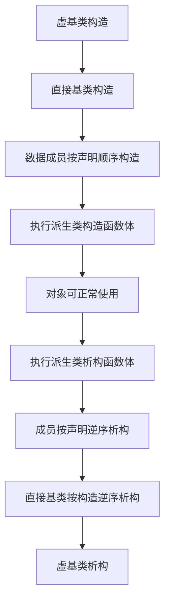
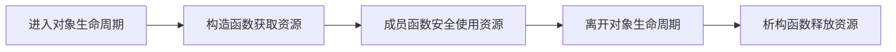

# C++ 类与对象进阶复习笔记

> 本笔记根据 `03_class_oop` 目录中的示例整理，用于 C++ 面试前复习。重点覆盖对象的构造、初始化、内存布局、析构和资源生命周期，并补充容易被追问的对象语义与现代 C++ 实践。

## 目录

- [1. 构造函数](#1-构造函数)
- [2. 对象初始化方式](#2-对象初始化方式)
- [3. 构造函数初始化列表](#3-构造函数初始化列表)
- [4. 对象的构造顺序](#4-对象的构造顺序)
- [5. 对象大小、对齐与填充](#5-对象大小对齐与填充)
- [6. 析构函数](#6-析构函数)
- [7. 不同对象的生命周期](#7-不同对象的生命周期)
- [8. RAII 与资源型类](#8-raii-与资源型类)
- [9. 拷贝控制与 Rule of Zero](#9-拷贝控制与-rule-of-zero)
- [10. 示例类的现代 C++ 改写](#10-示例类的现代-c-改写)
- [11. 高频面试题速答](#11-高频面试题速答)
- [12. 源码索引与勘误](#12-源码索引与勘误)

---

## 1. 构造函数

### 1.1 作用与语法

构造函数是在对象初始化时调用的特殊成员函数，负责建立对象的初始状态和不变量。

```cpp
class Point
{
public:
    Point()
        : x_(0), y_(0)
    {}

    Point(int x, int y)
        : x_(x), y_(y)
    {}

private:
    int x_;
    int y_;
};
```

构造函数的特点：

- 名字与类名相同。
- 没有返回类型，连 `void` 也不能写。
- 可以有参数，也可以重载。
- 不能是 `const`、`static` 或虚函数。
- 可以设置访问权限；构造函数不一定是 `public`。
- 构造函数的职责不只是“给成员赋值”，更重要的是让对象从生命周期开始就处于有效状态。

> [!NOTE]
> 构造函数没有返回类型，但可能正常完成，也可能抛出异常表示对象无法成功构造。

### 1.2 默认构造函数

默认构造函数是可以不传实参调用的构造函数：

```cpp
class First
{
public:
    First() = default;
};

class Second
{
public:
    Second(int value = 0) : value_(value) {}

private:
    int value_;
};

First first;
Second second; // Second(int = 0) 也是默认构造函数
```

如果类没有用户声明任何构造函数，编译器会隐式声明默认构造函数；一旦用户声明了构造函数，通常就不会再隐式声明默认构造函数：

```cpp
class Point
{
public:
    Point(int x, int y);
};

// Point point; // 错误：没有可调用的默认构造函数
```

需要恢复默认构造能力时可显式写：

```cpp
Point() = default;
```

> [!IMPORTANT]
> “编译器生成了默认构造函数”不等于“所有内置类型成员都被初始化为 0”。例如 `Point point;` 进行默认初始化时，隐式或显式 `= default` 的默认构造函数可能仍让未指定初值的 `int` 成员保持不确定值。

### 1.3 `= default` 与 `= delete`

```cpp
class Identifier
{
public:
    Identifier() = delete;        // 禁止无参构造
    explicit Identifier(int id);  // 必须提供 id
};
```

- `= default`：明确要求编译器生成默认实现。
- `= delete`：明确禁止某个函数被使用。

它们不仅可用于构造函数，也可用于复制、移动、赋值等特殊成员函数。

### 1.4 单参数构造与 `explicit`

可用单个实参调用的构造函数可能参与隐式类型转换：

```cpp
class Point
{
public:
    Point(int x) : x_(x), y_(0) {}

private:
    int x_;
    int y_;
};

Point point = 10; // 允许时，相当于使用 Point(10)
```

若这种隐式转换没有清晰语义，应使用 `explicit`：

```cpp
explicit Point(int x);

// Point point = 10; // 错误
Point point{10};     // 正确：显式构造
```

> [!TIP]
> 面试中可回答：单参数构造函数默认加 `explicit` 是良好习惯，除非类型设计明确希望支持该隐式转换。

### 1.5 构造函数重载与默认参数

```cpp
class Value
{
public:
    Value(int first = 1, int second = 1);
    // Value(); // 不要同时声明：无参构造时会产生二义性
};
```

如果一个带默认参数的构造函数已经能无参调用，再添加真正的无参构造函数会使 `Value value;` 无法确定调用哪一个。

### 1.6 委托构造函数

C++11 允许一个构造函数调用同类的另一个构造函数，减少重复初始化逻辑：

```cpp
class Point
{
public:
    Point() : Point(0, 0) {}
    explicit Point(int x) : Point(x, 0) {}
    Point(int x, int y) : x_(x), y_(y) {}

private:
    int x_;
    int y_;
};
```

委托构造函数的初始化列表只能委托给另一个构造函数，不能同时再直接初始化其他成员。

---

## 2. 对象初始化方式

### 2.1 默认初始化与值初始化

```cpp
Point first;   // 默认初始化
Point second{}; // 列表形式的值初始化
```

对于有用户提供默认构造函数的类，两者通常都会调用该构造函数。但对内置类型，结果明显不同：

```cpp
int first;   // 默认初始化：值不确定
int second{}; // 值初始化：0
```

初始化规则会受到类型、构造函数是否用户提供、聚合类型等因素影响；不要简单背成“大括号一定把所有类成员清零”。最可靠的做法是给成员提供明确初值。

### 2.2 直接初始化、复制初始化与列表初始化

```cpp
Point p1(1, 2);     // 直接初始化
Point p2{1, 2};     // 直接列表初始化
Point p3 = Point(1, 2); // 复制初始化语法，现代 C++ 常发生消除复制
Point p4 = {1, 2};  // 复制列表初始化
```

列表初始化的优点：

- 语法统一，适用于对象、数组和容器。
- 阻止许多窄化转换。
- 避免“最令人困惑的解析”。

```cpp
// Point point(1.5, 2.5); // 可能允许 double 转 int
// Point point{1.5, 2.5}; // 若构造参数为 int，窄化导致编译错误
```

> [!NOTE]
> 类型存在 `std::initializer_list` 构造函数时，大括号初始化会优先考虑它，可能与圆括号调用不同。选择容器构造函数时尤其要注意。

### 2.3 最令人困惑的解析

```cpp
Point point(); // 声明函数 point：无参数，返回 Point
```

这不是对象定义。创建默认构造对象应写：

```cpp
Point point;
Point another{};
```

C++ 在一段代码既可以解释成声明又可以解释成表达式时，会优先按声明解析，这就是 most vexing parse。

### 2.4 类内默认成员初始化器

```cpp
class Point
{
private:
    int x_{0};
    int y_{0};
};
```

类内默认成员初始化器为各构造函数提供后备初值。如果某个构造函数在初始化列表中显式初始化该成员，则初始化列表优先：

```cpp
class Data
{
public:
    Data(int value) : value_(value) {}

private:
    int value_{10};
};

Data data{20}; // value_ 为 20，不是 10
```

推荐先为成员设置合理默认值，再让确有不同需求的构造函数覆盖它。

---

## 3. 构造函数初始化列表

### 3.1 初始化与赋值的区别

```cpp
class Point
{
public:
    Point(int x, int y)
        : x_(x), y_(y) // 直接初始化
    {}

private:
    int x_;
    int y_;
};
```

如果在构造函数体中写：

```cpp
Point(int x, int y)
{
    x_ = x;
    y_ = y;
}
```

成员进入函数体前已经完成初始化，函数体执行的是赋值。对于 `int` 差异可能很小，但对于 `std::string` 等类成员，可能先默认构造再赋值，产生多余操作。

### 3.2 必须使用初始化列表的成员

以下对象不能先默认构造后赋值，必须在初始化阶段处理：

- 引用数据成员。
- `const` 数据成员。
- 没有可用默认构造函数的成员对象。
- 基类子对象。

```cpp
class Holder
{
public:
    Holder(int& ref, int id)
        : ref_(ref), id_(id), point_(1, 2)
    {}

private:
    int& ref_;
    const int id_;
    Point point_;
};
```

### 3.3 成员初始化顺序

成员始终按照在类中声明的顺序初始化，与初始化列表的书写顺序无关：

```cpp
class Wrong
{
public:
    Wrong(int value)
        : first_(value),
          second_(first_) // 看似先初始化 first_
    {}

private:
    int second_; // 实际先初始化
    int first_;  // 实际后初始化
};
```

实际执行 `second_(first_)` 时，`first_` 尚未初始化。读取这个不确定的 `int` 值会导致未定义行为，而不仅仅是“结果可能随机”。

正确写法：

```cpp
class Correct
{
public:
    Correct(int first, int second)
        : first_(first),
          second_(second)
    {}

private:
    int first_;
    int second_;
};
```

> [!IMPORTANT]
> 初始化列表最好按成员声明顺序书写。这样既符合真实执行顺序，也能让编译器的 `-Wreorder` 警告帮助发现依赖未初始化成员的问题。

---

## 4. 对象的构造顺序

完整对象的典型构造顺序：

1. 虚基类子对象，由最派生类负责，按规定的遍历顺序。
2. 直接基类子对象，按基类说明列表中的声明顺序。
3. 非静态数据成员，按类中声明顺序。
4. 构造函数体。

析构顺序与构造完成顺序严格相反。



数组元素也按照下标递增顺序构造，销毁时按照下标递减顺序析构。

### 4.1 构造过程中抛出异常

如果构造函数抛出异常：

- 当前对象未完成构造，因此不会调用该对象的析构函数。
- 已经完成构造的成员和基类子对象会自动按逆序析构。
- 尚未构造的成员不会析构。
- 若构造函数体前申请了裸资源且没有交给 RAII 成员，可能泄漏。

```cpp
class Safe
{
public:
    Safe()
        : resource_(std::make_unique<Resource>())
    {
        may_throw();
    }

private:
    std::unique_ptr<Resource> resource_;
};
```

即使 `may_throw()` 失败，已经构造的 `resource_` 也会析构并释放资源。

---

## 5. 对象大小、对齐与填充

### 5.1 什么通常存放在对象中

对象大小主要由以下因素决定：

- 非静态数据成员。
- 为满足对齐要求插入的填充字节。
- 继承带来的基类子对象。
- 实现动态多态所需的隐藏信息，例如主流 ABI 中的虚表指针。
- 多继承、虚继承等对象模型细节。

普通成员函数、构造函数和析构函数的机器代码不会在每个对象中各存一份，因此通常不直接增加每个对象的大小。

静态数据成员也不属于某个具体对象：

```cpp
class Counter
{
    static int total_; // 不计入每个 Counter 对象的普通成员存储
};
```

### 5.2 `sizeof` 与 `alignof`

```cpp
sizeof(Point);  // 类型对象表示占用的字节数
alignof(Point); // 类型要求的对齐值
```

每个类型都有实现定义的大小和对齐要求。成员通常从满足自身对齐要求的位置开始；对象大小通常补齐为其对齐值的整数倍，以保证对象数组中的每个元素都正确对齐。

> [!IMPORTANT]
> “成员按自身类型大小对齐”只是部分平台上经常成立的简化说法。标准层面应说“按该类型的对齐要求 `alignof(T)` 对齐”；对齐值不必永远等于 `sizeof(T)`。

### 5.3 填充示例

在常见的 `sizeof(int) == 4`、`sizeof(double) == 8`、`alignof(double) == 8` 的平台上：

```cpp
class Compact
{
    int first;     // 偏移 0
    int second;    // 偏移 4
    double third;  // 偏移 8
};                 // 常见大小：16

class Padded
{
    int first;     // 偏移 0
    // 4 字节填充
    double second; // 偏移 8
    int third;     // 偏移 16
    // 4 字节尾部填充
};                 // 常见大小：24
```


上图意在表现 `Compact` 的两个 `int` 后紧接一个 `double`，没有中间空洞；具体偏移与布局仍以目标平台为准。

调整成员顺序有时能减少填充，但不能在不了解语义、ABI 兼容、缓存局部性和访问模式时只追求最小 `sizeof`。

### 5.4 尾部填充为什么存在

假设一个类型对齐要求为 8，而最后一个成员结束于偏移 20。若对象大小也是 20，那么数组第二个元素从偏移 20 开始，无法满足 8 字节对齐。因此对象常补齐到 24：

```cpp
Padded array[2];
```

这样每个数组元素的起始地址都满足 `alignof(Padded)`。

### 5.5 空类为什么非零大小

```cpp
class Empty {};

static_assert(sizeof(Empty) >= 1);
```

完整空类对象大小必须非零，使同类型的不同完整对象能够拥有不同地址。常见实现中 `sizeof(Empty) == 1`，但标准只要求非零。

空基类可能触发空基类优化（EBO），不一定占用额外空间：

```cpp
class Derived : private Empty
{
    int value_;
};
```

C++20 的 `[[no_unique_address]]` 也允许某些空成员与其他成员共享地址。

### 5.6 成员地址与标准布局

不能把所有类对象都当作简单的 C 结构体去手动计算偏移。只有满足标准布局等要求的类型，才适合进行某些布局相关操作。

即使在同一编译器下，以下变化也可能影响布局：

- 编译目标从 32 位变为 64 位。
- 修改编译器或 ABI。
- 添加虚函数或虚继承。
- 使用对齐指令、打包选项。
- 调整成员声明顺序。

---

## 6. 析构函数

### 6.1 作用与语法

析构函数在对象生命周期结束时执行清理：

```cpp
class ResourceOwner
{
public:
    ~ResourceOwner()
    {
        // 释放当前对象拥有的资源
    }
};
```

析构函数特点：

- 名字为 `~ClassName`。
- 没有返回类型。
- 没有普通形参，不能重载。
- 不能是 `static`。
- 可以是虚函数；多态基类通常需要虚析构函数。
- 若用户未声明析构函数，编译器可能隐式声明一个。

析构函数不仅用于释放堆内存，还可关闭文件、释放锁、归还连接和句柄等资源。

### 6.2 `delete` 做了什么

```cpp
Computer* computer = new Computer{"xiaomi", 1999};
delete computer;
computer = nullptr;
```

对有效的单对象指针执行 `delete`，概念上包含：

1. 调用对象的析构函数。
2. 释放存放该对象的动态内存。

数组必须配对：

```cpp
Computer* computers = new Computer[3];
delete[] computers;
```

`delete nullptr;` 是安全的，不执行任何操作。

> [!CAUTION]
> `delete` 的对象必须来自匹配的 `new`，`delete[]` 必须匹配 `new[]`。重复释放、释放栈对象或使用错误配对都会产生未定义行为。

### 6.3 为什么不要手动调用析构函数

```cpp
Computer computer{"apple", 9999};
// computer.~Computer(); // 普通代码不要这样做
```

显式调用析构函数会结束对象生命周期，但不会阻止作用域结束时语言机制再次尝试销毁该自动对象。之后普通使用该对象或再次析构都会导致生命周期错误和未定义行为。

> [!IMPORTANT]
> 示例析构函数释放后把指针置空，因此第二次执行 `delete[] nullptr` 本身不会重复释放；但这不代表手动析构变得安全。根本问题是对象生命周期已结束，后续自动析构仍会作用于已销毁对象，行为未定义。

显式析构只出现在定位 `new`、自定义容器/内存池等非常底层的生命周期管理中，并且通常要在同一存储上正确重新构造对象。

### 6.4 析构函数与异常

析构函数通常应保证不让异常逃逸：

```cpp
~ResourceOwner() noexcept
{
    try {
        close();
    } catch (...) {
        // 记录错误，不能让清理破坏栈展开
    }
}
```

当另一个异常已经触发栈展开时，析构函数再抛出会导致 `std::terminate`。清理接口若可能失败，通常需要另行设计显式的 `close()`，析构只执行兜底清理。

---

## 7. 不同对象的生命周期

### 7.1 自动局部对象

```cpp
void function()
{
    Computer computer{"xiaomi", 1999};
} // 离开作用域，自动析构
```

同一作用域内，局部对象通常按构造完成的逆序销毁：

```cpp
Student first{/*...*/};
Student second{/*...*/};
Student third{/*...*/};
// 正常离开作用域：third、second、first
```

提前 `return` 或异常传播离开作用域时，已经构造完成的自动对象也会析构。

### 7.2 动态对象

```cpp
auto* computer = new Computer{"xiaomi", 1999};
delete computer;
```

指针离开作用域不会自动删除其指向的动态对象。若丢失最后一个裸指针地址，就会内存泄漏。

现代 C++ 应优先使用：

```cpp
auto computer = std::make_unique<Computer>("xiaomi", 1999);
```

`std::unique_ptr` 离开作用域时自动删除对象。

### 7.3 函数内静态对象

```cpp
void function()
{
    static Computer computer{"apple", 9999};
}
```

- 首次控制经过声明时初始化。
- 之后再次调用不重复构造。
- C++11 起，局部静态对象的初始化由语言保证线程安全。
- 若完成构造，通常在程序正常终止阶段析构。

如果首次初始化抛出异常，则本次初始化未完成；之后再次经过声明时会重试。

### 7.4 全局与命名空间作用域对象

这类对象具有静态存储期，通常在进入 `main` 的正常执行前完成初始化，并在正常程序终止时销毁。

同一翻译单元内，动态初始化完成的对象通常按构造逆序销毁。不同翻译单元之间的初始化与销毁顺序更复杂，可能引发“静态初始化顺序灾难”：

```cpp
// a.cpp 中的全局对象依赖 b.cpp 中尚未初始化的全局对象
```

常见规避方式是函数内静态对象：

```cpp
Service& service()
{
    static Service instance;
    return instance;
}
```

### 7.5 临时对象

```cpp
print(Computer{"apple", 9999});
```

临时对象通常在包含它的完整表达式结束时销毁，但生命周期延长、返回值优化等规则可能改变具体时机。绑定到合适的局部 `const` 引用时，临时对象生命周期可延长：

```cpp
const Computer& computer = Computer{"apple", 9999};
```

### 7.6 非正常终止

不要假定任何终止方式都会执行所有全局或静态析构：

- 从 `main` 返回或调用 `std::exit`：会执行相应正常终止清理，但局部自动对象规则不同。
- `std::_Exit`、`std::abort`、进程被强制终止：不会进行普通的完整栈展开和对象析构。

因此关键持久化数据不能只依赖“进程退出时析构”才保存。

---

## 8. RAII 与资源型类

### 8.1 RAII

RAII 是 Resource Acquisition Is Initialization：



它把资源所有权绑定到对象生命周期：

- 构造成功意味着对象拥有可用资源。
- 析构统一释放资源。
- 正常返回、提前返回和异常传播都能清理。
- 减少手写 `release()` 被遗漏的风险。

常见 RAII 类型：

- `std::string`、`std::vector`：管理动态内存。
- `std::unique_ptr`、`std::shared_ptr`：管理动态对象。
- `std::fstream`：管理文件。
- `std::lock_guard`、`std::unique_lock`：管理锁。

### 8.2 构造函数应建立不变量

长方形的长和宽应满足业务约束：

```cpp
class Rectangle
{
public:
    Rectangle(double length, double width)
        : length_(length), width_(width)
    {
        if (length <= 0 || width <= 0) {
            throw std::invalid_argument{"边长必须大于 0"};
        }
    }
};
```

更强的异常安全设计是先验证参数，再让有副作用的资源获取进入 RAII 成员。对象不应构造成功后仍处于“必须再调用 setter 才能使用”的半成品状态。

### 8.3 析构中置空成员是否必要

```cpp
~Computer()
{
    delete[] brand_;
    brand_ = nullptr;
}
```

在析构函数即将结束时，成员自身也马上消失，置空通常没有实际防护价值。它可以帮助某些调试或特殊共享清理逻辑，但不是析构安全的核心。

真正重要的是：

- 只释放自己拥有的资源。
- 每份资源只释放一次。
- 使用正确的释放方式。
- 不从析构函数泄漏异常。

---

## 9. 拷贝控制与 Rule of Zero

### 9.1 只有析构函数还不够

源码中的 `Computer` 和 `Student` 都直接拥有 `char*`：

```cpp
class Computer
{
    char* brand_;
    int price_;
};
```

虽然析构函数解决了单个对象的泄漏问题，但编译器生成的复制操作只会复制指针地址：

```cpp
Computer first{"apple", 9999};
Computer second = first; // 默认复制：两个 brand_ 指向同一块内存
```

两个对象析构时会释放同一地址两次，产生未定义行为。这叫浅复制问题。

### 9.2 Rule of Three

直接管理资源的类如果需要自定义以下任意一个，通常要同时检查另外两个：

1. 析构函数。
2. 复制构造函数。
3. 复制赋值运算符。

```cpp
class Computer
{
public:
    ~Computer();
    Computer(const Computer& other);
    Computer& operator=(const Computer& other);
};
```

深复制会为新对象申请独立空间并复制内容。复制赋值还需要处理旧资源、自赋值和异常安全。

### 9.3 Rule of Five

C++11 后还需考虑：

4. 移动构造函数。
5. 移动赋值运算符。

移动操作通常直接转移指针所有权，再把源指针置空；若确实不抛异常，应标记 `noexcept`，便于标准容器使用移动操作。

### 9.4 Rule of Zero

最佳方式通常不是手写五个函数，而是使用能自行管理资源的成员：

```cpp
class Computer
{
public:
    Computer(std::string brand, int price)
        : brand_(std::move(brand)), price_(price)
    {}

private:
    std::string brand_;
    int price_{};
};
```

此时无需手写析构、复制或移动函数，编译器生成的行为已经正确。这就是 Rule of Zero。

> [!IMPORTANT]
> 面试回答应从“资源所有权”出发，而不只是背 Rule of Three/Five。若类并不拥有指针指向的资源，复制语义和析构策略会完全不同。

---

## 10. 示例类的现代 C++ 改写

### 10.1 `Point`

```cpp
class Point
{
public:
    Point() = default;

    Point(int x, int y) noexcept
        : x_(x), y_(y)
    {}

    [[nodiscard]] int x() const noexcept { return x_; }
    [[nodiscard]] int y() const noexcept { return y_; }

private:
    int x_{};
    int y_{};
};
```

改进点：

- 类内初始值避免未初始化成员。
- 初始化列表与声明顺序一致。
- 只读函数标记 `const`。
- 确实不会抛异常的简单操作标记 `noexcept`。

### 10.2 `Rectangle`

```cpp
class Rectangle
{
public:
    Rectangle(double length, double width)
        : length_(length), width_(width)
    {
        if (length <= 0 || width <= 0) {
            throw std::invalid_argument{"长和宽必须大于 0"};
        }
    }

    [[nodiscard]] double perimeter() const noexcept
    {
        return 2 * (length_ + width_);
    }

    [[nodiscard]] double area() const noexcept
    {
        return length_ * width_;
    }

private:
    double length_;
    double width_;
};
```

计算函数不修改对象，应为 `const`；输入输出最好放在类外，使类只负责几何语义。

### 10.3 `Student`

```cpp
class Student
{
public:
    Student(std::string name, int id, int age)
        : name_(std::move(name)), id_(id), age_(age)
    {}

    void print(std::ostream& output) const
    {
        output << name_ << ' ' << id_ << ' ' << age_ << '\n';
    }

private:
    std::string name_;
    int id_{};
    int age_{};
};
```

使用 `std::string` 后自动获得安全的复制、移动和析构行为。

> [!CAUTION]
> 源码中的 `00001`、`00007` 等是带前导零的整数字面量，在 C++ 中按八进制解释。当前 `0` 到 `7` 看似结果相同，但 `00010` 表示十进制 `8`，`00008` 则非法。普通十进制编号不要添加前导零；需要保留格式时可用字符串。

---

## 11. 高频面试题速答

### 1. 什么是默认构造函数？

可以不传实参调用的构造函数，包括无参构造函数和所有参数都有默认值的构造函数。它不等于“编译器隐式生成的构造函数”。

### 2. 写了有参构造函数后，为什么 `Class object;` 可能失败？

用户声明任意构造函数后，编译器通常不再隐式声明默认构造函数。如果仍需要无参构造，可显式写 `Class() = default;`。

### 3. `Class object();` 为什么没有创建对象？

它被解析成函数声明：函数名为 `object`，无参数，返回 `Class`。应写 `Class object;` 或 `Class object{};`。

### 4. 初始化列表和构造函数体内赋值有什么区别？

初始化列表直接构造成员；进入构造函数体时成员已经完成初始化，函数体中的操作是赋值。引用、`const` 成员、无默认构造的成员对象和基类必须通过初始化阶段处理。

### 5. 成员按初始化列表顺序初始化吗？

不按。成员严格按类中声明顺序初始化。初始化列表最好保持同一顺序，避免读取尚未初始化的成员。

### 6. 为什么读取未初始化的 `int` 不能只说得到随机值？

不确定值不是一个可依赖的随机数。对它进行通常的读取可能产生未定义行为，优化器无需保留程序员想象中的运行方式。

### 7. 类内默认成员初始化器和初始化列表谁优先？

某个构造函数若在初始化列表中显式初始化成员，就使用该值；否则使用类内默认成员初始化器。

### 8. 构造顺序是什么？

先虚基类，再直接基类，然后按声明顺序构造数据成员，最后执行构造函数体。析构顺序相反。

### 9. 普通成员函数是否计入对象大小？

通常不计入，每个对象不保存一份函数代码。对象大小主要受非静态数据成员、对齐填充、基类子对象和多态实现信息影响。

### 10. 为什么对象末尾可能有填充字节？

为了让该类型的对象数组中，每个元素起始地址都满足类型的对齐要求。

### 11. 空类大小为什么不是 0？

完整对象必须占非零空间，使同类型的不同完整对象可拥有不同地址。常见大小为 1，但只保证非零；空基类还可能被优化掉额外开销。

### 12. `sizeof(T)` 是否跨平台固定？

不固定。它受数据模型、对齐要求、编译器 ABI、继承方式和编译选项影响。除 `sizeof(char) == 1` 外，不应把常见字节数当成标准保证。

### 13. `delete p` 做了什么？

对来自匹配单对象 `new` 的有效指针，先调用对象析构函数，再释放其动态存储。数组必须使用 `delete[]`。

### 14. 能否手动调用析构函数？

语法上可以，但普通对象不应这样做，因为显式析构会结束对象生命周期，后续访问或自动再次析构会产生未定义行为。它主要用于定位 `new` 等底层生命周期管理。

### 15. 局部、静态和动态对象何时析构？

局部自动对象离开作用域时析构；成功构造的静态存储期对象通常在正常程序终止时析构；动态对象在执行匹配的 `delete` 时析构，裸指针离开作用域不会自动删除对象。

### 16. 构造函数抛异常后会调用本对象析构函数吗？

不会，因为对象没有完成构造。但已经构造成功的基类和成员子对象会按逆序析构，因此资源应尽早交给 RAII 成员。

### 17. 为什么含裸资源指针的类只写析构函数仍不安全？

默认复制会浅复制指针，使多个对象声称拥有同一资源，最终可能重复释放。需要正确的复制/移动控制，或优先用 `std::string`、容器和智能指针实现 Rule of Zero。

### 18. 析构函数为什么通常不能抛异常？

若析构发生在另一个异常的栈展开期间，再让异常逃逸会调用 `std::terminate`。析构应执行可靠的兜底清理。

### 19. `explicit` 解决什么问题？

阻止构造函数参与不期望的隐式类型转换，避免实参被静默转换成类对象。显式直接初始化仍然可用。

### 20. RAII 的核心是什么？

让资源所有权绑定对象生命周期：构造时获取或接管资源，析构时释放，从而覆盖正常返回、提前返回和异常等控制路径。

---

## 12. 源码索引与勘误

### 12.1 源码索引

| 主题 | 对应示例 |
|---|---|
| 构造函数、重载、`= default`、most vexing parse | `01_constructor.cc` |
| 初始化列表、初始化顺序、类内初值 | `02_constructor.cc` |
| `sizeof`、内存对齐、空类 | `03_object_size.cc` |
| 析构函数、自动/静态/动态对象 | `04_destructor.cc` |
| 简单类设计 | `practice/calculate_rectangle.cc` |
| 资源型类与析构时机 | `practice/class_student.cc` |
| 全局、静态局部及动态对象析构 | `practice/destructor_call_timing.cc` |

### 12.2 示例中需要特别注意的地方

1. `01_constructor.cc` 中 `MyClass() = default` 不会保证 `m_data` 在 `MyClass obj;` 时初始化为零，应使用 `int m_data{};`。
2. `02_constructor.cc` 中 `m_y(m_x)` 在 `m_x` 初始化前读取它，会产生未定义行为；不能只描述为“获得不确定或随机值”。
3. `03_object_size.cc` 展示的是常见平台结果，实际大小和布局由类型对齐要求、ABI 及编译选项决定。
4. `03_object_size.cc` 中“按类型大小整数倍地址放置”是教学简化；准确概念是 `alignof(T)` 所表达的对齐要求。
5. `04_destructor.cc` 的 `Computer` 虽有析构函数，但仍缺少安全复制与移动语义；复制对象可能导致重复释放。
6. 手动调用局部对象析构函数的问题首先是对象生命周期被提前结束，而不只是“必然发生 double free”；即使析构将指针置空，后续自动析构仍是未定义行为。
7. `practice/calculate_rectangle.cc` 应使用初始化列表、校验边长，并把只读计算函数声明为 `const`。
8. `practice/class_student.cc` 的裸字符指针同样存在浅复制风险；学生编号的前导零还会让整数字面量按八进制解析。
9. 全局对象跨翻译单元的初始化顺序不应依赖；复杂全局依赖优先改成函数内静态对象或显式生命周期管理。
10. 示例使用的 C 头文件 `<string.h>` 和全局函数可工作，但 C++ 代码更推荐 `<cstring>` 与 `std::strlen/std::strcpy`；管理文本则优先使用 `std::string`。

> [!TIP]
> 复习这一章时，可以用一条主线串联回答：构造函数建立不变量 → 初始化列表决定子对象初始化 → 声明顺序决定真实顺序与布局 → 析构逆序清理 → RAII 覆盖异常路径 → 资源所有权决定复制和移动策略。
