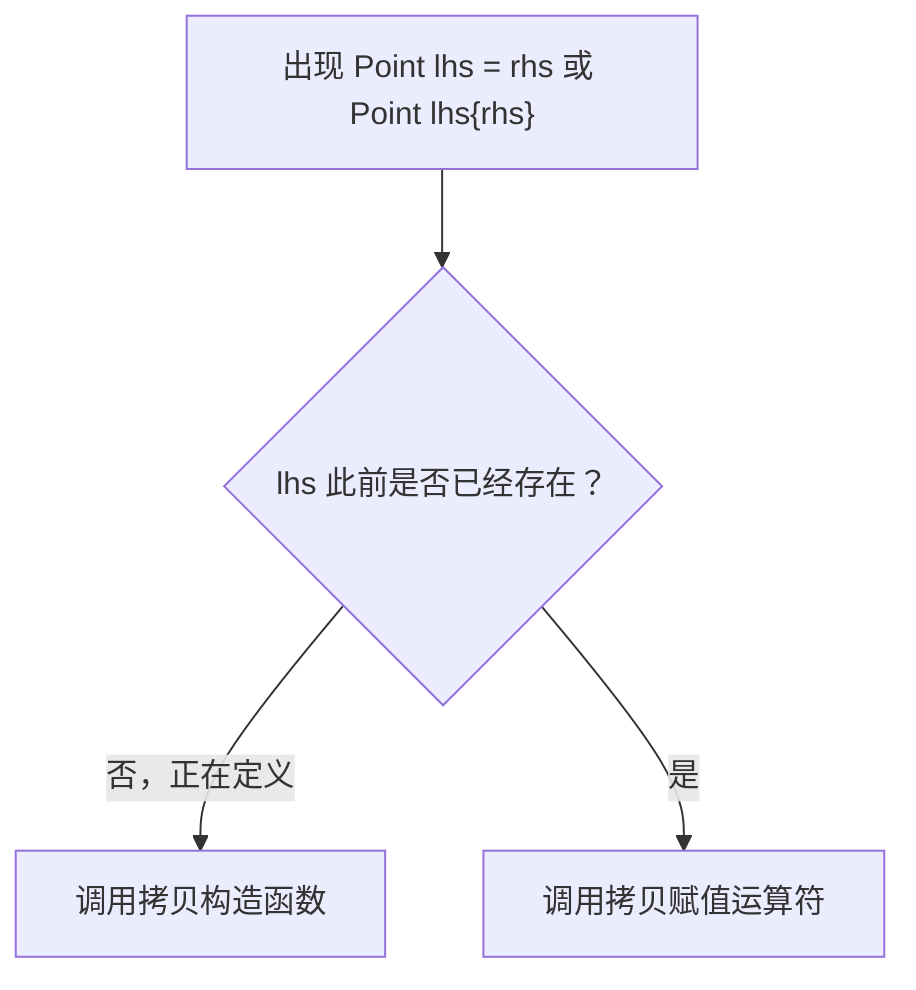
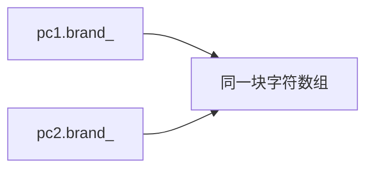
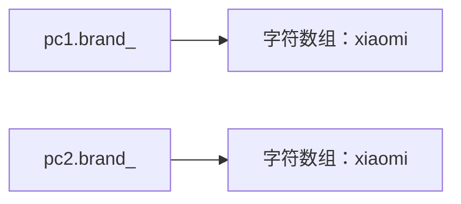
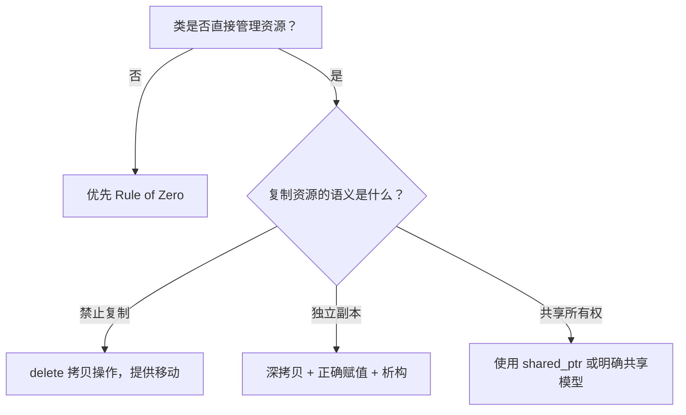

# C++ 对象复制与特殊成员复习笔记

> 本笔记根据 `04_class_oop` 目录中的示例整理，用于 C++ 面试前复习。重点覆盖拷贝构造、赋值运算符、`this`、`const`/引用/对象/静态成员，以及这些成员对类复制语义和生命周期的影响。

## 目录

- [1. 拷贝构造函数](#1-拷贝构造函数)
- [2. 值类别与引用](#2-值类别与引用)
- [3. 拷贝省略与返回值优化](#3-拷贝省略与返回值优化)
- [4. this 指针](#4-this-指针)
- [5. 拷贝赋值运算符](#5-拷贝赋值运算符)
- [6. 深拷贝、浅拷贝与异常安全](#6-深拷贝浅拷贝与异常安全)
- [7. const 数据成员与 const 成员函数](#7-const-数据成员与-const-成员函数)
- [8. 引用数据成员与前向声明](#8-引用数据成员与前向声明)
- [9. 对象数据成员与组合](#9-对象数据成员与组合)
- [10. 静态成员](#10-静态成员)
- [11. 特殊成员函数之间的关系](#11-特殊成员函数之间的关系)
- [12. 高频面试题速答](#12-高频面试题速答)
- [13. 源码索引与勘误](#13-源码索引与勘误)

---

## 1. 拷贝构造函数

### 1.1 拷贝构造与拷贝赋值

判断关键是左侧对象是否正在被创建：

```cpp
Point source{1, 2};

Point first = source; // 创建新对象：拷贝构造
Point second{source};  // 创建新对象：拷贝构造

Point target{3, 4};
target = source;       // target 已存在：拷贝赋值
```



### 1.2 典型声明

```cpp
class Point
{
public:
    Point(const Point& other)
        : x_(other.x_), y_(other.y_)
    {}

private:
    int x_{};
    int y_{};
};
```

为什么通常使用 `const T&`：

- 引用避免为形参再次复制对象。
- 若按值传入，为初始化形参本身又需要拷贝构造，语言直接禁止这种拷贝构造形式。
- `const` 表明不修改源对象。
- 能复制 `const` 对象。
- 也能绑定临时对象，尽管现代 C++ 中很多临时对象场景会省略复制或使用移动。

> [!NOTE]
> 标准所称的拷贝构造函数不只允许 `const T&`，其第一个参数也可能是 `T&`、`volatile T&` 或 `const volatile T&`，其余参数必须有默认值。但绝大多数值类型都应使用 `const T&`。

### 1.3 编译器生成的拷贝构造

若条件允许，编译器会隐式声明拷贝构造函数，其行为是依次复制：

1. 基类子对象。
2. 按声明顺序复制非静态数据成员。

对成员对象会调用其拷贝构造；对指针只复制地址：

```cpp
class Computer
{
    char* brand_; // 隐式复制只复制这个地址
    int price_;
};
```

因此，编译器生成的复制并非天然错误。若成员都是 `std::string`、`std::vector`、智能指针等具有正确语义的类型，成员逐个复制通常正是想要的行为。

### 1.4 拷贝构造的常见调用场景

```cpp
Point source{1, 2};
Point copy{source}; // 1. 用已有左值初始化新对象

void consume(Point value);
consume(source);    // 2. 左值按值传参，通常需要复制形参

Point result = source; // 3. 根据表达式初始化新对象
```

按值传递不等于永远调用拷贝构造：

- 实参是左值时通常复制。
- 实参是右值且类型有移动构造时通常移动。
- 某些场景会发生拷贝省略，既不复制也不移动。

### 1.5 禁止复制

具有唯一所有权或不可复制语义的类型应明确删除复制操作：

```cpp
class UniqueResource
{
public:
    UniqueResource(const UniqueResource&) = delete;
    UniqueResource& operator=(const UniqueResource&) = delete;
};
```

例如互斥量、独占文件句柄和 `std::unique_ptr` 都不应被普通复制。

---

## 2. 值类别与引用

### 2.1 不要只用“有没有名字”判断

“有名字的是左值，没名字的是右值”便于入门，但不是完整定义。值类别描述的是表达式，而不是对象本身。

常用五类：

```text
expression
├── glvalue：具有对象身份
│   ├── lvalue：非临近失效的对象/函数
│   └── xvalue：资源可被复用、临近失效
└── rvalue
    ├── prvalue：用于初始化对象或计算值
    └── xvalue
```

- `lvalue`：如变量表达式 `value`、解引用结果 `*pointer`。
- `prvalue`：如字面量 `42`、算术结果 `a + b`、`Point{1, 2}`。
- `xvalue`：如 `std::move(object)` 的结果。
- `glvalue`：`lvalue` 与 `xvalue` 的总称，强调对象身份。
- `rvalue`：`prvalue` 与 `xvalue` 的总称，通常可用于移动。

> [!IMPORTANT]
> 有名字的右值引用变量表达式本身是左值：
>
> ```cpp
> Point&& ref = Point{1, 2};
> // 表达式 ref 是左值；若要再次作为右值传递，需要 std::move(ref)
> ```

### 2.2 引用绑定

```cpp
int value = 10;

int& lref = value;          // 非 const 左值引用绑定左值
const int& cref1 = value;   // const 左值引用绑定左值
const int& cref2 = 42;      // const 左值引用绑定临时对象，并延长生命周期
int&& rref = 42;            // 右值引用绑定右值
```

常见用途：

- `const T&`：只读借用，可接收左值和右值。
- `T&`：可修改借用，只接收适当的左值。
- `T&&`：在非模板语境中常用于接收可移动的右值。

### 2.3 字符串字面量是什么值类别

```cpp
"hello"
```

字符串字面量是 `const char[N]` 类型的左值，具有静态存储期。它能取地址：

```cpp
auto pointer_to_array = &"hello"; // 类型近似 const char (*)[6]
```

这也是“字面量都是右值”这一说法的典型反例。

---

## 3. 拷贝省略与返回值优化

### 3.1 RVO、NRVO

```cpp
Point makePoint()
{
    return Point{1, 2}; // 返回无名临时：典型 RVO 场景
}

Point makeNamedPoint()
{
    Point point{1, 2};
    return point;       // 返回命名局部对象：NRVO 场景
}
```

- RVO：Return Value Optimization，返回值优化。
- NRVO：Named Return Value Optimization，命名返回值优化。

C++17 起，某些以同类型纯右值初始化对象的场景采用保证的复制消除；语言语义上直接在目标存储中构造对象：

```cpp
Point point{Point{1, 2}}; // C++17：不调用拷贝/移动构造
Point result = makePoint(); // 对相应纯右值返回场景同样直接构造
```

NRVO 仍然是允许但不强制的优化：

```cpp
Point makeNamedPoint()
{
    Point point{1, 2};
    return point; // 编译器可以 NRVO；否则尝试移动，再考虑复制
}
```

> [!IMPORTANT]
> 不要通过构造函数打印次数推断抽象语义，也不要写依赖“拷贝构造一定执行”的业务逻辑。允许省略时，即使拷贝/移动构造带副作用，也可能不执行；C++17 保证省略场景甚至不要求存在可访问的拷贝/移动构造，但析构仍需可访问。

### 3.2 返回局部对象时不要随意 `std::move`

```cpp
Point makePoint()
{
    Point point{1, 2};
    return point;            // 推荐，允许 NRVO
    // return std::move(point); // 常会阻碍 NRVO
}
```

编译器在无法进行 NRVO 时，本就可把适合的局部对象作为移动候选。手动 `std::move` 通常没有收益，反而可能破坏优化。

---

## 4. `this` 指针

### 4.1 `this` 表示当前对象

每个非静态成员函数中都可使用 `this`：

```cpp
class Point
{
public:
    void setX(int x)
    {
        this->x_ = x;
    }

    Point* address()
    {
        return this;
    }

private:
    int x_{};
};
```

`object.function()` 中，函数内的 `this` 指向 `object`。直接写成员名通常等价于通过 `this` 访问：

```cpp
x_ = x;
this->x_ = x;
```

> [!NOTE]
> 可把普通成员函数中的 `this` 近似理解为 `Point* const`，但它不是源码层面的普通形参，不能声明、重新赋值或取 `this` 自身的地址。

### 4.2 `const` 成员函数中的 `this`

```cpp
class Point
{
public:
    int x() const
    {
        return x_;
    }

private:
    int x_{};
};
```

在 `const` 成员函数中，可近似把 `this` 理解为指向常量对象的指针：

```text
普通成员函数：Point* const
const 成员函数：const Point* const
```

因此不能通过普通方式修改非 `mutable` 数据成员。

### 4.3 返回 `*this`

`this` 是当前对象指针，`*this` 是当前对象表达式：

```cpp
class Counter
{
public:
    Counter& increment()
    {
        ++value_;
        return *this;
    }

private:
    int value_{};
};

Counter counter;
counter.increment().increment();
```

返回 `T&` 可支持链式调用，并避免创建额外对象。必须确保返回引用指向的对象在调用方使用期间仍然存活。

### 4.4 静态成员函数没有 `this`

静态成员函数不依赖具体对象：

```cpp
class Counter
{
public:
    static int count()
    {
        return count_;
    }

private:
    inline static int count_{};
};
```

它没有 `this`，不能直接访问非静态成员，但仍属于类作用域，能访问类的私有静态成员。

---

## 5. 拷贝赋值运算符

### 5.1 典型形式

```cpp
class Point
{
public:
    Point& operator=(const Point& other)
    {
        x_ = other.x_;
        y_ = other.y_;
        return *this;
    }

private:
    int x_{};
    int y_{};
};
```

调用：

```cpp
target = source;
target.operator=(source); // 等价的显式成员调用形式
```

### 5.2 为什么返回 `T&`

```cpp
third = second = first;
```

赋值运算符从右向左结合：

```cpp
third = (second = first);
```

`second = first` 返回赋值后的 `second` 引用，再用于给 `third` 赋值。返回 `T&`：

- 符合内置类型赋值表达式的行为。
- 支持连续赋值。
- 避免返回值导致的额外对象。

### 5.3 自赋值

```cpp
object = object;
```

对只含普通值成员的简单实现，即使没有判断也通常安全：

```cpp
x_ = other.x_;
```

但资源型类若先释放自身资源再从 `other` 读取，就必须处理自赋值或采用天然安全的实现：

```cpp
if (this == &other) {
    return *this;
}
```

> [!NOTE]
> 自赋值判断不是每个赋值运算符的固定仪式。设计良好的 copy-and-swap 或成员逐个赋值可能天然自赋值安全。重点是赋值语义在 `x = x` 时仍正确。

### 5.4 复制构造与复制赋值的区别

| 对比项 | 拷贝构造 | 拷贝赋值 |
|---|---|---|
| 目标对象 | 尚未完成构造 | 已经存在 |
| 是否有旧状态 | 没有 | 有，可能需要先处理 |
| 典型声明 | `T(const T&)` | `T& operator=(const T&)` |
| 返回值 | 无返回类型 | 通常返回 `T&` |
| 资源处理 | 创建新资源 | 处理旧资源后建立新状态 |

赋值运算符比拷贝构造更难写，因为目标对象已经持有有效状态，必须同时考虑旧资源、自赋值和异常安全。

---

## 6. 深拷贝、浅拷贝与异常安全

### 6.1 浅拷贝

默认成员复制对裸指针只复制地址：



若两个对象都认为自己独占该地址，析构时会重复释放。问题根源不是“指针成员一定危险”，而是所有权语义不明确。

- 观察型指针：只借用，不负责释放，浅复制可能正合适。
- 独占所有权裸指针：默认浅复制通常错误。
- 共享所有权：应显式使用 `std::shared_ptr` 等工具，而不是碰巧复制地址。

### 6.2 深拷贝

深拷贝为新对象创建独立资源：



```cpp
Computer(const Computer& other)
    : brand_(new char[std::strlen(other.brand_) + 1]),
      price_(other.price_)
{
    std::strcpy(brand_, other.brand_);
}
```

每个对象独立管理自己的字符数组，析构互不影响。

### 6.3 源码赋值实现的异常安全问题

源码采用：

```cpp
delete[] brand_;
brand_ = new char[std::strlen(other.brand_) + 1];
```

如果 `new` 抛出 `std::bad_alloc`，目标对象的旧品牌已经丢失，`brand_` 只剩 `nullptr`，无法提供强异常保证。

更安全的顺序是先成功获取新资源，再释放旧资源：

```cpp
Computer& operator=(const Computer& other)
{
    if (this == &other) {
        return *this;
    }

    auto* new_brand =
        new char[std::strlen(other.brand_) + 1];
    std::strcpy(new_brand, other.brand_);

    delete[] brand_;
    brand_ = new_brand;
    price_ = other.price_;
    return *this;
}
```

若分配失败，旧对象状态仍保持不变。

### 6.4 copy-and-swap

```cpp
class Computer
{
public:
    Computer& operator=(Computer other)
    {
        swap(*this, other);
        return *this;
    }

    friend void swap(Computer& lhs, Computer& rhs) noexcept
    {
        using std::swap;
        swap(lhs.brand_, rhs.brand_);
        swap(lhs.price_, rhs.price_);
    }
};
```

参数 `other` 先通过复制或移动获得独立状态；交换成功后，旧资源随局部 `other` 析构。优点：

- 自赋值安全。
- 易于提供强异常保证。
- 可统一处理复制和移动来源。

代价是可能存在额外临时对象或分配，是否采用取决于类型和性能需求。

### 6.5 最现代的做法：Rule of Zero

```cpp
class Computer
{
public:
    Computer(std::string brand, int price)
        : brand_(std::move(brand)), price_(price)
    {}

private:
    std::string brand_;
    int price_{};
};
```

用 `std::string` 管理品牌后，无需手写析构、拷贝构造、拷贝赋值、移动构造和移动赋值。默认生成的特殊成员函数已具有正确值语义。

> [!IMPORTANT]
> “类中只要有指针成员就必须深拷贝”是错误的。应先判断指针是否表示所有权，以及复制一个对象时希望共享、克隆、转移还是禁止该资源。

---

## 7. `const` 数据成员与 `const` 成员函数

### 7.1 `const` 数据成员

```cpp
class Record
{
public:
    Record(int id, int value)
        : id_(id), value_(value)
    {}

private:
    const int id_;
    int value_{};
};
```

`const` 数据成员必须在初始化阶段获得值：

- 构造函数初始化列表。
- 或类内默认成员初始化器。

不能在构造函数体中给它赋值，因为进入函数体前成员已经完成初始化。

```cpp
const int id_{0};
```

若初始化列表显式指定 `id_`，则覆盖类内默认成员初始化器。

### 7.2 `const` 成员函数

```cpp
class Point
{
public:
    void print() const
    {
        std::cout << x_ << ' ' << y_;
    }

private:
    int x_{};
    int y_{};
};
```

特点：

- 承诺不通过 `this` 修改普通数据成员。
- `const` 对象只能调用适用的 `const` 成员函数。
- 非 `const` 对象可以调用 `const` 和非 `const` 成员函数。
- `const` 限定参与成员函数重载。

```cpp
char& operator[](std::size_t index);
const char& operator[](std::size_t index) const;
```

### 7.3 物理常量性与逻辑常量性

有时查询操作在逻辑上不改变对象，但需要更新缓存或统计信息：

```cpp
class Data
{
public:
    int expensiveValue() const
    {
        if (!cached_) {
            cache_ = calculate();
            cached_ = true;
        }
        return cache_;
    }

private:
    mutable bool cached_{};
    mutable int cache_{};
};
```

`mutable` 允许成员在 `const` 成员函数中修改，适合缓存、互斥量等不影响对象外部逻辑状态的实现细节。滥用会破坏 `const` 接口的可信度。

### 7.4 `const` 成员对赋值的影响

含非静态 `const` 数据成员的类，编译器生成的拷贝/移动赋值运算符通常会被定义为删除，因为赋值无法改变该成员：

```cpp
Record first{1, 10};
Record second{2, 20};

// second = first; // 隐式拷贝赋值通常被删除
```

可以自定义赋值只复制可变成员，但需确认语义合理：赋值后对象仍保留原 `id_`，可能不符合用户对“完整值赋值”的预期。若对象身份固定，禁止赋值往往更清晰。

> [!CAUTION]
> 源码 `05_const_member.cc` 的无参构造函数没有初始化普通成员 `m_data1`。只读取 `m_data2` 没问题，但若读取 `m_data1` 会涉及不确定值和未定义行为风险，应使用 `int m_data1{};`。

---

## 8. 引用数据成员与前向声明

### 8.1 引用成员必须初始化

```cpp
class Printer
{
public:
    explicit Printer(std::ostream& output)
        : output_(output)
    {}

    void print(std::string_view text)
    {
        output_ << text;
    }

private:
    std::ostream& output_;
};
```

引用没有“未绑定后再绑定”的状态，因此引用成员必须在初始化列表或类内初始化器中绑定。

### 8.2 引用成员表示非拥有关系

`Printer` 不拥有输出流，只借用它。被引用对象必须比引用成员所在对象活得更久：

```cpp
std::ostringstream stream;
Printer printer{stream}; // stream 必须覆盖 printer 的使用期
```

若无法保证生命周期，引用会悬空。接口设计应明确：

- 是否允许“没有对象”：允许时通常用指针。
- 是否需要改变绑定目标：需要时用指针或 `std::reference_wrapper`。
- 是否拥有对象：拥有时通常直接按值组合或使用智能指针。

### 8.3 引用成员的复制和赋值

```cpp
int value = 1;
Point first{/*...,*/ value};
Point second = first;
```

隐式拷贝构造会让 `second` 的引用成员绑定到与 `first` 相同的外部对象，而不是复制出新的被引用对象。

含引用成员的类，其隐式拷贝/移动赋值运算符通常被定义为删除，因为引用不能重新绑定：

```cpp
// another = first; // 若依赖隐式 operator=，通常编译失败
```

自定义赋值也无法改变引用绑定，只能给引用所指对象赋值。这通常很容易产生意外语义，因此含引用成员的类型要谨慎定义“可赋值”含义。

### 8.4 前向声明与不完整类型

```cpp
class Mother;

class Baby
{
    Mother& mother_; // 合法：引用大小已知，只需知道 Mother 是类型
};
```

前向声明后通常可以声明：

- 指针或引用。
- 只声明但暂不定义的、涉及该类型的函数。
- 某些模板成员，具体要求取决于实例化位置。

以下通常需要完整类型：

```cpp
// Mother mother_;       // 按值成员需要知道大小和构造/析构
// class Child : Mother; // 定义继承需要完整基类
// sizeof(Mother);       // 需要完整布局
```

成员函数若要访问 `Mother` 的成员，也应在 `Mother` 完整定义可见后再定义。

---

## 9. 对象数据成员与组合

### 9.1 组合表达 has-a

```cpp
class Engine {};

class Car
{
private:
    Engine engine_; // Car has-an Engine
};
```

按值对象成员通常表示拥有关系：外层对象拥有成员对象，二者生命周期绑定。这比裸指针所有权更直接。

### 9.2 构造与析构顺序

```cpp
class C
{
public:
    C(int a, int b)
        : first_(a), second_(b)
    {}

private:
    A first_;
    B second_;
};
```


规则：

- 成员按类内声明顺序构造，与初始化列表顺序无关。
- 构造函数体在所有基类和成员构造完成后执行。
- 析构函数体先执行，随后成员按声明逆序析构。
- 若初始化列表不显式初始化成员对象，编译器尝试默认初始化它。
- 成员类型没有可用默认构造函数时，外层构造函数必须为它提供初始化方式。

### 9.3 按值、引用、指针成员如何选择

| 表达关系 | 常见成员形式 | 生命周期/所有权 |
|---|---|---|
| 必有且拥有 | `T member;` | 与外层对象绑定 |
| 必有但借用 | `T& member;` | 外部必须活得更久 |
| 可有但借用 | `T* member;` | 可为 `nullptr`，不应释放 |
| 独占拥有动态对象 | `std::unique_ptr<T>` | 自动释放，不可复制 |
| 共享拥有 | `std::shared_ptr<T>` | 引用计数，谨慎使用 |

> [!TIP]
> 能按值组合时优先按值组合。它让所有权、析构顺序和复制语义自然明确，也更容易遵循 Rule of Zero。

---

## 10. 静态成员

### 10.1 静态数据成员

```cpp
class Student
{
public:
    static int count;

private:
    int id_{};
};

int Student::count = 0; // 类外定义
```

特点：

- 属于类，而不属于某个对象。
- 所有对象共享同一份静态数据。
- 不计入每个对象的 `sizeof`。
- 推荐通过 `Student::count` 访问。
- 不能出现在构造函数初始化列表中。
- 仍受 `public/protected/private` 访问控制。

### 10.2 C++17 内联静态成员

```cpp
class Student
{
public:
    inline static int count = 0;
};
```

`inline static` 可直接在类定义中定义并初始化，适合放在头文件，不再需要单独的类外定义。

`constexpr` 静态数据成员从 C++17 起隐式是内联变量：

```cpp
class Limits
{
public:
    static constexpr int max_count = 100;
};
```

### 10.3 静态成员函数

```cpp
class Student
{
public:
    static int count() noexcept
    {
        return count_;
    }

private:
    inline static int count_{};
};
```

- 没有 `this` 指针。
- 可以在没有对象时通过类名调用。
- 不能直接访问非静态数据成员。
- 能访问类的私有静态成员。
- 不能声明为 `const` 成员函数，因为没有当前对象可限定。
- 不能是虚函数。

### 10.4 对象计数器的陷阱

源码只在普通构造函数中递增 `m_count`：

```cpp
Student(int id, std::string name)
{
    ++m_count;
}
```

这并不能可靠统计“当前存活对象数”：

- 隐式拷贝构造不会执行这个普通构造函数，复制出的对象没有计数。
- 隐式移动构造同样需要考虑。
- 析构时没有递减，只能近似统计部分构造次数。
- 多线程同时修改普通 `int` 会产生数据竞争。

可靠的存活计数至少要覆盖所有成功构造路径并在析构时递减：

```cpp
class Student
{
public:
    Student(/*...*/) { ++live_count_; }
    Student(const Student& other) /*...*/ { ++live_count_; }
    Student(Student&& other) noexcept /*...*/ { ++live_count_; }
    ~Student() { --live_count_; }

    static int liveCount() noexcept { return live_count_; }

private:
    inline static int live_count_{};
};
```

并发环境中需使用同步或 `std::atomic<int>`。此外，计数器本身可能改变特殊成员函数的维护成本，应确认它确有业务价值。

### 10.5 静态初始化顺序

类的静态数据成员具有静态存储期。若它们需要跨翻译单元动态初始化，仍可能遇到静态初始化顺序问题。

对复杂单例式对象，可使用函数内静态：

```cpp
Registry& registry()
{
    static Registry instance;
    return instance;
}
```

C++11 起，函数内静态对象的首次初始化由语言保证线程安全。

---

## 11. 特殊成员函数之间的关系

### 11.1 六个特殊成员函数

```cpp
class Value
{
public:
    Value();                          // 默认构造
    ~Value();                         // 析构
    Value(const Value&);              // 拷贝构造
    Value& operator=(const Value&);   // 拷贝赋值
    Value(Value&&);                   // 移动构造
    Value& operator=(Value&&);        // 移动赋值
};
```

编译器是否隐式声明、是否定义为删除，取决于：

- 用户声明了哪些其他特殊成员函数。
- 基类和成员是否支持相应操作。
- 是否存在 `const` 或引用成员。
- 访问权限和歧义。

### 11.2 常见影响

| 类的组成/声明 | 常见结果 |
|---|---|
| 成员都可复制 | 隐式拷贝通常逐成员复制 |
| 含 `std::unique_ptr` | 隐式拷贝被删除，移动通常可用 |
| 含引用成员 | 隐式拷贝构造可绑定同一对象；赋值通常被删除 |
| 含非静态 `const` 成员 | 拷贝构造可复制值；赋值通常被删除 |
| 用户声明析构函数 | 会影响隐式移动操作的生成 |
| 用户声明拷贝操作 | 通常会影响隐式移动操作的生成 |

> [!IMPORTANT]
> 规则细节比“写了析构就一定没有拷贝”更复杂。用户声明析构函数通常不会自动删除已有条件下的拷贝操作，但会抑制隐式移动操作，并可能导致编译器生成的拷贝行为不再符合资源所有权需求。

### 11.3 Rule of Three、Five、Zero

- Rule of Three：需要自定义析构、拷贝构造、拷贝赋值之一时，检查另外两个。
- Rule of Five：C++11 后再检查移动构造和移动赋值。
- Rule of Zero：优先使用 RAII 成员，让类不必手写这五个操作。



---

## 12. 高频面试题速答

### 1. 拷贝构造和拷贝赋值如何区分？

用已有对象初始化一个新对象是拷贝构造；左右对象都已存在时执行 `=` 是拷贝赋值。核心是目标对象是否正在创建。

### 2. 拷贝构造函数为什么通常接收 `const T&`？

引用避免额外复制，`const` 防止修改源对象并允许复制 `const` 对象，还能绑定临时对象。

### 3. 编译器生成的拷贝构造做什么？

按规则复制基类和非静态数据成员；类成员调用其拷贝构造，内置成员直接复制，裸指针只复制地址。

### 4. 左值一定有名字，右值一定没名字吗？

不是。值类别描述表达式。例如有名字的右值引用变量表达式是左值，字符串字面量虽没有变量名却是左值。

### 5. 什么是 xvalue？

xvalue 是具有对象身份但资源可被复用、临近失效的 glvalue，例如 `std::move(object)` 的结果。它属于右值。

### 6. `Point p{Point{1, 2}}` 一定调用拷贝构造吗？

C++17 起该同类型纯右值初始化属于保证的复制消除，直接构造 `p`，不调用拷贝或移动构造。更早标准中编译器通常也会省略，但性质不同。

### 7. RVO 与 NRVO 有什么区别？

RVO 通常指返回无名临时的优化；C++17 某些纯右值场景已成为保证的复制消除。NRVO 是返回命名局部对象，至今仍是可选优化。

### 8. 为什么返回局部对象通常不写 `std::move`？

直接 `return local;` 允许 NRVO；无法 NRVO 时语言也可把适合的局部对象当作移动候选。显式 `std::move` 常阻碍 NRVO。

### 9. `this` 的作用是什么？

它指向调用当前非静态成员函数的对象，用于访问当前对象成员。静态成员函数没有 `this`。

### 10. 为什么赋值运算符通常返回 `T&`？

为了支持 `a = b = c` 的连续赋值，符合内置类型行为，并避免为返回结果创建额外对象。

### 11. 赋值运算符一定要判断自赋值吗？

不一定。关键是 `x = x` 必须正确。资源型“先释放再复制”实现需要处理，自赋值安全的成员赋值或 copy-and-swap 可无需显式判断。

### 12. 深拷贝和浅拷贝的区别是什么？

浅拷贝复制成员值，指针因而复制地址；深拷贝为新对象创建独立资源并复制资源内容。应由所有权和期望的复制语义决定使用哪种方式。

### 13. 源码的深拷贝赋值是否具有强异常保证？

没有。它先释放旧内存再申请新内存，若分配失败，目标对象旧状态已经丢失。应先成功创建新资源再替换，或使用 copy-and-swap/`std::string`。

### 14. `const` 数据成员如何初始化？

通过构造函数初始化列表或类内默认成员初始化器。不能在构造函数体中赋值，因为那时初始化阶段已经结束。

### 15. 含 `const` 或引用成员的类为什么常不能默认赋值？

赋值要求改变已有子对象，但 `const` 成员不能赋值，引用也不能重新绑定，因此隐式拷贝/移动赋值运算符通常被删除。

### 16. `const` 成员函数中的 `this` 有什么不同？

可近似理解为 `const T* const`，不能通过它修改普通数据成员，只能调用适用的 `const` 成员函数。

### 17. 引用成员的生命周期风险是什么？

引用成员不拥有被引用对象。若外部对象先销毁，成员就悬空，之后访问产生未定义行为。

### 18. 为什么前向声明足以声明引用成员，却不足以声明对象成员？

引用的表示大小已知，只需知道名字是类型；按值对象成员需要完整类型的大小、布局和构造析构信息。

### 19. 对象成员的构造和析构顺序是什么？

按成员在类中的声明顺序构造，随后执行外层构造函数体；析构时先执行外层析构函数体，再按声明逆序析构成员。

### 20. 静态数据成员是否计入 `sizeof`？

不计入。它属于类且只有独立的一份存储，不属于每个对象。只有静态成员的类对象仍需满足空类完整对象非零大小规则。

### 21. 静态成员函数能访问私有成员吗？

能访问私有静态成员，因为它仍处于类作用域；但没有 `this`，所以不能直接访问某个对象的非静态成员，除非显式获得对象。

### 22. 在构造函数里递增静态计数器就能统计存活对象吗？

不一定。还要覆盖拷贝和移动构造，并在析构时递减；并发访问还要同步。否则只能统计部分构造调用，甚至产生数据竞争。

### 23. 什么是 Rule of Zero？

让 `std::string`、容器、智能指针等 RAII 成员管理资源，使类无需自定义析构、复制和移动操作，编译器生成的对象语义自然正确。

---

## 13. 源码索引与勘误

### 13.1 源码索引

| 主题 | 对应示例 |
|---|---|
| 拷贝构造、值类别、按值传参、RVO/NRVO | `01_copy_constructor.cc` |
| `this` 指针 | `02_this.cc` |
| 拷贝赋值和连续赋值 | `03_operator_assign.cc` |
| 裸指针资源、深拷贝、Rule of Three | `04_exercise.cc` |
| `const` 数据成员 | `05_const_member.cc` |
| 引用成员、前向声明、非拥有关系 | `06_reference_member.cc` |
| 对象成员的构造与析构顺序 | `07_object_member.cc` |
| 静态数据成员、对象共享数据 | `08_static_member.cc` |

### 13.2 示例中需要特别注意的地方

1. `01_copy_constructor.cc` 对左值/右值使用的是入门近似；值类别属于表达式，“有名字/能取地址”并非完整判定规则。
2. `Point pt{Point{1, 2}}` 在 C++17 起是保证的复制消除，不只是编译器“很可能优化”。
3. 按值传参在左值实参下通常复制，但右值可能移动；返回值还可能完全省略复制和移动。
4. `02_this.cc` 中 `Point* const this` 是帮助理解的近似模型，`this` 并非可显式声明的普通隐藏形参。
5. `03_operator_assign.cc` 的 `Point` 只含 `int`，其手写拷贝构造和赋值与正确的编译器默认版本效果相同，实际项目可使用 `= default` 或完全不写。
6. `04_exercise.cc` 的赋值先释放旧资源再分配新资源；分配失败时不能保持原值，不满足强异常保证。
7. `04_exercise.cc` 还缺少移动构造和移动赋值；更好的方案是直接使用 `std::string`，遵循 Rule of Zero。
8. `05_const_member.cc` 的默认构造没有初始化 `m_data1`，读取它会涉及不确定值与未定义行为风险。
9. 含 `const` 或引用数据成员会使隐式赋值运算符通常被删除，这是使用这些成员时的重要接口影响。
10. `06_reference_member.cc` 中外部对象必须覆盖引用成员的使用期；引用表达借用，不表达所有权。
11. `08_static_member.cc` 的 `m_count` 没有统计隐式复制/移动构造，也没有在析构时递减，因此不是可靠的当前存活对象计数。
12. 多线程修改普通静态计数器会产生数据竞争，需要互斥或原子操作。
13. C++17 起可使用 `inline static` 在类内定义静态数据成员，减少头文件与实现文件的分离负担。

> [!TIP]
> 复习本章时可以围绕“一个对象是否拥有资源”展开：所有权决定复制是深拷贝、共享还是禁止；成员类型决定特殊成员函数能否生成；RAII 成员则能把大多数手写复制控制转化为 Rule of Zero。
