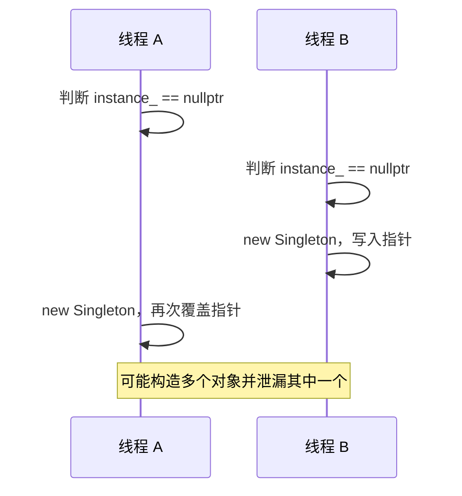

# C++ 成员函数、对象组织与单例复习笔记

> 本笔记根据 `05_class_oop` 下的主示例、`note/` 注释版和 `practice/` 练习整理，用于 C++ 面试前复习。重点覆盖静态/`const` 成员函数、对象数组、`new/delete` 表达式与分配函数、单例模式、`std::string` 以及栈容器设计。

## 目录

- [1. 静态成员函数](#1-静态成员函数)
- [2. const 成员函数](#2-const-成员函数)
- [3. 对象数组与范围 for](#3-对象数组与范围-for)
- [4. 自动对象与动态对象](#4-自动对象与动态对象)
- [5. new/delete 表达式](#5-newdelete-表达式)
- [6. operator new 与 operator delete](#6-operator-new-与-operator-delete)
- [7. 限制对象创建位置](#7-限制对象创建位置)
- [8. 单例模式](#8-单例模式)
- [9. std::string](#9-stdstring)
- [10. 迭代器与失效规则](#10-迭代器与失效规则)
- [11. Stack 类设计复盘](#11-stack-类设计复盘)
- [12. 高频面试题速答](#12-高频面试题速答)
- [13. 源码索引与勘误](#13-源码索引与勘误)

---

## 1. 静态成员函数

### 1.1 基本语法

```cpp
class Counter
{
public:
    static int count() noexcept
    {
        return count_;
    }

private:
    inline static int count_{};
};

int value = Counter::count();
```

静态成员函数属于类作用域，不依赖某个具体对象，推荐通过 `ClassName::function()` 调用。虽然语法上也能通过对象调用，但容易误导读者：

```cpp
Counter counter;
counter.count(); // 合法，但不推荐
```

### 1.2 没有 `this` 指针

```text
非静态成员函数 -> 有 this -> 知道当前对象
静态成员函数   -> 无 this -> 不知道应该操作哪个对象
```

因此静态成员函数：

- 可以直接访问静态数据成员和其他静态成员函数。
- 不能直接访问非静态数据成员或非静态成员函数。
- 可以显式接收或创建对象，再通过该对象访问非静态成员。
- 不能声明为 `const` 成员函数。
- 不能声明为虚函数。

```cpp
class MyClass
{
public:
    static void process(MyClass& object)
    {
        object.value_ = 10; // 显式指定对象后可以访问
    }

private:
    int value_{};
};
```

> [!NOTE]
> 静态成员函数仍属于类作用域，因此可以访问类的 `private` 成员。限制来自“没有当前对象”，而不是访问权限不足。

### 1.3 常见使用场景

- 不依赖对象状态的命名空间式工具接口。
- 静态工厂函数。
- 单例访问入口。
- 查询或维护类级别的共享状态。
- C 风格回调的适配入口，但普通静态函数不能直接捕获某个对象。

如果函数完全不需要访问类的私有内容，也不必强行建立“工具类”，放在合适的命名空间中往往更自然：

```cpp
namespace string_utils {
std::string trim(std::string_view text);
}
```

---

## 2. `const` 成员函数

### 2.1 基本语义

```cpp
class Point
{
public:
    int x() const noexcept
    {
        return x_;
    }

private:
    int x_{};
};
```

函数参数列表后的 `const` 限定隐式对象参数。可近似理解：

```text
普通成员函数中的 this：Point* const
const 成员函数中的 this：const Point* const
```

在 `const` 成员函数中：

- 不能修改普通非静态数据成员。
- 不能调用当前对象的非 `const` 成员函数。
- 对成员对象只能调用其适用的 `const` 接口。
- 可以读取成员，也可以访问静态成员。

> [!IMPORTANT]
> `const` 成员函数不是保证整个程序中没人修改对象，而是限制通过当前 `this` 访问路径进行普通修改。其他别名、指针或并发线程仍可能影响同一对象。

### 2.2 `const` 与非 `const` 重载

```cpp
class Buffer
{
public:
    char& operator[](std::size_t index)
    {
        return data_[index];
    }

    const char& operator[](std::size_t index) const
    {
        return data_[index];
    }

private:
    std::string data_;
};
```

调用选择：

| 对象 | 可调用版本 | 同时存在时优先 |
|---|---|---|
| 非 `const` 对象 | `const` 和非 `const` | 非 `const` 版本 |
| `const` 对象 | 只能调用 `const` 版本 | `const` 版本 |

两个函数可以重载，是因为隐式对象参数的 cv 限定不同。

### 2.3 逻辑常量性与 `mutable`

查询操作有时需要更新缓存或锁，但外部可观察状态并未改变：

```cpp
class Document
{
public:
    std::size_t hash() const
    {
        if (!cached_) {
            cached_hash_ = calculateHash();
            cached_ = true;
        }
        return cached_hash_;
    }

private:
    mutable bool cached_{};
    mutable std::size_t cached_hash_{};
};
```

`mutable` 成员可以在 `const` 成员函数中修改，常用于缓存、统计信息和互斥量。它不应被用来绕过对象接口承诺。

### 2.4 源码中的初始化问题

`02_const_function.cc` 的构造函数没有用参数初始化成员：

```cpp
Point(int x, int y)
{
    // x、y 未使用，m_x、m_y 保持未初始化
}
```

随后 `getX()` 读取 `m_x` 会导致未定义行为风险。正确写法：

```cpp
Point(int x, int y)
    : m_x(x), m_y(y)
{}
```

`const` 函数只保证不修改对象，并不能让未初始化数据变得可读。

---

## 3. 对象数组与范围 `for`

### 3.1 对象数组

```cpp
Point points[] = {
    {1, 1},
    {2, 2},
    {3, 3}
};
```

每个数组元素都是独立对象：

- 按下标递增顺序构造。
- 按下标递减顺序析构。
- 用左值对象初始化元素时通常复制。
- 用同类型纯右值初始化时，现代 C++ 可能或必须省略中间复制，取决于具体语境和标准版本。
- 未显式提供初值的剩余元素需要能够默认初始化。

```cpp
Point source{1, 1};
Point points[3] = {source, {2, 2}, {3, 3}};
```

固定长度容器优先考虑 `std::array`，它保留原生数组的连续存储，同时提供更完整的容器接口：

```cpp
std::array<Point, 3> points{{
    {1, 1},
    {2, 2},
    {3, 3}
}};
```

### 3.2 范围 `for` 的复制问题

```cpp
for (Point point : points) {
    point.print(); // 每次复制一个元素
}

for (auto point : points) {
    point.print(); // 同样按值复制
}

for (auto& point : points) {
    point.modify(); // 不复制，可以修改原元素
}

for (const auto& point : points) {
    point.print();  // 不复制，只读；最常见的只读遍历方式
}
```

选择原则：

- 小型标量或确实需要副本：按值。
- 只读且对象复制成本不明：`const auto&`。
- 需要修改原元素：`auto&`。
- 需要转移元素资源：根据算法明确使用移动，不要盲目写 `auto&&`。

> [!TIP]
> 面试看到 `for (auto item : container)` 时，应立即检查是否发生不必要复制，以及循环体本来是否希望修改容器中的元素。

---

## 4. 自动对象与动态对象

日常口语常说“栈对象”和“堆对象”，更准确的 C++ 概念是存储期与对象生命周期。

```cpp
void function()
{
    Point local{1, 2};              // 通常为自动存储期
    auto dynamic = new Point{3, 4}; // Point 具有动态存储期
    delete dynamic;
}
```

| 对比项 | 自动对象 | 动态对象 |
|---|---|---|
| 常见创建方式 | 局部对象定义 | `new` 表达式 |
| 生命周期 | 由作用域自动控制 | 到匹配的 `delete` |
| 访问 | `object.member` | 常通过 `pointer->member` |
| 异常安全 | 自动析构 | 裸指针易泄漏 |
| 现代替代 | 直接按值 | 智能指针或容器 |

指针本身和指向对象的存储期是两回事：

```cpp
Point local{1, 2};
Point* pointer = &local; // pointer 不会让 local 变成“堆对象”
pointer->print();
```

> [!IMPORTANT]
> 能确定生命周期并按值创建时，优先使用自动对象。不要因为对象“大”就机械地 `new`；是否动态分配应由生命周期、可选性、多态和所有权需求决定。

---

## 5. `new/delete` 表达式

### 5.1 `new` 表达式的两个阶段

```cpp
Point* point = new Point{1, 2};
```

概念上分为：

1. 调用分配函数 `operator new` 获取原始存储。
2. 在该存储上调用 `Point` 构造函数建立对象生命周期。


如果分配失败，普通 `new` 默认抛出 `std::bad_alloc`。使用非抛出形式：

```cpp
Point* point = new (std::nothrow) Point{1, 2};
if (point == nullptr) {
    // 分配失败
}
```

### 5.2 构造函数抛异常时

若内存已经分配，但对象构造失败：

- 该完整对象没有构造成功，因此不会调用它的析构函数。
- 已构造完成的基类和成员会自动析构。
- 运行时调用与分配函数匹配的 `operator delete` 释放原始存储。
- 异常继续向外传播。

这也是类特定 `operator new` 通常应提供匹配 `operator delete` 的原因。

### 5.3 `delete` 表达式的两个阶段

```cpp
delete point;
```

概念上分为：

1. 调用对象析构函数结束生命周期。
2. 调用 `operator delete` 释放原始存储。


数组需要匹配：

```text
new T       <-> delete
new T[n]    <-> delete[]
```

### 5.4 `new/delete` 与构造/析构不是同义词

- `operator new` 只分配原始存储，不调用构造函数。
- `new` 表达式包含分配和构造。
- `operator delete` 只释放原始存储，不调用析构函数。
- `delete` 表达式包含析构和释放。

这一区分是重载分配函数、定位 `new` 和自定义内存池的基础。

---

## 6. `operator new` 与 `operator delete`

### 6.1 类特定分配函数

```cpp
class Point
{
public:
    static void* operator new(std::size_t size)
    {
        if (void* memory = std::malloc(size)) {
            return memory;
        }
        throw std::bad_alloc{};
    }

    static void operator delete(void* memory) noexcept
    {
        std::free(memory);
    }
};
```

即使声明时没有显式写 `static`，类特定的分配/释放函数也是静态成员函数，没有 `this`。

常见要求：

- 返回满足大小和对齐要求的原始存储。
- 普通抛出型 `operator new` 分配失败时应抛 `std::bad_alloc`，不能直接把 `malloc` 的空指针当成功结果返回。
- `operator delete` 不应抛异常。
- 分配与释放机制必须匹配。
- C++17 过对齐类型还可能涉及 `std::align_val_t` 重载。
- 编译器可能选择带大小的删除重载 `operator delete(void*, std::size_t)`。

> [!CAUTION]
> 源码直接 `return malloc(size);` 没有处理 `malloc` 失败，不满足普通抛出型 `operator new` 的预期契约。教学示例可以展示调用顺序，但工程实现必须处理失败、对齐和配套重载。

### 6.2 类特定与全局分配函数

```cpp
Point* first = new Point{1, 2};   // 先查找 Point::operator new
Point* second = ::new Point{3, 4}; // 显式使用全局 operator new
```

类特定 `operator new` 只控制该类普通 `new` 表达式的分配阶段，不控制：

- 自动存储期对象。
- 静态存储期对象。
- 作为其他对象的成员或基类子对象。
- 显式使用全局 `::new` 的情况。
- 定位 `new` 在已有存储上构造的情况。

### 6.3 定位 `new`

```cpp
#include <new>

alignas(Point) std::byte storage[sizeof(Point)];
Point* point = new (storage) Point{1, 2};

point->~Point(); // 显式结束生命周期
```

定位 `new` 不分配存储，只在调用者提供的地址上构造对象。调用者负责：

- 存储大小与对齐正确。
- 原存储生命周期规则正确。
- 最终显式析构非平凡对象。
- 按存储来源决定是否以及如何释放底层存储。

这是容器、内存池等底层设施会用到的技术，普通业务代码不应手写。

---

## 7. 限制对象创建位置

### 7.1 “只允许栈对象”的常见写法

源码通过私有化类特定分配函数阻止普通写法：

```cpp
class Computer
{
private:
    static void* operator new(std::size_t);
    static void operator delete(void*) noexcept;

public:
    Computer(/*...*/);
    ~Computer();
};
```

```cpp
Computer local{/*...*/};          // 可行
// new Computer{/*...*/};         // 类外无法访问类特定 operator new
```

但这并不严格等于“对象只能在栈上”：

- 对象还可具有静态或线程存储期。
- 可以成为其他对象的成员。
- 可显式使用 `::new` 绕过类特定分配函数查找。
- 定位 `new` 可以在已有存储上构造。
- 还应分别考虑 `operator new[]`。

更准确的表述是：限制类外使用普通类特定 `new` 分配该类型。

### 7.2 “只允许堆对象”的常见写法

私有析构函数会阻止类外自动对象，因为作用域结束时无法访问析构函数：

```cpp
class Computer
{
public:
    static Computer* create();
    void destroy() { delete this; }

private:
    ~Computer();
};
```

但 `delete this` 风险很高，只有同时满足以下条件才可能正确：

- 当前对象确实由匹配的单对象 `new` 创建。
- 对象不是自动对象、静态对象、数组元素或其他对象的子对象。
- 删除后成员函数立即返回。
- 删除后任何代码都不再访问对象或其成员。
- 外部不会再次释放同一对象。

> [!CAUTION]
> `delete this` 执行后，连读取成员、调用成员函数或隐式使用 `this` 都属于释放后使用。把销毁责任隐藏在普通成员函数中也容易造成悬空指针和所有权不清晰。

更好的接口通常返回智能指针：

```cpp
class Computer
{
public:
    static std::unique_ptr<Computer> create(/*...*/);
    ~Computer() = default;

private:
    Computer(/*...*/);
};
```

若析构必须私有，需要为智能指针配置可访问的自定义删除器或友元删除器，接口复杂度也会增加。除非确有强设计约束，一般不必限制对象只能放在某类存储中。

### 7.3 访问权限与创建过程

普通动态创建通常需要相关操作可访问：

- 构造函数。
- 选中的分配函数。
- 构造失败时匹配的释放函数。

普通 `delete` 还需要析构函数和释放函数可访问。访问控制是编译期规则，但不能单靠它完整表达所有权。

---

## 8. 单例模式

### 8.1 目标与基本结构

单例模式试图保证进程中的某个逻辑服务只有一个实例，并提供全局访问点：

```cpp
class Singleton
{
public:
    static Singleton& instance()
    {
        static Singleton value;
        return value;
    }

    Singleton(const Singleton&) = delete;
    Singleton& operator=(const Singleton&) = delete;

private:
    Singleton() = default;
};
```

典型措施：

1. 构造函数私有，阻止普通外部创建。
2. 静态函数提供唯一访问入口。
3. 函数内静态对象只初始化一次。
4. 删除拷贝构造和拷贝赋值，防止复制出新对象。

这种写法常称为 Meyers Singleton。

### 8.2 线程安全边界

C++11 起，函数内静态对象的初始化由语言保证线程安全：

```cpp
static Singleton value;
```

“初始化线程安全”不代表单例的所有成员操作都线程安全：

```cpp
Singleton::instance().setValue(...); // 多线程修改仍需同步
```

必须分别分析：

- 首次构造是否安全。
- 内部可变状态访问是否安全。
- 程序退出时与其他线程的关系。

### 8.3 为什么返回引用

```cpp
Singleton& singleton = Singleton::instance();
```

返回引用：

- 不复制对象。
- 明确调用方不拥有实例。
- 避免暴露可删除的裸指针。

也可以返回指针，但会引入是否可为空、是否可删除等额外疑问。

### 8.4 私有析构函数

函数内静态对象可在类的成员函数上下文中定义，即使析构函数是私有的也可以设计为可正常注册销毁；关键是声明点对析构函数具有访问权限。

不过私有析构会限制测试、包装和组合，通常没有必要。更重要的是禁止外部构造与复制。

### 8.5 源码堆单例的问题

```cpp
if (instance_ == nullptr) {
    instance_ = new Singleton;
}
```

该写法存在数据竞争：



手动 `destroy()` 还会产生：

- 已返回引用/指针全部悬空。
- 销毁和访问并发时发生竞态。
- 销毁后再次调用可重新创建，语义复杂。
- 调用方忘记销毁则泄漏。
- 多个静态对象之间仍可能存在销毁顺序问题。

优先使用函数内静态对象。若确需显式动态初始化，可使用 `std::call_once`、互斥量或由程序顶层显式持有生命周期，但不要自行实现未经验证的双重检查锁。

### 8.6 带参数的单例入口

```cpp
Singleton::instance(10, 20);
Singleton::instance(30, 40); // 第二次参数通常被忽略
```

这类接口容易误导。单例配置更适合：

- 在程序启动阶段显式构造依赖。
- 单独的、只能执行一次的初始化接口。
- 通过依赖注入传入需要该服务的对象。

### 8.7 单例的设计代价

单例本质上是受控的全局状态，常见问题：

- 隐藏依赖，函数签名看不出使用了什么服务。
- 测试时难以替换或重置。
- 初始化和销毁顺序复杂。
- 并发访问需要额外同步。
- 状态在测试用例之间泄漏。

> [!IMPORTANT]
> 面试不要只背单例写法。应能说明 Meyers Singleton 的线程安全边界，并指出依赖注入、程序顶层显式持有对象往往更利于测试和生命周期管理。

---

## 9. `std::string`

### 9.1 常见构造方式

```cpp
std::string empty;
std::string from_c_string{"hello"};
std::string prefix{"hello", 3};       // "hel"
std::string copy{from_c_string};
std::string substring{from_c_string, 1, 3}; // "ell"
std::string repeated(5, 'a');         // "aaaaa"
```

区间构造使用半开区间 `[first, last)`：

```cpp
std::string source{"abcdef"};
std::string copy_range{source.begin(), source.end()};
```

### 9.2 大括号与圆括号的构造差异

```cpp
std::string first{98, 'a'};
std::string second(98, 'a');
```

`std::string` 支持 `initializer_list<char>` 构造，因此：

- `first` 优先匹配字符列表，常见结果是两个字符：值为 `98` 的字符 `'b'` 和 `'a'`，即 `"ba"`。
- `second` 明确匹配“重复字符”构造，得到 98 个 `'a'`。

```cpp
std::string letters{'a', 'b', 'c'}; // "abc"
```

> [!CAUTION]
> 花括号并不总与圆括号等价。存在 `initializer_list` 构造函数时，大括号会优先考虑它；同时列表初始化会拒绝窄化转换。

### 9.3 元素访问

```cpp
std::string text{"hello"};

text[0];       // 不进行常规边界检查
text.at(0);    // 越界时抛 std::out_of_range
text.front();  // 首字符
text.back();   // 尾字符
```

- 普通有效元素下标范围为 `[0, size())`。
- 对空字符串调用 `front()` 或 `back()` 不满足前置条件。
- `operator[]` 不适合处理来自不可信输入的下标。
- `at()` 适合需要显式越界错误的接口。

### 9.4 长度与容量

```cpp
text.size();      // 当前字符数
text.length();    // 与 size() 等价
text.empty();     // 是否为空
text.capacity();  // 当前无需重新分配即可容纳的字符数
text.reserve(100);
text.resize(10);
```

`reserve` 与 `resize` 不同：

- `reserve(n)`：调整容量意图，不改变逻辑字符数。
- `resize(n)`：改变字符串长度，必要时添加或删除字符。
- `clear()`：长度变为 0，但不保证释放容量。
- `shrink_to_fit()`：非强制请求缩减容量。

### 9.5 `c_str()` 与 `data()`

```cpp
const char* c_text = text.c_str();
```

- 返回以 `'\0'` 结尾的连续字符序列。
- 适合调用只读 C 接口。
- 指针不拥有内存，不能 `delete`。
- 对字符串执行可能重新分配或修改内容的操作后，旧指针可能失效。

C++17 起，非 `const std::string::data()` 可返回可修改字符缓冲区，但只能在字符串现有大小范围内按规则修改，不能破坏对象不变量。

### 9.6 `std::string` 的实现认知

标准要求连续存储，但不规定具体内部字段。主流实现通常包含：

- 指向字符数据的表示。
- 当前长度。
- 容量。
- 小字符串优化（SSO），把短字符串直接存入对象内部。

SSO 是常见优化，不是标准保证；不能依赖具体阈值和布局。

---

## 10. 迭代器与失效规则

### 10.1 基本概念

```cpp
std::string text{"abcdef"};

auto begin = text.begin(); // 指向第一个字符
auto end = text.end();     // 指向末元素之后的位置
```

有效遍历区间是 `[begin, end)`：

```cpp
for (auto iterator = text.begin();
     iterator != text.end();
     ++iterator) {
    std::cout << *iterator;
}
```

`end()` 是哨兵位置，不能解引用。空字符串中 `begin() == end()`。

### 10.2 “广义指针”只是类比

许多迭代器支持 `*`、`++`、`->`，用起来像指针，但迭代器是一个抽象：

- 不一定是原生地址。
- 不同容器支持的运算能力不同。
- 可能带调试检查或代理引用。
- 迭代器类别决定算法要求。

`std::string` 迭代器是随机访问迭代器，支持加减和距离计算。

### 10.3 迭代器、引用和指针失效

字符串发生重新分配时，指向旧缓冲区的迭代器、引用和指针会失效。可能触发失效的操作包括：

- 追加导致容量增长。
- 插入、删除或替换。
- 赋值、交换以及其他非 `const` 操作，具体保证依标准版本和操作而定。

安全习惯：

- 修改容器后不要继续使用旧迭代器，除非明确知道该操作的失效保证。
- 不长期保存 `c_str()`。
- 循环中修改容器时使用操作返回的新迭代器。

---

## 11. `Stack` 类设计复盘

### 11.1 固定数组版本

```cpp
class Stack
{
public:
    bool empty() const noexcept;
    bool full() const noexcept;
    void push(int value);
    void pop();
    int top() const;

private:
    static constexpr std::size_t capacity_ = 5;
    int data_[capacity_]{};
    std::size_t size_{};
};
```

使用“元素数量”比用 `-1` 表示空栈更适合无符号下标：

- 空：`size_ == 0`。
- 满：`size_ == capacity_`。
- 栈顶：`data_[size_ - 1]`。

查询函数应标记 `const`，简单不抛异常的查询可标记 `noexcept`。

### 11.2 `top()` 返回 `-1` 的问题

如果栈允许存放 `-1`，调用方无法区分：

```text
栈顶元素确实是 -1
栈为空而返回错误哨兵 -1
```

可选设计：

```cpp
int top() const;                    // 空栈时抛 std::out_of_range
std::optional<int> tryTop() const;  // 空栈返回 std::nullopt
bool tryTop(int& output) const;     // 通过状态返回是否成功
```

标准 `std::stack::top()` 要求栈非空，调用方必须满足前置条件。

### 11.3 `std::vector` 版本

```cpp
class Stack
{
public:
    explicit Stack(std::size_t max_size)
        : max_size_(max_size)
    {
        data_.reserve(max_size_);
    }

private:
    std::vector<int> data_;
    std::size_t max_size_;
};
```

改进点：

- 容量类型使用 `std::size_t`，与 `vector::size()` 一致。
- 校验 `max_size > 0`。
- `reserve` 减少容量范围内的重新分配。
- `empty/full/top` 应为 `const`。
- 用标准库容器自动管理内存，遵循 Rule of Zero。

源码使用 `int maxSize` 与 `size_t` 比较，负数配置还会产生隐式无符号转换和错误语义。

### 11.4 泛型版本

```cpp
template <typename T>
class Stack
{
public:
    explicit Stack(std::size_t max_size)
        : max_size_(max_size)
    {
        data_.reserve(max_size_);
    }

    void push(const T& value)
    {
        ensureNotFull();
        data_.push_back(value);
    }

    void push(T&& value)
    {
        ensureNotFull();
        data_.push_back(std::move(value));
    }

    void pop()
    {
        ensureNotEmpty();
        data_.pop_back();
    }

    T& top()
    {
        ensureNotEmpty();
        return data_.back();
    }

    const T& top() const
    {
        ensureNotEmpty();
        return data_.back();
    }

private:
    std::vector<T> data_;
    std::size_t max_size_;
};
```

面试设计容器时要明确：

- 空/满时是抛异常、返回状态还是未定义行为。
- 是否固定容量。
- 是否允许复制和移动。
- 引用/迭代器在修改后的有效性。
- 是否需要线程安全；普通容器默认不自动提供并发写安全。

---

## 12. 高频面试题速答

### 1. 静态成员函数为什么不能直接访问非静态成员？

它没有 `this` 指针，不知道应该访问哪个对象。显式取得对象后，仍可通过对象访问其成员。

### 2. 静态成员函数能访问类的私有成员吗？

能访问私有静态成员；它仍属于类作用域。不能直接访问非静态成员是缺少对象，不是权限问题。

### 3. 静态成员函数能否是 `const` 或虚函数？

不能。它没有隐式对象参数可供 `const` 限定，也没有对象动态类型参与虚分派。

### 4. `const` 成员函数中的 `this` 如何理解？

可近似理解为 `const T* const`：不能改变其指向，也不能通过它修改普通数据成员。

### 5. 普通对象同时面对 `const` 与非 `const` 重载时调用哪个？

优先调用非 `const` 版本；`const` 对象只能调用适用的 `const` 版本。

### 6. `mutable` 有什么用途？

允许某成员在 `const` 成员函数中修改，适合不改变逻辑状态的缓存、锁和统计信息，不应拿来随意绕过只读接口。

### 7. `for (auto value : container)` 有什么潜在问题？

每轮会按值构造副本，可能昂贵，也无法修改原元素。只读遍历通常使用 `const auto&`，修改使用 `auto&`。

### 8. 指向局部对象的指针会让对象进入堆吗？

不会。对象存储期由创建方式决定，指针只是保存地址。`Point* p = &local;` 中 `local` 仍是自动对象。

### 9. `new T` 内部发生了什么？

先通过 `operator new` 分配原始存储，再调用 `T` 的构造函数建立对象；成功后返回指针。

### 10. `delete p` 内部发生了什么？

对有效匹配指针，先调用对象析构函数，再通过 `operator delete` 释放原始存储。

### 11. `operator new` 和 `new` 有什么区别？

`operator new` 是分配函数，只负责原始存储；`new` 是表达式，包含分配、构造和类型化指针结果。

### 12. 构造函数在 `new` 中抛异常会泄漏刚分配的内存吗？

正常匹配情况下不会。运行时会调用与分配函数匹配的 `operator delete` 释放原始存储；已构造成员也会析构。

### 13. 类的 `operator new` 能否真正保证对象只能在栈上？

不能。它只能限制普通类特定动态分配；对象还可为静态对象、子对象，并可通过全局 `::new` 或定位 `new` 等路径构造。

### 14. `delete this` 什么时候才可能安全？

对象必须来自匹配的单对象 `new`，删除后立即返回，任何地方都不能再使用或重复删除对象。该模式所有权不透明，一般不推荐。

### 15. Meyers Singleton 为什么常被推荐？

实现简洁，C++11 起函数内静态初始化线程安全，并自动管理生命周期，无需裸指针和手动 `destroy()`。

### 16. Meyers Singleton 是否意味着所有操作都线程安全？

不是。只保证首次初始化；单例内部可变状态的并发读写仍需同步。

### 17. 手写堆单例的 `if (!ptr) ptr = new T;` 有什么问题？

多线程首次访问存在数据竞争，可能创建多个对象并泄漏；手动销毁还会使已返回引用悬空。

### 18. 单例模式的主要缺点是什么？

它引入隐藏全局状态和依赖，增加测试替换、初始化销毁顺序和并发管理难度。很多场景下依赖注入更清晰。

### 19. `std::string s{98, 'a'}` 和 `s(98, 'a')` 有何区别？

前者优先匹配字符初始化列表，常得到 `"ba"`；后者调用重复字符构造，得到 98 个 `'a'`。

### 20. `size()`、`capacity()`、`reserve()` 和 `resize()` 有何区别？

`size` 是当前字符数，`capacity` 是当前无需重分配可容纳数量；`reserve` 影响容量意图但不改长度，`resize` 直接改变长度。

### 21. `at()` 与 `operator[]` 有何区别？

`at()` 越界抛 `std::out_of_range`；`operator[]` 不进行普通边界检查，非法元素下标可能导致未定义行为。

### 22. `c_str()` 返回指针可以长期保存吗？

不应长期保存。指针由字符串管理，修改或重分配可能使其失效，也不能由调用方释放。

### 23. `end()` 迭代器能否解引用？

不能。它指向末元素之后的位置，只用于边界比较等操作。

### 24. 为什么栈的 `top()` 不宜用 `-1` 表示失败？

`-1` 可能是合法元素，成功值与错误状态混在同一通道。可使用异常、`std::optional` 或显式状态返回。

### 25. `vector` 版 Stack 为什么更符合现代 C++？

`vector` 自动管理内存并提供正确复制/移动语义，使 Stack 遵循 Rule of Zero；仍需补充容量校验、`const` 接口和清晰错误策略。

---

## 13. 源码索引与勘误

### 13.1 源码索引

| 主题 | 对应示例 |
|---|---|
| 静态成员函数 | `01_static_function.cc`、`note/01_static_function_note.cc` |
| `const` 成员函数与重载 | `02_const_function.cc`、`note/02_const_function_note.cc` |
| 对象数组、范围 `for`、自动/动态对象 | `03_object_organization.cc`、对应 `note/` 文件 |
| 类特定 `operator new/delete` | `04_new_delete.cc`、对应 `note/` 文件 |
| 函数内静态单例 | `05_singleton_pattern.cc`、对应 `note/` 文件 |
| 裸指针堆单例 | `06_singleton_pattern_v2.cc`、对应 `note/` 文件 |
| `std::string` 构造、访问和迭代器 | `07_string.cc`、对应 `note/` 文件 |
| 限制普通对象创建方式 | `practice/01_only_stack_obj.cc`、`02_only_heap_obj.cc` |
| 静态区与堆区单例练习 | `practice/03_singleton_static_area.cc`、`04_singleton_heap_area.cc` |
| 固定数组 Stack | `practice/05_class_stack.cc` |
| `std::vector` Stack | `practice/06_class_stack_vector.cc` |

### 13.2 示例中需要特别注意的地方

1. `01_static_function.cc` 中 `MyClass::m_data2` 只有声明、没有类外定义；当前未发生要求定义的使用，但若对其取值或修改，通常会出现链接错误。C++17 可改为 `inline static int m_data2{};`。
2. `MyClass obj;` 的 `m_data1` 未初始化；仅写 `obj.m_data1;` 作为弃值表达式没有业务意义，不应把它当成安全可读的值。
3. `02_const_function.cc` 构造函数未初始化 `m_x/m_y`，随后 `getX()` 读取未初始化成员会产生未定义行为风险。
4. `03_object_organization.cc` 将 `private:` 注释掉，使坐标公开；真实类设计应通过接口维护状态。
5. `for (Point pt : pts)` 和 `for (auto pt : pts)` 都会复制每个元素；只读遍历优先 `const auto&`。
6. `04_new_delete.cc` 的 `operator new` 直接返回 `malloc` 结果，没有在失败时抛 `std::bad_alloc`，也未覆盖过对齐和其他删除重载需求。
7. 私有类特定 `operator new/delete` 不能严格保证“只能创建栈对象”，还存在全局 `::new`、定位 `new`、静态对象和子对象等路径。
8. 私有析构加 `delete this` 能演示访问控制，但所有权和生命周期风险高；优先使用工厂与智能指针。
9. `practice/01_only_stack_obj.cc` 和 `02_only_heap_obj.cc` 都用裸字符指针管理品牌，却没有实现安全复制控制，复制会导致浅拷贝和重复释放。
10. 函数内静态单例初始化自 C++11 起线程安全，但单例成员操作并不会自动线程安全。
11. 裸指针堆单例的空指针检查存在数据竞争；手动 `destroy()` 会让已有引用悬空，且销毁后还能再次创建。
12. 带参数 `getInstance(x, y)` 只有首次参数生效，接口容易产生误解。
13. `std::string s6{98, 'a'}` 优先匹配字符列表，通常得到 `"ba"`，不是 98 个 `'a'`。
14. 对空字符串调用 `front()/back()` 不满足前置条件；`end()` 也不能解引用。
15. 保存的迭代器或 `c_str()` 指针可能在字符串修改和重分配后失效。
16. 两个 Stack 版本的查询函数都应添加 `const`；`top()` 返回 `-1` 会混淆错误与合法元素。
17. `vector` 版使用 `int maxSize` 与 `size_t` 比较，应改用 `std::size_t` 并拒绝零或负容量。
18. `vector` 版包含 `<algorithm>` 但未使用，可删除无关头文件。

> [!TIP]
> 复习本章可以沿一条“对象访问与生命周期”主线：静态函数没有对象 → `const` 函数限制对象访问 → 数组和范围循环决定是否复制 → `new/delete` 分离存储与生命周期 → 单例控制全局生命周期 → 容器与 `string` 用 RAII 消除手工管理。
