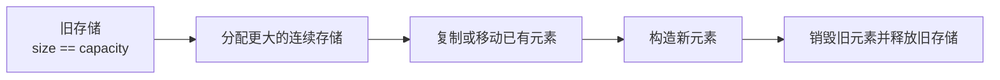
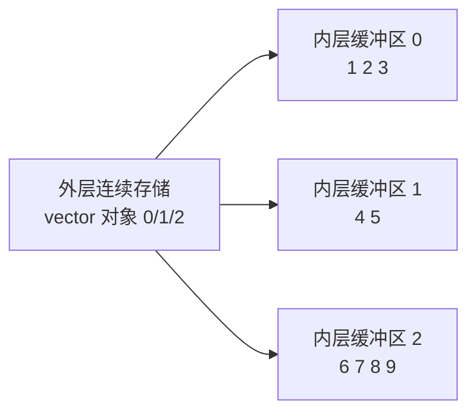
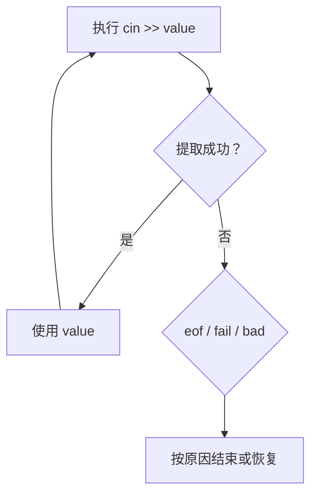
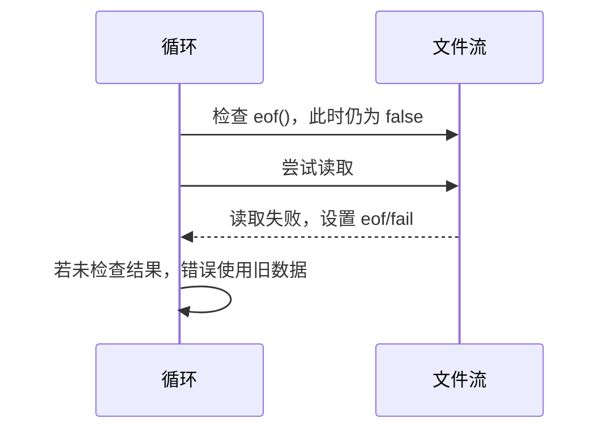

# C++ `string`、`vector` 与流复习笔记

> 本笔记根据 `06_string_vector_stream` 下的主示例、`note/` 注释版、`practice/` 练习及 `data.txt` 整理，用于 C++ 面试前复习。重点覆盖字符串与动态数组的接口、容量和失效规则，I/O 流状态、缓冲与文件读取，以及自定义资源类的设计问题。

## 目录

- [1. std::string 常用操作](#1-stdstring-常用操作)
- [2. string 的查找、截取与失效规则](#2-string-的查找截取与失效规则)
- [3. std::vector 基础](#3-stdvector-基础)
- [4. vector 的容量、扩容与异常安全](#4-vector-的容量扩容与异常安全)
- [5. vector 的迭代器失效](#5-vector-的迭代器失效)
- [6. 嵌套 vector 与自定义类型](#6-嵌套-vector-与自定义类型)
- [7. 自定义 String 类复盘](#7-自定义-string-类复盘)
- [8. I/O 流体系与状态](#8-io-流体系与状态)
- [9. 正确处理格式化输入](#9-正确处理格式化输入)
- [10. 标准流、缓冲与刷新](#10-标准流缓冲与刷新)
- [11. 文件输入流 ifstream](#11-文件输入流-ifstream)
- [12. 练习代码设计复盘](#12-练习代码设计复盘)
- [13. 高频面试题速答](#13-高频面试题速答)
- [14. 源码索引与勘误](#14-源码索引与勘误)

---

## 1. `std::string` 常用操作

### 1.1 基本性质

`std::string` 是 `std::basic_string<char>` 的别名，管理连续的字符序列：

```cpp
std::string text{"abcdef"};

text.size();    // 字符数量
text.length();  // 与 size() 等价
text.empty();   // 是否为空
text.data();    // 连续字符数据
text.c_str();   // 以 '\0' 结尾的只读 C 字符串视图
```

标准保证字符连续存放，因此可以与需要连续字节的接口协作。具体内部字段、容量增长方式和小字符串优化（SSO）不由标准规定。

### 1.2 元素访问

```cpp
char first = text[0];
char checked = text.at(1);
char front = text.front();
char back = text.back();
```

| 接口 | 边界行为 |
|---|---|
| `operator[]` | 不进行普通范围检查，非法元素下标可能导致未定义行为 |
| `at(index)` | 越界时抛出 `std::out_of_range` |
| `front()` | 返回首字符；空字符串不满足前置条件 |
| `back()` | 返回尾字符；空字符串不满足前置条件 |

面向可信、性能敏感且已验证下标的内部逻辑常用 `[]`；面向外部输入或希望显式报错时可用 `at()`。

### 1.3 插入与追加

```cpp
std::string text{"hello"};
std::string value{"abc"};

text.insert(1, value);                 // 在下标 1 前插入
text.insert(1, "xyz");
text.push_back('!');
text.append(value);
text.append(value.begin(), value.end());
text += "end";
```

选择可按语义：

- 末尾添加单个字符：`push_back`。
- 末尾追加字符串或区间：`append`、`+=`。
- 任意位置插入：`insert`。

这些操作可能重新分配字符缓冲区，从而使旧指针、引用和迭代器失效。

### 1.4 删除

```cpp
std::string text{"abcdef"};

auto next = text.erase(text.begin() + 2); // 删除 'c'，返回指向 'd' 的迭代器
text.erase(text.begin() + 2, text.end()); // 删除半开区间
text.erase(1, 3);                         // 从下标 1 删除最多 3 个字符
text.clear();                             // 删除全部字符
```

`erase(iterator)` 返回删除位置之后的新迭代器；若删除最后一个元素，返回 `end()`，不能解引用。

### 1.5 拼接

```cpp
std::string lhs{"abc"};
std::string rhs{"def"};

std::string result = lhs + rhs;
result = lhs + "xyz";
result += rhs;
```

连续使用 `operator+` 可能产生中间临时对象。已知最终结果较大时，可先 `reserve` 再使用 `append`/`+=`：

```cpp
std::string result;
result.reserve(lhs.size() + rhs.size());
result += lhs;
result += rhs;
```

> [!NOTE]
> 编译器和标准库可能优化部分临时对象，但接口设计时仍应避免在循环中反复从空字符串使用 `result = result + piece`。

---

## 2. `string` 的查找、截取与失效规则

### 2.1 `substr`

```cpp
std::string text{"abcdef"};

std::string first = text.substr(0, 3); // "abc"
std::string rest = text.substr(2);     // "cdef"
```

- `pos > size()`：抛出 `std::out_of_range`。
- `count` 超过剩余长度：截取到末尾，不报错。
- 返回新字符串，通常需要构造自己的结果数据。

C++17 起，若只需无所有权子串视图，可考虑 `std::string_view`：

```cpp
std::string_view view{text};
std::string_view part = view.substr(2, 3);
```

`string_view` 不拥有字符，原字符串销毁或重新分配后视图可能悬空。

### 2.2 `find` 与 `npos`

```cpp
std::string::size_type position = text.find("de");

if (position == std::string::npos) {
    // 未找到
}
```

`find` 返回无符号的 `size_type`。未找到时返回 `std::string::npos`，它通常是该无符号类型的最大值。

> [!CAUTION]
> 源码把结果存入 `int` 并判断 `index < 0`。`npos` 转成 `int` 在无法表示时结果由实现决定，常见得到 `-1` 但不可依赖。应保留 `size_type`/`auto` 并与 `string::npos` 比较。

常见查找：

```cpp
text.find("sub");
text.rfind("sub");
text.find_first_of("abc");
text.find_first_not_of(" \t\n");
```

### 2.3 容量

```cpp
text.size();       // 当前字符数
text.capacity();   // 当前无需重分配可容纳的字符数
text.reserve(100); // 请求预留容量，不改变 size
text.resize(20);   // 改变 size
text.shrink_to_fit(); // 非强制的缩容请求
```

`clear()` 让 `size()` 变为 0，但不保证释放容量。

### 2.4 指针、引用和迭代器失效

```cpp
const char* pointer = text.c_str();
auto iterator = text.begin();

text += "more"; // 可能重新分配
// pointer 和 iterator 可能已经失效
```

修改字符串后，不要继续使用旧的：

- `c_str()`/`data()` 指针。
- 元素指针或引用。
- 迭代器。

具体操作的失效保证与标准版本有关；除非明确掌握规则，修改后重新取得最安全。

---

## 3. `std::vector` 基础

### 3.1 连续动态数组

`std::vector<T>` 是可变长度的顺序容器。除 `vector<bool>` 特化外，元素连续存储：

```cpp
std::vector<int> values{1, 2, 3};

int* first = values.data();
// &values[i] == values.data() + i
```

特点：

- 随机访问为常数复杂度。
- 尾部添加通常为摊销常数复杂度。
- 中间插入/删除通常为线性复杂度。
- 自动管理元素生命周期和动态内存。
- 按值拥有元素。

### 3.2 构造方式

```cpp
std::vector<int> empty;
std::vector<int> list{1, 2, 3};
std::vector<int> range(list.begin(), list.end());
std::vector<int> repeated(3, 10); // 三个 10
std::vector<int> copied{list};
```

大括号与圆括号含义不同：

```cpp
std::vector<int> first(3, 10); // {10, 10, 10}
std::vector<int> second{3, 10}; // {3, 10}
```

因为大括号优先匹配 `initializer_list` 构造函数。

### 3.3 常用接口

```cpp
values.empty();
values.size();
values.capacity();

values.push_back(4);
values.emplace_back(5);
values.pop_back();
values.clear();

values.front();
values.back();
values.at(0);
values[0];
```

对空 `vector` 调用 `front()`、`back()` 或 `pop_back()` 不满足前置条件。

`emplace_back(args...)` 在容器尾部直接用参数构造元素，但不代表任何情况下都比 `push_back` 快；已有对象时 `push_back` 更清晰，编译器也能消除许多临时开销。

### 3.4 遍历与类型

```cpp
for (std::size_t i = 0; i < values.size(); ++i) {
    std::cout << values[i];
}

for (const auto& value : values) {
    std::cout << value;
}
```

`size()` 返回无符号 `size_type`。源码多处使用 `int i < vector.size()`，可能触发有符号/无符号比较警告；使用 `std::size_t`、容器的 `size_type` 或范围 `for`。

---

## 4. `vector` 的容量、扩容与异常安全

### 4.1 `size` 与 `capacity`

```text
size     = 已构造、可访问的元素数量
capacity = 当前存储无需重新分配可容纳的元素数量
```

必须满足：

```text
0 <= size <= capacity
```

`reserve(n)`：

- 若 `n <= capacity()`，通常不做任何事。
- 若 `n > capacity()`，分配新存储并搬迁元素。
- 不创建新元素，`size()` 不变。
- 完成重新分配后，旧迭代器、指针和引用全部失效。

`resize(n)`：

- 改变元素数量。
- 变大时构造新元素。
- 变小时析构尾部元素。
- 是否重新分配取决于新大小和容量。

### 4.2 扩容过程

当尾部添加且容量不足时，典型过程：



容量增长倍率由标准库实现决定，常见为几何增长，但标准不保证固定的 1.5 倍或 2 倍。

### 4.3 为什么是摊销常数复杂度

单次扩容需要搬迁所有元素，是线性操作；但容量按几何级数增长时，许多次 `push_back` 中只有少数触发扩容，总成本分摊后为摊销常数。

### 4.4 `reserve` 的价值

已知大致元素数时：

```cpp
std::vector<Point> points;
points.reserve(expected_count);
```

可以：

- 减少内存分配次数。
- 减少已有元素复制/移动。
- 在容量范围内保持元素地址稳定。

不要在每次 `push_back` 前调用 `reserve(size() + 1)`，这会破坏几何增长策略，可能把整体复杂度退化为平方级。

### 4.5 搬迁时复制还是移动

扩容时 `vector` 通常优先使用不会破坏异常保证的方式：

- 元素移动构造是 `noexcept`：通常移动。
- 移动可能抛出且类型可复制：实现常选择复制以保持强异常保证。
- 只能移动且移动可能抛出：异常保证可能受限。

资源型类型的移动构造应在确实不抛异常时标记 `noexcept`：

```cpp
Point(Point&&) noexcept = default;
```

### 4.6 `clear` 与 `shrink_to_fit`

```cpp
values.clear();         // 析构全部元素，size=0，capacity 通常保留
values.shrink_to_fit(); // 请求缩小容量，不保证一定执行
```

保留容量有利于容器再次增长。频繁缩容和扩容可能降低性能。

---

## 5. `vector` 的迭代器失效

失效规则是面试高频：

### 5.1 重新分配时

只要发生重新分配：

- 所有元素引用失效。
- 所有元素指针失效。
- 所有迭代器，包括旧 `end()`，全部失效。

```cpp
auto iterator = values.begin();
values.push_back(42); // 若扩容，iterator 失效
```

### 5.2 不重新分配时

常见规则：

| 操作 | 未重新分配时的典型失效范围 |
|---|---|
| `push_back/emplace_back` | 旧 `end()` 失效；现有元素引用通常保持 |
| `insert` | 插入位置及其后的迭代器/引用失效 |
| `erase` | 被删位置及其后的迭代器/引用失效 |
| `pop_back` | 被删除元素及旧 `end()` 失效 |
| `clear` | 所有元素相关迭代器/引用失效 |

继续遍历并删除时应接收 `erase` 返回值：

```cpp
for (auto iterator = values.begin(); iterator != values.end();) {
    if (shouldErase(*iterator)) {
        iterator = values.erase(iterator);
    } else {
        ++iterator;
    }
}
```

> [!IMPORTANT]
> `reserve` 不是永久地址保证。只要未来大小超过容量，仍会重新分配。需要稳定地址时考虑 `std::deque`、`std::list`、间接存储或预先固定所有权结构，并根据访问需求权衡。

---

## 6. 嵌套 `vector` 与自定义类型

### 6.1 `vector<vector<int>>` 的内存关系

```cpp
std::vector<std::vector<int>> matrix{
    {1, 2, 3},
    {4, 5},
    {6, 7, 8, 9}
};
```

外层 `vector` 连续存储的是若干 `vector<int>` 对象；每个内层 `vector` 通常分别拥有自己的动态缓冲区：



因此：

- 每一行内部连续。
- 不同行元素通常不在一块整体连续二维内存中。
- 支持不规则行长度。
- 若算法要求完整矩阵连续，可使用一维 `vector<T>` 加行列索引。

### 6.2 存储自定义对象

```cpp
std::vector<Point> points;
points.reserve(3);

points.push_back(existing);   // 复制已有左值
points.push_back(Point{1, 2}); // 移动或直接构造相关过程
points.emplace_back(3, 4);    // 在尾部用参数构造
```

容器按值拥有 `Point`。类型应有正确的析构、复制和移动语义；最佳情况是使用 RAII 成员并遵循 Rule of Zero。

遍历：

```cpp
for (const Point& point : points) {
    point.print();
}
```

### 6.3 `vector<bool>` 特例

`vector<bool>` 可能按位压缩，不提供普通 `bool&` 语义：

```cpp
std::vector<bool> flags{true, false};
auto value = flags[0]; // 可能是代理对象，不是 bool&
```

需要普通连续 `bool` 对象语义时，应选择其他表示。

---

## 7. 自定义 `String` 类复盘

### 7.1 资源与不变量

源码希望保持：

```text
m_pstr 始终指向一段有效、以 '\0' 结尾的独占字符数组
```

默认构造分配一个字符并置 `'\0'`，比用 `nullptr` 表示空字符串更容易维持接口不变量：

```cpp
String() : data_(new char[1]{'\0'}) {}
```

### 7.2 Rule of Three/Five

直接拥有 `char*` 时至少要检查：

- 析构函数。
- 拷贝构造函数。
- 拷贝赋值运算符。

C++11 后还应检查：

- 移动构造函数。
- 移动赋值运算符。

源码没有移动操作，放入 `vector<String>` 时扩容可能只能复制。

### 7.3 赋值的异常安全

主示例 `03_string.cc` 先删除旧内存，再申请新内存：

```cpp
delete[] m_pstr;
m_pstr = nullptr;
char* temp = new char[...];
```

若分配失败，原值已经丢失，不满足强异常保证。

练习 `practice/03_class_String.cc` 改为先分配并复制成功，再替换：

```cpp
char* temporary = new char[...];
std::strcpy(temporary, rhs.data_);

delete[] data_;
data_ = temporary;
```

这样分配失败时原对象保持不变。

### 7.4 `const` 正确性

主示例：

```cpp
int size();
char* c_str();
```

更合理的接口：

```cpp
std::size_t size() const noexcept;
const char* c_str() const noexcept;
```

- 查询不修改对象，应为 `const`。
- 长度类型应使用 `std::size_t`。
- `c_str()` 返回可写裸指针会让调用方破坏结尾 `'\0'`、越界写入或错误释放。

可根据需求额外提供受控的非 `const` 元素访问，而不是直接暴露所有内部存储。

### 7.5 空指针参数

```cpp
String(const char* text)
    : data_(new char[std::strlen(text) + 1])
{}
```

若 `text == nullptr`，`strlen` 会产生未定义行为。接口应明确：

- 把空指针视作非法参数并抛异常。
- 或把它规范化为空字符串。
- 更推荐直接接收 `std::string_view`/`std::string`，避免模糊空指针语义。

### 7.6 为什么不应重复造 `std::string`

自定义实现适合理解：

- RAII。
- 深拷贝与移动。
- 异常安全。
- 容量和迭代器。

生产代码应优先使用经过充分测试的 `std::string`。自行实现完整字符串还需处理分配器、容量、重叠输入、字符特征、异常保证和大量接口。

---

## 8. I/O 流体系与状态

### 8.1 常用流类型

```text
std::ios_base
└── std::basic_ios
    ├── std::istream
    │   └── std::ifstream
    ├── std::ostream
    │   └── std::ofstream
    └── std::iostream
        └── std::fstream
```

- `std::cin`：标准输入流。
- `std::cout`：标准输出流。
- `std::cerr`：标准错误流，默认带 `unitbuf` 行为。
- `std::clog`：标准日志流，通常缓冲。
- `std::ifstream`：文件输入。
- `std::ofstream`：文件输出。
- `std::fstream`：文件输入输出。
- `std::istringstream/ostringstream`：字符串流。

### 8.2 四个状态查询

底层状态位包括：

- `goodbit`：值为 0，未设置错误位。
- `eofbit`：输入序列到达末尾。
- `failbit`：格式化提取失败等逻辑错误。
- `badbit`：底层 I/O 严重错误。

查询：

| 函数 | 含义 |
|---|---|
| `good()` | 没有任何错误位 |
| `eof()` | 是否设置 `eofbit` |
| `fail()` | 是否设置 `failbit` 或 `badbit` |
| `bad()` | 是否设置 `badbit` |

状态不是互斥枚举，多个位可以同时设置。例如读取到文件末尾的失败提取常同时设置 `eofbit` 和 `failbit`。

### 8.3 流的布尔转换

```cpp
if (stream) {
    // 等价关注“没有 fail”
}
```

流的 `operator bool` 近似检查 `!fail()`，并不完全等价于 `good()`。只有 `eofbit` 而没有 `failbit/badbit` 时，`good()` 已为假，但布尔转换未必为假。

> [!IMPORTANT]
> 源码中“good 状态为 true，任何非 good 状态为 false”是教学简化。面试应区分 `good()` 与流的布尔转换。

### 8.4 `clear()` 与 `ignore()`

```cpp
stream.clear();
stream.ignore(std::numeric_limits<std::streamsize>::max(), '\n');
```

- `clear()`：重设状态位，默认恢复为 `goodbit`。
- `ignore()`：从输入序列丢弃字符。

格式错误后只调用 `clear()` 不够，错误字符仍留在输入序列，下次提取会再次失败；通常还要 `ignore()` 丢弃当前行。

---

## 9. 正确处理格式化输入

### 9.1 把提取操作放入条件

错误倾向：

```cpp
while (!std::cin.eof()) {
    std::cin >> value;
    use(value);
}
```

`eofbit` 通常只有在读取操作实际遇到末尾后才设置。循环会先进入，再执行一次失败读取，可能重复使用旧值或未初始化值。

正确写法：

```cpp
int value{};
while (std::cin >> value) {
    use(value);
}
```



同理：

```cpp
std::string word;
while (file >> word) {
    process(word);
}
```

### 9.2 可恢复的交互输入

```cpp
int value{};

for (;;) {
    std::cout << "请输入整数：";

    if (std::cin >> value) {
        break;
    }

    if (std::cin.eof()) {
        // 用户结束输入，不能无限重试
        return;
    }

    if (std::cin.bad()) {
        throw std::runtime_error{"标准输入发生严重错误"};
    }

    std::cin.clear();
    std::cin.ignore(
        std::numeric_limits<std::streamsize>::max(), '\n');
}
```

处理原则：

- 成功：使用值。
- `eof`：正常结束读取。
- `bad`：通常不可简单恢复，应退出或报告。
- 普通格式 `fail`：清状态、丢弃错误输入后重试。

### 9.3 避免读取失败后使用变量

```cpp
int number;       // 未初始化
std::cin >> number;
std::cout << number; // 若提取失败，读取未初始化值
```

应初始化并只在提取成功后使用：

```cpp
int number{};
if (std::cin >> number) {
    std::cout << number;
}
```

### 9.4 `operator>>` 与 `getline`

```cpp
std::string word;
stream >> word;           // 跳过前导空白，读取到下一个空白

std::string line;
std::getline(stream, line); // 读取整行，丢弃分隔换行
```

混用时，格式化提取可能在输入中留下换行：

```cpp
int age{};
std::cin >> age;
std::cin.ignore(
    std::numeric_limits<std::streamsize>::max(), '\n');
std::getline(std::cin, line);
```

---

## 10. 标准流、缓冲与刷新

### 10.1 为什么 `<<` 和 `>>` 能连续调用

流运算符返回流引用：

```cpp
std::cout << first << second;
```

可理解为：

```cpp
operator<<(operator<<(std::cout, first), second);
```

同理：

```cpp
std::cin >> first >> second;
```

提取失败后流保持失败状态，后续连续提取通常不会继续正常解析，直到状态被恢复。

### 10.2 刷新方式

```cpp
std::cout << '\n';         // 只写换行，不保证 C++ 层立即刷新
std::cout << std::endl;    // 写换行并 flush
std::cout << std::flush;   // 只刷新
std::cout << std::ends;    // 写 '\0'，较少用于普通文本输出
```

普通日志循环优先 `'\n'`，只在交互提示、调试或必须立即可见时刷新。

### 10.3 `cout`、`cerr` 与环境

“行缓冲、全缓冲、无缓冲”是有用的观察模型，但实际表现受以下因素共同影响：

- C++ `streambuf`。
- 与 C 标准 I/O 的同步。
- 输出目标是终端、文件还是管道。
- `tie` 和 `unitbuf` 设置。
- 标准库与操作系统实现。

`std::cerr` 默认设置 `unitbuf`，每次输出操作后会刷新，因此常表现为立即输出；说它“绝对没有任何缓冲层”并不严谨。

`std::cin` 默认与 `std::cout` 绑定，输入前会刷新 `cout`，所以不带换行的交互提示通常仍能显示：

```cpp
std::cout << "请输入：";
std::cin >> value; // tied stream 通常先刷新 cout
```

### 10.4 性能设置

```cpp
std::ios::sync_with_stdio(false);
std::cin.tie(nullptr);
```

- 关闭与 C `stdio` 同步可能提高大量 I/O 性能。
- 解开 `cin` 与 `cout` 绑定可减少自动刷新。
- 之后混用 `printf/scanf` 与 `cin/cout` 时顺序需要格外谨慎。
- 交互程序若解除绑定，要自己在提示后刷新。

---

## 11. 文件输入流 `ifstream`

### 11.1 打开与检查

```cpp
std::ifstream input{"data.txt"};

if (!input) {
    throw std::runtime_error{"无法打开文件"};
}
```

相对路径相对于进程当前工作目录，不一定是源文件所在目录。源码在不同目录启动时可能找不到 `data.txt`。

也可以先构造再打开：

```cpp
std::ifstream input;
input.open(path);
```

文件流是 RAII 对象，析构时自动关闭文件。显式 `close()` 主要用于提前释放文件、切换文件或检查关闭结果，不是避免泄漏的必需步骤。

### 11.2 打开模式

```cpp
std::ifstream text_file{path, std::ios::in};
std::ifstream binary_file{
    path, std::ios::in | std::ios::binary};
```

常见模式：

- `std::ios::in`：读。
- `std::ios::out`：写。
- `std::ios::app`：每次写到末尾。
- `std::ios::ate`：打开后初始定位到末尾。
- `std::ios::trunc`：截断已有内容。
- `std::ios::binary`：二进制模式。

### 11.3 按字符读取

最简单安全的循环：

```cpp
char character{};
while (input.get(character)) {
    process(character);
}
```

无参数 `get()` 返回流的 `int_type`，因为结果既要表示所有可能字符值，又要表示 EOF：

```cpp
using Traits = std::char_traits<char>;
std::istream::int_type character;

while (!Traits::eq_int_type(
    character = input.get(), Traits::eof())) {
    process(Traits::to_char_type(character));
}
```

> [!CAUTION]
> 不应硬编码 `!= -1` 判断 EOF。`EOF` 常见为 `-1`，但应使用流字符特征的 `eof()`/`eq_int_type()`，或直接使用 `while (input.get(ch))`。

用 `char` 接收无参数 `get()` 的返回值可能无法区分某个合法字符与 EOF，因此应使用 `int_type`。

### 11.4 按单词与按行读取

```cpp
std::string word;
while (input >> word) {
    process(word);
}

std::string line;
while (std::getline(input, line)) {
    process(line);
}
```

- `operator>>`：按空白分隔 token。
- `getline`：按行读取，可保留行内空格。
- 两者都应把读取操作放在循环条件中。

### 11.5 为什么不能用 `while (!eof())`



EOF 表示“最近一次读取尝试遇到了末尾”，不是“下一次读取一定会失败”的预测接口。

### 11.6 读取结束后的状态判断

```cpp
while (input >> word) {
    process(word);
}

if (input.bad()) {
    // 底层 I/O 错误
} else if (!input.eof()) {
    // 不是正常 EOF，可能是格式错误
}
```

读取循环结束不一定都代表正常到达文件末尾，应按业务需要区分状态。

---

## 12. 练习代码设计复盘

### 12.1 `Student`

```cpp
class Student
{
public:
    Student(std::string name, int id, double score)
        : name_(std::move(name)), id_(id), score_(score)
    {}

    void print(std::ostream& output) const
    {
        output << name_ << ' ' << id_ << ' ' << score_;
    }

private:
    std::string name_;
    int id_{};
    double score_{};
};
```

建议：

- 数据成员命名一致。
- 校验成绩范围。
- 输出函数接收 `ostream&`，便于输出到终端、文件或字符串流。
- 学号若需要保留前导零，应使用字符串。

源码中的 `001`、`002` 是八进制整数字面量；当前值与十进制相同，但 `010` 表示十进制 8。

### 12.2 `Computer`

练习通过先分配后替换实现了较好的拷贝赋值异常安全，但仍缺少移动操作。生产代码直接使用：

```cpp
class Computer
{
    std::string brand_;
    double price_{};
};
```

即可遵循 Rule of Zero。

### 12.3 `Logger` 单例

练习中的裸指针单例：

- 首次访问线程不安全。
- `destroyInstance()` 使已有指针悬空。
- 销毁后可以重新创建。
- 日志输出本身在多线程中也可能交错。

优先使用函数内静态对象，并为日志写入添加适当同步；更进一步可将日志器作为依赖传入，而不是隐藏为全局状态。

### 12.4 未完成的练习

`practice/07_class_Student_vector.cc` 目前只有题目和头文件，没有实现。可复用 `practice/04_class_Student.cc` 的 `Student`，并注意：

```cpp
std::vector<Student> students;
students.reserve(4);
students.emplace_back("zs", 1, 95.5);

for (const Student& student : students) {
    student.print();
}
```

### 12.5 测试方式

示例大量依赖人工观察输出。面试或工程实现中应覆盖：

- 空字符串、空容器、空文件。
- 越界访问。
- 自赋值和复制独立性。
- 分配失败或异常路径。
- `vector` 扩容前后的对象语义。
- 输入类型错误与 EOF。
- 文件打开失败。
- 单例并发访问与销毁。

内存工具可使用 AddressSanitizer、UndefinedBehaviorSanitizer 或 Valgrind；测试资源类时还应检查复制后修改是否互不影响。

---

## 13. 高频面试题速答

### 1. `string::find` 未找到时返回什么？

返回 `std::string::npos`，类型是 `string::size_type`。应使用 `auto`/`size_type` 保存并与 `npos` 比较，不要依赖转成 `int` 后为 `-1`。

### 2. `substr(pos, count)` 中 count 超过剩余长度会怎样？

截取到字符串末尾；但 `pos > size()` 会抛 `std::out_of_range`。

### 3. `string` 修改后 `c_str()` 指针还能用吗？

可能失效。修改或重新分配后应重新获取；该指针也不拥有内存，不能释放。

### 4. `vector` 的 `size` 与 `capacity` 有什么区别？

`size` 是已构造元素数；`capacity` 是当前存储无需重新分配可容纳的元素数，始终不小于 `size`。

### 5. `reserve` 和 `resize` 有什么区别？

`reserve` 只请求容量，不创建元素；`resize` 改变元素数量，会构造或析构元素。

### 6. `clear()` 会释放 `vector` 容量吗？

不保证。它析构所有元素并令 `size` 为 0，容量通常保留。`shrink_to_fit` 也只是非强制缩容请求。

### 7. `vector` 的扩容倍率是多少？

标准不规定。实现通常几何增长以实现摊销常数尾插，但不能依赖固定 1.5 倍或 2 倍。

### 8. `vector` 扩容时为什么有时复制而不是移动？

若移动构造可能抛异常而复制可用，容器可能选择复制以保持更强异常保证；`noexcept` 移动通常更有利。

### 9. `push_back` 和 `emplace_back` 有何区别？

`push_back` 接收已有元素值后复制/移动进容器；`emplace_back` 用参数在尾部直接构造。后者不保证所有情况下更快，应按语义选择。

### 10. `vector` 重新分配后哪些东西失效？

所有指向元素的迭代器、指针和引用，以及旧 `end()` 都失效。

### 11. `vector<vector<int>>` 是否保证所有整数整体连续？

不保证。外层连续存储内层 `vector` 对象，每个内层元素缓冲区通常单独分配；只保证每一行内部连续。

### 12. `vector<bool>` 有什么特殊之处？

它可能按位压缩并返回代理引用，不具有普通 `bool&` 和普通连续 `bool` 数组语义。

### 13. 自定义 String 为什么要实现拷贝控制？

它直接独占裸字符数组，默认复制只复制指针地址，会导致共享同一资源和重复释放。也可改用 `std::string` 遵循 Rule of Zero。

### 14. 如何让资源类的拷贝赋值提供强异常保证？

先成功分配并构造新资源，再替换旧资源；或使用 copy-and-swap。失败时原对象保持不变。

### 15. `good()`、`fail()`、`bad()`、`eof()` 是互斥状态吗？

不是，它们查询底层状态位，多个状态可同时成立。例如 EOF 失败读取常同时设置 `eofbit` 和 `failbit`。

### 16. 流的 `operator bool` 等价于 `good()` 吗？

不完全等价。布尔转换主要检查 `!fail()`，而 `good()` 要求没有任何状态位。

### 17. `clear()` 会清除输入缓冲区吗？

不会。它重置状态位；错误字符仍在输入序列中，通常还需 `ignore()` 丢弃。

### 18. 为什么 `while (!stream.eof())` 是错误模式？

EOF 通常在一次读取失败后才设置。循环会多进入一次并可能使用旧值；应把读取操作直接放在条件中。

### 19. 为什么 `if (cin) cin >> value;` 不够好？

它只检查读取前状态，不能保证接下来的提取成功。应写 `if (cin >> value)`，只在成功后使用值。

### 20. `std::endl` 与 `'\n'` 有什么区别？

两者都写换行，`endl` 还强制刷新。普通输出优先 `'\n'`，确需立即输出时再刷新。

### 21. `cerr` 是否绝对没有缓冲？

不应这样绝对表述。`cerr` 默认设置 `unitbuf`，每次输出操作后刷新，所以通常立即可见，但底层仍可能涉及其他缓冲层。

### 22. 为什么输入前没有换行的提示通常也会显示？

`cin` 默认与 `cout` 绑定，执行输入操作前会刷新绑定的输出流。

### 23. `ifstream` 是否必须手动 `close()`？

不必须。文件流析构时自动关闭；显式 `close` 用于提前关闭、重新打开或显式检查关闭结果。

### 24. `istream::get()` 为什么返回比 `char` 更宽的类型？

需要同时表示所有合法字符值和额外的 EOF 哨兵。使用 `int_type` 或 `get(char&)` 可避免混淆。

### 25. 可以直接用 `-1` 判断 EOF 吗？

不应依赖。使用字符特征的 `eof()`/`eq_int_type()`，或直接写 `while (stream.get(ch))`。

### 26. `operator>>` 和 `getline` 的区别是什么？

前者通常跳过前导空白并读取一个 token；后者读取整行并保留行内空格。混用时要处理残留换行。

### 27. 相对文件路径相对于哪里？

相对于进程当前工作目录，不是天然相对于源代码或可执行文件所在目录。

---

## 14. 源码索引与勘误

### 14.1 源码索引

| 主题 | 对应示例 |
|---|---|
| `string` 插入、删除、拼接、截取、查找 | `01_string.cc`、`note/01_string_note.cc` |
| `vector` 构造、容量、遍历、插入删除 | `02_vector.cc`、`note/02_vector_note.cc` |
| 自定义 `String` | `03_string.cc`、`note/03_string_note.cc` |
| 流状态及错误恢复 | `04_iostate.cc`、`note/04_iostate_note.cc` |
| 标准流、链式操作和缓冲 | `05_iostream.cc`、`note/05_iostream_note.cc` |
| 文件流创建与字符读取 | `06_ifstream.cc`、`note/06_ifstream_note.cc` |
| 按字符、单词循环读取 | `07_ifstream.cc` |
| 嵌套 `vector` | `practice/01_vector_of_int_vectors.cc` |
| `vector<Point>` | `practice/02_vector_of_Points.cc` |
| 自定义字符串、学生、电脑和日志器 | `practice/03` 至 `06` |
| 待实现的 `vector<Student>` | `practice/07_class_Student_vector.cc` |

### 14.2 示例中需要特别注意的地方

1. `01_string.cc` 用 `int` 保存 `find()` 结果并判断小于 0，不可移植；应使用 `auto` 并与 `string::npos` 比较。
2. `string::erase` 返回值可能是 `end()`，解引用前必须检查。
3. 字符串与 `vector` 遍历多处使用 `int` 与无符号 `size()` 比较，应使用 `size_type`、`std::size_t` 或范围 `for`。
4. `vector` 扩容倍率由实现决定，不能根据几次打印结果总结成语言规则。
5. `clear()` 不保证释放容量，`shrink_to_fit()` 也只是非强制请求。
6. 插入、删除、扩容后继续使用旧迭代器会有失效风险。
7. `Point` 自定义了拷贝构造和析构但没有移动构造，`vector` 扩容只能按可用操作处理，打印结果不代表所有类型的普遍行为。
8. 主示例自定义 `String::operator=` 先删除旧资源后分配，分配失败时丢失原状态；练习版的“先分配再替换”更安全。
9. 自定义 `String::size()` 应返回 `size_t` 且为 `const`；`c_str()` 不应只提供可修改 `char*`。
10. 自定义 `String(const char*)` 没有处理空指针，传入 `nullptr` 会在 `strlen` 处产生未定义行为。
11. 自定义 `String` 和 `Computer` 未实现移动操作；生产代码优先使用 `std::string`。
12. `04_iostate.cc` 的 `while (!cin.eof())` 会在失败读取后才发现 EOF，不应作为读取循环条件。
13. `test2` 遇到 `bad/eof` 后只打印而不退出，可能无限循环；`test3` 使用预检查 EOF 的反模式。两者都可能在未成功提取时继续输出 `num`。
14. `05_iostream.cc` 在读取前写 `if (cin)`，不能验证接下来的提取是否成功；应写 `if (cin >> num)`。
15. `cerr` 更准确的描述是默认带 `unitbuf`、每次输出操作后刷新，而不是断言底层绝对不存在缓冲。
16. `06_ifstream.cc` 未检查文件是否成功打开；相对路径还依赖程序当前工作目录。
17. 文件流是 RAII 类型，不必为了避免资源泄漏而在每条路径显式 `close()`。
18. `07_ifstream.cc` 用 `!= -1` 判断 `get()` 结果不可移植，应使用 `int_type` 的 EOF 比较或 `while (ifs.get(ch))`。
19. `while (!ifs.eof()) { ifs >> word; ... }` 可能重复处理最后一次成功值；应写 `while (ifs >> word)`。
20. `practice/01` 的嵌套 `vector` 不是完整二维连续数组；只有每个内层 `vector` 自己的元素连续。
21. `practice/04` 的 `001/002` 是八进制字面量；需保留前导零的学号应使用字符串。
22. `practice/06` 的裸指针 Logger 单例首次访问线程不安全，手动销毁还会使已有指针悬空。
23. `practice/07_class_Student_vector.cc` 尚未完成，当前不能编译成完整练习程序。

> [!TIP]
> 复习本章时可以抓住三条主线：容器操作是否改变容量并使引用失效；资源类型复制/移动时是否保持所有权正确；流读取是否把“执行操作”和“检查结果”绑定在同一个条件中。
