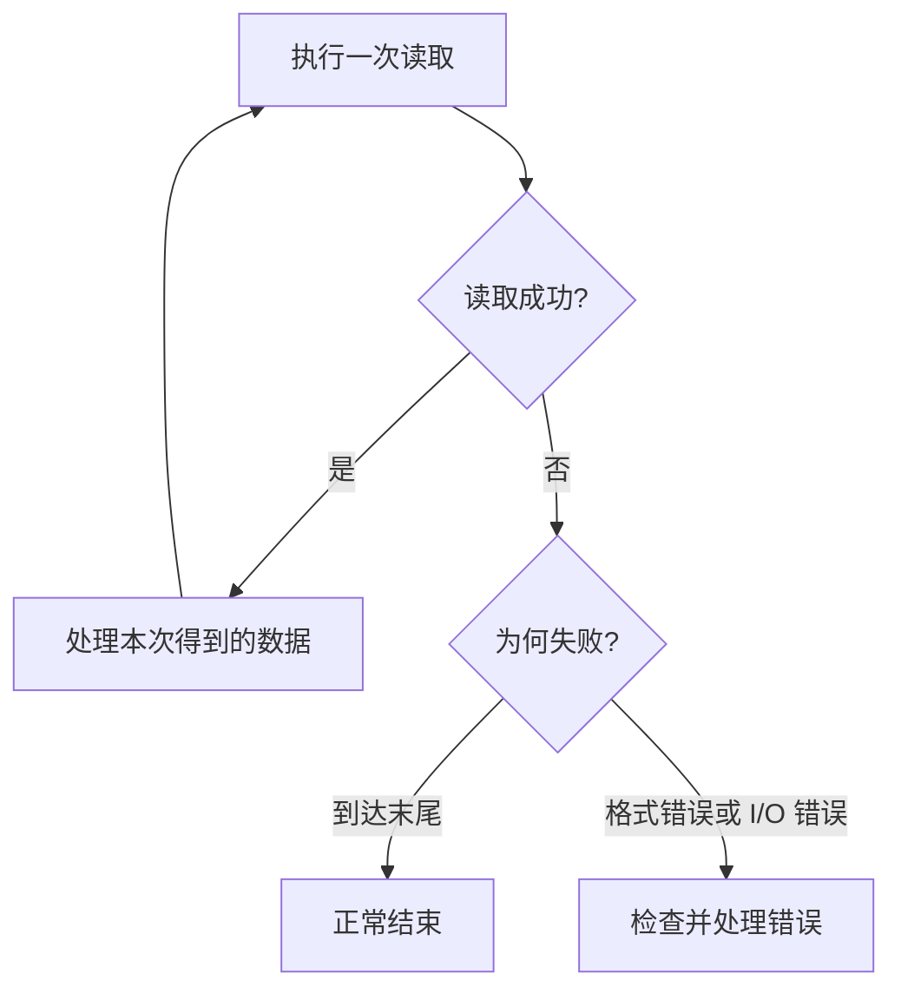
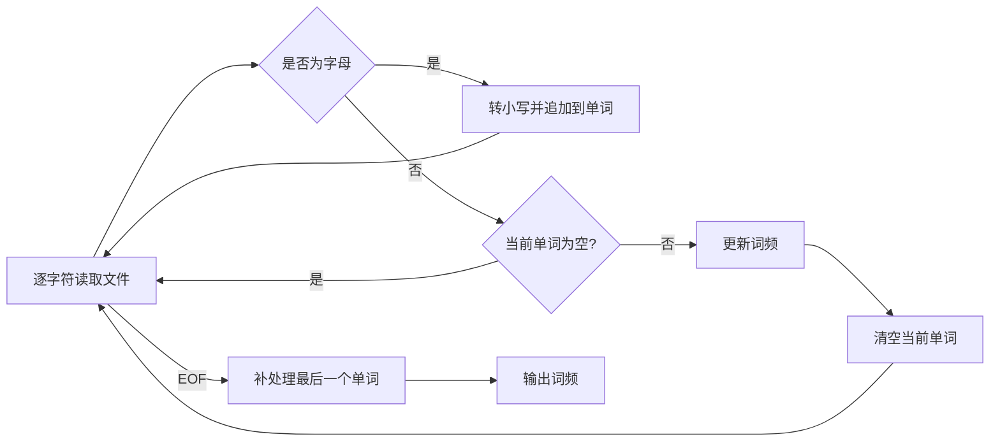
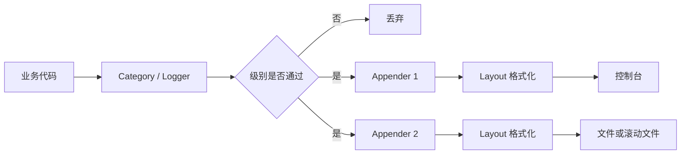
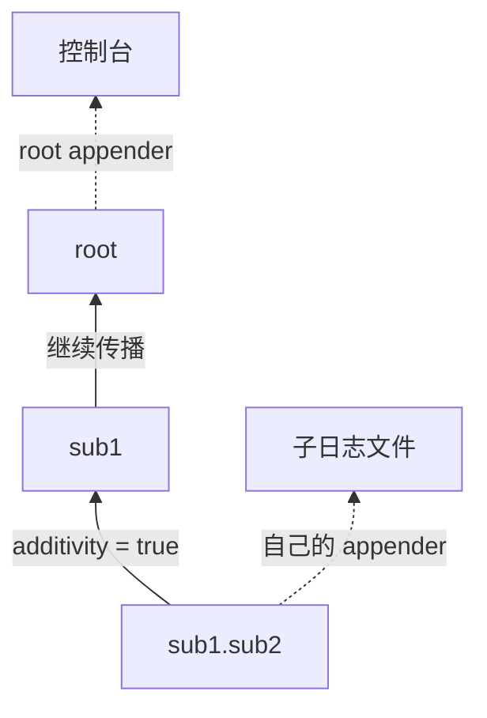
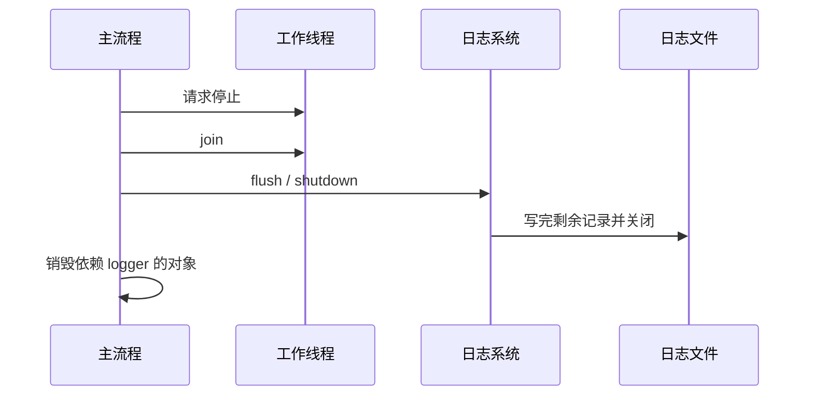

# C++ 文件流、字符串流与日志复习笔记

> 本笔记根据 `07_stream_log` 下的主示例、`note/` 注释版、`practice/` 练习和配套数据文件整理，用于 C++ 面试前复习。重点覆盖文件读写、流位置、字符串解析、词频统计，以及日志系统的组成、配置、封装、生命周期和并发安全。

## 目录

- [1. 文件输入流 ifstream](#1-文件输入流-ifstream)
- [2. 流位置 tellg 与 seekg](#2-流位置-tellg-与-seekg)
- [3. 文件输出流 ofstream](#3-文件输出流-ofstream)
- [4. 字符串流 stringstream](#4-字符串流-stringstream)
- [5. 稳健的输入解析](#5-稳健的输入解析)
- [6. 词频统计案例](#6-词频统计案例)
- [7. 日志系统基础](#7-日志系统基础)
- [8. log4cpp 核心组件](#8-log4cpp-核心组件)
- [9. 优先级、层级与可加性](#9-优先级层级与可加性)
- [10. 日志格式、文件与滚动策略](#10-日志格式文件与滚动策略)
- [11. 配置文件与程序内配置](#11-配置文件与程序内配置)
- [12. MyLogger 封装复盘](#12-mylogger-封装复盘)
- [13. 日志生命周期与并发安全](#13-日志生命周期与并发安全)
- [14. 按行解析人员信息](#14-按行解析人员信息)
- [15. 高频面试题速答](#15-高频面试题速答)
- [16. 源码索引与勘误](#16-源码索引与勘误)

---

## 1. 文件输入流 `ifstream`

### 1.1 打开文件

```cpp
#include <fstream>
#include <iostream>
#include <string>

std::ifstream input{"data.txt"};
if (!input) {
    std::cerr << "failed to open data.txt\n";
    return;
}
```

文件流构造后应立即检查状态。相对路径相对于**进程当前工作目录**，不是源文件所在目录，因此“文件明明存在却打不开”经常是启动目录不同造成的。

也可以先构造再打开：

```cpp
std::ifstream input;
input.open("data.txt");

if (!input.is_open()) {
    // 文件没有成功关联
}
```

- `is_open()`：是否关联了文件。
- `operator bool()`：当前流是否仍处于可继续操作的正常状态。
- 文件可能已经打开，但之后的读取仍可能失败，因此两者语义不同。

### 1.2 按单词读取

```cpp
std::string word;
while (input >> word) {
    std::cout << word << '\n';
}
```

格式化提取 `operator>>` 会：

- 自动跳过前导空白。
- 读取至下一个空白字符。
- 将空格、换行和制表符都视作分隔。
- 在读取失败或到达文件末尾时使条件为假。

因此它适合读取由空白分隔的 token，但会丢失原始行结构和分隔符。

### 1.3 按行读取

```cpp
std::string line;
while (std::getline(input, line)) {
    std::cout << line << '\n';
}
```

`getline` 读取一整行并丢弃分隔换行符。最后一行即使没有以换行符结尾，只要成功提取了字符，本次读取仍然成功。

> [!IMPORTANT]
> 应让“读取操作本身”成为循环条件。不要使用 `while (!input.eof())`：`eofbit` 只有在一次读取尝试越过文件末尾后才会设置，容易多处理一次旧数据。



### 1.4 混用 `>>` 与 `getline`

格式化提取通常会把分隔换行符留在输入缓冲区：

```cpp
int age{};
std::string name;

input >> age;
std::getline(input, name); // 可能立刻读到空行
```

常见处理方式：

```cpp
input >> age;
std::getline(input >> std::ws, name);
```

`std::ws` 会消费所有前导空白。如果空格本身是字段内容，则应只忽略至本行末尾：

```cpp
input.ignore(std::numeric_limits<std::streamsize>::max(), '\n');
std::getline(input, name);
```

### 1.5 RAII 与 `close`

文件流对象析构时会自动关闭文件：

```cpp
void readFile() {
    std::ifstream input{"data.txt"};
    // ...
} // 自动关闭
```

通常无需手动 `close()`。以下情况才有明确理由主动关闭：

- 希望在对象析构前尽早释放文件描述符。
- 要检查关闭或最终刷盘是否出错。
- 要用同一个流对象重新打开另一个文件。

RAII 还能覆盖异常、提前 `return` 等控制路径，比每条路径上手动关闭更可靠。

---

## 2. 流位置 `tellg` 与 `seekg`

### 2.1 get position 与 put position

流维护当前读写位置：

| 输入侧（get） | 输出侧（put） | 含义 |
|---|---|---|
| `tellg()` | `tellp()` | 查询当前位置 |
| `seekg(...)` | `seekp(...)` | 修改当前位置 |

```cpp
std::ifstream input{"data.txt", std::ios::binary};
if (!input) {
    return;
}

const std::streampos original = input.tellg();
input.seekg(0, std::ios::end);
const std::streampos end = input.tellg();
input.seekg(original);
```

定位基准：

- `std::ios::beg`：文件开头。
- `std::ios::cur`：当前位置。
- `std::ios::end`：文件末尾。

两类重载：

```cpp
input.seekg(position);                  // 定位到绝对位置
input.seekg(offset, std::ios::beg);     // 相对某个基准移动
```

### 2.2 类型不能随意写成 `int`

`tellg()` 返回流的 `pos_type`，常用 `std::streampos` 表示；相对偏移常用 `std::streamoff`。位置可能大于 `int` 能表示的范围，也不保证本质就是普通整数。

```cpp
const std::streampos position = input.tellg();
if (position == std::streampos{-1}) {
    // 查询失败
}
```

> [!CAUTION]
> 源码把 `tellg()` 结果存入 `int`，只适合帮助观察小文件，不是可移植的工程写法。大文件可能发生窄化或溢出。

### 2.3 读取整个文件

已知需要把整个普通文件装入内存时，可先获取长度：

```cpp
std::ifstream input{"data.txt", std::ios::binary | std::ios::ate};
if (!input) {
    throw std::runtime_error{"open failed"};
}

const std::streampos end = input.tellg();
if (end < 0) {
    throw std::runtime_error{"tellg failed"};
}

const auto size = static_cast<std::size_t>(end);
std::string content(size, '\0');

input.seekg(0, std::ios::beg);
if (!input.read(content.data(), static_cast<std::streamsize>(content.size()))) {
    throw std::runtime_error{"read failed"};
}
```

这里使用二进制模式，使“末尾位置作为字节数”更符合预期。文本模式可能进行换行转换，流位置应被视为用于再次定位的**不透明位置值**。

也可以使用迭代器读取：

```cpp
std::ifstream input{"data.txt", std::ios::binary};
std::string content{
    std::istreambuf_iterator<char>{input},
    std::istreambuf_iterator<char>{}
};
```

选择时考虑：

- 预分配方式通常避免多次扩容，但需要可靠获取大小。
- 迭代器方式简单，适合普通文件。
- 超大文件不应无条件整体载入内存，应分块或流式处理。
- 管道、设备等输入不一定支持随机定位。

### 2.4 `read`、实际读取量与字符数组

```cpp
char buffer[1024];
input.read(buffer, sizeof buffer);
const std::streamsize count = input.gcount();
```

`read` 请求固定数量的字符；实际读取量可能更少，可由 `gcount()` 获得。原始读取不会自动补 `'\0'`。

```cpp
std::vector<char> buffer(size + 1);
input.read(buffer.data(), static_cast<std::streamsize>(size));
buffer[static_cast<std::size_t>(input.gcount())] = '\0';
```

> [!CAUTION]
> `char buf[size + 1]` 中的运行期长度数组是编译器扩展，不是标准 C++。而把未补 `'\0'` 的缓冲区直接交给 `operator<<(const char*)`，会越界寻找终止符，属于未定义行为。优先使用 `std::string` 或 `std::vector<char>`。

### 2.5 失败后重新定位

到达 EOF 或读取失败后，流的状态标志可能阻止后续操作：

```cpp
input.clear();                 // 清除 eofbit/failbit
input.seekg(0, std::ios::beg);
```

先修复错误原因，再 `clear()`；`clear()` 只重置状态，不会自动丢弃错误输入，也不会改变文件位置。

---

## 3. 文件输出流 `ofstream`

### 3.1 基本写入

```cpp
std::ofstream output{"result.txt"};
if (!output) {
    throw std::runtime_error{"open failed"};
}

output << "answer = " << 42 << '\n';

const std::string raw{"abcdef"};
output.write(raw.data(), static_cast<std::streamsize>(raw.size()));

if (!output) {
    throw std::runtime_error{"write failed"};
}
```

- `operator<<`：格式化输出，可输出数字、字符串和用户自定义类型。
- `write`：按给定长度写原始字符序列，不依赖 `'\0'`。

成功打开文件不代表之后一定写入成功；磁盘满、配额、设备错误都可能在写入或刷新时出现。

### 3.2 常用打开模式

| 模式 | 含义 |
|---|---|
| `std::ios::in` | 允许读取 |
| `std::ios::out` | 允许写入 |
| `std::ios::trunc` | 打开时截断原内容 |
| `std::ios::app` | 每次写入都强制发生在末尾 |
| `std::ios::ate` | 打开后初始位置位于末尾，之后仍可定位 |
| `std::ios::binary` | 二进制模式，不进行文本转换 |

```cpp
std::ofstream overwrite{"result.txt"}; // 通常等价于 out | trunc
std::ofstream append{"result.txt", std::ios::out | std::ios::app};
```

> [!IMPORTANT]
> `app` 与 `ate` 不等价：`ate` 只在打开时定位到末尾，之后可以 `seekp`；`app` 保证每一次写入都在末尾，适合追加日志。

### 3.3 刷新与落盘

```cpp
output << "record\n";             // 通常先进入用户态缓冲
output.flush();                   // 请求把流缓冲提交给底层
output << "important" << std::endl; // 输出换行并 flush
```

频繁刷新会降低吞吐。一般使用 `'\n'`，只在协议交互、崩溃前关键日志或确实需要立即可见时显式刷新。

`flush()` 成功也不必然意味着数据已经持久化到物理介质；操作系统和存储设备仍可能有缓存。强持久化需要平台相关能力。

---

## 4. 字符串流 `stringstream`

### 4.1 三种字符串流

| 类型 | 主要用途 |
|---|---|
| `std::istringstream` | 从字符串进行格式化读取 |
| `std::ostringstream` | 把格式化输出收集为字符串 |
| `std::stringstream` | 同时支持输入和输出 |

### 4.2 字符串解析

```cpp
std::string line{"100 3.14"};
std::istringstream parser{line};

int count{};
double ratio{};
if (parser >> count >> ratio) {
    // 解析成功
}
```

目录中的 `db.conf` 可以逐行解析：

```cpp
std::string key;
std::string value;
std::istringstream parser{line};

if (parser >> key >> value) {
    // 使用键和值
}
```

这适合不允许字段包含空白的简单格式。真实配置文件还需定义注释、转义、重复键、空值和错误报告等规则。

### 4.3 字符串格式化

```cpp
std::ostringstream builder;
builder << "id=" << 7 << ", score=" << 95.5;
std::string result = builder.str();
```

字符串流沿用 iostream 的格式状态和 locale：

```cpp
builder << std::fixed << std::setprecision(2) << 3.14159;
```

若只做高性能、与 locale 无关的数值转换，C++17 可考虑 `std::to_chars`/`std::from_chars`；字符串流更易组合，也更适合教学和一般业务解析。

### 4.4 重用字符串流

```cpp
std::istringstream parser;

for (const auto& line : lines) {
    parser.clear();  // 清除上一次可能留下的 eof/fail 状态
    parser.str(line);
    // 继续解析
}
```

只调用 `str(newText)` 不一定清除失败状态；只调用 `clear()` 也不会替换底层字符串，二者职责不同。

---

## 5. 稳健的输入解析

练习要求用户输入一个合法整数，并拒绝 `123abc` 这样的部分转换。推荐按行获取，再解析整行：

```cpp
int value{};
std::string line;

while (std::getline(std::cin, line)) {
    std::istringstream parser{line};
    char extra{};

    if ((parser >> value) && !(parser >> extra)) {
        std::cout << "valid: " << value << '\n';
        break;
    }

    std::cout << "please enter an integer\n";
}

if (!std::cin.eof() && std::cin.fail()) {
    // 可按应用需求处理其他输入错误
}
```

第二次提取 `extra` 会先跳过空白：

- `123`：成功。
- `123   `：成功，尾随空白被允许。
- `123abc`：失败，检测到额外字符。
- `abc`：第一次数值提取失败。
- 空行：第一次数值提取失败。

> [!CAUTION]
> 目录练习中的无限循环没有检查 `getline(std::cin, line)` 的结果。若输入关闭或到达 EOF，循环会不断复用失败状态。任何交互式重试循环都要给“用户取消输入”留出退出路径。

如果使用 `std::cin >> value` 直接读取，恢复错误通常需要两步：

```cpp
std::cin.clear();
std::cin.ignore(std::numeric_limits<std::streamsize>::max(), '\n');
```

`clear()` 恢复流状态，`ignore()` 丢弃造成失败的本行输入；缺一项都可能再次失败。

---

## 6. 词频统计案例

### 6.1 处理流程

`practice/01_word_count` 从文本中提取英文字母组成的单词，转成小写后计数，再写入字典文件：



EOF 前可能没有分隔符，因此循环结束后还要提交最后积累的单词。

### 6.2 容器选择与复杂度

源码以 `std::vector<Record>` 保存词频，每遇到一个单词都线性查找：

- 总单词数为 `N`。
- 不同单词数为 `U`。
- 时间复杂度约为 `O(N × U)`，最坏可接近二次。

更常用的实现：

```cpp
std::unordered_map<std::string, std::size_t> counts;
for (const auto& word : words) {
    ++counts[word];
}
```

| 容器 | 单次更新 | 输出顺序 | 适用场景 |
|---|---:|---|---|
| `vector<Record>` + 线性找 | `O(U)` | 首次出现顺序 | 数据很小、强调顺序 |
| `std::map` | `O(log U)` | 按 key 排序 | 需要自然字典序 |
| `std::unordered_map` | 平均 `O(1)` | 无稳定顺序 | 追求平均统计效率 |

若使用 `unordered_map` 统计但需要排序输出，可以把结果复制到 `vector` 后排序。

### 6.3 `isalpha` 与 `tolower` 的未定义行为

`<cctype>` 中的字符分类函数要求参数是 `EOF`，或可表示为 `unsigned char` 的值：

```cpp
const unsigned char byte = static_cast<unsigned char>(ch);
if (std::isalpha(byte)) {
    word.push_back(static_cast<char>(std::tolower(byte)));
}
```

> [!IMPORTANT]
> 直接把可能为负数的 `char` 传给 `std::isalpha`、`std::tolower`，行为未定义。这是字符处理题中的高频陷阱。

这种算法仍是 locale 相关的单字节字符处理，并不等于 Unicode 分词或大小写折叠。中文、组合字符和多字节编码需要专门的 Unicode 库与明确规则。

### 6.4 其他工程问题

- `std::cin >> filepath` 无法直接读取含空格的路径，可改用 `getline`。
- 多次调用读取函数前应明确是否清空原词典，否则结果会累计。
- 输出大量行时优先用 `'\n'`，避免 `std::endl` 每行强制刷新。
- 应分别检查输入文件打开、读取和输出文件写入是否成功。

---

## 7. 日志系统基础

日志不是简单的 `std::cout`。一个可用日志系统通常需要：

- 严重级别过滤。
- 时间戳和来源信息。
- 分类器/logger 名称。
- 一个或多个输出目的地。
- 可配置格式。
- 文件切分与保留策略。
- 并发写入协调。
- 可控的刷新、性能和失败策略。

典型日志记录：

```text
2026-07-28 10:20:31 [ERROR] network.client request.cc:73 connect timeout
```



### 7.1 日志级别

目录示例使用了 `DEBUG`、`INFO`、`NOTICE`、`WARN`、`ERROR`、`FATAL` 等级。概念上严重程度逐步增加：

| 级别 | 常见用途 |
|---|---|
| `DEBUG` | 调试细节、变量和流程 |
| `INFO` | 正常业务里程碑 |
| `NOTICE` | 值得关注但仍属正常的事件 |
| `WARN` | 异常迹象，可继续运行 |
| `ERROR` | 当前操作失败，需要处理 |
| `FATAL` | 进程或核心功能无法继续 |

具体等级集合与过滤边界以所用日志库为准。生产环境通常不会长期启用海量 `DEBUG`。

### 7.2 日志内容原则

一条高价值日志应回答：

- 何时发生？
- 严重程度如何？
- 哪个组件、线程、请求发生？
- 在哪个源文件、函数或行？
- 发生了什么，关键上下文是什么？

> [!CAUTION]
> 不要记录密码、令牌、私钥、完整身份证号等敏感数据。目录中的 `db.conf` 只是教学数据，真实配置和日志必须遵循脱敏与访问控制要求。

---

## 8. log4cpp 核心组件

本目录使用 log4cpp 展示日志。理解组件职责比记住某一版 API 更重要。

### 8.1 `Category`

`Category` 是日志入口和分类节点：

```cpp
log4cpp::Category& root = log4cpp::Category::getRoot();
root.setPriority(log4cpp::Priority::DEBUG);

root.debug("debug message");
root.info("id=%d", 42);
root.warnStream() << "slow request: " << elapsed;
```

它负责：

- 接收日志事件。
- 根据优先级过滤。
- 关联 appender。
- 参与名称层级和可加性传播。

### 8.2 `Appender`

Appender 决定日志写到哪里：

- `OstreamAppender`：写入 `std::cout`/`std::cerr` 等流。
- `FileAppender`：写入普通文件。
- `RollingFileAppender`：达到条件后滚动文件。

一个 Category 可以关联多个 appender，因此同一条日志可同时输出到控制台和文件。

### 8.3 `Layout`

Layout 决定每条日志的文本格式：

- `BasicLayout`：基础默认格式。
- `PatternLayout`：使用模式字符串定制格式。

示例：

```cpp
auto* layout = new log4cpp::PatternLayout;
layout->setConversionPattern("%d [%p] %c : %m%n");
appender->setLayout(layout);
```

目录示例中：

- `%d`：日期时间。
- `%p`：优先级。
- `%c`：Category 名称。
- `%m`：消息。
- `%n`：换行。

支持的完整占位符和所有权规则应以项目实际使用版本的 log4cpp 文档为准。

---

## 9. 优先级、层级与可加性

### 9.1 优先级过滤

```cpp
root.setPriority(log4cpp::Priority::WARN);
```

当阈值设为 `WARN` 时，较低严重程度的 `DEBUG`、`INFO` 通常不会输出，`WARN`、`ERROR`、`FATAL` 会通过。尽早过滤能避免不必要的格式化和 I/O。

如果构造日志消息很昂贵，应使用日志库提供的“是否启用该级别”检查或惰性日志接口：

```cpp
if (root.isDebugEnabled()) {
    root.debug(buildExpensiveDebugMessage());
}
```

具体函数名以实际版本为准。

### 9.2 Category 层级

配置示例使用类似以下名称：

```text
root
└── sub1
    └── sub1.sub2
```

子 Category 可以继承上级设置，并把事件继续传递给父级 appender。这个传播行为称为 additivity（可加性）。



若子节点和 root 都有 appender，同一条事件可能被输出多次。需要独立输出时可关闭传播：

```cpp
child.setAdditivity(false);
```

> [!IMPORTANT]
> 遇到“日志重复两次”的问题，首先检查 Category 层级、子节点 appender 和 additivity，而不只是检查业务代码是否调用了两次。

---

## 10. 日志格式、文件与滚动策略

### 10.1 为什么需要滚动日志

普通 `FileAppender` 持续写入同一个文件，可能无限增长。`RollingFileAppender` 可按容量切换文件并保留有限备份。

目录练习中的教学配置使用很小的容量和少量备份，以便快速观察滚动；生产配置应根据：

- 日志产生速率。
- 磁盘容量。
- 故障排查所需时间窗口。
- 合规保留期限。
- 收集系统是否已经接管文件。

共同确定。

### 10.2 格式设计

推荐至少包含：

```text
时间 | 级别 | 组件 | 线程/请求标识 | 源位置 | 消息
```

权衡点：

- 字段越全，排障越方便，但日志量越大。
- 本地时间便于阅读，UTC 和明确时区便于跨地域关联。
- 文本日志易人工查看；JSON 等结构化日志易被采集和查询。
- 源码行号便于定位，但每条都采集可能有开销。

### 10.3 同步与异步日志

| 策略 | 优点 | 风险 |
|---|---|---|
| 同步写入 | 调用结束时状态更明确、实现简单 | I/O 延迟阻塞业务线程 |
| 异步写入 | 降低业务线程延迟、便于批量写 | 队列占内存，崩溃时可能丢失，顺序和背压更复杂 |

异步日志必须定义：

- 队列满时丢弃、阻塞还是降级。
- 丢弃哪些级别。
- 退出前如何排空。
- 崩溃场景能接受丢失多少。

---

## 11. 配置文件与程序内配置

### 11.1 程序内配置

目录中的多数示例在 C++ 代码中创建 layout、appender 和 category：

```cpp
auto* appender = new log4cpp::OstreamAppender{"console", &std::cout};
auto* layout = new log4cpp::PatternLayout;
layout->setConversionPattern("%d [%p] %c : %m%n");
appender->setLayout(layout);

auto& root = log4cpp::Category::getRoot();
root.addAppender(appender);
root.setPriority(log4cpp::Priority::DEBUG);
```

优点是配置随程序一起编译、容易理解；缺点是修改级别、路径和格式通常需要重新构建或重启。

### 11.2 属性文件配置

`07_logProperties.cc` 使用：

```cpp
log4cpp::PropertyConfigurator::configure("log4cpp.properties");
```

外部配置便于运维调整：

- logger/category 级别。
- appender 类型。
- 文件位置。
- layout 格式。
- 滚动策略。

> [!NOTE]
> 当前目录未包含示例代码所引用的 `log4cpp.properties`。直接运行前需要自行提供匹配配置，或把路径改为实际存在的配置文件，并处理配置加载异常。

配置路径也受当前工作目录影响。生产程序通常通过命令行、环境变量或应用配置传入绝对/明确基准路径，而不是依赖偶然的启动目录。

### 11.3 所有权

示例以 `new` 创建 layout 和 appender，再交给 log4cpp 对象关联。第三方库对这些指针是否接管所有权、何时销毁，属于库版本的接口契约。

> [!CAUTION]
> 不要凭经验同时手动 `delete`，也不要默认一定由库释放。包装第三方库前应核对项目所使用版本的文档和源码，否则可能内存泄漏或二次释放。

---

## 12. `MyLogger` 封装复盘

### 12.1 封装目标

目录中的 `08_MyLogger.cc` 和 `practice/06_mylogger` 尝试把 log4cpp 隐藏在自定义接口后：

```cpp
logger.info("server started");
logger.error("connect failed");
```

好处：

- 业务层减少对具体日志库的依赖。
- 集中统一格式和输出位置。
- 方便添加文件、行号、函数等上下文。
- 将来替换日志库时缩小改动面。

更完整的接口应考虑：

```cpp
class Logger {
public:
    void info(std::string_view message);
    void warn(std::string_view message);
    void error(std::string_view message);
};
```

### 12.2 源位置

传统宏可以在调用点捕获：

```cpp
#define LOG_INFO(msg) logger.info(__FILE__, __LINE__, __func__, (msg))
```

- `__FILE__`、`__LINE__`：标准预定义宏。
- `__func__`：标准函数内局部名称。
- `__FUNCTION__`：常见编译器扩展，不是标准 C++ 保证。

C++20 更推荐 `std::source_location`：

```cpp
#include <source_location>

void info(
    std::string_view message,
    const std::source_location location =
        std::source_location::current());
```

默认实参在调用点取得源位置，避免大多数宏问题。

### 12.3 宏的陷阱

目录练习的宏把拼接得到的临时 `std::string` 调用 `.c_str()` 后传给函数。临时对象会活到完整表达式结束，因此只有在被调函数**同步消费或复制**内容时才安全；若保存该指针供以后使用，就会悬空。

宏还存在：

- 缺少类型检查或作用域。
- 参数可能因宏展开被重复求值。
- 调试时不直观。
- 命名容易污染全局空间。

因此应让宏尽可能薄，只负责捕获调用点，再立刻转交给类型安全的函数。宏参数和整个展开式要充分加括号。

### 12.4 头文件设计

练习头文件还有几个典型问题：

- 在头文件中 `using namespace log4cpp;` 会污染所有包含者，应使用限定名。
- 双下划线标识符由实现保留，不应用作 include guard。
- `LogInfo` 与 `logWarn` 大小写风格不一致。
- 头文件暴露具体日志库类型，会增加编译耦合；可考虑 PImpl 或接口隔离。

```cpp
#ifndef CPP_BASIC_MYLOGGER_H
#define CPP_BASIC_MYLOGGER_H
// ...
#endif
```

---

## 13. 日志生命周期与并发安全

### 13.1 全局对象的问题

`08_MyLogger.cc` 使用全局 `MyLogger logger`。风险包括：

- 跨翻译单元初始化顺序不确定。
- 其他全局对象构造时 logger 可能尚未完成初始化。
- logger 先析构后，其他全局对象析构期间再记录日志会产生问题。
- 测试难以替换全局依赖。
- 重复构造封装器可能多次给 root 添加 appender，造成重复日志。

常见改进是函数局部静态对象：

```cpp
Logger& globalLogger() {
    static Logger instance;
    return instance;
}
```

C++11 起，函数局部静态对象的**初始化**是线程安全的。但这只解决初始化竞态，不自动保证 logger 的每个方法、底层库、配置重载和关闭流程都线程安全。

### 13.2 裸指针单例

练习中的手写单例大意为：

```cpp
static MyLogger* instance;

if (instance == nullptr) {
    instance = new MyLogger;
}
```

多个线程可能同时观察到空指针并重复创建对象。手动 `destroy()` 后，已有引用和指针还可能悬空。

优先方案：

```cpp
MyLogger& MyLogger::instance() {
    static MyLogger logger;
    return logger;
}
```

对于需要严格控制启停、可替换依赖的服务，更适合由应用入口构造 logger，再以引用或依赖注入传给组件，而不是隐藏在单例中。

### 13.3 `shutdown` 与退出顺序

目录示例调用：

```cpp
log4cpp::Category::shutdown();
```

关闭阶段通常要：

1. 阻止产生新的异步日志。
2. 等待或排空日志队列。
3. 刷新 appender。
4. 关闭文件。
5. 销毁日志资源。



实际顺序需与应用对象依赖一致；核心原则是“不再有人写日志”之后才关闭日志系统。

### 13.4 性能与可靠性

日志属于故障处理基础设施，但日志自身也可能失败：

- 文件无权限或磁盘已满。
- 滚动重命名失败。
- 异步队列耗尽。
- 格式化抛出异常。
- 日志目录尚未创建。

设计时应明确失败策略，避免日志错误递归记录日志形成死循环，也不能让低价值调试日志无限阻塞核心业务。

---

## 14. 按行解析人员信息

`practice/07_personInfos` 的数据每行由姓名和若干电话号码组成：

```text
Alice 13800138000 01012345678
```

推荐“文件按行读取，行内再分词”：

```cpp
struct PersonInfo {
    std::string name;
    std::vector<std::string> phones;
};

std::vector<PersonInfo> people;
std::string line;

while (std::getline(input, line)) {
    std::istringstream record{line};
    PersonInfo person;

    if (!(record >> person.name)) {
        continue; // 空行或无姓名
    }

    std::string phone;
    while (record >> phone) {
        person.phones.push_back(std::move(phone));
    }

    people.push_back(std::move(person));
}
```

电话号码应保存为字符串：

- 可能含前导 `0`。
- 可能含 `+`、分隔符或分机号。
- 不参与算术运算。
- 长度可能超过普通整数范围。

设计复盘：

- 只读成员函数应标记 `const`。
- setter 若只是复制，应接收 `const T&`；若要取得所有权，可按值接收再 `std::move`。
- 遍历大对象时使用 `const auto&`，避免不必要复制。
- 可以使用构造函数和 `emplace_back` 表达一次性构造。
- 应定义空行、缺姓名、无号码、非法号码如何处理，而不是静默接受所有输入。

---

## 15. 高频面试题速答

### 15.1 为什么不能写 `while (!ifs.eof())`？

EOF 只有在一次读取尝试失败后才会设置。先判断 EOF 再读取，会多进入一次循环并可能处理旧值。应写 `while (ifs >> value)` 或 `while (getline(ifs, line))`。

### 15.2 `ifstream` 析构时会自动关闭吗？

会。文件流使用 RAII 管理关联文件。需要提前释放资源、重新打开文件或检查关闭结果时才显式 `close()`。

### 15.3 `is_open()` 与 `good()`/布尔判断有何区别？

`is_open()` 只说明流是否关联文件；状态判断说明最近的 I/O 是否允许继续。已打开的文件流也可能处于 EOF 或失败状态。

### 15.4 `tellg` 为什么不应存到 `int`？

它返回流的位置类型，可能是大文件位置或不透明表示。`int` 范围不足且会丢失类型语义，应使用 `auto`、`std::streampos` 和 `std::streamoff`。

### 15.5 `seekg` 后为什么仍然读不了？

此前读取可能设置了 `eofbit`/`failbit`。通常先 `clear()`，再 `seekg()`，并检查两步是否成功。

### 15.6 `read` 会自动添加 `'\0'` 吗？

不会。它读取原始字符序列。若之后按 C 字符串使用，必须额外预留空间并手动终止；更推荐根据长度构造 `std::string`。

### 15.7 为什么变长数组不是标准 C++？

标准 C++ 的普通栈数组长度必须是编译期常量。部分编译器把 VLA 作为扩展支持，但开启严格标准和其他编译器时不可移植。动态长度应使用 `vector` 或 `string`。

### 15.8 文本模式与二进制模式有何区别？

文本模式可能执行换行等平台转换；二进制模式按字节读写。序列化格式、图片和精确字节处理必须使用二进制模式。

### 15.9 `ios::app` 与 `ios::ate` 有何区别？

`ate` 仅在打开后把初始位置设到末尾；之后可改变位置。`app` 强制每次写入发生在末尾。

### 15.10 `'\n'` 与 `std::endl` 有何区别？

二者都输出换行，`endl` 还会刷新缓冲区。循环输出时通常用 `'\n'`，避免无意义的频繁刷新。

### 15.11 如何判断一整行是否是合法整数？

用 `getline` 取得整行，以 `istringstream` 提取整数，再尝试提取额外非空白字符；前者成功且后者失败才表示整行有效。

### 15.12 如何复用 `stringstream`？

`clear()` 清除状态标志，`str(newText)` 替换底层字符串。之前读取到 EOF/失败时一般两者都需要。

### 15.13 为什么 `isalpha(ch)` 可能是未定义行为？

当 `char` 为有符号且值为负时，不满足 `<cctype>` 函数的参数要求。先转成 `unsigned char`，再传入分类或大小写转换函数。

### 15.14 词频统计用什么容器？

只要平均高效计数通常用 `unordered_map`；需要按单词自然排序用 `map`；要按频率排序则统计后复制进 `vector` 自定义排序。

### 15.15 日志系统由哪些核心部分组成？

logger/category 接收和分类事件，level/priority 过滤，appender 决定目的地，layout 决定格式，配置管理整体组合，滚动和刷新策略控制存储。

### 15.16 为什么日志会重复打印？

常见原因是子 Category 自己有 appender，同时 additivity 又把事件传播给带 appender 的父节点。关闭不需要的传播或移除重复 appender。

### 15.17 为什么日志应该支持配置文件？

级别、路径、格式和滚动策略属于运行期运维参数。外部配置允许不同环境调整而无需改源码和重新编译。

### 15.18 同步日志和异步日志如何取舍？

同步简单且时序明确，但会把 I/O 延迟施加给业务线程；异步延迟低、吞吐高，但要解决队列上限、丢失、背压、退出排空和崩溃恢复。

### 15.19 为什么全局日志对象有风险？

跨翻译单元初始化和析构顺序不确定，其他全局对象可能在 logger 准备好之前或销毁之后使用它。它还隐藏依赖，降低可测试性。

### 15.20 Meyers Singleton 是否完全线程安全？

C++11 保证函数局部静态对象的初始化线程安全，但不自动保证对象方法、底层日志库、配置变更和销毁过程线程安全。

### 15.21 日志宏中临时字符串 `.c_str()` 一定悬空吗？

不一定。临时对象存活到完整表达式结束，若被调用函数在调用期间立即消费或复制则有效；若保存该指针供以后使用就会悬空。接口最好直接接收 `string_view`/`string`。

### 15.22 `__func__` 与 `__FUNCTION__` 有何区别？

`__func__` 是标准 C++ 的函数内预定义名称；`__FUNCTION__` 是常见编译器扩展，移植性不如前者。C++20 可用 `std::source_location`。

### 15.23 日志为何不能记录密码？

日志通常会被复制、集中采集并长期保存，访问范围也可能大于业务数据。敏感信息进入日志后难以彻底删除，会扩大泄漏面。

### 15.24 日志库关闭前要做什么？

停止产生日志的工作线程，排空异步队列，刷新输出，再关闭 appender 和文件。避免 logger 已销毁后仍被其他对象使用。

---

## 16. 源码索引与勘误

### 16.1 主示例

| 文件 | 主题 |
|---|---|
| `01_ifstream.cc` | 按单词、按行读取文件 |
| `02_filePointer.cc` | `tellg`、`seekg`、文件整体读取 |
| `03_ofstream.cc` | 格式化写入、`write`、追加模式 |
| `04_stringstream.cc` | 字符串解析、配置读取和格式化 |
| `05_logDemo.cc` | log4cpp 基础组件和双输出 |
| `06_logTest.cc` | `PatternLayout` 与优先级 |
| `07_logProperties.cc` | 属性文件配置和 Category 层级 |
| `08_MyLogger.cc` | 自定义日志封装 |

`note/` 目录提供了各主题的注释版和扩展示例。

### 16.2 练习

| 目录或文件 | 主题 |
|---|---|
| `practice/01_word_count` | 文本分词与词频统计 |
| `practice/02_log4cpp_format_output` | 控制台、文件、滚动文件与格式 |
| `practice/03_readfile_by_word_line.cc` | 文件按词、按行读取 |
| `practice/04_readfile_tellg_seekg.cc` | 文件位置和整体读取 |
| `practice/05_inputstring_robust.cc` | 整行整数校验 |
| `practice/06_mylogger` | 单例日志封装和调用点宏 |
| `practice/07_personInfos` | 行记录与变长字段解析 |

### 16.3 重点勘误

> [!CAUTION]
> 以下是阅读源码时必须主动修正的点，适合面试中作为 code review 结论回答。

1. `02_filePointer.cc` 使用 `int` 保存 `tellg()`，应改用 `std::streampos`/`std::streamoff` 并检查失败。
2. `char buf[size + 1]` 是非标准变长数组，应使用 `std::string` 或 `std::vector<char>`。
3. 主示例整体读取后未补 `'\0'` 就按 C 字符串输出，属于未定义行为。
4. 获取长度和整体读取若追求字节语义，应使用二进制模式，并检查 `tellg`、`seekg`、`read`。
5. `read` 可能短读，必要时检查返回状态和 `gcount()`。
6. 文件流无需为普通控制路径手动 `close()`；RAII 更稳健。
7. 相对文件路径依赖运行时当前工作目录。
8. 稳健输入练习没有检查 `getline` 的 EOF/失败，输入关闭后可能无限循环。
9. 词频练习把普通 `char` 直接传给 `isalpha`/`tolower`，负值时可能未定义行为。
10. 词频练习用 `vector` 线性查找，数据量大时效率低。
11. 词频对象重复读取前未清空 `_dict`，结果会继续累计，应明确接口语义。
12. 大量输出中使用 `std::endl` 会频繁刷新，优先用 `'\n'`。
13. `std::cin >> filepath` 不能完整读取含空格路径。
14. `07_logProperties.cc` 引用的 `log4cpp.properties` 当前不在目录中，运行前需要补充。
15. 全局 `MyLogger` 存在静态初始化和析构顺序风险。
16. 多次配置 root 并添加 appender 可能造成重复输出。
17. 练习的裸指针单例初始化存在并发竞态，手动销毁还会制造悬空引用。
18. 头文件中的 `using namespace log4cpp;` 会污染包含者命名空间。
19. 双下划线 include guard 使用实现保留标识符。
20. 日志宏命名不一致，且测试中的 warning 文案仍调用了 info 宏。
21. 临时字符串 `.c_str()` 只在完整表达式内有效，不应被日志接口保存。
22. `__FUNCTION__` 不是标准 C++，优先使用 `__func__` 或 C++20 `source_location`。
23. `PersonInfo` setter 参数只读却接收非常量引用，应改为 `const&` 或按值接收。
24. `PersonInfo::print` 应为 `const`，外部遍历也应尽量使用 `const auto&`。
25. `practice/06_mylogger/test` 是生成的 ELF 可执行文件，通常不应作为源码产物提交，应加入忽略规则并由构建生成。

---

## 复习主线

面试前可按以下顺序快速回忆：

1. **读取循环**：让读取表达式直接控制循环，检查打开和最终状态。
2. **位置与缓冲区**：使用正确的位置类型，区分文本/二进制，不使用 VLA，不忘长度与终止符。
3. **输出模式**：掌握 `trunc`、`app`、`ate`，理解缓冲、刷新和 RAII。
4. **字符串解析**：整行读取后再用字符串流分词，验证是否存在多余输入。
5. **算法与字符安全**：选择合适容器，正确调用 `<cctype>`。
6. **日志架构**：Category → level → Appender → Layout → destination。
7. **工程化日志**：理解层级传播、外部配置、滚动、异步、敏感信息和失败策略。
8. **封装与生命周期**：减少宏和全局状态，明确所有权、线程安全和 shutdown 顺序。

> [!TIP]
> 回答流与日志面试题时，先说“正确语义”，再补充“失败路径、资源生命周期和并发条件”。这三点往往比背 API 更能体现工程能力。
