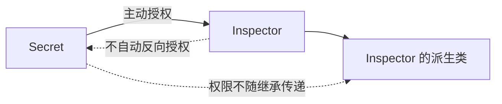
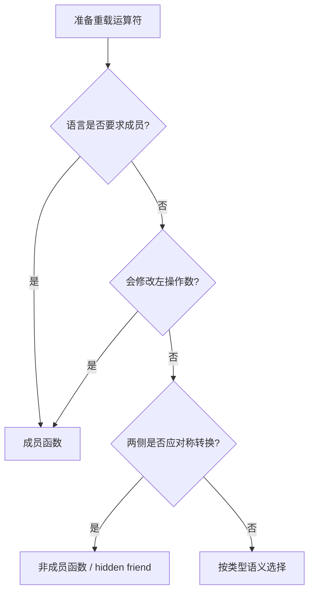
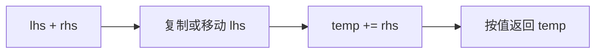
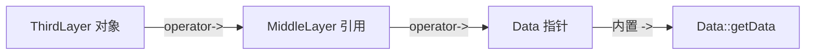
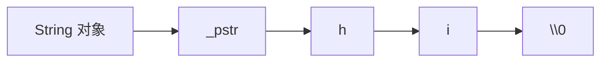
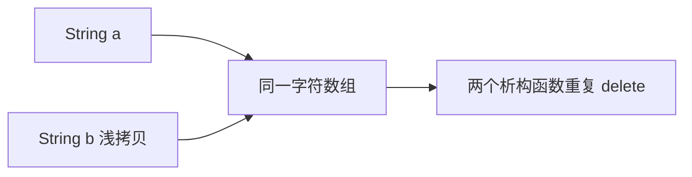

# C++ 友元与运算符重载复习笔记

> 本笔记根据 `08_operator_overload` 下的主示例、`note/` 注释版和 `practice/` 练习整理，用于 C++ 面试前复习。重点覆盖友元、运算符重载规则、成员与非成员实现的选择、输入输出、复合赋值、自增、下标、智能指针式访问、手写 `String` 以及函数对象。

## 目录

- [1. 友元机制](#1-友元机制)
- [2. 运算符重载基本规则](#2-运算符重载基本规则)
- [3. 成员函数还是非成员函数](#3-成员函数还是非成员函数)
- [4. 算术运算符与复合赋值](#4-算术运算符与复合赋值)
- [5. 输入输出运算符](#5-输入输出运算符)
- [6. 赋值运算符](#6-赋值运算符)
- [7. 前置与后置自增自减](#7-前置与后置自增自减)
- [8. 下标运算符](#8-下标运算符)
- [9. 箭头与解引用运算符](#9-箭头与解引用运算符)
- [10. 类型转换与对称性](#10-类型转换与对称性)
- [11. 手写 String 综合案例](#11-手写-string-综合案例)
- [12. 比较运算符](#12-比较运算符)
- [13. 函数调用运算符与函数对象](#13-函数调用运算符与函数对象)
- [14. 哪些运算符不建议重载](#14-哪些运算符不建议重载)
- [15. 高频面试题速答](#15-高频面试题速答)
- [16. 源码索引与勘误](#16-源码索引与勘误)

---

## 1. 友元机制

### 1.1 友元是什么

类可以通过 `friend` 主动授权某个外部函数或类访问自己的 `private`、`protected` 成员：

```cpp
class Box {
public:
    explicit Box(int value) : value_(value) {}

    friend void print(const Box& box);

private:
    int value_;
};

void print(const Box& box) {
    std::cout << box.value_;
}
```

友元函数仍然是**非成员函数**：

- 没有该类的 `this` 指针。
- 不能通过 `box.print()` 调用，除非它本身还是成员。
- 只是额外获得了访问权限。
- `friend` 声明写在 `public`、`protected` 或 `private` 区域，授权效果都相同。

> [!IMPORTANT]
> 友元是类主动授予的精确访问权，不是“关闭 private”。应把授权范围控制到完成协作所需的最小程度。

### 1.2 三种友元形式

#### 普通函数作为友元

```cpp
class Secret {
    friend void inspect(const Secret&);
private:
    int value_{42};
};
```

#### 另一个类的单个成员函数作为友元

```cpp
class Secret;

class Inspector {
public:
    void inspect(const Secret&);
};

class Secret {
    friend void Inspector::inspect(const Secret&);
private:
    int value_{42};
};

void Inspector::inspect(const Secret& secret) {
    std::cout << secret.value_;
}
```

这里的定义顺序很重要：

1. 前向声明 `Secret`。
2. 完整声明 `Inspector` 及目标成员函数。
3. 在 `Secret` 中声明该成员函数为友元。
4. 等 `Secret` 完整定义后实现 `Inspector::inspect`。

#### 整个类作为友元

```cpp
class Secret {
    friend class Inspector;
private:
    int value_{42};
};
```

此时 `Inspector` 的所有成员函数都可访问 `Secret` 的非公有成员，授权范围更大。

### 1.3 友元关系的性质

友元关系：

- **单向**：`A` 把 `B` 设为友元，不代表 `A` 能访问 `B` 的私有成员。
- **不传递**：`B` 是 `A` 的友元，`C` 是 `B` 的友元，不代表 `C` 是 `A` 的友元。
- **不继承**：友元类的派生类不会自动获得同样权限。



### 1.4 友元与封装

友元会扩大能接触类内部表示的代码范围，但并不必然是糟糕设计。典型合理用途：

- `operator<<`、对称二元运算符。
- 两个紧密协作的实现类。
- 难以通过公共接口高效实现、但边界清晰的辅助函数。

如果能通过稳定的公共接口完成操作，通常不必使用友元。大面积使用 `friend class` 往往意味着类之间耦合过强。

### 1.5 隐藏友元

把非成员运算符直接定义在类内：

```cpp
class Point {
public:
    friend bool operator==(const Point& lhs, const Point& rhs) {
        return lhs.x_ == rhs.x_ && lhs.y_ == rhs.y_;
    }

private:
    int x_{};
    int y_{};
};
```

该函数仍属于外围命名空间，并且隐式为 `inline`。它通常由实参相关查找（ADL）在出现 `Point` 实参时找到，因此称为 hidden friend。

优点：

- 运算符与类型定义靠近。
- 只在相关类型参与调用时进入候选集合。
- 减少命名空间中的无关候选。

---

## 2. 运算符重载基本规则

### 2.1 本质是函数

```cpp
lhs + rhs;
```

对于用户定义类型，可能对应：

```cpp
lhs.operator+(rhs); // 成员形式
operator+(lhs, rhs); // 非成员形式
```

运算符语法最终调用函数，但重载解析、隐式转换、ADL 和部分表达式求值规则仍由语言规定，不能简单把所有情况都当成普通手写函数调用。

### 2.2 可以改变什么

可以定义用户类型参与某个既有运算符时的行为，例如：

```cpp
Complex result = lhs + rhs;
std::cout << result;
++iterator;
```

### 2.3 不能改变什么

运算符重载不能：

- 创造新的运算符符号。
- 改变运算符的优先级。
- 改变结合性。
- 改变操作数个数。
- 改写全由内置类型组成的运算。

```cpp
// 错误：两个参数都是内置类型
int operator+(int lhs, int rhs);
```

非成员运算符的操作数中至少有一个必须是类类型或枚举类型。

### 2.4 不能重载的常见运算符/语言构造

- `.`：成员访问。
- `.*`：成员指针访问。
- `::`：作用域解析。
- `?:`：条件运算符。
- `sizeof`。
- `typeid`。
- `alignof`。
- `decltype`。
- `noexcept`。

> [!NOTE]
> `->` 可以重载，`.*` 不可以；`->*` 可以重载。面试时最常考的不可重载集合是 `.`、`.*`、`::`、`?:`、`sizeof`。

### 2.5 必须实现为成员函数的运算符

传统常考答案：

- `operator=`
- `operator[]`
- `operator()`
- `operator->`
- 类型转换函数，如 `operator bool()`

新标准为少数接口增加了静态重载能力，但面试与常规类设计中仍按上述成员形式理解最实用。

### 2.6 语义应符合直觉

重载不是“只要能编译就合理”。用户看到：

```cpp
a + b;
```

会预期：

- 得到组合后的新值。
- 通常不修改 `a`、`b`。
- 满足该抽象类型自然的加法语义。

`practice/01_class_Base.cc` 把 `x + y` 定义成两值差的绝对值。技术上可编译，语义却违背直觉，实际接口更适合命名为 `distance(x, y)`。

> [!IMPORTANT]
> 运算符重载的首要设计标准不是“代码短”，而是能否让类型表现得像用户熟悉的值或指针，并维持清晰的不变量。

---

## 3. 成员函数还是非成员函数

### 3.1 参数个数

成员函数有隐式左操作数 `*this`：

```cpp
class Complex {
public:
    Complex operator+(const Complex& rhs) const;
};
```

非成员函数需要显式接收两个操作数：

```cpp
Complex operator+(const Complex& lhs, const Complex& rhs);
```

| 运算符 | 成员形式显式参数 | 非成员形式显式参数 |
|---|---:|---:|
| 一元 `-x` | 0 | 1 |
| 二元 `x + y` | 1 | 2 |
| 前置 `++x` | 0 | 1 |
| 后置 `x++` | 1 个占位 `int` | 2，其中一个是占位 `int` |

### 3.2 推荐选择

通常实现为成员：

- 会修改左操作数：`=`, `+=`, `-=`, `++`。
- 本来就被语言要求为成员：`[]`, `()`, `->`。
- 左操作数必须是当前类。

通常实现为非成员：

- 对称二元运算：`+`, `-`, `==`, `<=>`。
- 左操作数不是当前类：`std::cout << object`。
- 希望两个操作数都能进行隐式转换。



### 3.3 `const` 正确性

不修改对象的成员运算符应标记 `const`：

```cpp
Complex operator+(const Complex& rhs) const {
    return {real_ + rhs.real_, imag_ + rhs.imag_};
}
```

否则 `const Complex` 不能参与加法：

```cpp
const Complex a{1, 2};
Complex b{3, 4};
auto c = a + b; // 要求成员 operator+ 是 const
```

---

## 4. 算术运算符与复合赋值

### 4.1 `operator+` 返回新值

```cpp
class Complex {
public:
    Complex(double real = 0, double imag = 0)
        : real_(real), imag_(imag) {}

    friend Complex operator+(const Complex& lhs,
                             const Complex& rhs) {
        return {lhs.real_ + rhs.real_,
                lhs.imag_ + rhs.imag_};
    }

private:
    double real_{};
    double imag_{};
};
```

加法结果是新对象，应按值返回。不能返回函数局部临时对象的引用：

```cpp
// 错误：返回后 result 已销毁
const Complex& operator+(const Complex& lhs,
                         const Complex& rhs) {
    Complex result{/* ... */};
    return result;
}
```

按值返回可以利用返回值优化、复制消除或移动语义，无需为了“减少复制”制造悬空引用。

### 4.2 `operator+=` 修改自身并返回引用

```cpp
Complex& operator+=(const Complex& rhs) {
    real_ += rhs.real_;
    imag_ += rhs.imag_;
    return *this;
}
```

返回 `*this` 的引用可以支持：

```cpp
(a += b) += c;
```

也与内置复合赋值的结果类别一致。

### 4.3 用复合赋值实现算术运算

避免 `+` 与 `+=` 的逻辑分叉：

```cpp
class Complex {
public:
    Complex& operator+=(const Complex& rhs) {
        real_ += rhs.real_;
        imag_ += rhs.imag_;
        return *this;
    }

    friend Complex operator+(Complex lhs,
                             const Complex& rhs) {
        lhs += rhs;
        return lhs;
    }

private:
    double real_{};
    double imag_{};
};
```

左参数按值接收，本身就是结果副本；若调用者传入右值，还可利用移动构造。



### 4.4 一致性

如果同时提供相关运算，应维持：

```text
a + b 的值  ==  先复制 a，再执行副本 += b 的值
```

同理，`-` 可复用 `-=`，`*` 可复用 `*=`。这能减少重复代码和行为不一致。

---

## 5. 输入输出运算符

### 5.1 为什么通常是非成员

表达式：

```cpp
std::cout << object;
```

左操作数是 `std::ostream`，若写成业务类的成员函数，左边必须是业务对象，语法会变成 `object << cout`。又不能修改标准库类，因此通常定义非成员：

```cpp
std::ostream& operator<<(std::ostream& os,
                         const Complex& value);
```

需要访问私有成员时可以：

- 声明为友元。
- 调用公共 getter。
- 调用类提供的公共格式化函数。

### 5.2 输出运算符

```cpp
std::ostream& operator<<(std::ostream& os,
                         const Complex& value) {
    os << value.real_;
    if (value.imag_ >= 0) {
        os << '+';
    }
    return os << value.imag_ << 'i';
}
```

关键设计：

- 流参数使用非常量引用，因为输出会修改流状态和缓冲区。
- 待输出对象使用 `const&`。
- 返回原流的引用，支持链式输出。
- 使用传入的 `os`，不要在内部写死 `std::cout`。
- 通常不擅自输出换行，让调用者决定是否换行。

```cpp
std::cout << a << ' ' << b << '\n';
// 等价于连续把同一个 ostream& 传给后续 operator<<
```

### 5.3 输入运算符

```cpp
std::istream& operator>>(std::istream& is,
                         Complex& value) {
    double real{};
    double imag{};

    if (is >> real >> imag) {
        value.real_ = real;
        value.imag_ = imag;
    }
    return is;
}
```

先读入临时变量，全部成功后再提交，避免第二个字段失败时对象只被修改一半。

参数设计：

- 输入流为非常量引用。
- 目标对象为非常量引用，因为需要修改。
- 返回原输入流引用，使 `if (cin >> a >> b)` 成立。
- 失败状态留在流中，由调用者按 iostream 规则处理。

> [!CAUTION]
> 目录 `Complex` 示例直接写 `is >> cx.m_real >> cx.m_image`。若只成功读取第一个字段，对象会处于部分更新状态；默认构造的两个 `int` 还未初始化，失败后再输出可能读取不确定值。应进行成员默认初始化并采用临时值提交。

---

## 6. 赋值运算符

### 6.1 基本签名

```cpp
T& T::operator=(const T& rhs);
```

赋值运算符必须是非静态成员函数。惯例返回 `T&`：

```cpp
a = b = c;
```

按从右向左结合：

```cpp
a.operator=(b.operator=(c));
```

### 6.2 自赋值与异常安全

资源类不能先释放自身资源再读取 `rhs`：

```cpp
String& String::operator=(const String& rhs) {
    if (this == &rhs) {
        return *this;
    }

    char* replacement = clone(rhs.data_); // 可能抛异常
    delete[] data_;
    data_ = replacement;
    return *this;
}
```

这里先申请并复制成功，再释放旧资源。若分配失败，原对象保持不变，提供强异常安全保证。

也可使用 copy-and-swap：

```cpp
String& operator=(String rhs) {
    swap(rhs);
    return *this;
}
```

它自然处理自赋值，并统一利用拷贝/移动构造；代价和接口取舍需结合类型决定。

### 6.3 编译器生成

如果类成员本身都能正确赋值，通常不需要手写：

```cpp
class Point {
    int x_{};
    int y_{};
}; // 编译器生成的拷贝赋值已经正确
```

目录 `Point` 只包含两个 `int`，手写 `operator=` 主要用于教学。工程中遵循 Rule of Zero，交给成员类型管理资源更可靠。

---

## 7. 前置与后置自增自减

### 7.1 签名区别

```cpp
class Counter {
public:
    Counter& operator++();   // 前置 ++x
    Counter operator++(int); // 后置 x++
};
```

后置版本中的 `int` 是语法规定的占位参数，用来区分两个重载，普通实现中不使用。

### 7.2 推荐实现

```cpp
Counter& Counter::operator++() {
    ++value_;
    return *this;
}

Counter Counter::operator++(int) {
    Counter old = *this;
    ++*this;          // 复用前置版本
    return old;
}
```

| 形式 | 修改对象 | 返回内容 | 常见返回类型 |
|---|---|---|---|
| `++x` | 是 | 修改后的自身 | `T&` |
| `x++` | 是 | 修改前的快照 | `T` |

后置版本必须保留旧值，通常比前置版本多一次对象构造，因此迭代器只需自增、不使用旧值时惯用 `++it`。

自减 `--` 使用同样模式。

> [!NOTE]
> “前置一定更快”不能脱离类型和优化下结论。对简单整数，编译器通常生成相同代码；对非平凡迭代器，后置版本保留旧值的语义可能产生额外成本。

---

## 8. 下标运算符

### 8.1 const 与非 const 成对提供

```cpp
class CharArray {
public:
    char& operator[](std::size_t index) {
        return data_[index];
    }

    const char& operator[](std::size_t index) const {
        return data_[index];
    }
};
```

效果：

```cpp
CharArray a;
a[0] = 'A';                // 非 const 版本

const CharArray b;
char ch = b[0];             // const 版本
// b[0] = 'B';              // 错误
```

返回引用使下标表达式可以作为左值。对于代理容器，返回类型也可能不是普通引用，例如 `vector<bool>`。

### 8.2 是否检查边界

标准容器通常区分：

- `operator[]`：高效访问，不进行普通范围检查。
- `at()`：越界抛 `std::out_of_range`。

自定义类型可以让 `operator[]` 检查，但必须明确契约：

```cpp
char& at(std::size_t index) {
    if (index >= size_) {
        throw std::out_of_range{"CharArray"};
    }
    return data_[index];
}
```

### 8.3 不要返回共享的“错误元素”

目录 `CharArray` 在越界时返回：

```cpp
static char nullChar = '\0';
return nullChar;
```

这会产生问题：

- `array[999] = 'X'` 看似成功，实际修改共享哨兵。
- 后续越界读取可能得到 `'X'`。
- 多线程写同一静态字符存在数据竞争。
- 错误被隐藏，调用者无法可靠处理。

应抛异常、断言或遵循不检查但越界违反前置条件的接口契约。

### 8.4 下标类型

容器大小与下标通常使用 `std::size_t`。若接口使用 `int`，必须同时检查：

```cpp
if (index < 0 ||
    static_cast<std::size_t>(index) >= size_) {
    throw std::out_of_range{"index"};
}
```

> [!CAUTION]
> 练习 `String::operator[](int)` 只检查 `index >= size()`，负下标会绕过检查并访问缓冲区前方，属于未定义行为。

---

## 9. 箭头与解引用运算符

### 9.1 类指针接口

智能指针式包装器通常提供：

```cpp
template<class T>
class Owner {
public:
    T* operator->() noexcept {
        return ptr_.get();
    }

    const T* operator->() const noexcept {
        return ptr_.get();
    }

    T& operator*() noexcept {
        return *ptr_;
    }

    const T& operator*() const noexcept {
        return *ptr_;
    }

private:
    std::unique_ptr<T> ptr_;
};
```

`operator->` 的最终结果必须是原生指针，或另一个定义了 `operator->` 的类对象。

### 9.2 箭头递归

目录中的结构：

```text
ThirdLayer -> MiddleLayer -> Data*
```

表达式：

```cpp
third->getData();
```

会递归展开：

```cpp
third.operator->()
     .operator->()
     ->getData();
```



这是 `operator->` 特有的递归语义。`operator*` 只是普通一元运算符，不会自动连续解引用；要几层解引用由表达式和返回类型决定。

### 9.3 RAII 资源所有权

目录 `MiddleLayer`/`ThirdLayer` 用裸指针表示独占所有权，并在析构函数中 `delete`。若对象被默认复制：

```cpp
MiddleLayer a{new Data};
MiddleLayer b = a; // 两者保存同一个指针
```

析构时会重复释放。资源类至少要：

- 实现深拷贝；或
- 删除复制；或
- 实现正确的移动语义。

现代 C++ 直接使用 `std::unique_ptr`：

```cpp
class MiddleLayer {
public:
    explicit MiddleLayer(std::unique_ptr<Data> data)
        : data_(std::move(data)) {}

private:
    std::unique_ptr<Data> data_;
};
```

这自动获得正确的析构和移动行为，并禁用复制，符合 Rule of Zero。

> [!IMPORTANT]
> `std::auto_ptr` 已在 C++11 弃用，并从 C++17 标准中移除。目录代码能在某些标准库兼容模式下编译，不代表可以继续使用；独占所有权应使用 `std::unique_ptr`。

### 9.4 空指针契约

`operator*` 和 `operator->` 遇到空指针时会产生与解引用空指针相同的问题。包装器应明确：

- 是否允许空状态。
- 如何通过 `operator bool()` 检查。
- 构造函数是否拒绝 `nullptr`。

---

## 10. 类型转换与对称性

### 10.1 转换构造函数

单参数构造函数可能定义从参数类型到类类型的隐式转换：

```cpp
class String {
public:
    String(const char* text); // 非 explicit：允许隐式转换
};

String value = "hello";
```

如果转换容易造成意外，应加 `explicit`：

```cpp
explicit String(const char* text);
```

是否允许隐式转换属于接口语义选择。字符串类允许从字面量自然构造很方便，但也会扩大重载候选并隐藏额外对象创建。

### 10.2 成员二元运算符的左侧限制

```cpp
class Number {
public:
    Number(int);
    Number operator+(const Number&) const;
};
```

成员形式中，右侧可转换：

```cpp
Number n{1};
n + 2; // 2 可转换成 Number
```

左侧不是 `Number` 时，不能先隐式转换成对象再调用其成员：

```cpp
2 + n; // 成员 operator+ 无法完成这种对称转换
```

非成员形式可以让两侧都参与转换：

```cpp
Number operator+(Number lhs, const Number& rhs);
```

### 10.3 为异构操作提供正确方向

字符串拼接常见三组：

```cpp
String operator+(String lhs, const String& rhs);
String operator+(String lhs, const char* rhs);
String operator+(const char* lhs, const String& rhs);
```

参数顺序必须与表达式左右顺序一致：

```text
lhs + rhs  →  operator+(lhs, rhs)
```

> [!CAUTION]
> 练习实现写成 `operator+(const String& rhs, const char* lhs)`，函数内部却先构造 `lhs` 再追加 `rhs`。因此 `s2 + " language"` 会得到 `" languagehello"`，与运算符表面顺序相反；同时缺少明确的 `const char* + String` 版本，只是借助隐式转换绕过。应按上述三种签名修正。

### 10.4 转换运算符

类也可以定义转换到其他类型：

```cpp
class Handle {
public:
    explicit operator bool() const noexcept {
        return pointer_ != nullptr;
    }
};
```

现代 C++ 通常把 `operator bool` 声明为 `explicit`，它仍能用于 `if (handle)`，但避免意外参与整数算术。

---

## 11. 手写 `String` 综合案例

### 11.1 不变量

目录练习以 `char* _pstr` 独占字符数组。设计首先应明确不变量：

- `_pstr` 始终指向合法、以 `'\0'` 结尾的字符数组。
- 空字符串也拥有至少一个 `'\0'`。
- 每个对象独占自己的缓冲区。
- `size()` 不包含末尾 `'\0'`。



### 11.2 Rule of Three/Five/Zero

类拥有裸动态资源，因此至少需要 Rule of Three：

1. 析构函数。
2. 拷贝构造函数。
3. 拷贝赋值运算符。

否则默认复制只复制地址：



支持移动时扩展为 Rule of Five：

- 移动构造。
- 移动赋值。

工程中优先 Rule of Zero：使用 `std::string`、`std::vector<char>` 或合适智能指针作为成员，让成员自动管理资源。

### 11.3 拷贝赋值的正确顺序

目录实现采用：

```text
检查自赋值 → 分配新内存 → 复制 → 释放旧内存 → 接管新内存
```

这比“先删除再分配”安全，因为分配失败时原值仍存在。

### 11.4 `operator+=`

```cpp
String& String::operator+=(const String& rhs) {
    // 计算长度并验证溢出
    // 分配足够空间
    // 复制 lhs，追加 rhs
    // 成功后替换旧缓冲区
    return *this;
}
```

目录实现每次拼接都重新计算 `strlen` 并重新分配，连续拼接可能达到二次复杂度。实际字符串通常保存 `size`、`capacity` 并按增长策略扩容。

还要防止：

```cpp
len1 + len2 + 1
```

发生无符号溢出，并检查是否超过分配器/类型允许的最大长度。

### 11.5 `operator+`

推荐复用 `+=`：

```cpp
String operator+(String lhs, const String& rhs) {
    lhs += rhs;
    return lhs;
}
```

这样：

- 拼接逻辑只有一份。
- 左侧副本直接成为结果。
- 返回值可被移动或消除复制。

### 11.6 输入缓冲区

目录代码：

```cpp
char buffer[1024];
is >> buffer;
```

在其使用的 C++17 接口下没有自动限制为 1023 个字符，过长 token 可能写越界。注释“最多读取 1023 个有效字符”与实现不符。

安全做法：

```cpp
std::istream& operator>>(std::istream& is, String& value) {
    std::string temp;
    if (is >> temp) {
        value = temp.c_str();
    }
    return is;
}
```

它仍然只读取一个空白分隔 token。要读取整行，应单独提供 `getline` 风格接口，而不是悄悄改变 `operator>>` 的常规语义。

### 11.7 `size` 与 `c_str`

```cpp
std::size_t size() const noexcept;
const char* c_str() const noexcept;
```

源码每次 `size()` 都调用 `strlen`，时间复杂度为 `O(n)`；成熟字符串类通常缓存长度，使其为 `O(1)`。

`c_str()` 返回的是非拥有指针：

- 对象销毁后失效。
- 重新赋值、拼接后旧指针通常失效。
- 不应由调用者 `delete`。

---

## 12. 比较运算符

### 12.1 保持关系一致

目录实现基于 `strcmp`：

```cpp
bool operator==(const String& lhs, const String& rhs) {
    return std::strcmp(lhs.data_, rhs.data_) == 0;
}

bool operator!=(const String& lhs, const String& rhs) {
    return !(lhs == rhs);
}
```

应保证：

- `a != b` 等价于 `!(a == b)`。
- `a <= b` 等价于 `!(b < a)`。
- `a > b` 等价于 `b < a`。
- 排序关系满足严格弱序，否则有序容器和排序算法的行为不可靠。

可从最少的基础操作派生其他关系，减少重复逻辑：

```cpp
bool operator>(const String& lhs, const String& rhs) {
    return rhs < lhs;
}
```

### 12.2 C++20 三路比较

对成员可直接比较的值类型：

```cpp
class Point {
public:
    auto operator<=>(const Point&) const = default;
};
```

编译器可据此生成关系比较。字符串包装器若需要遵循 C 字符串字典序，则应实现符合目标语义的比较，而不是盲目比较指针地址。

### 12.3 浮点复数是否适合比较大小

复数通常自然支持相等判断，但不存在唯一公认的 `<` 全序语义。若业务需要按模长排序，更清楚的方式是：

```cpp
std::sort(values.begin(), values.end(),
          [](const Complex& a, const Complex& b) {
              return norm(a) < norm(b);
          });
```

不要为了“运算符齐全”强行赋予类型误导性的顺序。

---

## 13. 函数调用运算符与函数对象

### 13.1 函数对象

重载 `operator()` 后，对象可像函数一样调用：

```cpp
class CountEven {
public:
    void operator()(int value) {
        ++calls_;
        if (value % 2 == 0) {
            ++evens_;
        }
    }

    std::size_t calls() const noexcept { return calls_; }
    std::size_t evens() const noexcept { return evens_; }

private:
    std::size_t calls_{};
    std::size_t evens_{};
};

CountEven counter;
counter(10); // counter.operator()(10)
```

函数对象可以：

- 保存状态。
- 通过构造函数接收配置。
- 重载多个参数列表。
- 被内联优化。
- 作为标准算法的 callable。

lambda 本质上会生成一个匿名闭包类型，其对象也提供调用运算符。

### 13.2 `std::for_each` 会复制函数对象

```cpp
CountEven counter;
std::for_each(values.begin(), values.end(), counter);
```

算法通常持有传入函数对象的副本，因此原 `counter` 不一定包含统计结果。可以接收返回的最终函数对象：

```cpp
CountEven result =
    std::for_each(values.begin(), values.end(), CountEven{});
```

或显式按引用传递：

```cpp
std::for_each(values.begin(), values.end(), std::ref(counter));
```

也可用捕获引用的 lambda：

```cpp
std::size_t count{};
std::for_each(values.begin(), values.end(),
              [&count](int value) {
                  count += value % 2 == 0;
              });
```

> [!CAUTION]
> 并行算法中让多个调用共享并修改同一计数器会引入数据竞争。并行统计应使用规约算法、线程局部结果或正确同步。

### 13.3 const 调用运算符

无状态或逻辑上不修改对象的谓词通常写：

```cpp
bool operator()(int value) const noexcept {
    return value % 2 == 0;
}
```

目录 `CountEven` 会更新内部计数，因此其 `operator()` 合理地不是 `const`。

---

## 14. 哪些运算符不建议重载

即使语言允许，也要谨慎重载：

- `&&`、`||`：重载版本不能提供内置运算符的短路语义。
- `,`：行为容易让读者误判求值逻辑。
- 一元 `&`：可能破坏“取对象地址”的直觉。
- `new`/`delete`：只有明确的内存管理需求才定制。

也不要让运算符承担明显不相关的行为：

```cpp
a + b; // 不应偷偷写文件、发送网络请求或修改 a
```

> [!IMPORTANT]
> 可重载不等于应重载。若无法用一句符合直觉的话解释运算符语义，命名函数往往更清晰。

---

## 15. 高频面试题速答

### 15.1 运算符重载的本质是什么？

是为用户定义类型提供具有特殊名称的函数，例如 `operator+`。表达式语法经过重载解析后调用成员或非成员运算符函数。

### 15.2 能否改变优先级和结合性？

不能。重载只改变用户类型参与时的操作含义，不改变语法规则、操作数个数、优先级和结合性。

### 15.3 能否重载两个 `int` 的加法？

不能。非成员重载运算符至少有一个操作数必须是类类型或枚举类型，不能改写纯内置类型语义。

### 15.4 哪些运算符不能重载？

高频集合是 `.`、`.*`、`::`、`?:`、`sizeof`；此外 `typeid`、`alignof`、`decltype`、`noexcept` 等语言构造也不能重载。

### 15.5 哪些运算符必须是成员函数？

常考的是 `operator=`、`operator[]`、`operator()`、`operator->` 和类型转换函数。

### 15.6 友元函数是成员函数吗？

不是。它没有该类的 `this` 指针，只是被授权访问类的非公有成员。

### 15.7 友元关系会继承、传递或自动双向吗？

都不会。友元是类主动授予特定函数或类的单向、非传递权限。

### 15.8 为什么对称二元运算符常写成非成员？

非成员形式让左右操作数地位对等，两侧都可以参与隐式转换；成员形式的左侧必须已经是调用类对象。

### 15.9 为什么 `operator+` 通常按值返回？

加法产生独立新值。按值返回安全且可被复制消除或移动优化；返回局部对象引用会悬空。

### 15.10 为什么 `operator+=` 返回 `T&`？

它修改并返回当前对象，符合内置类型语义，并支持 `(a += b) += c` 等链式表达式。

### 15.11 为什么常用 `+=` 实现 `+`？

可以复用核心修改逻辑，避免两个操作实现不一致。`+` 先复制或移动左侧，再对副本执行 `+=`。

### 15.12 为什么输出运算符不能通常写成业务类成员？

`cout << object` 的左侧是 `ostream`。业务类的成员函数只能让业务对象成为左侧，因此应写接收 `ostream&` 的非成员函数。

### 15.13 流运算符为什么返回流引用？

为了保持同一个流对象和状态并支持 `cout << a << b`、`cin >> a >> b` 链式操作。流对象通常也不可复制。

### 15.14 输入失败时如何避免对象部分更新？

先把所有字段读入局部临时变量，全部成功后再赋值给目标对象；同时返回保留失败状态的原输入流。

### 15.15 前置和后置 `++` 如何区分？

前置为 `operator++()`；后置为 `operator++(int)`，其中 `int` 只是语法占位参数。

### 15.16 两种 `++` 应返回什么？

前置通常返回修改后自身的 `T&`；后置通常按值返回修改前的快照。

### 15.17 `operator[]` 为什么提供 const 和非 const 两版？

非 const 对象需要可修改元素引用，const 对象只能获得只读引用；这是基于对象 cv 限定的重载。

### 15.18 越界时返回静态哨兵引用有什么问题？

写越界会修改共享哨兵，隐藏错误，并可能造成线程数据竞争。应使用清晰的检查契约、异常或断言。

### 15.19 `operator->` 有什么特殊规则？

若返回类对象，编译器会继续调用该对象的 `operator->`，直到得到原生指针，再执行内置箭头访问。

### 15.20 `operator*` 也会自动递归吗？

不会。它是普通一元运算符，只执行一次重载调用；多层解引用必须由表达式或返回实现明确完成。

### 15.21 `auto_ptr` 为什么被淘汰？

它通过复制语法转移所有权，行为反直觉，也不适合标准容器。C++11 用支持移动语义的 `unique_ptr` 替代，`auto_ptr` 在 C++17 被移除。

### 15.22 拥有裸指针的类为何不能直接使用默认复制？

默认复制只复制地址，多个对象会认为自己拥有同一资源，最终重复释放。应深拷贝、删除复制或使用智能指针表达所有权。

### 15.23 Rule of Three、Five、Zero 分别是什么？

拥有资源时，析构、拷贝构造、拷贝赋值通常要一起考虑；加入移动构造和移动赋值成为 Five；用资源管理成员避免手写这些函数称为 Zero。

### 15.24 转换构造函数为什么常加 `explicit`？

它能阻止意外隐式转换，减少不透明的临时对象和重载歧义。只有确认转换自然、低风险时才允许隐式转换。

### 15.25 函数对象相比普通函数有什么优势？

它能携带状态和配置，可重载调用签名，适合作为模板参数并便于内联。lambda 也是函数对象的一种语言级生成形式。

### 15.26 `for_each` 后为何原计数器仍为零？

算法按值接收并操作函数对象副本。应使用它返回的最终函数对象，或通过 `std::ref`/引用捕获显式共享状态。

### 15.27 为什么不建议重载 `&&` 和 `||`？

用户会期待短路求值，但重载版本是函数调用，不能提供内置逻辑运算符的短路语义，容易产生副作用和性能问题。

---

## 16. 源码索引与勘误

### 16.1 主示例

| 文件 | 主题 |
|---|---|
| `01_friend_intro.cc` | 私有成员与公共访问接口 |
| `02_friend_function.cc` | 普通友元函数 |
| `03_friend_member_func.cc` | 另一个类的成员函数作为友元 |
| `04_friend_class.cc` | 友元类 |
| `05_operator_overload_intro.cc` | 运算符重载概念和赋值 |
| `06_operator_add.cc` | 普通、友元、成员形式的加法 |
| `07_operator_in_out.cc` | 输入输出运算符 |
| `08_operator_add_assign.cc` | 复合赋值 |
| `09_operator_add_add.cc` | 前置、后置自增 |
| `10_operator_subscript.cc` | 下标访问 |
| `11_MiddleLayer.cc` | 类指针运算符与资源管理 |
| `12_ThirdLayer.cc` | `operator->` 的递归调用 |

`note/` 提供了以上主题的详细注释版本。

### 16.2 练习

| 文件 | 主题 |
|---|---|
| `practice/01_class_Base.cc` | 自定义加法语义辨析 |
| `practice/02_ThirdLayer.cc` | 多层箭头与 const 重载 |
| `practice/03_class_Complex.cc` | 复数算术、自增与自减 |
| `practice/04_class_String.cc` | 资源管理和多类运算符综合 |
| `practice/04_class_String_note.md` | 手写字符串详细讲解 |
| `practice/05_class_CountEven.cc` | 有状态函数对象 |
| `practice/05_class_CountEven_note.md` | 循环、`for_each` 和 `ref` |

### 16.3 重点勘误

> [!CAUTION]
> 以下问题应结合源码主动识别，不应把教学示例直接当成工程模板。

1. `02_friend_function.cc` 的 `m_data` 未初始化却被输出，读取不确定值会产生未定义行为，应初始化成员。
2. 多个 `Complex` 示例默认构造后未初始化整数成员，应使用成员默认初始化。
3. `Complex::operator+` 不修改对象，应标记为 `const`。
4. `Complex::print` 不修改对象，也应标记为 `const`。
5. 同一个类中不应同时保留语义和参数完全重叠的成员、非成员 `operator+` 候选；示例切换实现时应只启用一种，避免接口混乱或重载歧义。
6. 输入运算符直接写成员，后一个字段失败时会留下部分更新，应先读临时变量。
7. `CharArray` 构造函数未处理空指针，`strlen(nullptr)` 会产生未定义行为。
8. `CharArray` 管理裸指针并定义析构，却未定义或删除复制操作，默认浅拷贝会导致 double free。
9. `CharArray::operator[]` 返回静态哨兵引用会隐藏越界，还允许修改共享错误值。
10. `CharArray` 没有 const 版下标运算符，const 对象无法读取。
11. `CharArray` 的长度和下标更适合使用 `std::size_t`。
12. `MiddleLayer`、`ThirdLayer` 拥有裸指针但仍可默认复制，会造成重复释放。
13. 这些资源包装类的裸指针构造函数没有清楚表达所有权转移，应使用 `unique_ptr` 参数或明确删除复制。
14. `operator->`、`operator*` 缺少完整的 const 重载；练习版本只为箭头补了 const 版。
15. 解引用包装器没有空值检查或空状态契约。
16. `std::auto_ptr` 已弃用并从 C++17 移除，应改用 `std::unique_ptr`。
17. 练习 `String::operator[](int)` 没有检查负下标。
18. `String::size()` 每次调用 `strlen`，复杂度为 `O(n)`，且返回 `int` 不适合表达容器大小。
19. `String::operator>>` 的固定数组没有设置宽度限制，长输入可能导致缓冲区溢出。
20. `String + const char*` 的实现把参数名和拼接方向写反，结果顺序与表达式不一致。
21. 练习缺少明确的 `const char* + String` 实现，只能依赖非 `explicit` 构造函数发生隐式转换。
22. 手写 `String` 实现了 Rule of Three，但缺少移动构造和移动赋值；现代代码优先 Rule of Zero。
23. 字符串长度相加及 `+1` 未检查溢出，极端长度可能导致分配尺寸错误。
24. 反复拼接每次重新分配且重复 `strlen`，整体性能可能退化为二次复杂度。
25. `practice/01_class_Base.cc` 用 `operator+` 表示差值绝对值，违反常规加法语义，命名函数更合适。
26. `practice/05_class_CountEven.cc` 的手写循环能保留原对象状态；改成 `for_each` 时必须注意函数对象按值复制。
27. 根目录和 `practice/` 中的 `a.out` 是生成的 ELF 文件，通常不应提交，应由构建生成并加入忽略规则。
28. 多数示例的 `main` 参数未使用，只是编译警告；不需要命令行参数时可写 `int main()`。
29. 多个源文件包含未使用头文件或使用全局 `using namespace std;`，工程代码应缩小依赖和命名污染。

---

## 复习主线

面试前按以下顺序快速回忆：

1. **先看语义**：重载结果必须符合运算符直觉和类型不变量。
2. **再选形式**：修改左侧或语言要求时用成员；对称运算与流运算常用非成员。
3. **确定返回类型**：`+` 返回值，`+=`/前置 `++` 返回自身引用，后置 `++` 返回旧值。
4. **保证 const 与对称性**：只读成员加 `const`，考虑左右两侧隐式转换。
5. **处理失败路径**：输入先解析临时值，下标明确越界契约，资源类保证异常安全。
6. **检查所有权**：裸指针资源类必须考虑复制、移动、析构，优先 Rule of Zero。
7. **理解特殊语义**：`operator->` 会递归，`operator()` 形成函数对象，重载逻辑运算符没有短路。
8. **最后做 code review**：查未初始化值、悬空引用、浅拷贝、缓冲区溢出和违反直觉的重载。

> [!TIP]
> 面试中设计一个运算符时，可以按“语义 → 成员/非成员 → 参数 → const → 返回类型 → 转换 → 异常安全”依次回答，结构会非常清晰。
