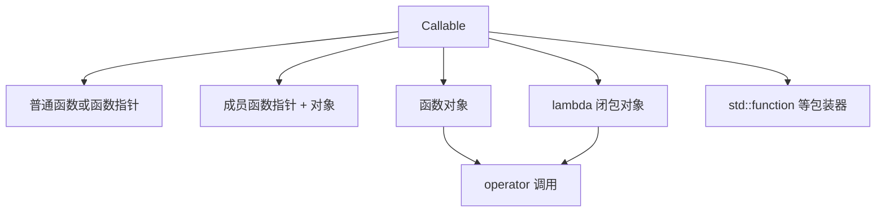
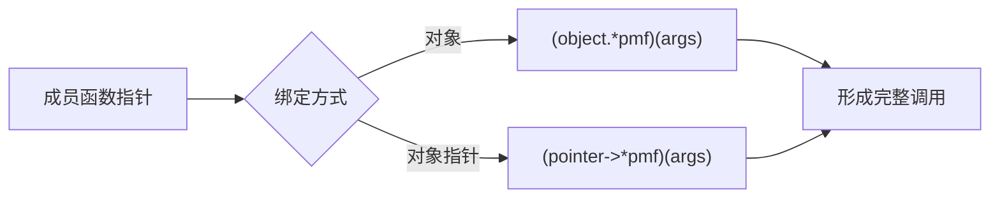
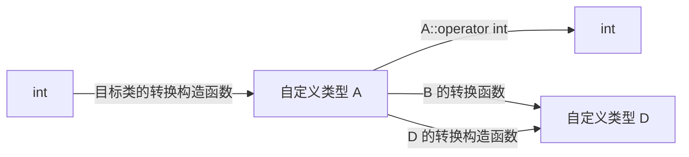
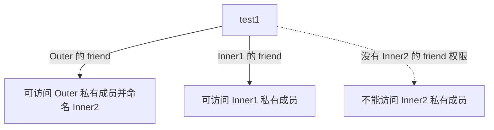
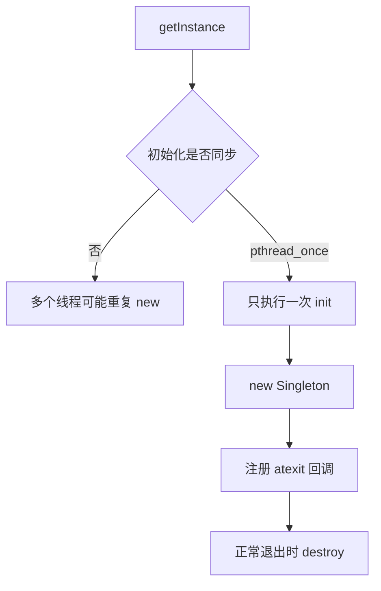
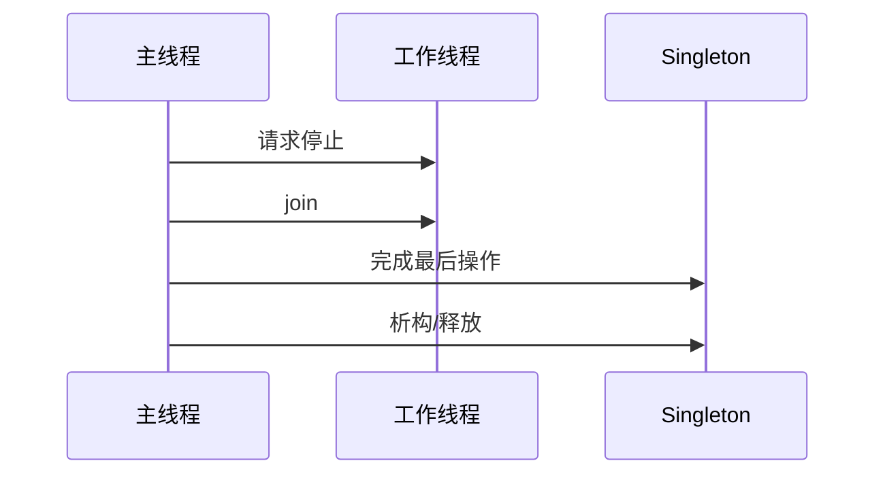

# C++ 可调用对象、类型转换、嵌套类与单例复习笔记

> 本笔记根据 `09_operator_overload` 下的主示例、`note/` 注释版和 `practice/` 练习整理，用于 C++ 面试前复习。本章承接上一章的运算符重载，进一步覆盖函数对象、函数指针与成员指针、用户定义类型转换、嵌套类、PImpl，以及单例对象的初始化、自动回收和线程安全。

## 目录

- [1. C++ 可调用实体](#1-c-可调用实体)
- [2. 函数对象与 operator 调用](#2-函数对象与-operator-调用)
- [3. 普通函数指针](#3-普通函数指针)
- [4. 成员函数指针](#4-成员函数指针)
- [5. 通用调用与包装器](#5-通用调用与包装器)
- [6. 用户定义类型转换](#6-用户定义类型转换)
- [7. 转换构造函数与 explicit](#7-转换构造函数与-explicit)
- [8. 类型转换函数](#8-类型转换函数)
- [9. 跨类型赋值的三种方案](#9-跨类型赋值的三种方案)
- [10. 嵌套类](#10-嵌套类)
- [11. 嵌套类访问规则](#11-嵌套类访问规则)
- [12. PImpl 编译防火墙](#12-pimpl-编译防火墙)
- [13. 单例模式基础](#13-单例模式基础)
- [14. 四种单例回收方案复盘](#14-四种单例回收方案复盘)
- [15. 现代 C++ 单例与线程安全](#15-现代-c-单例与线程安全)
- [16. 高频面试题速答](#16-高频面试题速答)
- [17. 源码索引与勘误](#17-源码索引与勘误)

---

## 1. C++ 可调用实体

能出现在调用表达式 `f(args...)` 中的实体统称为 callable。常见类型：

1. 普通函数。
2. 普通函数指针。
3. 成员函数指针与对象组合。
4. 重载 `operator()` 的函数对象。
5. lambda 表达式生成的闭包对象。
6. `std::function` 等类型擦除包装器。

```cpp
int add(int lhs, int rhs) {
    return lhs + rhs;
}

struct Adder {
    int operator()(int lhs, int rhs) const {
        return lhs + rhs;
    }
};

auto lambda = [](int lhs, int rhs) {
    return lhs + rhs;
};

int a = add(1, 2);
int b = Adder{}(1, 2);
int c = lambda(1, 2);
```



泛型代码通常不关心 callable 的具体类别，只关心它能否使用给定参数调用，以及调用结果能否满足要求。

---

## 2. 函数对象与 `operator()`

### 2.1 基本形式

类重载函数调用运算符后，其对象可像函数一样使用：

```cpp
class Calculator {
public:
    void operator()() const {
        std::cout << "called\n";
    }

    void operator()(int value) const {
        std::cout << value << '\n';
    }

    int operator()(int lhs, int rhs) const {
        return lhs + rhs;
    }
};

Calculator calculator;
calculator();
calculator(100);
int sum = calculator(1, 2);
```

本质形式：

```cpp
calculator.operator()(1, 2);
```

`operator()` 可以像普通成员函数一样重载，不同版本可拥有不同参数和返回类型。

### 2.2 为什么使用函数对象

函数对象本质是对象，因此能够：

- 保存调用之间的状态。
- 通过构造函数接收配置。
- 同时提供多个调用签名。
- 作为模板实参被静态内联。
- 对调用运算符使用 `const`、引用限定符等成员函数能力。

```cpp
class CountCalls {
public:
    void operator()() {
        ++count_;
    }

    std::size_t count() const noexcept {
        return count_;
    }

private:
    std::size_t count_{};
};
```

状态属于具体对象：

```cpp
CountCalls first;
CountCalls second;

first();
first();
second();
// first.count() == 2，second.count() == 1
```

### 2.3 `const operator()`

不修改自身状态的谓词或变换器通常声明为 `const`：

```cpp
struct IsEven {
    bool operator()(int value) const noexcept {
        return value % 2 == 0;
    }
};
```

有状态计数器会修改成员，其调用运算符自然不是 `const`。也可以将缓存标记为 `mutable`，但必须确认这种修改在逻辑 const、线程安全和可观察行为上合理。

### 2.4 lambda 与函数对象

lambda 会生成匿名闭包类型：

```cpp
int offset = 10;
auto addOffset = [offset](int value) {
    return value + offset;
};
```

概念上类似：

```cpp
class GeneratedClosure {
public:
    explicit GeneratedClosure(int offset) : offset_(offset) {}

    int operator()(int value) const {
        return value + offset_;
    }

private:
    int offset_;
};
```

捕获方式决定闭包成员的存储和生命周期。引用捕获不能超过被引用对象的生命周期。

> [!IMPORTANT]
> 函数对象“能保存状态”既是优势也是风险。标准算法可能复制 callable；并发调用同一个可变函数对象还可能产生数据竞争。

---

## 3. 普通函数指针

### 3.1 声明与调用

```cpp
void task() {
    std::cout << "task\n";
}

void (*pointer)() = &task;
pointer();
(*pointer)();
```

函数名在多数表达式中会转换成函数指针，因此 `&` 可以省略：

```cpp
void (*pointer)() = task;
```

调用时显式 `*` 也可省略。

### 3.2 类型别名

```cpp
using Task = void (*)();
Task current = &task;
current();
```

带参数和返回值：

```cpp
using BinaryOperation = int (*)(int, int);
```

函数指针类型包含：

- 返回类型。
- 参数类型与顺序。
- 变参信息。
- 适用时还包括语言规定的其他函数类型属性。

不匹配的函数不能直接赋给该指针。

### 3.3 空函数指针

```cpp
Task taskPointer = nullptr;
if (taskPointer) {
    taskPointer();
}
```

调用空函数指针是未定义行为。回调接口应检查是否允许空回调，或用类型/默认实现保证可调用。

### 3.4 与 lambda 的关系

无捕获 lambda 可转换为匹配的普通函数指针：

```cpp
using Operation = int (*)(int, int);
Operation operation = [](int a, int b) {
    return a + b;
};
```

捕获 lambda 需要保存状态，不能转换为普通函数指针。可以直接作为模板参数，或使用 `std::function` 等包装器。

---

## 4. 成员函数指针

### 4.1 为什么不是普通函数指针

非静态成员函数需要一个对象作为隐式 `this`，因此其指针类型必须包含所属类：

```cpp
class Widget {
public:
    void start() {
        std::cout << "start\n";
    }
};

void (Widget::*memberPointer)() = &Widget::start;
```

调用必须绑定对象：

```cpp
Widget widget;
Widget* pointer = &widget;

(widget.*memberPointer)();
(pointer->*memberPointer)();
```

括号不可随意省略，因为调用运算符 `()` 与 `.*`/`->*` 的优先级关系会改变解析。



### 4.2 const、参数与重载

const 成员函数指针：

```cpp
class Widget {
public:
    int value() const noexcept;
};

using Getter = int (Widget::*)() const noexcept;
Getter getter = &Widget::value;
```

`const`、引用限定符、参数、返回类型以及适用标准下的 `noexcept` 都是成员函数指针类型的一部分。

若成员函数重载，必须提供目标类型帮助消歧：

```cpp
class Printer {
public:
    void print(int);
    void print(double);
};

using IntPrinter = void (Printer::*)(int);
IntPrinter printer = &Printer::print;
```

### 4.3 成员对象指针

成员指针也可以指向数据成员：

```cpp
struct Record {
    int id;
};

int Record::*dataPointer = &Record::id;

Record record{42};
record.*dataPointer = 7;

Record* pointer = &record;
pointer->*dataPointer = 9;
```

它表示“某个类中某个成员的位置/标识”，不是可脱离对象直接解引用的普通内存地址。

### 4.4 空对象指针调用成员函数

目录示例通过 `FFF* ptr = nullptr` 调用成员函数，并观察“不读取成员时似乎可以运行”。

> [!CAUTION]
> 只要通过空指针调用非静态成员函数，行为就是未定义的；函数体是否访问数据成员不会使调用合法。某次运行没有崩溃只是未定义行为的一种偶然表现。

静态成员函数不需要对象，可使用类名直接调用，也可用普通函数指针保存：

```cpp
class Utility {
public:
    static void run();
};

void (*pointer)() = &Utility::run;
```

---

## 5. 通用调用与包装器

### 5.1 统一调用语法

C++17 的 `std::invoke` 可以统一调用普通函数、函数对象、成员函数指针和成员对象指针：

```cpp
#include <functional>

std::invoke(add, 1, 2);
std::invoke(Adder{}, 1, 2);
std::invoke(&Widget::start, widget);
std::invoke(&Record::id, record);
```

这也是许多标准库 callable 规则的基础。

### 5.2 `std::function`

```cpp
std::function<int(int, int)> operation;

operation = add;
operation = Adder{};
operation = [](int a, int b) { return a - b; };
```

优点：

- 用一个统一类型保存不同 callable。
- 适合运行期替换回调。

代价：

- 类型擦除可能产生间接调用。
- 可能发生动态分配。
- 要求目标满足包装器的复制等契约。
- 空 `std::function` 调用会抛 `std::bad_function_call`。

性能敏感且调用目标在编译期已知时，模板参数通常更利于内联。

### 5.3 `std::bind`

`std::bind` 能绑定部分参数，但占位符、值类别和重载处理较难阅读。现代代码通常优先 lambda：

```cpp
auto bound = [&widget](int value) {
    widget.update(value);
};
```

---

## 6. 用户定义类型转换

### 6.1 三个方向

目录示例覆盖：

1. 基本类型 → 自定义类型：转换构造函数。
2. 自定义类型 → 基本类型：类型转换函数。
3. 自定义类型 A → 自定义类型 B：B 的转换构造函数、A 的转换函数，或 B 的异构赋值。



### 6.2 隐式转换序列

编译器为函数匹配参数时可组合标准转换和用户定义转换，但一个隐式转换序列中至多包含一次用户定义转换。

```cpp
class Meter {
public:
    Meter(double);
};

void consume(Meter);
consume(10); // int -> double 是标准转换，double -> Meter 是一次用户转换
```

如果需要两次用户定义转换，编译器不会自动串联。

### 6.3 风险

隐式转换可能：

- 让本应报错的代码悄悄通过。
- 构造昂贵临时对象。
- 扩大重载候选并产生歧义。
- 选择语义令人意外的重载。
- 让两种物理量或领域类型意外混用。

默认策略是：不自然、不廉价、可能丢信息的转换应设为 `explicit`，或者提供命名转换函数。

---

## 7. 转换构造函数与 `explicit`

### 7.1 什么是转换构造函数

能以单个实参调用、从其他类型构造当前类型的构造函数可参与转换：

```cpp
class A {
public:
    A(int value) : value_(value) {}
private:
    int value_;
};

A first(10);  // 直接初始化
A second{10}; // 直接列表初始化
A third = 10; // 复制初始化，发生隐式转换
```

转换构造函数不一定在声明上只有一个参数；其余参数有默认值时，也可能只用一个实参调用。

### 7.2 `explicit`

```cpp
class A {
public:
    explicit A(int value);
};
```

此时：

```cpp
A first(10);        // 正确
A second{10};       // 正确
// A third = 10;    // 错误：复制初始化不考虑 explicit 构造函数
A fourth = A{10};   // 正确
```

`explicit` 不代表构造函数不能用于转换，而是禁止编译器在多数隐式转换上下文中自动使用它。

### 7.3 为什么单参数构造函数通常先考虑 `explicit`

```cpp
class File {
public:
    File(int descriptor);
};

void closeFile(File);
closeFile(3); // 是否真的希望 int 自动变成 File？
```

如果领域语义不是天然的“is-a/value-like conversion”，应阻止隐式转换：

```cpp
explicit File(int descriptor);
```

> [!TIP]
> 面试中看到可单实参调用的构造函数，应主动讨论 `explicit`。这是接口安全和重载解析的高频考点。

---

## 8. 类型转换函数

### 8.1 语法

```cpp
class Point {
public:
    operator int() const {
        return x_ + y_;
    }

private:
    int x_{};
    int y_{};
};
```

类型转换函数：

- 必须是非静态成员函数。
- 名称由 `operator 目标类型` 构成。
- 声明中不写普通返回类型。
- 没有显式参数。
- 通常应为 `const`，因为观察式转换不应修改源对象。
- 可以声明为 `explicit`。

### 8.2 隐式转换的危险

若 `Point::operator int()` 非 `explicit`：

```cpp
Point point;
int sum = point;
point + 10; // 可能先转成 int 再做整数加法
```

这会让 `Point` 参与大量本不相关的整数运算。更安全的接口：

```cpp
explicit operator int() const;
```

调用者明确写：

```cpp
int sum = static_cast<int>(point);
```

### 8.3 `explicit operator bool`

资源句柄常需要条件判断：

```cpp
class Handle {
public:
    explicit operator bool() const noexcept {
        return pointer_ != nullptr;
    }
};

if (handle) {
    // 可用
}
```

`explicit` 转换函数仍可用于 `if`、`while`、逻辑非等要求上下文布尔值的位置，但不会轻易转换成整数参与算术。

### 8.4 转换放在源类型还是目标类型

从 `Source` 转为 `Target`：

- `Target(Source)`：目标类型知道如何从源构造。
- `Source::operator Target()`：源类型知道如何导出目标。

选择依据：

- 哪个类型由当前项目控制。
- 转换语义属于谁。
- 是否需要访问私有表示。
- 是否希望允许隐式转换。
- 是否会产生循环依赖。

通常优先让目标类型通过构造函数接收源值，或使用命名的自由函数；不要在两个方向同时铺设大量隐式转换。

---

## 9. 跨类型赋值的三种方案

练习希望：

```cpp
Point point{8, 9};
Complex complex{4, 6};
complex = point;
```

### 9.1 方案一：异构赋值运算符

```cpp
class Complex {
public:
    Complex& operator=(const Point& point) {
        real_ = point.x();
        imag_ = point.y();
        return *this;
    }
};
```

语义是“`Complex` 知道如何接收一个 `Point` 赋值”。

特点：

- 只影响赋值表达式。
- 不会自动让 `Point` 用于所有要求 `Complex` 的位置。
- 可直接修改现有对象，避免先构造临时目标对象。
- 增加目标类与源类的耦合。

### 9.2 方案二：目标类型的转换构造函数

```cpp
class Complex {
public:
    Complex(const Point& point)
        : real_(point.x()), imag_(point.y()) {}
};
```

若非 `explicit`，赋值过程可概念化为：

```cpp
complex = Complex{point};
```

它表达“`Point` 可以构造一个 `Complex`”，适用于参数传递、返回值、初始化等更广泛场景。

若只希望显式构造：

```cpp
explicit Complex(const Point&);
complex = Complex{point};
```

### 9.3 方案三：源类型的转换函数

```cpp
class Point {
public:
    operator Complex() const {
        return Complex{x_, y_};
    }
};
```

语义是“`Point` 知道如何把自己转换成 `Complex`”。这会影响所有考虑该转换的上下文，应谨慎开放。

### 9.4 对比

| 方案 | 定义位置 | 影响范围 | 适合场景 |
|---|---|---|---|
| `Complex::operator=(Point)` | 目标类 | 仅赋值 | 只需要异构赋值 |
| `Complex(Point)` | 目标类 | 构造及可能的隐式转换 | 源值天然可构造目标 |
| `Point::operator Complex()` | 源类 | 广泛转换上下文 | 转换职责明确属于源类 |

> [!IMPORTANT]
> 不要同时提供多个同等可行的隐式转换路径。即使某个表达式能由编译器按规则选出一个，其他初始化、重载调用或模板上下文也可能产生歧义或选择意外路径。

目录 `03_cast.cc` 同时提供 `Point(const Complex&)` 和 `Complex::operator Point()`。在当前 `pt = cx` 示例及所用编译器中选择了后者，但这不应作为接口设计依赖；保留一条权威路径更清晰。

---

## 10. 嵌套类

### 10.1 基本语法

```cpp
class Outer {
public:
    class PublicInner {};

private:
    class PrivateInner {};
};

Outer::PublicInner value;
// Outer::PrivateInner hidden; // 无权命名
```

嵌套类是定义在另一个类作用域中的独立类类型，其完整名称包含外部类作用域。

适用场景：

- 只为外部类服务的节点或辅助类型。
- 隐藏实现细节。
- 减少外围命名空间污染。
- 表达类型的逻辑从属关系。

### 10.2 嵌套类没有外部对象

嵌套不等于 Java 风格的隐式外部实例绑定。嵌套类对象不会自动保存 `Outer*`：

```cpp
class Outer {
    int value_{42};

    class Inner {
    public:
        int read(const Outer& outer) const {
            return outer.value_;
        }
    };
};
```

访问外部类的非静态成员仍需一个具体 `Outer` 对象、指针或引用。

### 10.3 访问级别控制的是“能否命名类型”

若嵌套类位于 `private`：

- 外部代码不能直接写出 `Outer::Inner`。
- `Outer` 自己仍可创建和使用它。
- 被 `Outer` 授权的友元可获得命名权限。

嵌套类本身的成员还拥有自己的 `public/private/protected` 规则，这是另一层访问控制。

### 10.4 对象大小

仅仅声明嵌套类型不会把其对象放入外部对象：

```cpp
class Outer {
    class Inner {
        int value_;
    };
};
```

`Outer` 不因为声明了 `Inner` 就包含一个 `int`。只有真正声明成员：

```cpp
Inner inner_;
```

才会影响 `Outer` 的对象布局和大小。

---

## 11. 嵌套类访问规则

### 11.1 内部类访问外部类

嵌套类的成员可访问外部类的非公有成员，但必须有外部对象才能访问非静态数据：

```cpp
class Outer {
private:
    int secret_{42};

    class Inner {
    public:
        int read(const Outer& outer) const {
            return outer.secret_;
        }
    };
};
```

### 11.2 外部类访问内部类

外部类并不会因为“包含了类型声明”就自动越过内部类自己的 `private`：

```cpp
class Outer {
    class Inner {
    private:
        int secret_{};
    };

    void function() {
        Inner inner;
        // inner.secret_; // 没有自动访问权
    }
};
```

若确有需要，`Inner` 可以把 `Outer` 声明为友元；更好的设计通常是给 `Inner` 提供适当公共接口。

### 11.3 友元函数的两层授权

目录 `05_nested_access.cc` 中，外部函数 `test1`：

- 是 `Outer` 的友元，因此能命名其私有嵌套类 `Inner2`。
- 也是 `Inner1` 的友元，因此能访问 `Inner1` 的私有成员。

获得外部类友元权限，不代表自动获得每个嵌套类私有成员的访问权。



### 11.4 组合案例

`Line` 将 `Point` 定义为私有嵌套类，并拥有两个 `Point` 成员：

```cpp
class Line {
    class Point {
        int x_;
        int y_;
    };

    Point first_;
    Point second_;
};
```

这表达 `Point` 是 `Line` 的私有实现细节。注意源码声明了 `Line() = default`，但 `Point` 没有默认构造函数，因此 `Line` 的默认构造函数会被隐式定义为删除；`Line line;` 仍然不能使用。

---

## 12. PImpl 编译防火墙

### 12.1 基本结构

PImpl 是 pointer to implementation：

```cpp
// Line.hpp
class Line {
public:
    Line(int x1, int y1, int x2, int y2);
    ~Line();

    void print() const;

private:
    class Impl;
    std::unique_ptr<Impl> impl_;
};
```

```cpp
// Line.cpp
class Line::Impl {
    // 真实数据与依赖
};

Line::~Line() = default;
```

头文件只需要知道 `Impl` 是一种类型，并保存固定大小的指针。完整实现放在 `.cpp`。


### 12.2 主要收益

- 隐藏实现数据和私有辅助类型。
- 减少头文件依赖与级联重新编译。
- 公共类大小不随实现成员轻易改变。
- 有助于维持库的二进制接口稳定。

PImpl 不是绝对 ABI 保证；编译器 ABI、标准库、虚函数布局、编译选项及公开接口变化仍会影响兼容性。

### 12.3 成本

- 通常多一次动态分配。
- 成员访问多一次指针间接寻址。
- 需要显式处理复制、移动和析构。
- 调试时多一层实现对象。
- 小型值类型可能不值得使用。

### 12.4 为什么析构函数放在 `.cpp`

`std::unique_ptr<Impl>` 可以在头文件中持有不完整类型，但默认删除器真正执行 `delete` 时通常需要 `Impl` 完整：

```cpp
// 头文件只声明
~Line();

// .cpp 中 Impl 完整定义之后
Line::~Line() = default;
```

若直接在头文件内让析构隐式实例化，可能在 `Impl` 不完整的调用点触发编译问题。

### 12.5 复制与移动

独占 PImpl 默认不可复制：

```cpp
Line(const Line&) = delete;
Line& operator=(const Line&) = delete;

Line(Line&&) noexcept;
Line& operator=(Line&&) noexcept;
```

移动操作也可在 `Impl` 完整定义后的 `.cpp` 中写成 `= default`。若类型语义要求值复制，应在 `.cpp` 中深拷贝：

```cpp
Line::Line(const Line& other)
    : impl_(std::make_unique<Impl>(*other.impl_)) {}
```

> [!CAUTION]
> 练习 PImpl 使用裸指针并只实现析构。编译器生成的复制会让两个 `Line` 指向同一 `LineImpl`，最终 double free。必须删除复制或实现深拷贝，现代代码优先 `unique_ptr`。

---

## 13. 单例模式基础

### 13.1 目标

单例通常尝试保证：

- 类只能创建一个共享实例。
- 提供全局访问点。
- 禁止外部随意构造、复制和销毁。

```cpp
class Singleton {
public:
    Singleton(const Singleton&) = delete;
    Singleton& operator=(const Singleton&) = delete;

    static Singleton& instance();

private:
    Singleton() = default;
    ~Singleton() = default;
};
```

私有构造函数阻止外部直接创建；删除复制与赋值阻止产生第二个逻辑实例。

### 13.2 懒汉与饿汉

| 模式 | 创建时间 | 优点 | 风险/代价 |
|---|---|---|---|
| 懒加载 | 第一次使用 | 不使用就不创建 | 必须正确同步初始化 |
| 立即加载 | 静态初始化阶段 | 获取逻辑简单 | 即使不用也构造，涉及静态初始化顺序 |

### 13.3 单例的设计成本

单例本质是受控的全局状态：

- 隐藏依赖。
- 测试中难以替换或隔离。
- 初始化参数不易变化。
- 生命周期与退出顺序复杂。
- 并发读写仍需要同步。
- 容易被任意代码访问。

依赖注入或由应用入口持有唯一服务对象，常常比单例更易测试。只有“进程内确实唯一且生命周期明确”的设施才适合考虑单例。

---

## 14. 四种单例回收方案复盘

目录用四种方式演示堆上单例的释放。

### 14.1 方式一：局部栈管理器

```cpp
void test() {
    AutoRelease manager{Singleton::getInstance()};
}
```

函数退出时 `manager` 析构并删除单例。

问题：

- 生命周期只覆盖该局部作用域，不一定是整个程序。
- 管理器析构后，静态 `m_pInstance` 没被置空，成为悬空指针。
- 再次 `getInstance()` 会返回已释放地址。
- 创建两个管理器或复制管理器可能 double free。
- 裸指针懒加载不是线程安全的。

因此它只能演示 RAII，不能作为可靠的全局单例方案。

### 14.2 方式二：静态嵌套管理器

`Singleton` 保存一个静态 `AutoRelease` 对象；程序正常退出时管理器析构并删除实例。

优点：

- 回收对象具有静态存储期。
- 不依赖业务函数中的局部管理器。

问题：

- `getInstance()` 中的检查与 `new` 仍有并发竞态。
- 跨翻译单元静态对象之间仍可能发生析构顺序问题。
- 其他静态对象析构时若访问已释放单例，会出现 use-after-free。
- 嵌套类本身已有访问外围类私有成员的权限，额外 `friend class AutoRelease` 通常没有必要。

### 14.3 方式三：`std::atexit`

第一次构造成功后注册销毁回调：

```cpp
instance_ = new Singleton;
std::atexit(&Singleton::destroy);
```

`atexit` 回调：

- 在正常程序终止流程中调用。
- 多个回调按注册顺序的逆序执行。
- 不保证在 `std::_Exit`、`std::abort`、被强制终止或崩溃时执行。

还应检查注册是否成功。该版本依然没有解决首次创建的线程竞态。

### 14.4 方式四：`pthread_once`

```cpp
pthread_once(&once_, &Singleton::initialize);
```

它保证初始化例程只成功执行一次，解决并发懒加载的重复创建问题。初始化例程中创建实例并注册退出回调。

注意：

- 属于 POSIX 接口，不是标准 C++。
- 初始化回调应遵守接口约束，不应让异常越过 C/POSIX 边界。
- 销毁时必须保证其他线程已停止访问单例。
- 一旦销毁，`pthread_once_t` 仍处于已执行状态，不能靠再次调用自然重建。
- 仍需处理静态析构顺序与正常/异常退出差异。

### 14.5 对比

| 方案 | 自动回收 | 初始化线程安全 | 主要问题 |
|---|---|---|---|
| 局部 `AutoRelease` | 作用域结束 | 否 | 静态指针悬空、作用域不匹配 |
| 静态嵌套管理器 | 正常退出 | 否 | 初始化竞态、静态析构顺序 |
| `atexit` | 正常退出 | 否 | 初始化竞态、只覆盖正常终止 |
| `pthread_once + atexit` | 正常退出 | 是 | POSIX 依赖、退出并发与顺序 |



---

## 15. 现代 C++ 单例与线程安全

### 15.1 Meyers Singleton

C++11 起，函数局部静态变量的初始化由语言保证线程安全：

```cpp
class Singleton {
public:
    static Singleton& instance() {
        static Singleton value;
        return value;
    }

    Singleton(const Singleton&) = delete;
    Singleton& operator=(const Singleton&) = delete;

private:
    Singleton() = default;
    ~Singleton() = default;
};
```

优势：

- 不需要裸指针和手动 `new/delete`。
- 第一次使用时初始化。
- 初始化只执行一次。
- 正常退出时自动析构。
- 不依赖 `pthread_once`。

> [!IMPORTANT]
> 语言只保证局部静态对象的初始化线程安全，不保证 `Singleton` 的业务成员函数线程安全。共享可变状态仍需互斥量、原子操作或无共享设计。

### 15.2 静态析构顺序

函数局部静态对象也存在退出期依赖问题：

```text
全局对象 A 的析构函数 → 调用 Singleton
Singleton 可能已经先析构
```

同一翻译单元内，静态对象通常按构造逆序析构；跨翻译单元的动态初始化/销毁依赖容易形成 static initialization order fiasco。

应避免在全局对象析构期间访问彼此，或由应用入口显式管理依赖顺序。对确实可安全交给操作系统回收、且析构顺序风险大于进程结束时释放价值的进程级设施，有时会有意不销毁，但这必须是明确、记录在案的工程决策。

### 15.3 `std::call_once`

如果对象不能使用局部静态方式初始化，可以使用标准接口：

```cpp
std::once_flag flag;
std::unique_ptr<Service> service;

void initialize() {
    std::call_once(flag, [] {
        service = std::make_unique<Service>();
    });
}
```

与手写双重检查锁相比，`std::call_once` 更容易正确处理内存可见性和异常重试语义。

### 15.4 销毁期并发

无论哪种方案，销毁前都要建立明确的 happens-before：



不能一边让工作线程读取单例，一边由退出回调删除它。

---

## 16. 高频面试题速答

### 16.1 什么是 callable？

能以调用语法配合一组参数执行的实体，包括函数、函数指针、函数对象、lambda、成员函数指针加对象，以及 `std::function` 等包装器。

### 16.2 函数对象是什么？

重载了 `operator()` 的类对象。它既能像函数一样调用，又能保存配置和跨调用状态。

### 16.3 lambda 与函数对象是什么关系？

lambda 表达式生成匿名闭包类型，其对象包含捕获数据，并提供由 lambda 参数和函数体对应的调用运算符。

### 16.4 普通函数指针如何声明？

`Return (*name)(Args...)`。可用 `using Name = Return (*)(Args...);` 提高可读性。

### 16.5 捕获 lambda 能转成普通函数指针吗？

不能，因为普通函数指针没有保存捕获状态的位置。无捕获 lambda 在签名匹配时可以转换。

### 16.6 成员函数指针为什么带类名？

非静态成员函数需要所属类型和具体对象提供 `this`。类型写作 `R (C::*)(Args...)`，不能当普通函数指针调用。

### 16.7 如何调用成员函数指针？

对象使用 `(object.*pointer)(args...)`；对象指针使用 `(pointerToObject->*pointer)(args...)`。

### 16.8 const 成员函数指针和非 const 版本是同一类型吗？

不是。`R (C::*)() const` 与 `R (C::*)()` 是不同类型；引用限定符、参数以及适用情况下的 `noexcept` 也会影响类型。

### 16.9 空指针能否调用不访问成员的成员函数？

不能。通过空对象指针调用非静态成员函数已经是未定义行为，与函数体是否使用成员无关。

### 16.10 `std::invoke` 有什么用？

它提供统一调用规则，可调用普通 callable、成员函数指针和成员对象指针，减少泛型代码对不同语法的分支。

### 16.11 `std::function` 有什么代价？

类型擦除带来间接调用，目标较大时可能动态分配，并有自身的复制和空状态语义。编译期已知 callable 时模板通常更轻量。

### 16.12 什么是转换构造函数？

能够以某种源类型实参构造目标类对象、并可参与用户定义转换的构造函数。它不一定语法上只有一个参数，其他参数可能有默认值。

### 16.13 `explicit` 有什么作用？

阻止构造函数或转换函数被多数隐式转换上下文自动采用，同时保留直接初始化或显式转换能力。

### 16.14 类型转换函数的语法特点是什么？

写作 `operator Target() const`，没有普通返回类型和显式参数，必须是非静态成员函数。

### 16.15 为什么 `operator bool` 常声明为 explicit？

它仍支持 `if (object)` 等上下文判断，但避免对象继续隐式转为整数并参与算术或匹配错误重载。

### 16.16 一个隐式转换序列能连续调用多个用户转换吗？

不能，至多包含一次用户定义转换；其前后可以组合允许的标准转换。

### 16.17 跨类型赋值有哪些实现方式？

目标类的异构 `operator=`、目标类的转换构造函数、源类的类型转换函数。三者影响范围和转换职责不同。

### 16.18 为什么不要同时提供多条隐式转换路径？

会扩大候选集合，导致歧义、上下文相关选择或意外临时对象。接口应指定一条权威转换路径，其余使用命名/显式转换。

### 16.19 嵌套类对象是否自动拥有外部类对象？

不拥有。嵌套类只是位于外部类作用域中的类型，访问外部非静态成员仍需要具体外部对象。

### 16.20 私有嵌套类意味着什么？

外部代码无权通过 `Outer::Inner` 命名该类型；外部类自身及获得相应权限的友元可以使用它。

### 16.21 外部类能自动访问嵌套类的 private 成员吗？

不能。嵌套类可访问外围类的非公有成员，但反向没有自动特权；需要嵌套类授权或公共接口。

### 16.22 只声明嵌套类会增大外部对象吗？

不会。类型声明本身不占每个对象的存储，只有把嵌套类对象作为非静态数据成员时才影响布局。

### 16.23 PImpl 是什么？

公共类只持有指向不完整实现类的指针，把真实数据和依赖放入 `.cpp`，形成实现隐藏和编译防火墙。

### 16.24 PImpl 有哪些代价？

通常包含动态分配、一次间接访问、更多特殊成员函数处理和更复杂的调试，不适合所有小型值类型。

### 16.25 `unique_ptr<Impl>` 为什么常要求析构函数在 cpp 定义？

删除 `Impl` 时需要其完整定义。把析构定义放到 `Impl` 已完整的 `.cpp`，避免在只有前向声明的头文件使用点实例化删除逻辑。

### 16.26 裸指针 PImpl 为什么容易 double free？

默认复制只复制实现指针，两个外层对象都会在析构时删除同一实现。应删除复制或实现深拷贝，优先使用 `unique_ptr` 表达所有权。

### 16.27 懒汉单例为什么需要同步？

多个线程可能同时观察到空指针，各自创建实例，并对静态指针产生数据竞争。初始化必须使用局部静态、`call_once` 或等价正确同步。

### 16.28 Meyers Singleton 为什么线程安全？

C++11 保证函数局部静态对象的初始化只成功完成一次，并协调并发进入；该保证不涵盖对象后续方法的共享状态。

### 16.29 `atexit` 回调按什么顺序执行？

按成功注册顺序的逆序执行。它只覆盖规定的正常终止流程，不是崩溃或强制退出下的可靠资源回收机制。

### 16.30 单例是否一定应该在进程退出时销毁？

不一定。若析构依赖复杂且资源可由操作系统安全回收，有些进程级设施会有意存活至进程终止；但必须权衡泄漏检查、缓冲刷新和业务资源释放，不能默认忽略析构。

---

## 17. 源码索引与勘误

### 17.1 主示例

| 文件 | 主题 |
|---|---|
| `01_function_object.cc` | 函数对象重载和有状态调用 |
| `02_member_func_pointer.cc` | 函数指针、成员函数指针和空指针实验 |
| `03_cast.cc` | 转换构造、转换函数和跨类型转换 |
| `04_nested.cc` | 嵌套类语法与应用 |
| `05_nested_access.cc` | 嵌套类双向访问规则 |
| `06_nested_case.cc` | `Line::Point` 组合案例 |
| `07_AutoRelease1.cc` | 局部栈管理器回收单例 |
| `08_AutoRelease2.cc` | 静态嵌套管理器 |
| `09_AutoRelease3.cc` | `atexit` 回调 |
| `10_AutoRelease4.cc` | `pthread_once + atexit` |

`note/` 提供了对应的详细注释版本。

### 17.2 练习

| 路径 | 主题 |
|---|---|
| `practice/01_AutoRelease1.cc` | 静态嵌套管理器 |
| `practice/02_AutoRelease2.cc` | 静态嵌套管理器的相似实现 |
| `practice/03_AutoRelease3.cc` | `atexit` 自动销毁 |
| `practice/04_AutoRelease4.cc` | 局部回收器与 `pthread_once` |
| `practice/assignment_operation` | 跨类型赋值的三种方案 |
| `practice/pointer_to_implementation` | PImpl、静态库与接口隐藏 |

### 17.3 重点勘误

> [!CAUTION]
> 以下是源码中需要主动识别的教学简化或设计问题。

1. `02_member_func_pointer.cc` 通过空对象指针调用成员函数属于未定义行为，即使函数体没有读取成员。
2. 成员函数指针示例只演示非 const 无参版本；真实类型必须匹配参数、const、引用限定符和适用情况下的 `noexcept`。
3. `03_cast.cc` 的 `Point::operator int()` 不修改对象，应标记为 `const`，通常还应考虑 `explicit`。
4. `Complex::operator Point()` 同样应标记为 `const`。
5. 同时提供 `Point(const Complex&)` 与 `Complex::operator Point()` 建立了重复隐式路径，其他上下文可能歧义或选择意外。
6. `Point` 为读取 `Complex` 私有成员而把整个类声明为友元，授权范围偏大；getter 或更窄接口通常更清晰。
7. `04_nested.cc` 的 `LinkedList` 拥有裸指针但未删除/实现复制，默认浅拷贝会导致 double free。
8. `LinkedList::show()` 与多处 `print()` 不修改对象，应标记为 `const`。
9. `05_nested_access.cc` 的多个整数成员未初始化；虽然多数表达式只用于演示访问权限，实际读取前必须初始化。
10. `Inner2::inner2Method2` 与 `Outer::outerMethod2` 输出了错误的函数名，容易误导调试。
11. `06_nested_case.cc` 声明 `Line() = default`，但成员 `Point` 无默认构造函数，因此该默认构造函数实际被删除。
12. 第一种局部 `AutoRelease` 删除实例后未清空 `Singleton::m_pInstance`，静态指针悬空。
13. 第一种 `AutoRelease` 本身可复制，也允许多个管理器接管同一指针，可能重复释放。
14. 裸指针懒加载写法 `if (!instance) instance = new ...` 存在数据竞争，不是线程安全单例。
15. 静态嵌套管理器只负责正常退出回收，没有解决首次创建竞态。
16. 嵌套 `AutoRelease` 已能访问外围类私有静态成员，额外友元声明通常多余。
17. `atexit` 示例没有检查注册返回值，也不能覆盖 `abort`、`_Exit`、崩溃或强制终止。
18. 退出回调删除单例前没有协调仍在运行的其他线程，可能发生 use-after-free。
19. `pthread_once` 版本依赖 POSIX；标准 C++ 可优先使用函数局部静态或 `std::call_once`。
20. `pthread_once` 一旦完成，即使之后手动销毁实例也不会自动重新初始化。
21. `practice/04_AutoRelease4.cc` 的回收器是函数局部静态，但单例本身仍是裸指针，整体复杂度高于 Meyers Singleton。
22. PImpl 头文件使用双下划线 include guard，这是实现保留标识符，应改为项目专属普通名称或 `#pragma once`。
23. PImpl 示例用裸指针并只实现析构，默认复制会 double free。
24. PImpl 的 `printLine()` 未检查实现指针；若以后加入移动语义，必须定义 moved-from 对象的可用契约。
25. PImpl 笔记所说“头文件不变，用户通常不需重新适配”不等于在任意编译器、标准库和编译选项间保证 ABI。
26. 公共头文件和多个示例使用 `using namespace std;`，会扩大名称冲突，尤其不应出现在库头文件中。
27. 多数 `main` 的参数、部分局部变量和函数参数未使用，严格警告下会产生诊断。

---

## 复习主线

面试前可按以下顺序回忆：

1. **Callable**：函数、函数指针、成员指针、函数对象、lambda 和类型擦除包装。
2. **成员指针**：必须绑定对象，牢记 `.*`、`->*` 与 `std::invoke`。
3. **类型转换**：区分目标构造、源转换函数和异构赋值，默认警惕隐式路径。
4. **`explicit`**：阻止意外转换，同时保留直接初始化和显式转换。
5. **嵌套类**：只有作用域从属，没有隐式外围对象，双向访问权限并不对称。
6. **PImpl**：前向声明隐藏实现，析构放 `.cpp`，明确复制/移动与 ABI 边界。
7. **单例初始化**：裸指针检查有竞态，优先 C++11 局部静态。
8. **单例销毁**：考虑正常/异常退出、静态析构顺序和工作线程停止顺序。

> [!TIP]
> 回答本章面试题时，不要只说“语法怎么写”。继续追问一次“对象在哪里、谁拥有它、能否隐式发生、多个线程和退出阶段会怎样”，就能覆盖最关键的工程风险。
