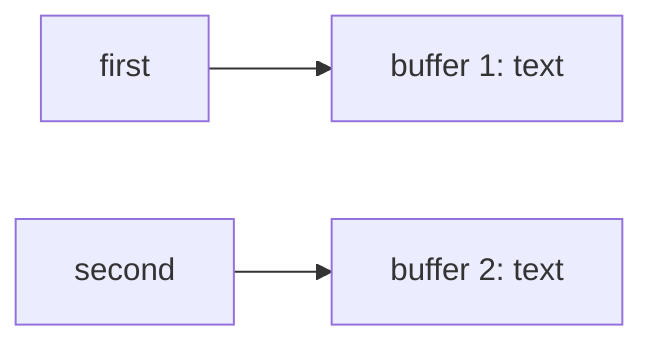
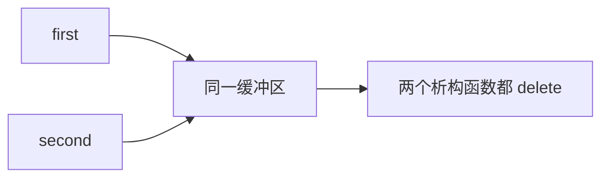
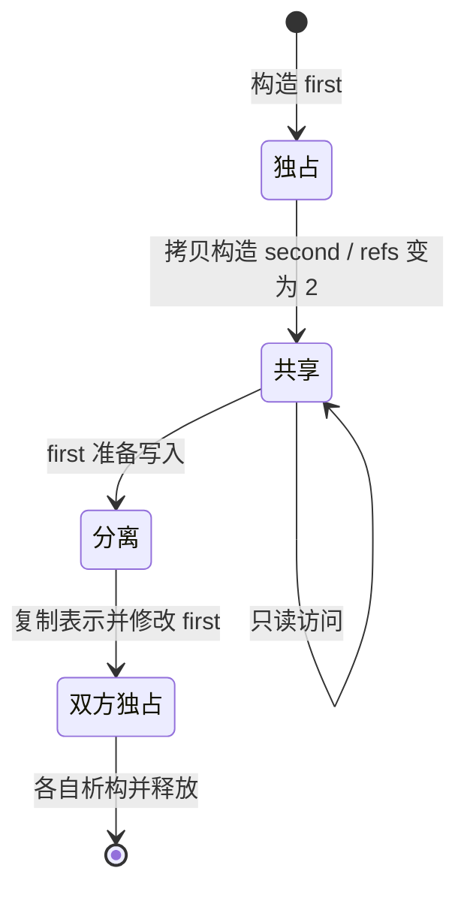
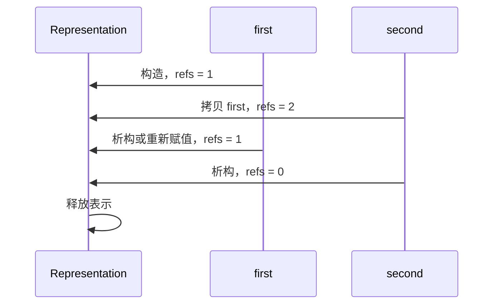
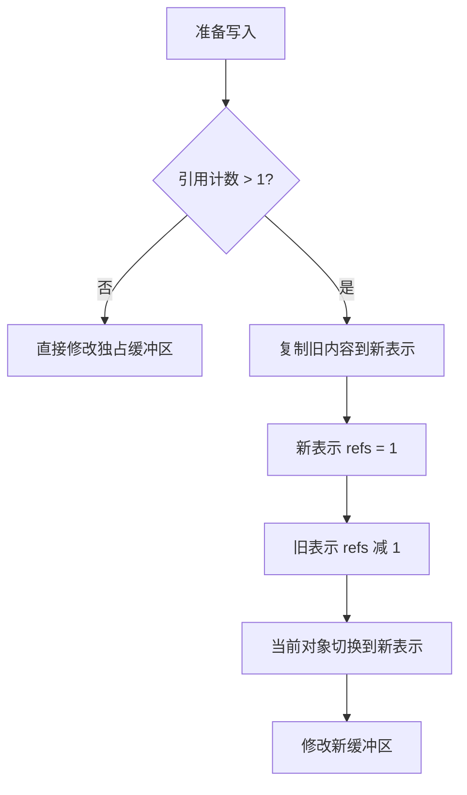
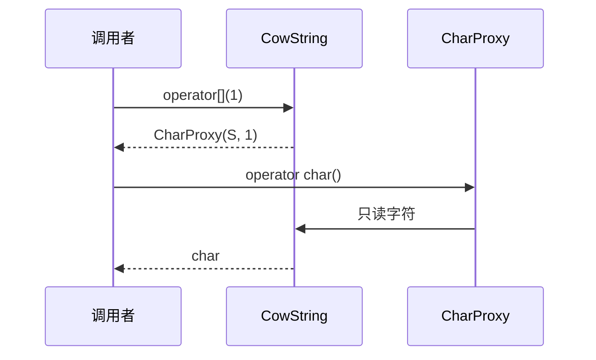
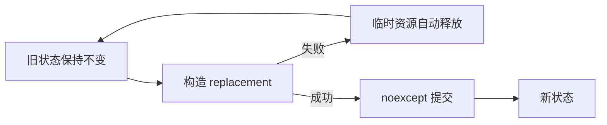
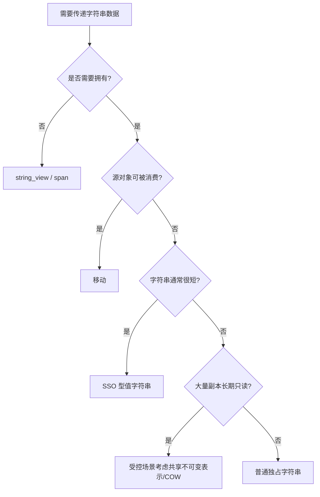

# C++ 写时复制字符串、字符代理与 SSO 复习笔记

> 本笔记根据 `10_string_copy_on_write` 下的主示例、`note/` 注释版和 `practice/` 练习整理，用于 C++ 面试前复习。重点覆盖深浅拷贝、引用计数、Copy-On-Write、写时分离、字符代理、异常安全、线程安全，以及 SSO 与现代字符串优化策略。

## 目录

- [1. 字符串复制策略](#1-字符串复制策略)
- [2. COW 基本原理](#2-cow-基本原理)
- [3. 共享表示与内存布局](#3-共享表示与内存布局)
- [4. 引用计数与对象生命周期](#4-引用计数与对象生命周期)
- [5. 写时分离 detach](#5-写时分离-detach)
- [6. 下标读写难题](#6-下标读写难题)
- [7. CharProxy 字符代理](#7-charproxy-字符代理)
- [8. 代理引用的局限](#8-代理引用的局限)
- [9. const 正确性与可变数据出口](#9-const-正确性与可变数据出口)
- [10. COW 的异常安全](#10-cow-的异常安全)
- [11. COW 的线程安全](#11-cow-的线程安全)
- [12. 现代标准字符串为何不采用 COW](#12-现代标准字符串为何不采用-cow)
- [13. SSO 小字符串优化](#13-sso-小字符串优化)
- [14. 字符串传递与优化策略对比](#14-字符串传递与优化策略对比)
- [15. 代理设计模式复盘](#15-代理设计模式复盘)
- [16. 高频面试题速答](#16-高频面试题速答)
- [17. 源码索引与勘误](#17-源码索引与勘误)

---

## 1. 字符串复制策略

假设：

```cpp
String first{"a very long string"};
String second = first;
```

字符串类可以采用不同复制策略。

### 1.1 深拷贝

`second` 立即申请独立缓冲区并复制全部字符：



特点：

- 两个对象完全独立。
- 写操作简单，不需要分离。
- 复制时间和额外空间为 `O(n)`。
- 资源所有权容易理解。

### 1.2 错误的普通浅拷贝

只复制裸指针：



没有共享所有权协议时会导致：

- 修改任一对象会影响另一个对象。
- 一个对象析构后另一个对象指针悬空。
- 最终 double free。

### 1.3 写时复制

COW（Copy On Write）是**有管理协议的共享**：

- 复制时只共享不可变表示并增加引用计数。
- 读取时继续共享。
- 某个对象准备写入时，如果表示被共享，先复制一份再修改。
- 最后一个拥有者离开时释放表示。

因此 COW 不是普通浅拷贝，而是“引用计数 + 写前分离 + 封闭所有写入口”共同组成的值语义实现。

> [!IMPORTANT]
> 仅增加引用计数并不能得到 COW。任何可修改共享缓冲区的入口如果绕过 `detach()`，都会破坏对象之间应有的独立值语义。

---

## 2. COW 基本原理

### 2.1 状态变化

```cpp
CowString first{"abc"};
CowString second = first; // 共享，引用计数为 2

char value = first[0];    // 只读，不分离
first[0] = 'A';           // 写入，first 分离
```

预期结果：

```text
first  == "Abc"，refCount == 1
second == "abc"，refCount == 1
```



### 2.2 时间复杂度

设字符串长度为 `n`：

| 操作 | COW 典型成本 |
|---|---:|
| 拷贝构造 | `O(1)`，增加引用计数 |
| 拷贝赋值 | `O(1)`，调整两个引用计数 |
| 只读访问 | `O(1)` |
| 独占时修改单字符 | `O(1)` |
| 共享时首次修改 | `O(n)`，需要分离复制 |
| 析构 | `O(1)`，最后一个拥有者还需释放 |

COW 把复制成本从“每次对象复制”推迟到“共享对象首次写入”。

### 2.3 适用负载

COW 更有机会获益的场景：

- 大对象频繁复制。
- 大多数副本只读。
- 修改次数少。
- 能完整控制所有写入口。

若对象经常写入，每次复制后很快分离，COW 只会额外增加引用计数、分支、间接访问和同步成本。

---

## 3. 共享表示与内存布局

### 3.1 目录实现

示例在一块 `char[]` 前四字节保存引用计数：

```text
低地址                                           高地址
+------------------+-------------------------------+
| 引用计数 int     | 'a' | 'b' | 'c' | '\0'        |
+------------------+-------------------------------+
^                  ^
真实分配起点        m_pStr
```

代码通过：

```cpp
new char[4 + length + 1] + 4;
reinterpret_cast<int*>(m_pStr - 4);
```

访问控制信息。

### 3.2 魔数 `4` 不可移植

标准只保证：

```cpp
sizeof(char) == 1
sizeof(int) >= 2
```

不保证 `sizeof(int) == 4`。至少应使用 `sizeof(CountType)`，但仅替换魔数仍没有解决对象生命周期、对齐和类型访问问题。

### 3.3 对齐与对象生命周期

把 `char[]` 中的一段地址强制解释成 `int*`，必须保证：

- 地址满足 `alignof(int)`。
- 那里确实存在生命周期已经开始的 `int` 对象。
- 访问遵守别名和对象表示规则。
- 释放时找回完全相同的原始分配地址。

目录的技巧高度依赖平台和实现，在 C++17 的严格对象生命周期模型下不适合作为通用控制块实现。

### 3.4 更清晰的表示对象

概念上可把共享状态建模成真正的类型：

```cpp
struct Representation {
    std::string text;
};

class CowValue {
public:
    CowValue() : rep_(std::make_shared<Representation>()) {}

private:
    std::shared_ptr<Representation> rep_;
};
```

共享所有权由 `shared_ptr` 管理，字符和长度由 `std::string` 管理。该示例用于说明控制块建模，并不建议再把它包装成替代 `std::string` 的生产字符串。

如果为性能确实需要单次分配的自定义控制块，应使用明确的对齐分配、对象构造和销毁协议，并封装原始基址，不能让业务代码到处执行 `pointer - 4`。

### 3.5 应保存的元数据

成熟表示通常至少需要：

- 引用计数。
- 当前长度。
- 容量。
- 字符数据。
- 可能还包括分配器或编码信息。

源码每次 `size()`、边界检查和分离都调用 `strlen`，使这些本可 `O(1)` 的操作变成 `O(n)`。

---

## 4. 引用计数与对象生命周期

### 4.1 引用计数不变量

对每块表示：

```text
refs == 当前共享该表示的 CowString 对象数量
refs >= 1，只要表示仍可访问
refs 变为 0 时释放且只能释放一次
```

典型变化：



### 4.2 拷贝构造

```cpp
CowString::CowString(const CowString& other)
    : representation_(other.representation_) {
    incrementReferenceCount();
}
```

复制指针和增加计数必须共同完成。若支持并发共享，计数操作还需要正确的原子协议。

### 4.3 拷贝赋值

逻辑：

1. 处理自赋值。
2. 释放当前表示的一份所有权。
3. 指向右侧表示。
4. 增加新表示引用计数。

两个不同对象也可能已经共享同一表示：

```cpp
CowString second = first;
first = second;
```

实现仍必须保持计数不变。源码先减再加，在单线程和自赋值检查成立时能够维持这个情形，但更稳健的抽象应把“获取新所有权”和“释放旧所有权”封装为安全操作。

### 4.4 析构

```text
refs 减一 → 若为 0 则释放控制块与字符区
```

不得直接 `delete[] m_pStr`，因为：

- `m_pStr` 不是真实分配起点。
- 其他对象可能仍在共享。

### 4.5 移动语义

COW 让拷贝已经较便宜，但移动仍有意义：

```cpp
CowString(CowString&& other) noexcept
    : representation_(std::exchange(other.representation_, nullptr)) {}
```

移动可直接转移表示指针，不必增加再减少引用计数。移动后对象必须处于可析构、可赋值的有效状态。

---

## 5. 写时分离 `detach`

### 5.1 触发条件

只有同时满足以下条件才需要复制：

```text
准备修改 && 当前表示被多个对象共享
```

若引用计数为 1，当前对象已经独占表示，可原地写入。

### 5.2 分离过程



### 5.3 保持值语义

分离后：

- 当前对象拥有内容相同的新表示。
- 其他副本继续指向旧表示。
- 随后的写入只影响当前对象。

这使得用户观察到的行为与深拷贝字符串一致，只是复制发生得更晚。

### 5.4 不只是 `operator[]`

所有可能修改字符或表示的接口都必须先确保独占：

- 非 const `operator[]`。
- `append`、`insert`、`erase`、`replace`。
- 非 const 迭代器。
- 非 const `data()`。
- 返回可修改指针、引用或 span 的接口。

只在某一个写函数里调用 `detach` 并不足以维护 COW。

---

## 6. 下标读写难题

### 6.1 返回 `char&` 无法知道后续意图

传统非 const 下标：

```cpp
char& operator[](std::size_t index);
```

以下两句都会先调用同一个函数：

```cpp
char ch = text[0]; // 读
text[0] = 'A';     // 写
```

函数返回时无法知道调用者之后是否通过引用修改字符。

### 6.2 保守分离

源码第一版在非 const `operator[]` 中，只要共享就立即分离：

```cpp
char& operator[](std::size_t index) {
    if (referenceCount() > 1) {
        detach();
    }
    return data_[index];
}
```

它保证返回的可写引用不会影响其他副本，但：

```cpp
std::cout << text[0];
```

对非 const 对象的纯读取也会触发 `O(n)` 复制，削弱 COW 的收益。

### 6.3 const 重载只解决部分问题

```cpp
char operator[](std::size_t index) const;
```

`const CowString` 的读取可以直接返回值，不分离。但大量逻辑上只读的代码持有的仍是非 const 对象，重载解析仍会选择非 const 版本。

### 6.4 代理引用

让 `operator[]` 返回一个代理对象，把真正的读或写推迟到下一步：

```cpp
CharProxy operator[](std::size_t index);
char operator[](std::size_t index) const;
```

```text
text[0]            → 得到 CharProxy
char ch = text[0]  → CharProxy 转为 char，只读
text[0] = 'A'      → CharProxy::operator=，写前分离
```

---

## 7. `CharProxy` 字符代理

### 7.1 基本结构

```cpp
class CharProxy {
public:
    CharProxy(CowString& owner, std::size_t index)
        : owner_(owner), index_(index) {}

    operator char() const {
        return owner_.read(index_);
    }

    CharProxy& operator=(char value) {
        owner_.write(index_, value);
        return *this;
    }

private:
    CowString& owner_;
    std::size_t index_;
};
```

代理不拥有字符，只保存：

- 被代理的 `CowString`。
- 被代理的下标。

### 7.2 读操作

```cpp
char value = string[1];
```

调用链：



不调用 `detach()`，共享状态保持不变。

### 7.3 写操作

```cpp
string[1] = 'X';
```

调用：

```text
CowString::operator[] → CharProxy::operator=(char)
                      → 必要时 detach
                      → 修改独占表示
```

### 7.4 代理到代理赋值

```cpp
first[0] = second[1];
```

左右两侧都是 `CharProxy`。应把右侧读取成字符，再复用字符赋值逻辑：

```cpp
CharProxy& operator=(const CharProxy& rhs) {
    return *this = static_cast<char>(rhs);
}
```

如果不显式提供，编译器生成的代理复制赋值可能不符合“修改字符”的语义；代理含引用成员时，默认复制赋值还会被删除。

### 7.5 输出代理

练习版输出运算符统一复用读取转换：

```cpp
std::ostream& operator<<(std::ostream& os,
                         const CharProxy& proxy) {
    return os << static_cast<char>(proxy);
}
```

这样边界检查和读取语义只有一份。

> [!CAUTION]
> 主示例 `03_CharProxy.cc` 的代理输出直接访问 `m_pStr[m_index]`，没有验证下标。`cout << string[999]` 会越界读取；练习版通过 `operator char()` 统一检查更合理。

---

## 8. 代理引用的局限

代理能延迟区分读写，但不是真正的 `char&`。

### 8.1 类型推导不同

```cpp
auto value = string[0];
```

`value` 推导为 `CharProxy`，不是 `char`。若只需字符：

```cpp
char value = string[0];
```

### 8.2 通用代码兼容性

这些代码可能无法像真实引用一样工作：

```cpp
auto& reference = string[0];
std::swap(string[0], string[1]);
char* pointer = &string[0];
++string[0];
string[0] += 1;
```

要支持更多表达式，就要继续为代理实现运算符，接口复杂度不断增加。

### 8.3 代理生命周期

代理保存 `CowString&`：

```cpp
auto proxy = CowString{"abc"}[0];
// 临时 CowString 已销毁，proxy 内部引用悬空
```

即使原字符串仍存在，移动、重新赋值或其他操作也可能改变其表示；代理的有效期和失效规则必须写入接口契约。

### 8.4 地址和引用语义

用户通常期待：

```cpp
&container[index]
```

取得元素地址。代理返回值破坏这一期待，也会影响要求真正 `reference` 类型的算法和模板。

> [!IMPORTANT]
> Proxy reference 是一种有成本的抽象。它适合受控接口，不应假装与真实引用完全等价；`std::vector<bool>` 的代理引用就是常见面试类比。

---

## 9. const 正确性与可变数据出口

### 9.1 只读成员

这些接口应为 `const`：

```cpp
std::size_t size() const noexcept;
const char* c_str() const noexcept;
std::size_t referenceCount() const noexcept; // 仅教学/诊断
char operator[](std::size_t index) const;
```

主示例中的 `size()`、`c_str()` 和 `getRefCount()` 缺少 `const`，限制了 const 对象的正常使用。

### 9.2 `c_str()` 必须防止直接修改

主示例返回：

```cpp
char* c_str();
```

调用者可绕过代理：

```cpp
char* pointer = first.c_str();
pointer[0] = 'X'; // 共享的 second 也被修改
```

这直接破坏 COW。

练习版改为：

```cpp
const char* c_str() const;
```

如果类还要提供可写 `data()`，必须在返回可修改指针前完成 `detach()`，并明确该指针在后续哪些操作后失效。

### 9.3 const 不等于线程安全

`const` 表示不能通过该接口修改对象的逻辑可观察状态，但 COW 的引用计数可能在复制/析构中变化。即使所有读取接口都是 const，也不能据此断言整个类型可并发安全使用。

---

## 10. COW 的异常安全

### 10.1 源码 `detach` 的问题

练习版顺序为：

```text
保存旧指针 → 旧计数减一 → new 新空间 → 复制 → 切换
```

如果 `new` 抛出 `std::bad_alloc`：

- 当前对象仍指向旧表示。
- 旧引用计数却已经减少。
- 实际拥有者数与计数不一致。
- 后续可能过早释放、悬空或 double free。

### 10.2 正确的提交顺序

先完整构造替代表示，成功后再提交：

```cpp
void detach() {
    if (rep_.use_count() == 1) {
        return;
    }

    auto replacement =
        std::make_shared<Representation>(*rep_); // 可能抛出
    rep_.swap(replacement);                      // noexcept 提交
}
```

在自定义单块内存实现中也应遵循：

```text
分配新块 → 初始化控制信息 → 复制字符
→ 成功后减少旧计数并切换指针
```

临时资源应用 RAII 守卫管理，保证复制中途失败时释放新块。



### 10.3 拷贝赋值

使用共享表示对象时，copy-and-swap 很自然：

```cpp
CowString& operator=(CowString rhs) noexcept {
    swap(rhs);
    return *this;
}
```

右侧按值参数先安全取得所有权，交换后旧状态由临时对象析构释放。是否采用该形式仍需结合移动、计数成本和接口设计。

---

## 11. COW 的线程安全

### 11.1 普通整数引用计数有数据竞争

两个线程分别销毁共享同一表示的不同对象：

```cpp
++*refCount;
--*refCount;
```

若计数是普通 `int` 且没有同步，并发读写就是数据竞争，行为未定义。可能丢失更新、提前释放或泄漏。

### 11.2 换成 atomic 仍不代表整体安全

原子引用计数只能帮助保护**表示生命周期**，不能自动保证：

- 同一个 `CowString` 对象被两个线程同时修改。
- 一个线程读取字符，另一个线程通过同一对象写入。
- `use_count > 1` 检查与随后的分离形成完整同步协议。
- 返回的裸指针/代理在另一线程修改期间仍有效。

`std::shared_ptr` 也有相同原则：不同 `shared_ptr` 对象可并发操作其所有权，但共享的目标对象是否可并发修改取决于目标类型自身。

### 11.3 合理的并发契约

可采用常见容器式规则：

- 多线程只读同一逻辑对象可以。
- 不同对象可独立操作，但共享表示的引用计数必须安全。
- 同一对象有写入时，调用者负责外部同步。
- 任何线程写字符时，不能有其他线程无同步地读写同一字符表示。

### 11.4 引用计数竞争成本

即使正确使用原子计数，频繁复制会让多个核心争用同一缓存行。引用计数的 cache-line bouncing 可能抵消省下的字符复制成本。

---

## 12. 现代标准字符串为何不采用 COW

历史上部分标准库字符串使用过 COW。现代 C++ 的 `std::basic_string` 接口、迭代器/引用失效规则、连续存储要求和并发访问要求，使经典的引用计数 COW 实现无法满足标准字符串的预期语义；C++11 之后的标准库实现不应再采用这种经典 COW 表示。

核心冲突可以这样理解：

```cpp
std::string first = "abc";
std::string second = first;

char* address = &first[0];
first[0]; // 非 const 元素访问不能任意让既有地址失效
```

COW 若在非 const 元素访问时分离，可能使之前取得的指针、引用或迭代器失效；若不分离，写入又会影响副本。

此外现代 C++ 已有：

- 移动构造与移动赋值，低成本转移临时字符串资源。
- SSO，避免短字符串的堆分配。
- `std::string_view`，只读场景可避免拥有式复制。

> [!NOTE]
> “`std::string` 不再使用 COW”不等于 COW 技术没有价值。操作系统页面、文件系统快照、持久化数据结构和只读快照等场景仍广泛采用写时复制思想。

---

## 13. SSO 小字符串优化

### 13.1 核心思想

SSO（Small String Optimization）把短字符串直接存进字符串对象内部：

```text
短字符串对象
+--------+----------+----------------------+
| size   | capacity | inline char buffer   |
+--------+----------+----------------------+

长字符串对象
+--------+----------+----------------------+
| size   | capacity | heap pointer         |
+--------+----------+----------------------+
                              |
                              v
                        heap characters
```

目录练习使用联合体：

```cpp
union Buffer {
    char* pointer;
    char local[16];
};
```

长度不超过 15 时，把字符和 `'\0'` 存入 `local`；更长时使用堆指针。

### 13.2 优点

- 常见短字符串无需动态分配。
- 数据直接位于对象内，局部性好。
- 没有共享引用计数和原子争用。
- 修改短字符串不需要分离。

### 13.3 代价

- 每个字符串对象更大。
- 移动短字符串仍需复制内联字符。
- 实现需要区分短/长两种活动表示。
- 边界和 union 活动成员管理更复杂。

标准不保证 `std::string` 一定使用 SSO，也不保证内联容量。不能依赖某个平台上观察到的 15、22、23 等阈值。

### 13.4 Rule of Five

练习的简版 `02_SsoString.cc` 只有析构函数：

- 短字符串默认复制对象内字符，表面上通常可工作。
- 长字符串默认复制堆指针，最终 double free。

必须正确实现：

- 拷贝构造：长字符串深拷贝。
- 拷贝赋值：兼顾短→长、长→短、长→长。
- 移动构造。
- 移动赋值。
- 析构。

详细注释版补充了深拷贝，但其赋值操作先删除旧堆空间，再为右侧长字符串分配。如果分配抛异常，对象的 `_capacity`/union 状态可能不再满足不变量。应先构造副本再交换，或先成功分配新缓冲区后提交。

### 13.5 下标与接口

简版没有边界检查和 const 下标重载。较完整接口：

```cpp
char& operator[](std::size_t index);
const char& operator[](std::size_t index) const;

char& at(std::size_t index);
const char& at(std::size_t index) const;

std::size_t size() const noexcept;
const char* c_str() const noexcept;
```

通常 `operator[]` 遵循不检查契约，`at()` 负责抛出 `std::out_of_range`；自定义教学类也可检查，但应保持文档一致。

---

## 14. 字符串传递与优化策略对比

| 技术 | 解决的问题 | 所有权 | 主要优势 | 主要风险/代价 |
|---|---|---|---|---|
| 深拷贝 | 对象独立复制 | 每个对象独占 | 简单、写入便宜 | 每次复制 `O(n)` |
| COW | 大对象多副本少写 | 共享后按需独占 | 复制 `O(1)` | 代理、同步、首次写 `O(n)` |
| SSO | 短字符串堆分配 | 对象独占 | 短值快速、局部性好 | 对象变大、双表示复杂 |
| 移动语义 | 临时值资源转移 | 转移所有权 | 常数时间转移长缓冲区 | 只适用于可被消费的源 |
| `string_view` | 非拥有只读视图 | 不拥有 | 无分配、复制极轻 | 原字符串销毁后悬空 |



现代业务代码通常直接使用 `std::string`，让标准库结合 SSO、容量管理和移动语义优化。只有测量证明共享表示有价值，并能接受复杂接口时才自定义 COW。

---

## 15. 代理设计模式复盘

### 15.1 代理的职责

代理对象在客户端与真实对象之间增加一层间接访问：

```text
客户端 → Proxy → RealSubject
```

它可以附加：

- 权限检查。
- 延迟加载。
- 缓存。
- 远程调用。
- 日志或计时。
- 本章中的“读写判断与写前分离”。

### 15.2 组合代理

```cpp
class BreakfastProxy {
public:
    explicit BreakfastProxy(BreakfastBuyer& buyer)
        : buyer_(buyer) {}

    void buy() {
        authorize();
        buyer_.buy();
    }

private:
    BreakfastBuyer& buyer_;
};
```

引用成员要求真实对象活得比代理久，且代理通常不可重新绑定。使用指针、`reference_wrapper` 或智能指针可表达不同的空状态和所有权。

### 15.3 继承是否真的是代理

目录还用公开继承演示：

```cpp
class Proxy : public RealSubject {};
```

只有当 Proxy 真正满足 RealSubject 的替换关系时才适合公开继承。示例基类函数不是虚函数：

```cpp
RealSubject* subject = new Proxy;
subject->buyBreakfast(); // 静态调用基类版本
```

无法通过基类接口实现运行期代理分派。经典代理通常让真实对象和代理共同实现一个抽象接口，并由代理组合真实对象。

> [!TIP]
> “为了复用一段代码而继承”不是充分理由。代理强调控制访问，组合通常比继承更能清晰表达委托关系。

---

## 16. 高频面试题速答

### 16.1 什么是 COW？

Copy On Write：多个值对象先共享同一只读表示，只有某个对象准备修改且表示被共享时，才复制成独立表示再写入。

### 16.2 COW 与浅拷贝有什么区别？

普通浅拷贝没有共享生命周期和写入隔离协议；COW 有引用计数、最后拥有者释放以及写前分离，外部应保持值语义。

### 16.3 COW 拷贝为什么是 `O(1)`？

只复制表示指针并增加引用计数，不复制全部字符。首次共享写入仍需要 `O(n)` 分离。

### 16.4 COW 在什么场景收益最大？

大对象频繁复制、绝大多数副本只读且所有修改入口可控的场景。频繁写入或小对象通常收益较低。

### 16.5 引用计数为零时做什么？

释放共享表示，且必须保证只释放一次。只要仍有对象能访问表示，计数就不得提前变为零。

### 16.6 为什么不能硬编码四字节引用计数？

标准不保证 `sizeof(int) == 4`，而且还要满足对齐、对象生命周期、别名和原始分配地址回收规则。

### 16.7 为什么应保存字符串长度？

反复调用 `strlen` 是 `O(n)`；保存 size 能让长度查询、边界检查和很多操作成为 `O(1)`，也便于处理嵌入 `'\0'` 的字符序列。

### 16.8 `detach` 何时执行？

准备写入并且引用计数大于 1 时。独占表示不需要复制，纯读取也不应复制。

### 16.9 为什么普通 `char& operator[]` 难以精确实现 COW？

返回引用时函数不知道调用者之后是读取还是写入。为保证安全只能提前分离，导致非 const 对象的纯读取也复制。

### 16.10 CharProxy 如何区分读写？

`operator[]` 先返回代理；需要字符时调用代理的 `operator char()`，需要赋值时调用代理的 `operator=(char)`，后者才执行分离。

### 16.11 为什么还要实现 `CharProxy = CharProxy`？

表达式 `a[0] = b[1]` 两边都是代理。显式重载可先把右侧读为 char，再复用左侧字符赋值；默认代理赋值不代表修改被代理字符。

### 16.12 代理引用有哪些问题？

它不是真实 `char&`，会影响 `auto` 推导、取地址、交换、泛型算法和更多复合运算；代理保存宿主引用时还可能悬空。

### 16.13 为什么代理输出要复用 `operator char()`？

可以把读语义和边界检查集中一处，避免输出运算符直接越界访问或与普通读取行为不一致。

### 16.14 为什么 COW 的 `c_str()` 应返回 `const char*`？

返回可写指针会让调用者绕过 `detach()` 修改共享字符。若提供可写 `data()`，返回前必须确保当前对象独占表示。

### 16.15 `const` 接口是否自动线程安全？

否。const 只是接口层的修改约束。引用计数、缓存、共享表示和其他线程的写入仍可能需要同步。

### 16.16 为什么 `detach` 要先复制再减少旧计数？

分配可能抛异常。先减少计数会在失败时破坏“计数等于拥有者数量”的不变量；先完整构造新表示再提交能提供强异常保证。

### 16.17 引用计数改成 atomic 就线程安全了吗？

没有。atomic 只可能解决表示生命周期计数；同一个字符串对象并发读写、字符数据竞争、代理/指针失效和分离协议仍需处理。

### 16.18 COW 有什么并发性能问题？

多个核心频繁修改同一原子引用计数会争用缓存行，产生 cache-line bouncing；分离还包含分配和整串复制。

### 16.19 现代 `std::string` 是否可以采用经典 COW？

现代标准对连续存储、元素访问以及引用/迭代器失效等语义的要求，实际上排除了经典的引用计数 COW 字符串实现。

### 16.20 什么是 SSO？

Small String Optimization：短字符串直接存进对象内部缓冲区，避免堆分配；长字符串才使用动态内存。

### 16.21 SSO 阈值是多少？

标准没有规定，也不保证实现一定使用 SSO。阈值取决于平台、对象布局和标准库实现，不能写依赖具体数字的业务逻辑。

### 16.22 SSO 为什么需要正确复制控制？

短表示内嵌字符可以按值复制；长表示含拥有型指针，默认复制会共享地址并 double free。必须实现 Rule of Five 或使用已有字符串类型。

### 16.23 SSO 赋值为何要考虑四种状态切换？

左、右对象都可能是短或长，存在短→短、短→长、长→短、长→长；每种都要正确切换 union 活动成员并管理堆资源。

### 16.24 COW 和 SSO 能否同时使用？

理论上可以设计多表示字符串，但状态数量和接口复杂度会显著增加。现代标准字符串通常采用独占表示加 SSO 和移动语义，而非经典 COW。

### 16.25 移动语义为何降低了 COW 的吸引力？

临时对象、返回值和可消费源的缓冲区可被常数时间转移，无需引用计数共享，也没有后续写分离。

### 16.26 `string_view` 与 COW 有何区别？

`string_view` 不拥有字符，也不管理引用计数，只提供轻量只读视图；源数据失效后视图悬空。COW 对象共同拥有表示并维持值语义。

### 16.27 代理模式应优先组合还是继承？

通常优先组合。只有代理确实能替代真实主体，并共享合适的虚接口时才考虑公开继承。

---

## 17. 源码索引与勘误

### 17.1 主示例

| 文件 | 主题 |
|---|---|
| `01_CowString.cc` | 引用计数、共享复制与保守写时分离 |
| `02_Proxy_pattern.cc` | 组合与继承形式的代理演示 |
| `03_CharProxy.cc` | 通过字符代理区分读写 |

`note/` 提供了对应的详细注释版本。

### 17.2 练习

| 文件 | 主题 |
|---|---|
| `practice/01_CowString.cc` | 较完整的 CharProxy COW 字符串 |
| `practice/01_CowString_note.cc` | COW 逐步注释版 |
| `practice/01_note.md` | COW、引用计数和代理详细讲解 |
| `practice/02_SsoString.cc` | 简化 SSO 字符串 |
| `practice/02_SsoString_note.cc` | 增加复制、边界和查询接口的 SSO 版 |
| `practice/02_note.md` | SSO 布局和练习说明 |

### 17.3 重点勘误

> [!CAUTION]
> 以下问题应作为阅读源码时的 code review 结论，而不是照搬教学实现。

1. 用固定 `4` 表示 `int` 大小不可移植，应至少使用正确类型大小，并解决对齐与对象生命周期。
2. 在 `new char[]` 的字节区域直接通过 `int*` 读写控制块，在严格 C++17 对象模型下不稳健。
3. `CowString(const char*)` 对 `nullptr` 调用 `strlen`，行为未定义；应拒绝或按空串处理。
4. `size()` 每次调用 `strlen`，复杂度为 `O(n)`；应缓存长度并返回 `std::size_t`。
5. 主示例的 `size()`、`c_str()`、`getRefCount()` 缺少 `const`。
6. 主示例返回可修改 `char* c_str()`，可绕过 COW 修改共享表示。
7. 第一版非 const `operator[]` 在纯读取时也会分离，不能实现精确的“只在写时复制”。
8. 越界时返回静态 `nullChar` 会隐藏错误、允许写共享哨兵，并可能产生数据竞争。
9. 主示例 `03_CharProxy.cc` 的代理输出没有边界检查，可能越界读取。
10. 主示例代理写入在越界时返回静态字符引用，同样隐藏错误。
11. 练习代理保存 `CowString&`，代理超过宿主生命周期后会悬空。
12. `auto value = string[0]` 得到代理而非 char，接口行为可能令泛型代码意外。
13. 代理不能天然支持真实引用的取地址、交换、复合赋值等完整语义。
14. COW 的 `detach()` 先减少旧引用计数再分配；若分配失败，会破坏计数不变量和异常安全。
15. 引用计数是普通 `int`，多个线程操作不同副本时仍可能发生数据竞争。
16. 即使把计数改成 atomic，也没有自动解决同一对象/字符数据的并发读写。
17. 示例没有移动构造和移动赋值，会产生不必要的引用计数增减。
18. `getRefCount()` 暴露实现细节，只适合教学诊断，不应成为普通字符串的稳定业务接口。
19. 继承版“代理”的基类函数不是虚函数，通过基类指针调用不会分派到代理逻辑。
20. 组合代理保存引用，要求委托对象比代理活得更久；接口没有显式表达这一生命周期约束。
21. `practice/02_SsoString.cc` 没有复制控制，长字符串复制会 double free。
22. 简版 SSO 的 `operator[]` 没有边界检查，也缺少 const 版本。
23. SSO 构造函数同样没有处理 `nullptr`。
24. 详细 SSO 版的赋值先释放旧缓冲区再分配新缓冲区，不满足强异常安全。
25. SSO 版缺少移动构造和移动赋值。
26. 用 `_capacity <= 15` 同时充当存储模式标签可用于教学，但生产实现应严密维护所有状态转换的不变量。
27. 根目录和 `practice/` 中的 `a.out` 是构建产物，通常应加入忽略规则而不是提交。

---

## 复习主线

面试前按以下顺序快速回忆：

1. **先说值语义**：COW 必须让副本表现得像独立值，而不是普通浅拷贝。
2. **共享生命周期**：复制增加计数，离开减少计数，零时唯一释放。
3. **封闭写入口**：所有返回可写引用、指针和迭代器的接口都要考虑分离。
4. **下标代理**：读取转 char，写入走赋值并 detach，但代理不等于真实引用。
5. **异常安全**：先完整构造新表示，再无异常提交，不能先破坏旧计数。
6. **并发边界**：原子计数只保护生命周期的一部分，不保护字符数据和同一对象。
7. **现代字符串**：移动、SSO、`string_view` 降低了经典字符串 COW 的必要性。
8. **源码审查**：检查魔数布局、`c_str()` 可写逃逸、代理悬空、浅拷贝和状态切换。

> [!TIP]
> 回答 COW 面试题时，建议按“为什么共享 → 怎么计数 → 何时分离 → 如何拦截写入 → 异常/线程失败会怎样”展开，这比只画引用计数内存图更完整。
