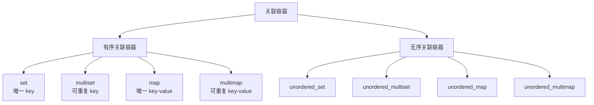

# C++ 关联容器：`set` 与 `map`

> 面试复习目标：掌握有序关联容器的接口、复杂度和比较规则，理解 `map::operator[]` 的副作用，并能根据唯一性、顺序性和性能需求选择合适容器。

## 1. 知识地图



本章源码重点是：

- `std::set`：存储唯一的键；
- `std::map`：存储唯一键到值的映射；
- `std::pair`：表示一对数据；
- 词频统计：`map<string, int>` 的典型应用。

---

## 2. 关联容器的核心特点

序列容器通过位置组织数据，关联容器通过键组织数据：

| 容器 | 数据组织方式 | 典型访问方式 |
|---|---|---|
| `vector` | 连续位置 | 下标、迭代器 |
| `list` | 链式位置 | 迭代器 |
| `set` | 键 | 按键查找 |
| `map` | 键值对 | 由键查值 |

`set`、`map`、`multiset`、`multimap` 是**有序关联容器**。标准要求它们维持由比较器定义的顺序，并为主要操作提供对数复杂度；具体底层结构没有被标准强制规定，常见实现是红黑树。

> [!NOTE]
> 面试中应说“`map/set` 通常由红黑树实现”，不要说“标准规定底层必须是红黑树”。

主要特征：

- 元素按照比较器定义的顺序排列，而非插入顺序；
- 通过键进行查找；
- `set/map` 的键唯一；
- `multiset/multimap` 允许等价键；
- 查找、插入、删除通常是 `O(log n)`。

---

## 3. 四种有序关联容器

| 容器 | 存储内容 | 键是否唯一 | 能否通过键修改值 |
|---|---|---:|---:|
| `set<Key>` | `Key` | 是 | 不适用 |
| `multiset<Key>` | `Key` | 否 | 不适用 |
| `map<Key, T>` | `pair<const Key, T>` | 是 | 可以修改 `T` |
| `multimap<Key, T>` | `pair<const Key, T>` | 否 | 可以修改 `T` |

```cpp
std::set<int> ids{3, 1, 2, 2}; // 结果：1, 2, 3

std::map<std::string, int> ages{
    {"Alice", 20},
    {"Bob", 22}
};
```

### 3.1 “唯一”的准确含义

关联容器不是使用 `operator==` 判断键是否重复，而是使用比较器判断两个键是否**等价**。

若比较器为 `comp`，则：

```cpp
!comp(a, b) && !comp(b, a)
```

成立时，容器认为 `a` 与 `b` 等价。

因此比较器既决定：

1. 元素的排列顺序；
2. 哪些键被视为重复键。

---

## 4. `std::pair` 与 `map` 元素类型

```cpp
std::pair<std::string, int> item{"age", 20};

std::cout << item.first;  // "age"
std::cout << item.second; // 20
```

可用 `std::make_pair` 创建，也可以直接使用列表初始化：

```cpp
auto p1 = std::make_pair("age", 20);
std::pair<std::string, int> p2{"age", 20};
```

对于：

```cpp
std::map<int, std::string> data;
```

其 `value_type` 是：

```cpp
std::pair<const int, std::string>
```

键带有 `const`，值可以修改：

```cpp
auto it = data.begin();
// it->first = 10;       // 错误：不能原地修改 key
it->second = "updated";  // 正确：可以修改 value
```

如果允许原地修改键，树中的顺序不变量可能立即被破坏。需要改键时应删除后重新插入，或使用 C++17 节点句柄。

### 4.1 结构化绑定

```cpp
for (const auto& [key, value] : data) {
    std::cout << key << " = " << value << '\n';
}
```

注意保留引用，否则会复制每个键值对：

```cpp
for (auto [key, value] : data) { // 每轮复制
}
```

---

## 5. `std::set`

### 5.1 构造与遍历

```cpp
std::set<int> a;
std::set<int> b{3, 1, 2, 2};
std::set<int> c(b.begin(), b.end());
std::set<int> d = b;

for (const int value : b) {
    std::cout << value << ' '; // 1 2 3
}
```

`set` 没有位置下标：

```cpp
// b[0]; // 编译错误
```

原因不是单纯“内存不连续”，更关键的是它按键组织，接口没有“第几个元素”的随机访问语义。其迭代器通常是双向迭代器，不能写 `begin() + n`。

### 5.2 为什么元素不能修改

即使迭代器变量不是 `const_iterator`，解引用后也不能修改键：

```cpp
auto it = b.begin();
// *it = 100; // 错误
```

修改元素可能破坏排序结构。若要修改，应先删除旧键，再插入新键。

### 5.3 插入

```cpp
std::set<int> values;

auto [it, inserted] = values.insert(42);
if (inserted) {
    std::cout << "new value: " << *it;
} else {
    std::cout << "already exists: " << *it;
}
```

对唯一键容器，单元素 `insert` 返回：

```cpp
std::pair<iterator, bool>
```

- `first`：指向新插入元素或已有等价元素；
- `second`：是否真正插入。

其他形式：

```cpp
values.insert({1, 2, 3});
values.insert(other.begin(), other.end());
values.emplace(100);
values.emplace_hint(values.end(), 200);
```

正确的插入提示可能降低插入成本，但错误提示不会改变结果，只可能失去优化。

### 5.4 查找

```cpp
auto it = values.find(42);
if (it != values.end()) {
    std::cout << *it;
}
```

对于唯一键容器：

```cpp
values.count(42); // 只可能是 0 或 1
```

C++20 可使用：

```cpp
values.contains(42); // 返回 bool
```

若找到后还要访问元素，使用 `find`，避免先 `count/contains` 再重复查找。

---

## 6. `std::map`

### 6.1 构造与遍历

```cpp
std::map<int, std::string> users{
    {2, "Bob"},
    {1, "Alice"},
    {3, "Carol"}
};

for (const auto& [id, name] : users) {
    std::cout << id << ": " << name << '\n';
}
```

遍历顺序由键决定，默认使用 `std::less<Key>`，通常表现为升序。

### 6.2 查找：`find`、`at`、`operator[]`

这三个接口语义不同：

| 接口 | 键不存在时 | 是否修改容器 | 是否要求 `mapped_type` 可默认构造 |
|---|---|---:|---:|
| `find(key)` | 返回 `end()` | 否 | 否 |
| `at(key)` | 抛 `std::out_of_range` | 否 | 否 |
| `operator[](key)` | 插入默认值 | 是 | 是 |

只读查询优先使用 `find`：

```cpp
auto it = users.find(2);
if (it != users.end()) {
    std::cout << it->second;
}
```

确定键必须存在时可以使用 `at`：

```cpp
try {
    std::cout << users.at(2);
} catch (const std::out_of_range&) {
}
```

### 6.3 `operator[]` 的副作用

```cpp
std::map<std::string, int> scores;
int value = scores["missing"];
```

即使只是读取，`"missing"` 不存在时也会插入：

```cpp
{"missing", 0}
```

等价地说，`operator[]` 返回对应 `mapped_type` 的引用；键不存在时，需要先值初始化一个 `mapped_type`。

适合使用 `operator[]` 的场景：

```cpp
++word_count[word];               // 计数
groups[province].push_back(name); // 分组
scores[name] = 100;               // 插入或覆盖
```

不适合的场景：

```cpp
if (users["unknown"] == "Alice") { // 查询却意外插入
}
```

> [!IMPORTANT]
> 面试高频点：`map::operator[]` 不是纯查询接口，键不存在时会修改容器。

`const map` 没有 `operator[]`，因为该操作可能插入；可使用 `at` 或 `find`。

---

## 7. 插入与更新接口

不同接口在“键已存在”时的行为不同：

| 接口 | 键不存在 | 键已存在 | 值是否可能被覆盖 |
|---|---|---|---:|
| `insert` | 插入 | 失败 | 否 |
| `emplace` | 原位构造并尝试插入 | 失败 | 否 |
| `try_emplace`（C++17） | 用参数构造值并插入 | 不构造新值 | 否 |
| `insert_or_assign`（C++17） | 插入 | 赋新值 | 是 |
| `operator[]` | 插入默认值后访问 | 访问原值 | 由后续代码决定 |

### 7.1 `insert`

```cpp
auto [it, inserted] = users.insert({4, "Dave"});
```

键已存在时不会覆盖：

```cpp
std::map<int, std::string> m{{1, "old"}};
m.insert({1, "new"}); // value 仍是 "old"
```

### 7.2 `emplace`

```cpp
m.emplace(2, "two");
```

`emplace` 可以避免先创建完整 `value_type`，但在部分实现和调用形式中，即使键已存在，传入参数对应的对象仍可能被构造。

### 7.3 `try_emplace`

```cpp
std::map<std::string, Expensive> cache;
cache.try_emplace("key", constructor_arg1, constructor_arg2);
```

键已存在时不会构造 `Expensive`，适合 mapped value 构造昂贵或不可复制的情况：

```cpp
std::map<std::string, std::unique_ptr<Widget>> owners;
owners.try_emplace("main", std::make_unique<Widget>());
```

### 7.4 `insert_or_assign`

```cpp
auto [it, inserted] = m.insert_or_assign(1, "new");
```

- 键不存在：插入；
- 键已存在：覆盖 `second`；
- 返回值可以区分插入还是赋值。

若意图是明确的“新增或覆盖”，它通常比 `m[key] = value` 更适合不可默认构造的值类型。

---

## 8. 范围查找

有序关联容器最有价值的能力之一是高效边界查询：

```cpp
auto first = values.lower_bound(key); // 第一个不小于 key 的元素
auto last  = values.upper_bound(key); // 第一个大于 key 的元素
auto range = values.equal_range(key); // {lower_bound, upper_bound}
```


对 `set/map`，等价区间长度最多为 1；对 `multiset/multimap`，它可能包含多个元素。

遍历 `multimap` 中同一个键对应的所有值：

```cpp
auto [first, last] = data.equal_range(key);
for (auto it = first; it != last; ++it) {
    std::cout << it->second << '\n';
}
```

查询闭区间 `[low, high]`：

```cpp
for (auto it = values.lower_bound(low);
     it != values.upper_bound(high);
     ++it) {
    std::cout << *it;
}
```

---

## 9. 删除与迭代器失效

### 9.1 删除方式

```cpp
container.erase(iterator);           // 按位置删除
container.erase(first, last);        // 删除半开区间
auto removed = container.erase(key); // 按键删除，返回删除数量
container.clear();                   // 删除全部元素
```

C++11 之后，按迭代器删除会返回被删除元素的下一个迭代器：

```cpp
for (auto it = values.begin(); it != values.end();) {
    if (should_remove(*it)) {
        it = values.erase(it);
    } else {
        ++it;
    }
}
```

### 9.2 失效规则

对于有序关联容器：

- 插入通常不会使已有迭代器和引用失效；
- 删除只使指向被删元素的迭代器和引用失效；
- `end()` 不能解引用；
- 删除后不能再使用已失效迭代器。

这与 `vector` 扩容可能使所有迭代器失效不同。

---

## 10. 自定义比较器

### 10.1 函数对象比较器

```cpp
struct Student {
    int id;
    std::string name;
    int age;
};

struct ById {
    bool operator()(const Student& lhs,
                    const Student& rhs) const noexcept {
        return lhs.id < rhs.id;
    }
};

std::set<Student, ById> students;
```

也可以定义 `operator<`，但独立比较器更容易为同一类型提供不同排序方式。

### 10.2 严格弱序

比较器必须满足严格弱序（strict weak ordering），重点性质包括：

- 非自反：`comp(a, a)` 必须为 `false`；
- 非对称：若 `comp(a, b)` 为真，`comp(b, a)` 必须为假；
- 传递：若 `a < b` 且 `b < c`，则必须有 `a < c`；
- 等价关系也必须保持传递。

错误示例：

```cpp
return lhs.id <= rhs.id; // 错误：a <= a 为 true，违反非自反性
```

组合多个字段时：

```cpp
return std::tie(lhs.age, lhs.id)
     < std::tie(rhs.age, rhs.id);
```

本章 `Student` 示例只比较 `id`，因此两个 `id` 相同而姓名、年龄不同的对象会被 `set` 视为等价，只保留一个。

> [!WARNING]
> 已放入容器的键，其参与比较的字段不能在容器外被间接修改，否则会破坏内部顺序，程序行为不可依赖。

---

## 11. 自定义类型的现代比较写法

C++20 可以定义三路比较：

```cpp
struct Student {
    int id;
    std::string name;

    auto operator<=>(const Student&) const = default;
};
```

默认比较会按成员声明顺序逐字段比较。如果业务上的唯一键只有 `id`，则不应直接默认比较全部字段，而应显式编写比较器，确保“排序规则”和“业务唯一性”一致。

---

## 12. 透明比较与异构查找

假设容器键是 `std::string`，查询参数是 `std::string_view`。使用透明比较器可避免为查找临时构造 `std::string`：

```cpp
std::map<std::string, int, std::less<>> scores;

std::string_view key = "Alice";
auto it = scores.find(key);
```

`std::less<>` 的 `is_transparent` 支持兼容类型间比较。该技术称为异构查找，适用于查找频繁且键构造成本明显的场景。

> [!NOTE]
> 哪些重载可用与语言标准版本有关。项目使用 C++17 时，常用的异构 `find`、`lower_bound` 等已经可用；异构擦除和更多接口在更新标准中继续扩展。

---

## 13. C++17 节点句柄

节点句柄允许在不复制/移动元素值的情况下，从一个关联容器提取节点再插入另一个兼容容器：

```cpp
std::map<int, std::string> source{{1, "one"}};
std::map<int, std::string> target;

auto node = source.extract(1);
if (node) {
    node.key() = 2;       // 节点脱离容器后可以修改 key
    target.insert(std::move(node));
}
```

典型用途：

- 安全修改键；
- 在兼容容器间转移节点；
- 避免重新分配节点和复制昂贵对象。

`merge` 可以批量转移能被目标容器接收的节点：

```cpp
target.merge(source);
```

唯一键冲突的节点会留在源容器中。

---

## 14. 有序容器与无序容器如何选择

| 特性 | `map/set` | `unordered_map/unordered_set` |
|---|---|---|
| 典型结构 | 平衡搜索树 | 哈希表 |
| 元素顺序 | 按比较器有序 | 无稳定顺序 |
| 查找/插入/删除 | `O(log n)` | 平均 `O(1)`，最坏 `O(n)` |
| 范围查询 | 支持 | 不支持 |
| 自定义要求 | 比较器 | 哈希函数与相等判断 |
| 迭代器稳定性 | 插入通常不失效 | rehash 可能使迭代器失效 |
| 内存特征 | 每节点含树链接 | 桶数组加节点 |

选择建议：

- 需要排序遍历、最值、前驱后继或区间查询：`map/set`；
- 只需精确查找，性能测试显示哈希更合适：`unordered_*`；
- 数据量很小：不要只看大 O，缓存局部性和常数项可能更重要；
- 需要最坏情况 `O(log n)` 的稳定保证：有序关联容器；
- 键允许重复：使用 `multi*`，或考虑 `map<Key, vector<Value>>` 是否更符合业务。

> [!IMPORTANT]
> `unordered_map` 并不保证一定比 `map` 快，应结合数据规模、哈希质量、内存、遍历方式和范围查询需求选择。

---

## 15. 常用操作复杂度

令容器元素数量为 `n`：

| 操作 | `set/map` 复杂度 |
|---|---:|
| `find` / `count` / `contains` | `O(log n)` |
| `lower_bound` / `upper_bound` | `O(log n)` |
| 单元素 `insert` / `emplace` | `O(log n)` |
| 单元素按键 `erase` | `O(log n + count(key))` |
| 按迭代器 `erase` | 均摊常数时间 |
| 全量有序遍历 | `O(n)` |
| `size` / `empty` | 通常/标准保证常数时间 |

从已排序区间构造或插入、以及正确使用 hint 时，复杂度可能更优。

---

## 16. 词频统计案例

本章 `practice/02_word_count.cc` 使用：

```cpp
++word_count[word];
```

逻辑是：

1. 单词已存在：取得原计数并递增；
2. 单词不存在：先插入 `{word, 0}`，再递增为 1。

一个简洁版本：

```cpp
std::map<std::string, std::size_t> word_count;
std::string word;

while (input >> word) {
    normalize(word);
    if (!word.empty()) {
        ++word_count[word];
    }
}
```

源码逐字符解析并正确地在调用 `std::isalpha`、`std::tolower` 前转为 `unsigned char`：

```cpp
const auto uch = static_cast<unsigned char>(ch);
if (std::isalpha(uch)) {
    word += static_cast<char>(std::tolower(uch));
}
```

这是必要的，因为当 `char` 为有符号类型且值为负时，直接传给这些字符分类函数可能产生未定义行为。

可进一步改进：

- `read()` 前清空 `_dict`，或明确多次调用是累加语义；
- 用返回值或异常向调用方报告打开失败，避免仍输出“已生成”；
- `store()` 使用 `'\n'`，避免 `std::endl` 每行强制刷新；
- 输入路径可能含空格时使用 `std::getline`；
- 不需要显式 `close()`，文件流析构会自动关闭；
- 词频类型优先使用 `std::size_t`；
- 需要按频次排序时，`map` 当前只按单词排序，应转换数据后按 value 排序。

### 16.1 为什么不能按 value 自动排序

`map<Key, Value>` 的内部顺序只由 `Key` 决定。若要输出词频最高的单词，可复制到序列容器：

```cpp
std::vector<std::pair<std::string, std::size_t>> result(
    word_count.begin(), word_count.end());

std::sort(result.begin(), result.end(),
          [](const auto& lhs, const auto& rhs) {
              if (lhs.second != rhs.second) {
                  return lhs.second > rhs.second;
              }
              return lhs.first < rhs.first;
          });
```

---

## 17. 容器组合

关联容器的 value 可以是任意满足要求的类型：

```cpp
std::map<std::string, std::vector<std::string>> province_to_names;
province_to_names["河南"].push_back("张三");

std::map<std::string, std::set<int>> word_to_lines;
word_to_lines["hello"].insert(10);
```

常见建模：

| 需求 | 容器 |
|---|---|
| 去重并排序 | `set<T>` |
| ID 查对象 | `map<Id, Object>` |
| 分类存储 | `map<Category, vector<Item>>` |
| 一个键对应多个唯一值 | `map<Key, set<Value>>` |
| 一个键对应多个可重复值 | `multimap<Key, Value>` 或 `map<Key, vector<Value>>` |
| 统计次数 | `map<Key, size_t>` |

`multimap<Key, Value>` 与 `map<Key, vector<Value>>` 的差异：

- `multimap`：每个键值对都是独立节点，方便逐项插入/删除；
- `map<Key, vector<Value>>`：分组结构更直观，同一键的值连续存于 `vector`，但组内删除可能较贵。

---

## 18. 常见陷阱

### 18.1 在查询时误用 `operator[]`

```cpp
if (m[key] == expected) { } // key 不存在时会插入
```

改用：

```cpp
auto it = m.find(key);
if (it != m.end() && it->second == expected) {
}
```

### 18.2 忽略 `insert` 返回值

```cpp
m.insert({key, value}); // 键已存在时不会覆盖
```

如果业务需要覆盖，应使用 `insert_or_assign` 或明确赋值。

### 18.3 比较器使用 `<=`

严格弱序必须使用类似 `<` 的关系，不能使用 `<=`。

### 18.4 比较字段不完整

若只按年龄比较，年龄相同的两个学生会被 `set` 视为等价。应确认这是否符合唯一性需求，必要时加入 ID 作为第二排序字段。

### 18.5 遍历时复制元素

```cpp
for (auto item : m) { }        // 复制 pair
for (const auto& item : m) { } // 只读遍历
for (auto& item : m) { }       // 可修改 mapped value
```

### 18.6 假定遍历顺序等于插入顺序

`map/set` 按比较器顺序遍历。若必须保留插入顺序，需要额外序列容器或专门的数据结构。

### 18.7 缓存 `end()` 后错误使用

`end()` 是尾后位置，永远不能解引用。删除当前元素时使用 `erase` 返回的迭代器最安全。

---

## 19. 高频面试问题

### 19.1 `map` 和 `set` 的底层是什么？

标准未规定具体结构。常见标准库实现使用红黑树，以维持有序性并让查找、插入和删除具有 `O(log n)` 复杂度。

### 19.2 `map` 中的 key 为什么是 `const`？

键决定节点在有序结构中的位置。原地修改键会破坏排序不变量，因此 `value_type` 是 `pair<const Key, T>`。

### 19.3 `map::operator[]` 和 `at()` 有何区别？

`operator[]` 在键不存在时插入一个值初始化的 mapped value；`at()` 不插入，而是抛出 `out_of_range`。纯查询通常使用 `find`。

### 19.4 `insert` 与 `emplace` 有何区别？

`insert` 接收已构造的元素；`emplace` 用参数尝试原位构造。但 `emplace` 不保证键冲突时所有中间构造都被避免，C++17 的 `try_emplace` 更适合昂贵的 mapped value。

### 19.5 如何判断两个 key 重复？

不是使用 `==`，而是比较器等价：`!comp(a,b) && !comp(b,a)`。

### 19.6 为什么比较器必须满足严格弱序？

树结构依赖一致的顺序定位节点。违反非自反、非对称或传递性会破坏容器不变量，使查找、插入结果不可依赖。

### 19.7 `map` 与 `unordered_map` 如何选择？

需要有序遍历、范围查询和稳定的最坏 `O(log n)` 时选择 `map`；只需精确查找且良好哈希下平均常数性能更重要时考虑 `unordered_map`。

### 19.8 插入或删除会让迭代器失效吗？

有序关联容器插入不会使已有迭代器失效；删除只使指向被删元素的迭代器、指针和引用失效。

### 19.9 如何修改 `map` 的 key？

传统方式是删除旧元素后插入新元素；C++17 可用 `extract` 得到节点句柄，在节点脱离容器后修改 `key()` 再插入。

### 19.10 `multimap` 为什么没有 `operator[]`？

同一个键可能对应多个值，`operator[]` 无法唯一确定应返回哪一个 mapped value。

---

## 20. 易错结论速查

| 易错说法 | 正确理解 |
|---|---|
| `map/set` 标准规定使用红黑树 | 红黑树只是常见实现 |
| `set` 通过 `==` 去重 | 通过比较器定义的等价关系去重 |
| `map[key]` 只是查询 | 键不存在时会插入默认值 |
| `insert` 会覆盖同键 value | 唯一键容器中插入失败，不覆盖 |
| `emplace` 永远不会构造多余对象 | 键冲突时未必避免所有构造，关注 `try_emplace` |
| 可以修改 `set` 元素或 `map` 的 key | 会破坏排序，因此接口禁止 |
| `unordered_map` 一定比 `map` 快 | 取决于数据、哈希、内存和访问模式 |
| 比较器可以写 `<=` | 必须满足严格弱序，通常使用 `<` |
| `count` 对所有关联容器只返回 0/1 | 对 `multi*` 可能大于 1 |
| `end()` 指向最后一个元素 | 它指向尾后位置，不能解引用 |
| 删除一个节点会使全部迭代器失效 | 仅被删除节点的迭代器失效 |

---

## 21. 源码阅读索引

| 文件 | 主题 |
|---|---|
| `01_set.cc` | `set` 构造、查找、插入、删除与自定义类型 |
| `02_map.cc` | `map` 构造、遍历、查找、插入和下标访问 |
| `03_map.cc` | `map` 统计、分类及容器组合 |
| `practice/01_map_basic.cc` | `map` 基础练习 |
| `practice/02_word_count.cc` | 文件词频统计综合练习 |
| `note/*.cc` | 对应主题的详细源码注释 |

---

## 22. 复习清单

- [ ] 能说出四种有序关联容器及键是否唯一
- [ ] 能解释标准为何不保证底层一定是红黑树
- [ ] 能说明 `map` 的 `value_type` 是 `pair<const Key, T>`
- [ ] 能解释比较器等价与严格弱序
- [ ] 能正确选择 `find`、`at` 和 `operator[]`
- [ ] 能区分 `insert`、`emplace`、`try_emplace`、`insert_or_assign`
- [ ] 能使用 `lower_bound`、`upper_bound` 和 `equal_range`
- [ ] 能说明关联容器的复杂度与迭代器失效规则
- [ ] 能在自定义比较器中组合多个排序字段
- [ ] 能比较 `map` 与 `unordered_map`
- [ ] 能选择 `multimap` 或 `map<Key, vector<Value>>`
- [ ] 能用 `map<string, size_t>` 完成词频统计
