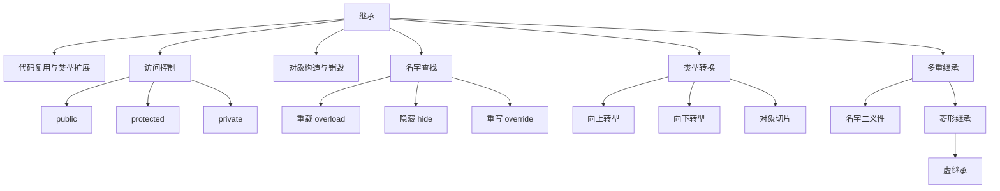
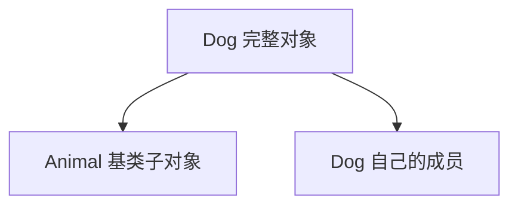
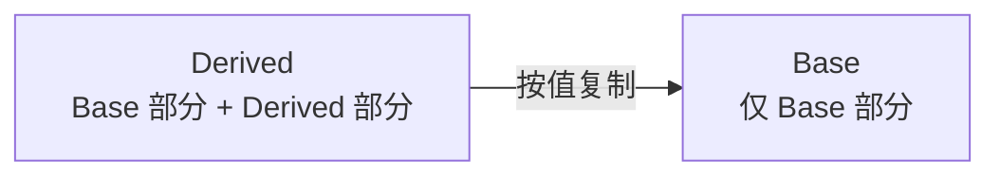
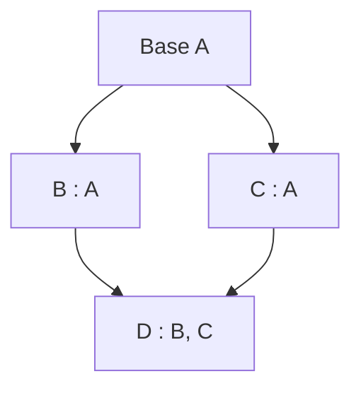
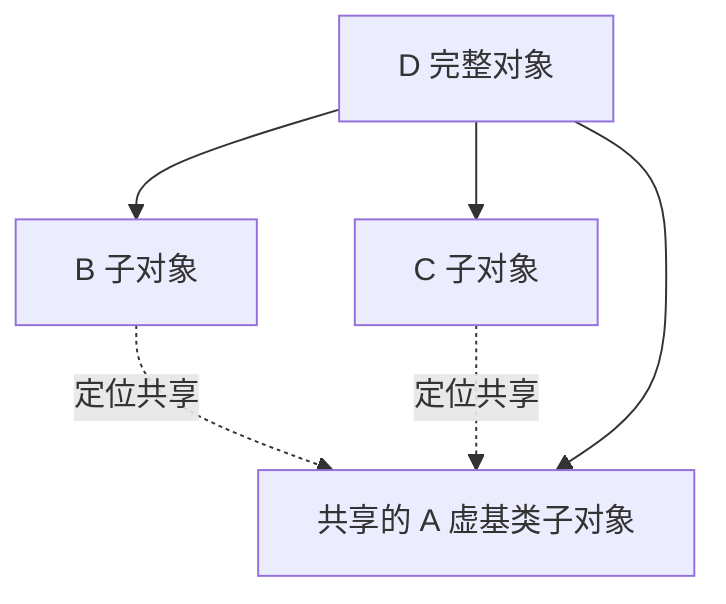

# C++ 继承

> 面试复习目标：理解继承表达的类型关系、访问控制、派生对象的构造与复制、名字查找、多重继承、对象切片及安全类型转换，并能判断什么时候应该使用组合。

## 1. 知识地图



继承最重要的两层含义：

1. **实现层面**：派生类对象包含基类子对象，可以复用或扩展实现；
2. **类型层面**：公有继承建立 “Derived is-a Base” 关系，使派生类可替代基类。

> [!IMPORTANT]
> 继承不仅是减少重复代码的工具，更重要的是表达类型之间的可替代关系。只为了复用几行实现时，组合往往更合适。

---

## 2. 基本语法与术语

```cpp
class Animal {
public:
    void eat();
};

class Dog : public Animal {
public:
    void bark();
};
```

- `Animal`：基类、父类；
- `Dog`：派生类、子类；
- `public`：继承方式；
- `Dog` 对象中含有一个 `Animal` 基类子对象，以及 `Dog` 自己的成员。



常用术语：

| 中文 | 英文 |
|---|---|
| 基类 | base class |
| 派生类 | derived class |
| 单继承 | single inheritance |
| 多重继承 | multiple inheritance |
| 虚继承 | virtual inheritance |
| 最终派生类 | most-derived class |

### 2.1 默认继承方式

```cpp
class D1 : Base {};  // 默认 private 继承
struct D2 : Base {}; // 默认 public 继承
```

面试中不要把“类成员默认访问权限”和“默认继承方式”混在一起：

| 声明形式 | 成员默认权限 | 继承默认方式 |
|---|---|---|
| `class` | `private` | `private` |
| `struct` | `public` | `public` |

多重继承中，每个基类都应分别写清继承方式：

```cpp
class Derived
    : public Base1
    , public Base2 {
};
```

若写成 `: public Base1, Base2`，在 `class` 中 `Base2` 是私有继承。

---

## 3. 继承表达 is-a，组合表达 has-a

### 3.1 公有继承

```cpp
class Dog : public Animal {};
```

它承诺：

- 每个 `Dog` 都可以作为 `Animal` 使用；
- 所有针对 `Animal` 成立的语义约束，对 `Dog` 也应成立；
- 调用者可通过基类指针或引用操作派生对象。

这就是里氏替换原则（Liskov Substitution Principle）的核心。

### 3.2 组合

```cpp
class Car {
private:
    Engine engine_; // Car has an Engine
};
```

如果关系是“拥有”“使用”或“由……实现”，通常优先组合：

- 组合耦合较低；
- 成员的接口不会自动暴露；
- 更容易替换实现；
- 避免继承层级和脆弱基类问题。

本章 `practice/01_inherit_Triangle.cc` 让 `Triangle` 同时继承 `Line` 和 `Color`。从建模角度看，“三角形有底边、有颜色”通常比“三角形是一条线、是一种颜色”更自然：

```cpp
class Triangle {
private:
    Line base_;
    Color color_;
    float height_{};
};
```

> [!TIP]
> 面试判断法：能否自然说出 “Derived is a Base”，并保证 Derived 在所有 Base 语境中都合法？若不能，优先组合。

---

## 4. 三种成员访问权限

| 成员权限 | 本类内部 | 派生类内部 | 类外 |
|---|---:|---:|---:|
| `public` | ✅ | ✅ | ✅ |
| `protected` | ✅ | ✅ | ❌ |
| `private` | ✅ | ❌（不能直接访问） | ❌ |

```cpp
class Base {
public:
    int public_data;

protected:
    int protected_data;

private:
    int private_data;
};

class Derived : public Base {
    void test() {
        public_data = 1;     // 正确
        protected_data = 2;  // 正确
        // private_data = 3; // 错误
    }
};
```

### 4.1 private 成员是否“存在”

派生对象中的基类子对象仍然包含基类的私有数据，但派生类不能通过名字直接访问。它只能通过基类提供的 `public` 或 `protected` 接口间接操作。

因此更准确的表述是：

> 基类的 `private` 成员存在于派生对象的基类子对象中，但对派生类不可直接访问。

不要简单记成“private 成员没有被继承”，这容易混淆对象布局与名字访问权限。

### 4.2 `protected` 的特殊访问规则

派生类不能通过任意基类对象访问基类的 `protected` 成员：

```cpp
class Base {
protected:
    int value{};
};

class Derived : public Base {
public:
    void valid(Derived& other) {
        other.value = 1; // 正确
    }

    void invalid(Base& other) {
        // other.value = 1; // 错误
    }
};
```

在 `Derived` 的成员函数中，受保护成员必须通过 `Derived` 或其派生类型的对象访问，不能借此绕过 `Base` 对其他 `Base` 对象的封装。

### 4.3 友元与继承

- 友元关系不会被继承；
- 基类的友元不会自动成为派生类的友元；
- 派生类的友元也不能直接访问基类的私有成员；
- 友元关系不具有传递性。

---

## 5. 三种继承方式

继承方式决定基类的 `public/protected` 成员进入派生类后呈现的访问级别：

| 基类成员权限 | `public` 继承后 | `protected` 继承后 | `private` 继承后 |
|---|---|---|---|
| `public` | `public` | `protected` | `private` |
| `protected` | `protected` | `protected` | `private` |
| `private` | 派生类不可直接访问 | 派生类不可直接访问 | 派生类不可直接访问 |

可以把它理解为：继承方式是基类可继承接口在派生类中的“权限上限”。

### 5.1 `public` 继承

```cpp
class Dog : public Animal {};
```

- 对外保留基类公共接口；
- 建立公开的 is-a 关系；
- 存在可访问且无歧义的隐式向上转型；
- 面向接口的继承最常见。

### 5.2 `protected` 继承

```cpp
class Adapter : protected Base {};
```

- 基类公共接口对派生类及后代可用；
- 对普通外部调用者不公开；
- 不建立面向外部的公开 is-a 关系；
- 实际工程中较少使用。

### 5.3 `private` 继承

```cpp
class Implementation : private Base {};
```

- 基类 `public/protected` 成员在派生类中都成为 `private`；
- 后续派生类无法直接访问它们；
- 对外不能隐式转换为基类；
- 表达 “implemented-in-terms-of”，而非公开 is-a。

大多数私有继承可以改为组合。私有继承的少数用途包括需要重写受保护虚函数、访问受保护成员，或利用空基类优化等。

> [!NOTE]
> 继承方式不仅影响成员访问，也影响基类转换是否可从相应上下文访问。公有继承的向上转型对外公开；私有、保护继承的转换受访问控制约束。

---

## 6. 构造与析构顺序

创建完整派生对象时，不是直接跳进派生类构造函数体，而是按固定顺序初始化各部分。

### 6.1 完整构造顺序


对于没有虚继承的单继承：

1. 构造基类子对象；
2. 按成员声明顺序构造成员；
3. 执行派生类构造函数体。

析构顺序严格相反：

1. 执行派生类析构函数体；
2. 按声明逆序析构成员；
3. 按继承列表逆序析构直接基类；
4. 最后析构虚基类。

### 6.2 必须用初始化列表选择基类构造函数

```cpp
class Base {
public:
    explicit Base(int value);
};

class Derived : public Base {
public:
    Derived(int base_value, int own_value)
        : Base(base_value)
        , own_value_(own_value) {
    }

private:
    int own_value_;
};
```

如果没有显式写 `Base(...)`，编译器尝试默认构造基类。若基类没有可访问的默认构造函数，代码无法通过编译。

派生类构造函数不能先默认构造基类，再在函数体中“重新调用构造函数”；构造只能发生一次。

### 6.3 初始化顺序由声明决定

```cpp
class Derived : public Base2, public Base1 {
public:
    Derived()
        : Base1()
        , Base2()
        , second_(first_)
        , first_(42) {
    }

private:
    int first_;
    int second_;
};
```

实际顺序是：

1. `Base2`；
2. `Base1`；
3. `first_`；
4. `second_`。

与初始化列表书写顺序无关。上例中 `second_(first_)` 实际发生在 `first_` 初始化之后，因为 `first_` 声明在前；但这种反序书写极易误导，应让初始化列表顺序与声明顺序保持一致。

> [!IMPORTANT]
> 基类顺序看继承列表，成员顺序看类内声明；初始化列表只能选择初始化方式，不能改变顺序。

### 6.4 对象大小

派生对象通常包含基类子对象和自己的非静态数据成员，但：

- 对齐和填充会影响大小；
- 空基类可能应用 Empty Base Optimization；
- 虚函数或虚继承可能引入实现相关信息；
- 标准不规定必须存在名为 `vptr`、`vbptr` 的字段；
- 不应把源码示例中的 `8B`、`24B` 当作跨平台保证。

---

## 7. 构造函数能继承吗

基类构造函数不会像普通成员函数一样自动成为派生类构造函数。C++11 可显式引入：

```cpp
class Derived : public Base {
public:
    using Base::Base;
};
```

这称为继承构造函数。需要注意：

- 它让编译器为派生类生成对应构造方式；
- 派生类自己的成员仍按默认成员初始化器或默认初始化处理；
- 构造顺序仍遵循正常规则；
- 复制/移动构造规则不能简单理解为“也从基类继承过来”；
- 派生类仍可定义自己的构造函数。

---

## 8. 重载、隐藏与重写

这是继承章节最常见的概念辨析。

| 概念 | 发生范围 | 核心条件 | 是否需要 `virtual` |
|---|---|---|---:|
| 重载 overload | 同一作用域 | 同名、参数列表不同 | 否 |
| 隐藏 hide | 基类与派生类不同作用域 | 派生类声明同名成员 | 否 |
| 重写 override | 继承层次 | 匹配基类虚函数 | 是 |

### 8.1 重载

```cpp
class Printer {
public:
    void print(int);
    void print(std::string_view);
};
```

返回类型不同不能单独构成重载。

### 8.2 名字隐藏

```cpp
class Base {
public:
    void func();
    void func(int);
};

class Derived : public Base {
public:
    void func(double);
};

Derived object;
object.func(3.14);  // Derived::func(double)
// object.func();   // 错误：Base 中整组 func 被隐藏
```

派生类只要声明了同名成员，就会在普通名字查找中隐藏基类的整个同名集合，不要求参数列表相同。

可通过作用域限定访问：

```cpp
object.Base::func();
```

或把基类重载引入派生类作用域：

```cpp
class Derived : public Base {
public:
    using Base::func;
    void func(double);
};
```

### 8.3 重写

```cpp
class Base {
public:
    virtual void run() const;
    virtual ~Base() = default;
};

class Derived final : public Base {
public:
    void run() const override;
};
```

重写时通常需要匹配：

- 函数名；
- 参数类型与顺序；
- `const` 限定；
- 引用限定 `&/&&`；
- 异常说明不能比基类更宽松；
- 返回类型相同，或满足协变返回类型规则。

`override` 不是必须的，但强烈建议使用。签名不匹配时编译器会报错，避免意外变成隐藏。

```cpp
class Wrong : public Base {
public:
    // void run() override; // 错误：少了 const
};
```

`final` 可禁止继续重写虚函数或继续派生类：

```cpp
void run() const final;
class Leaf final : public Base {};
```

> [!NOTE]
> 本章 `06_oversee.cc` 和 `practice/02_inherit_Animal.cc` 展示的是名字隐藏，不是运行时多态：基类函数没有声明为 `virtual`。

---

## 9. 静态类型、动态类型与虚调用

```cpp
Derived derived;
Base& ref = derived;
```

- `ref` 的静态类型：`Base&`，编译期确定；
- `ref` 所引用对象的动态类型：`Derived`，运行期对象真实类型。

非虚函数根据静态类型绑定：

```cpp
ref.non_virtual(); // Base::non_virtual
```

虚函数通过基类指针或引用调用时，根据动态类型分派：

```cpp
ref.virtual_func(); // Derived::virtual_func
```

通过对象值而不是引用/指针传递会发生切片，无法保持派生动态类型。

更完整的动态多态、纯虚函数和虚表知识属于下一章 `13_polymorphism`，本章重点是继承关系为多态提供的类型基础。

---

## 10. 虚析构函数

如果类可能通过基类指针删除派生对象，基类析构函数必须是虚函数：

```cpp
class Base {
public:
    virtual ~Base() = default;
};

class Derived : public Base {
public:
    ~Derived() override = default;
};

Base* ptr = new Derived;
delete ptr; // 正确：先 Derived，再 Base
```

如果 `Base::~Base()` 非虚，通过 `Base*` 删除 `Derived` 对象会产生未定义行为。

设计建议：

- 多态基类：公开虚析构函数；
- 不允许通过基类删除：可使用受保护且非虚的析构函数；
- 没有多态用途的类无需仅因“可能被继承”就机械添加虚函数。

> [!IMPORTANT]
> “类中已有其他虚函数”并不会自动让析构函数变成虚函数；必须显式声明 `virtual ~Base()`，但它在派生类中会继续保持虚属性。

---

## 11. 向上转型

公有、无歧义继承下，派生类指针或引用可隐式转换为基类：

```cpp
Dog dog;

Animal& ref = dog;
Animal* ptr = &dog;
```

这叫向上转型（upcast）：

- 通常隐式完成；
- 类型安全；
- 指针值在多重继承中可能被调整，以指向正确的基类子对象；
- 通过基类接口只能直接访问基类可见成员；
- 虚函数仍可根据动态类型分派。


传参时优先使用引用或指针：

```cpp
void handle(const Animal& animal);
```

这样既避免复制，又保留对象的动态类型。

---

## 12. 对象切片

使用基类**值对象**接收派生对象时，只复制基类子对象：

```cpp
Derived derived;
Base base = derived; // Derived 特有部分被切掉
```



后果：

- 派生类新增数据丢失；
- 新对象的动态类型就是 `Base`；
- 即使调用虚函数，也只会表现为 `Base` 对象；
- `vector<Base>` 存放派生对象同样会切片。

需要保存多态对象时使用智能指针：

```cpp
std::vector<std::unique_ptr<Base>> objects;
objects.push_back(std::make_unique<Derived>());
```

或者根据业务提供 `virtual std::unique_ptr<Base> clone() const` 实现多态复制。

> [!WARNING]
> “派生类可以转成基类”不代表按值转换没有信息损失。指针/引用向上转型与对象切片必须区分。

---

## 13. 向下转型

向下转型把基类视图恢复为更具体的派生类型。它不一定成功，因为一个 `Base` 对象未必真的是 `Derived`。

### 13.1 `dynamic_cast`

```cpp
class Base {
public:
    virtual ~Base() = default;
};

class Derived : public Base {
public:
    void work();
};

Base* base = get_object();
if (auto* derived = dynamic_cast<Derived*>(base)) {
    derived->work();
}
```

对向下或交叉转换，源类型通常必须是多态类型，即至少拥有一个虚函数。

转换失败时：

| 目标类型 | 失败行为 |
|---|---|
| 指针 | 返回 `nullptr` |
| 引用 | 抛出 `std::bad_cast` |

```cpp
try {
    Derived& derived = dynamic_cast<Derived&>(base_ref);
} catch (const std::bad_cast&) {
}
```

`dynamic_cast` 会根据对象真实类型和继承关系进行运行时检查，适合确实需要安全向下/侧向转换的场景。

### 13.2 `static_cast`

```cpp
Base* base = actually_derived;
Derived* derived = static_cast<Derived*>(base);
```

`static_cast` 不做运行时真实类型检查。若 `base` 实际不指向合适的 `Derived` 基类子对象，之后把结果当作 `Derived` 使用会导致未定义行为。

仅在程序逻辑已严格保证动态类型、且该转换在类型系统中合法时使用。

### 13.3 C 风格强制转换

```cpp
Derived* p = (Derived*)base;
```

它可能尝试多种转换规则，意图不清晰，容易绕开检查。现代 C++ 应根据目的选择 `static_cast`、`dynamic_cast`、`const_cast` 或 `reinterpret_cast`。

### 13.4 减少向下转型

频繁 `dynamic_cast` 往往说明基类接口不完整。可考虑：

- 在基类中增加合适的虚函数；
- 使用访问者模式；
- 使用 `std::variant` 表达封闭类型集合；
- 重构职责，避免调用者判断具体类型。

---

## 14. 多重继承

```cpp
class Scanner {};
class Printer {};

class AllInOne
    : public Scanner
    , public Printer {
};
```

一个派生对象含有多个直接基类子对象。

### 14.1 构造顺序

```cpp
class Derived
    : public Base1
    , public Base2 {
};
```

无论初始化列表怎样书写：

1. 先构造 `Base1`；
2. 再构造 `Base2`；
3. 再构造派生类成员；
4. 最后进入 `Derived` 构造函数体。

析构顺序相反。

### 14.2 同名成员二义性

```cpp
class A {
public:
    void func();
};

class B {
public:
    void func();
};

class C : public A, public B {};

C object;
// object.func(); // 二义性
object.A::func();
object.B::func();
```

解决思路：

- 使用作用域限定明确路径；
- 在派生类中提供统一接口；
- 使用 `using A::func` 有选择地引入；
- 重新审视多继承是否合理。

多重继承更适合多个正交接口：

```cpp
class Serializable {
public:
    virtual void serialize() const = 0;
    virtual ~Serializable() = default;
};

class Drawable {
public:
    virtual void draw() const = 0;
    virtual ~Drawable() = default;
};
```

同时继承多个带状态的实现类更容易产生布局、初始化、二义性和维护问题。

---

## 15. 菱形继承

普通菱形继承：



如果 `B`、`C` 普通继承 `A`，`D` 中包含两份独立的 `A` 基类子对象：

```cpp
class A {
public:
    int value{};
};

class B : public A {};
class C : public A {};
class D : public B, public C {};

D d;
d.B::value = 1;
d.C::value = 2;
// d.value; // 二义性
```

此时 `D* -> A*` 也有二义性，因为存在两条基类路径。

---

## 16. 虚继承

让菱形中间层虚继承共同基类：

```cpp
class B : virtual public A {};
class C : virtual public A {};
class D : public B, public C {};
```

最终的 `D` 对象只含一份共享 `A` 虚基类子对象：



### 16.1 谁构造虚基类

虚基类由**最终派生类**直接负责初始化：

```cpp
class A {
public:
    explicit A(int value);
};

class B : virtual public A {
public:
    B() : A(1) {}
};

class C : virtual public A {
public:
    C() : A(2) {}
};

class D : public B, public C {
public:
    D() : A(42), B(), C() {}
};
```

构造 `D` 时，`A(42)` 生效，`B` 和 `C` 对虚基类 `A` 的初始化被忽略。构造独立的 `B` 或 `C` 对象时，各自对 `A` 的初始化才生效。

完整顺序是：

1. 虚基类；
2. 直接非虚基类；
3. 成员；
4. 最终派生类构造函数体。

### 16.2 虚继承的代价

- 对象布局更复杂；
- 访问虚基类成员可能需要额外地址调整；
- 对象大小可能增加；
- 构造职责转移到最终派生类；
- 具体实现机制和大小由 ABI/编译器决定。

不要把虚继承与虚函数混淆：

- 虚函数解决运行时动态分派；
- 虚继承解决共享虚基类子对象问题。

---

## 17. 派生类的复制与移动

派生对象由基类子对象和派生类成员组成，因此复制/移动必须处理所有部分。

### 17.1 编译器生成的复制操作

如果可生成，派生类的隐式复制构造会依次复制：

1. 基类子对象；
2. 按声明顺序复制派生类成员。

隐式复制赋值也会给基类部分和成员逐一赋值。

如果成员和基类都具有正确值语义，优先使用默认操作：

```cpp
class Derived : public Base {
public:
    Derived(const Derived&) = default;
    Derived& operator=(const Derived&) = default;

private:
    std::string name_;
};
```

很多情况下甚至无需显式写出，遵循 Rule of Zero。

### 17.2 手写复制构造

```cpp
Derived::Derived(const Derived& other)
    : Base(other)
    , member_(other.member_) {
}
```

如果省略 `Base(other)`，基类部分会尝试默认构造，而不是自动改为复制构造。这可能：

- 编译失败，因为基类没有默认构造函数；
- 编译成功但基类状态错误。

### 17.3 手写复制赋值

```cpp
Derived& Derived::operator=(const Derived& other) {
    if (this != &other) {
        Base::operator=(other);
        member_ = other.member_;
    }
    return *this;
}
```

若遗漏 `Base::operator=(other)`，基类子对象会保留旧状态。

真实资源类还要考虑异常安全。若各子操作可能部分成功，必须定义并实现所需的基本或强异常保证。

### 17.4 移动操作

同样应显式处理基类：

```cpp
Derived::Derived(Derived&& other) noexcept
    : Base(std::move(other))
    , member_(std::move(other.member_)) {
}

Derived& Derived::operator=(Derived&& other) noexcept {
    Base::operator=(std::move(other));
    member_ = std::move(other.member_);
    return *this;
}
```

只有当所有相关基类和成员的移动都不抛异常时，才能诚实地标记 `noexcept`。优先让编译器默认生成，避免遗漏。

### 17.5 通过基类引用赋值

```cpp
Derived a, b;
Base& lhs = a;
Base& rhs = b;
lhs = rhs;
```

这里只调用 `Base::operator=`，只给 `a` 的基类部分赋值；派生类部分不变。这不是对象切片构造，但会造成“部分赋值”，接口设计时应谨慎。

---

## 18. 赋值运算符与名字隐藏

派生类的赋值运算符会隐藏基类的同名 `operator=`：

```cpp
class Base {
public:
    Base& operator=(int);
};

class Derived : public Base {
public:
    using Base::operator=;
};
```

如果业务上允许用基类支持的其他类型给派生类赋值，可以使用 `using` 引入；但要确认这种操作是否会使派生类自身状态保持一致。

---

## 19. 基类接口设计

### 19.1 析构策略

```cpp
class Interface {
public:
    virtual ~Interface() = default;
    virtual void run() = 0;
};
```

纯接口类通常：

- 只有行为契约；
- 使用纯虚函数；
- 提供虚析构函数；
- 不暴露可变数据；
- 避免依赖派生类的内部实现。

### 19.2 数据成员优先 private

基类把数据声明为 `protected` 虽方便派生类访问，却让派生类依赖实现细节。更稳健的方式是：

```cpp
class Account {
public:
    int balance() const noexcept;

protected:
    void set_balance(int value);

private:
    int balance_{};
};
```

这允许基类维护不变量，未来也更容易修改表示方式。

### 19.3 构造和析构期间的虚调用

在基类构造或析构期间调用虚函数，不会分派到尚未构造或已经析构的派生部分：

```cpp
class Base {
public:
    Base() {
        virtual_func(); // 调用 Base 版本
    }
};
```

不要依赖构造/析构函数中的虚调用执行派生行为，更不能在其中调用没有基类实现的纯虚函数。

---

## 20. 接口继承与实现继承

```cpp
class Shape {
public:
    virtual double area() const = 0; // 接口继承
    virtual ~Shape() = default;
};
```

- **接口继承**：派生类承诺实现统一行为，可通过基类接口多态使用；
- **实现继承**：派生类复用基类已有代码或状态。

接口继承通常更稳定。实现继承会让派生类依赖基类细节，基类修改可能影响整个继承树，这被称为脆弱基类问题。

设计时可考虑：

- 接口是否稳定；
- 基类不变量是否会被派生类破坏；
- 是否真的需要替换关系；
- 组合、委托或模板能否降低耦合；
- 继承层级是否过深。

---

## 21. 练习代码复盘

### 21.1 `Triangle` 多重继承

`practice/01_inherit_Triangle.cc` 展示：

- `Triangle` 的多个基类初始化；
- 基类公共接口的复用；
- 基类子对象复制；
- 多重继承对象的构造和析构。

但有几个工程化改进点：

1. `Triangle` 与 `Line/Color` 更接近 has-a，优先组合；
2. `Color` 可直接使用 `std::string`，遵循 Rule of Zero；
3. 当前 `Color::operator=` 先删除旧内存再申请新内存，若 `new` 抛异常会破坏对象状态；
4. `Color(const char*)` 没有处理空指针；
5. `Line` 的 `Point` 参数可按 `const Point&` 传递，或按值后移动，视设计而定；
6. 几何计算可使用 `std::hypot`；
7. “三角形底边 + 高”只能描述特定几何信息，需要确认周长计算假设是直角三角形。

更简单的颜色成员：

```cpp
class Color {
public:
    explicit Color(std::string value = "unknown")
        : value_(std::move(value)) {
    }

    const std::string& value() const noexcept {
        return value_;
    }

private:
    std::string value_;
};
```

### 21.2 `Animal` 名字隐藏

`practice/02_inherit_Animal.cc` 中：

```cpp
class Animal {
public:
    void speak();
};

class Dog : public Animal {
public:
    void speak();
};
```

`Dog::speak` 隐藏 `Animal::speak`，但它不是虚函数重写。通过 `Animal&` 调用时仍选择 `Animal::speak`。

若目标是动态多态，应写成：

```cpp
class Animal {
public:
    virtual void speak() const = 0;
    virtual ~Animal() = default;
};

class Dog : public Animal {
public:
    void speak() const override;
};
```

---

## 22. 高频面试问题

### 22.1 public、protected、private 继承有什么区别？

它们改变基类 `public/protected` 成员在派生类中的访问级别，也影响向上转型的可访问性。只有公有继承向普通调用者公开表达 is-a 关系。

### 22.2 基类的 private 成员是否在派生对象中？

存在于派生对象的基类子对象中，但派生类不能通过名字直接访问，只能使用基类提供的接口。

### 22.3 派生类构造和析构顺序是什么？

先虚基类，再按继承列表顺序构造直接基类，再按声明顺序构造成员，最后执行派生构造函数体；析构完全相反。

### 22.4 为什么初始化顺序不看初始化列表？

固定顺序保证所有构造函数看到一致的对象布局和依赖关系。否则不同构造函数改变列表书写顺序会导致同一类拥有不同初始化顺序。

### 22.5 重载、隐藏和重写的区别？

重载发生在同一作用域且参数列表不同；隐藏发生在继承层次的名字查找中，派生类同名声明会隐藏基类同名集合；重写要求匹配基类虚函数。

### 22.6 为什么使用 `override`？

它让编译器验证函数确实重写了基类虚函数，可发现遗漏 `const`、参数不一致等签名错误。

### 22.7 什么是对象切片？

派生对象按值赋给基类对象时，只复制基类子对象，派生部分丢失。通过基类引用、指针或智能指针传递可避免。

### 22.8 `dynamic_cast` 失败会怎样？

转换为指针失败返回 `nullptr`；转换为引用失败抛 `std::bad_cast`。向下或交叉转换通常要求源基类是多态类型。

### 22.9 `static_cast` 向下转换是否安全？

编译器只检查继承关系，不检查对象真实类型。若动态类型不匹配，使用转换结果可能产生未定义行为。

### 22.10 为什么多态基类需要虚析构函数？

通过基类指针删除派生对象时，需要动态调用派生析构函数。否则行为未定义，可能造成资源泄漏或更严重错误。

### 22.11 菱形继承有什么问题？

普通继承会让最终派生对象包含多份共同基类子对象，造成状态重复和转换/访问二义性。虚继承可让其共享一份。

### 22.12 虚基类由谁构造？

由最终派生类直接构造。中间类对虚基类的初始化仅在自己是最终派生类时生效。

### 22.13 继承和组合如何选择？

公有继承用于稳定的 is-a 和可替代关系；has-a、仅复用实现或需要运行时替换成员时优先组合。

### 22.14 派生类手写复制构造为什么要调用基类复制构造？

基类子对象必须在进入派生构造函数体之前完成构造。省略时会尝试默认构造基类，而不是复制它。

---

## 23. 易错结论速查

| 易错说法 | 正确理解 |
|---|---|
| 继承只是为了代码复用 | 公有继承首先表达 is-a 和可替代关系 |
| 派生对象中没有基类 private 数据 | 数据存在，但派生类不可直接访问 |
| 派生类可通过任意基类对象访问 protected | 访问所经对象类型也受限制 |
| `class Derived : Base` 是公有继承 | `class` 默认私有继承 |
| 初始化列表先写谁就先构造谁 | 基类看继承列表，成员看声明顺序 |
| 派生类同名不同参数只隐藏一个函数 | 会隐藏基类整组同名函数 |
| 派生类同名函数就是重写 | 只有匹配虚函数才是重写 |
| 有虚函数就会自动得到虚析构 | 析构函数必须显式声明为虚 |
| 派生对象赋给基类对象仍保留动态类型 | 按值赋值会对象切片 |
| 向上转型永远不调整地址 | 多继承时可能调整到对应基类子对象 |
| `static_cast` 会检查真实对象类型 | 它不做运行时类型检查 |
| `dynamic_cast` 指针失败会抛异常 | 指针失败返回空，引用失败才抛异常 |
| 虚继承就是虚函数 | 两者解决的问题完全不同 |
| 虚基类由直接基类分别构造 | 由最终派生类构造一次 |
| `sizeof` 示例结果跨平台固定 | 布局、对齐和实现信息均可能不同 |
| 多继承总是不应该使用 | 多接口继承可合理，多个有状态实现基类需谨慎 |

---

## 24. 源码阅读索引

| 文件 | 主题 |
|---|---|
| `01_inherit_intro.cc` | 继承动机与基本语法 |
| `02_protected.cc` | `public/protected/private` 成员权限 |
| `03_inherit_access.cc` | 三种继承方式 |
| `04_inherit_basic.cc` | 默认继承方式与多重继承语法 |
| `05_single_inherit.cc` | 单继承构造、析构与对象组成 |
| `06_oversee.cc` | 同名成员隐藏 |
| `07_multi_inherit.cc` | 多重继承构造与析构 |
| `08_multr_inherit_problem.cc` | 多基类同名成员二义性 |
| `09_multr_inherit_problem2.cc` | 菱形继承与虚继承 |
| `10_cast.cc` | 上行、下行转换与 `dynamic_cast` |
| `11_copy_control.cc` | 派生类复制构造与复制赋值 |
| `practice/01_inherit_Triangle.cc` | 多重继承综合练习 |
| `practice/02_inherit_Animal.cc` | 派生类同名函数隐藏 |
| `note/*.cc` | 对应主题的详细源码注释 |

---

## 25. 复习清单

- [ ] 能解释公有继承的 is-a 与可替代关系
- [ ] 能区分成员权限和继承方式
- [ ] 能准确解释基类 private 成员在派生对象中的状态
- [ ] 能写出完整构造和析构顺序
- [ ] 能区分 overload、hide、override
- [ ] 能使用 `using Base::func` 恢复基类重载
- [ ] 能说明 `override`、`final` 的作用
- [ ] 能解释虚析构的必要性
- [ ] 能解释向上转型与对象切片
- [ ] 能比较 `dynamic_cast` 与 `static_cast`
- [ ] 能处理多重继承的名字二义性
- [ ] 能画出普通菱形与虚继承对象关系
- [ ] 能说明最终派生类负责构造虚基类
- [ ] 能正确手写派生类复制/移动操作
- [ ] 能根据 is-a / has-a 选择继承或组合
