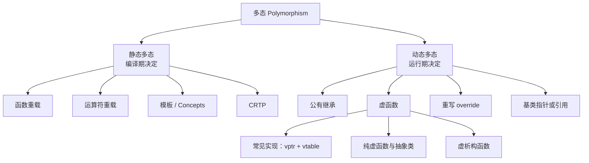
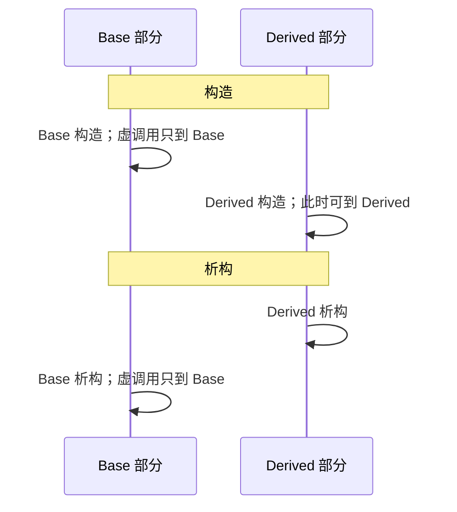
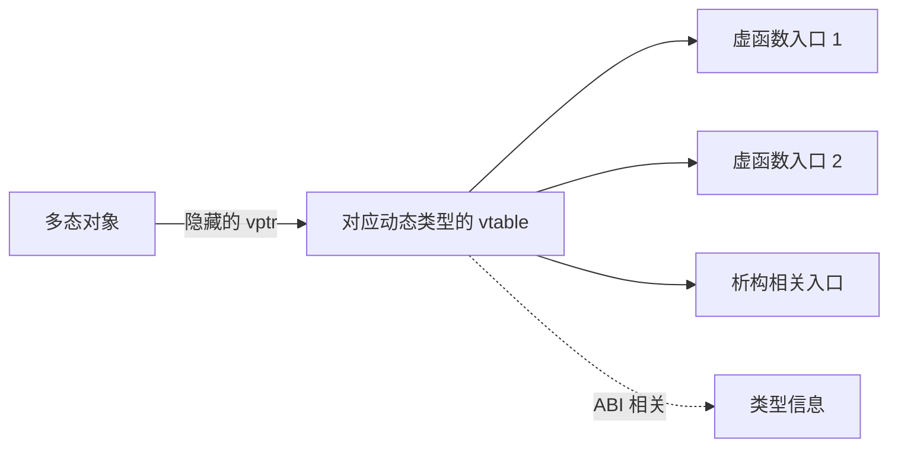
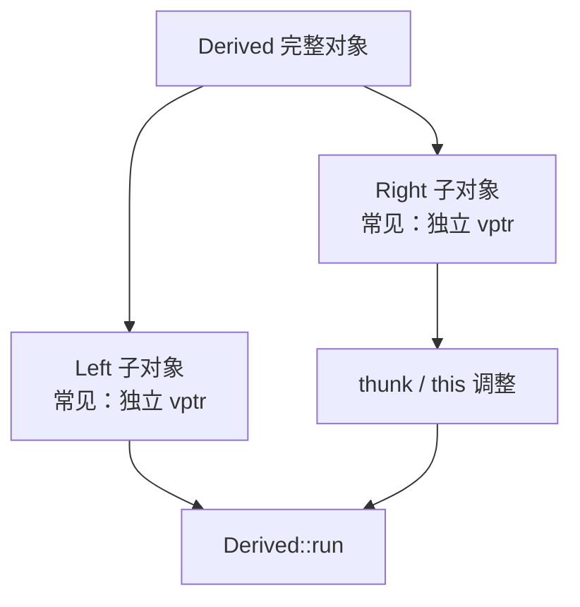

# C++ 多态

> 面试复习目标：掌握静态多态与动态多态、虚函数重写规则、抽象接口、虚析构、虚调用边界及常见虚表实现，并能够写出所有权安全、可扩展的多态代码。

## 1. 知识地图



一句话理解：

> 多态允许调用方只依赖统一接口，同一段调用代码面对不同具体对象时表现出不同的行为。

---

## 2. 什么是多态

```cpp
class Phone {
public:
    virtual void assistant() = 0;
    virtual ~Phone() = default;
};

class Xiaomi final : public Phone {
public:
    void assistant() override {
        std::cout << "XiaoAI\n";
    }
};

class Apple final : public Phone {
public:
    void assistant() override {
        std::cout << "Siri\n";
    }
};

void wake_up(Phone& phone) {
    phone.assistant();
}
```

```cpp
Xiaomi xiaomi;
Apple apple;

wake_up(xiaomi); // XiaoAI
wake_up(apple);  // Siri
```

`wake_up` 不需要判断对象具体类型，也不需要为每种手机重写一套处理逻辑。

动态多态的典型条件：

1. 存在公有继承关系；
2. 基类声明虚函数；
3. 派生类提供最终重写函数；
4. 通过基类指针或引用观察实际对象；
5. 进行未被限定的虚函数调用。

> [!NOTE]
> “必须通过基类指针或引用”是教学中便于记忆的典型形式。严格说，虚调用的语义还取决于表达式与是否使用限定名；只是直接写 `derived.func()` 时编译器通常已知道最终类型，体现不出“同一调用处理多种动态类型”的价值。

---

## 3. 静态多态与动态多态

| 对比项 | 静态多态 | 动态多态 |
|---|---|---|
| 决定时间 | 编译期 | 运行期 |
| 常见机制 | 重载、模板、CRTP | 继承、虚函数 |
| 类型关系 | 可依赖语法/Concept | 通常依赖共同基类 |
| 调用开销 | 易内联、零抽象开销 | 通常有一次间接调用 |
| 代码生成 | 可能为不同类型实例化多份 | 通常共享接口调用代码 |
| 异构集合 | 需 `variant`、类型擦除等辅助 | 基类智能指针天然支持 |
| 扩展特点 | 新类型需满足编译期接口 | 新派生类可接入既有调用方 |

### 3.1 静态多态

函数重载：

```cpp
void print(int value);
void print(std::string_view value);
```

模板：

```cpp
template<class T>
void draw(const T& object) {
    object.draw();
}
```

编译器根据静态类型在编译期选择或生成调用目标。

### 3.2 动态多态

```cpp
void draw_all(const std::vector<std::unique_ptr<Shape>>& shapes) {
    for (const auto& shape : shapes) {
        shape->draw();
    }
}
```

`shape` 的静态类型统一，但每个对象的动态类型可以不同，运行时调用各自的最终重写函数。

---

## 4. 静态类型与动态类型

```cpp
Derived object;
Base& ref = object;
```

- `ref` 的**静态类型**是 `Base&`，由声明和表达式在编译期确定；
- `ref` 所引用对象的**动态类型**是 `Derived`，表示运行时完整对象类型。


静态类型影响：

- 名字查找；
- 重载决议；
- 成员是否可见；
- 访问控制；
- 默认实参；
- `sizeof` 等编译期性质。

动态类型影响：

- 未限定虚函数调用的最终重写函数；
- `dynamic_cast`；
- 多态表达式的 `typeid`。

```cpp
Base* ptr = new Derived;
sizeof(*ptr); // sizeof(Base)，由静态类型决定
```

---

## 5. 虚函数

```cpp
class Base {
public:
    virtual void run();
};
```

`virtual` 只能写在类定义内的成员函数声明上。类外定义时不能重复：

```cpp
void Base::run() {
}
```

以下函数不能成为虚函数：

- 普通非成员函数；
- 静态成员函数；
- 构造函数；
- 成员函数模板。

析构函数可以且经常应该是虚函数；普通成员运算符也可以是虚函数。

一旦某函数在基类中是虚函数，它在所有派生层次中一直保持虚属性，派生类不必重复写 `virtual`：

```cpp
class Derived : public Base {
public:
    void run() override;
};
```

推荐风格：

- 首次声明虚函数：写 `virtual`；
- 派生类重写：写 `override`；
- 不必同时重复 `virtual` 和 `override`。

---

## 6. 重写规则

一个派生函数要成为基类虚函数的重写，通常需要匹配：

- 函数名；
- 参数类型和顺序；
- 成员函数的 `const/volatile` 限定；
- 引用限定符 `&`、`&&`；
- 异常说明满足兼容要求；
- 返回类型相同，或符合协变返回规则。

```cpp
class Base {
public:
    virtual void process(int) const & noexcept;
};

class Derived : public Base {
public:
    void process(int) const & noexcept override;
};
```

容易写错：

```cpp
class Wrong : public Base {
public:
    // 少了 const &，不是同一个签名
    // void process(int) noexcept override; // 编译错误
};
```

### 6.1 `override`

`override` 让编译器确认当前函数确实重写了某个基类虚函数。它可以发现：

- 参数类型拼错；
- 遗漏 `const`；
- 引用限定不同；
- 基类函数其实不是虚函数；
- 名字拼写错误。

> [!IMPORTANT]
> `override` 不负责“让函数变虚”，而是验证已经存在的虚函数重写关系。

### 6.2 `final`

禁止继续重写某个虚函数：

```cpp
class Derived : public Base {
public:
    void run() final;
};
```

禁止继续派生整个类：

```cpp
class Leaf final : public Base {
};
```

`final` 能表达设计约束，也可能帮助编译器确认调用目标并进行去虚化。

---

## 7. 协变返回类型

重写函数通常要求返回类型相同，但类类型的指针或左/右值引用支持协变：

```cpp
class Base {
public:
    virtual Base* clone_raw() const;
};

class Derived : public Base {
public:
    Derived* clone_raw() const override;
};
```

要求派生返回类型对应的类是基类返回类型对应类的可访问、无歧义派生类。

协变只适用于指针或引用，不适用于按值返回，也不能直接用于不同模板实例：

```cpp
// std::unique_ptr<Derived> 不能作为
// std::unique_ptr<Base> 的协变重写返回类型
```

现代多态复制通常让基类接口返回 `std::unique_ptr<Base>`：

```cpp
class Base {
public:
    virtual std::unique_ptr<Base> clone() const = 0;
    virtual ~Base() = default;
};

class Derived : public Base {
public:
    std::unique_ptr<Base> clone() const override {
        return std::make_unique<Derived>(*this);
    }
};
```

---

## 8. 名字隐藏不是重写

```cpp
class Base {
public:
    virtual void func(int);
    void helper();
};

class Derived : public Base {
public:
    void func(double); // 隐藏 Base::func，但没有重写 func(int)
    void helper();     // 隐藏普通函数
};
```

名字查找先看到派生类作用域中的 `func`，便不再自动查找基类的同名集合。使用 `override` 可以避免误判：

```cpp
// void func(double) override; // 编译器报告没有匹配的虚函数
```

需要保留基类重载时：

```cpp
class Derived : public Base {
public:
    using Base::func;
    void func(double);
};
```

更多 overload、hide、override 的对比可回顾上一章继承笔记。

---

## 9. 最终重写函数

虚调用最终执行的是当前完整对象中该虚函数的 **final overrider**：

```cpp
class A {
public:
    virtual void run();
};

class B : public A {
public:
    void run() override;
};

class C : public B {
public:
    void run() override; // C 对象中的最终重写函数
};
```

```cpp
C object;
A& ref = object;
ref.run(); // C::run
```

中间类是否重复写 `virtual` 不影响虚属性。

多继承中，一个签名匹配的派生函数可以同时成为多个基类虚函数的最终重写：

```cpp
class Left  { public: virtual void run(); };
class Right { public: virtual void run(); };

class Both : public Left, public Right {
public:
    void run() override;
};
```

通过 `Left&` 或 `Right&` 调用都可以到达 `Both::run`。

---

## 10. 动态绑定何时发生

```cpp
Base& ref = derived;
ref.run(); // 未限定的虚调用：动态绑定
```

以下情形会抑制或不需要动态绑定。

### 10.1 作用域限定调用

```cpp
ref.Base::run(); // 明确调用 Base::run
```

`Base::` 抑制虚分派。派生类常用它复用基类实现：

```cpp
void Derived::run() {
    Base::run();
    // 派生类额外工作
}
```

### 10.2 直接对象表达式

```cpp
Derived object;
object.run();
```

调用语义仍遵守虚函数规则，但对象的完整类型通常已知，编译器可以直接确定最终重写函数并去虚化。因此它不展示运行时选择不同具体类型的典型多态用法。

### 10.3 非虚函数

```cpp
ref.non_virtual(); // 按静态类型选择 Base 版本
```

非虚成员函数是静态绑定，即使派生类有同名函数也只是隐藏。

---

## 11. 虚函数中的内部调用

```cpp
class Base {
public:
    virtual void step();

    void execute() {
        step();       // 等价于 this->step()，动态绑定
        Base::step(); // 限定调用，静态绑定到 Base
    }
};
```

如果 `execute()` 作用于一个 `Derived` 完整对象：

- `step()` 调用派生类最终重写函数；
- `Base::step()` 固定调用基类版本。

这构成模板方法模式的基础：

```cpp
class Algorithm {
public:
    void run() {
        before();
        do_work();
        after();
    }

    virtual ~Algorithm() = default;

private:
    virtual void do_work() = 0;
    void before();
    void after();
};
```

基类公开稳定流程，把可变步骤留给派生类重写。

---

## 12. 私有虚函数也能被重写

访问控制与虚函数重写是两套规则：

```cpp
class Base {
public:
    void run() {
        do_run();
    }

    virtual ~Base() = default;

private:
    virtual void do_run() = 0;
};

class Derived : public Base {
private:
    void do_run() override {
    }
};
```

派生类虽然不能普通调用 `Base::do_run()`，但仍可重写它。调用 `run()` 时，基类内部的虚调用会分派到 `Derived::do_run()`。

这叫 Non-Virtual Interface（NVI）模式：

- 公共非虚函数负责前置条件、后置条件、锁、日志等稳定逻辑；
- 私有或保护虚函数提供扩展点；
- 防止派生类绕开统一协议。

访问权限在调用点根据静态类型检查，虚分派在之后选择最终重写函数。

---

## 13. 默认参数不是动态绑定

默认实参在编译期根据静态类型选择，函数体才进行虚分派：

```cpp
class Base {
public:
    virtual void print(int value = 1) {
        std::cout << "Base: " << value;
    }
};

class Derived : public Base {
public:
    void print(int value = 2) override {
        std::cout << "Derived: " << value;
    }
};

Derived object;
Base& ref = object;
ref.print(); // 调用 Derived::print，但参数是 1
```

输出为 `Derived: 1`。

> [!WARNING]
> 虚函数不应在不同层级设置不同默认参数。最好只在基类接口提供默认值，或完全避免虚函数默认实参。

---

## 14. 构造与析构期间的虚调用

构造和析构阶段，虚调用只分派到当前正在构造或析构的类，不会进入更派生层级。



原因：

- 构造基类时，派生部分尚未开始生命周期；
- 析构基类时，派生部分已经结束生命周期；
- 不能调用依赖未构造或已析构状态的派生实现。

```cpp
class Base {
public:
    Base() {
        initialize(); // 调用 Base::initialize
    }

    virtual ~Base() {
        cleanup();    // 调用 Base::cleanup
    }

private:
    virtual void initialize();
    virtual void cleanup();
};
```

设计上应尽量避免在构造、析构函数中调用虚函数，因为它容易让读者误以为会发生正常动态分派。

### 14.1 纯虚调用风险

如果在构造或析构期间，直接或间接进行最终指向纯虚函数的虚调用，行为未定义，常见运行时表现是 “pure virtual function called” 后终止。即使该纯虚函数在类外另有函数体，也不应依赖构造、析构阶段的虚调用到达它；若确需复用其定义，应在对象生命周期有效的阶段使用明确的限定调用。

需要派生初始化逻辑时，可采用工厂函数和二阶段的非构造期初始化：

```cpp
class Service {
public:
    virtual ~Service() = default;

    void initialize() {
        do_initialize();
    }

private:
    virtual void do_initialize() = 0;
};
```

工厂先完成对象构造，再显式调用 `initialize()`。

---

## 15. 纯虚函数与抽象类

```cpp
class Shape {
public:
    virtual double area() const = 0;
    virtual ~Shape() = default;
};
```

- `= 0` 声明纯虚函数；
- 含有至少一个最终未实现纯虚函数的类是抽象类；
- 抽象类不能直接实例化；
- 可以声明抽象类的指针和引用；
- 抽象类仍可以有构造函数、数据成员和普通函数；
- 派生类必须使所有纯虚函数都有最终重写，才能成为具体类。

```cpp
class Rectangle final : public Shape {
public:
    Rectangle(double width, double height)
        : width_(width), height_(height) {
    }

    double area() const override {
        return width_ * height_;
    }

private:
    double width_;
    double height_;
};
```

抽象类适合表达接口或不完整的公共抽象，不应只是为了阻止实例化而堆砌无意义纯虚函数。

---

## 16. 纯虚函数可以有定义

纯虚函数仍可在类外提供函数体：

```cpp
class Base {
public:
    virtual void run() = 0;
};

void Base::run() {
    std::cout << "common implementation\n";
}

class Derived : public Base {
public:
    void run() override {
        Base::run(); // 限定调用纯虚函数的定义
    }
};
```

即使纯虚函数有定义，`Base` 仍是抽象类，派生类仍需提供最终重写函数才能实例化。

### 16.1 纯虚析构函数必须有定义

```cpp
class Interface {
public:
    virtual ~Interface() = 0;
};

Interface::~Interface() = default;
```

析构派生对象时总会继续调用基类析构函数，所以纯虚析构函数也必须提供定义，否则会链接失败。

用纯虚析构函数可让类保持抽象，但通常直接 `virtual ~Interface() = default` 更简单。

---

## 17. 虚析构函数

如果对象可能通过基类指针销毁，基类析构函数必须是虚函数：

```cpp
class Base {
public:
    virtual ~Base() = default;
};

class Derived : public Base {
public:
    ~Derived() override = default;
};

std::unique_ptr<Base> object = std::make_unique<Derived>();
```

销毁时执行：

```text
Derived::~Derived()
Base::~Base()
```

若通过 `Base*` 对实际 `Derived` 对象执行 `delete`，而 `Base` 的析构函数非虚，标准规定行为未定义。不能只描述成“可能少调一次派生析构函数”。

### 17.1 两种基类析构策略

一般遵循：

- **公开且虚析构**：允许通过基类指针删除；
- **受保护且非虚析构**：不允许外部通过基类指针删除。

```cpp
class NonOwningBase {
protected:
    ~NonOwningBase() = default;
};
```

### 17.2 智能指针也不能修复错误接口

```cpp
std::unique_ptr<Base> p = std::make_unique<Derived>();
```

`unique_ptr<Base>` 默认最终执行 `delete Base*`，仍要求 `Base` 有虚析构函数。

`shared_ptr` 在某些构造方式下能在控制块中保存正确的具体删除类型，但不能因此省略多态基类的虚析构设计；类型可能经不同路径创建和删除。

---

## 18. 对象切片与多态容器

```cpp
Derived derived;
Base copy = derived; // 只复制 Base 子对象
```

切片后：

- 派生数据丢失；
- 新对象动态类型就是 `Base`；
- 虚调用也只会到 `Base`。

错误的异构容器：

```cpp
std::vector<Base> objects;
objects.push_back(Derived{}); // 切片
```

正确的运行时多态容器：

```cpp
std::vector<std::unique_ptr<Base>> objects;
objects.push_back(std::make_unique<Derived>());

for (const auto& object : objects) {
    object->run();
}
```

所有权选择：

- 容器独占对象：`unique_ptr<Base>`；
- 确实有多个共享所有者：`shared_ptr<Base>`；
- 不拥有对象：`Base&`、`Base*`；
- 需要值语义：考虑虚拟 `clone()`、类型擦除或 `std::variant`。

---

## 19. 常见的虚表实现模型

C++ 标准只规定虚调用的语义，不规定实现必须使用虚表。主流 ABI 通常采用：



概念上：

1. 多态对象的相应基类子对象中保存虚表指针；
2. 虚表包含虚函数分派所需入口；
3. 构造/析构期间相关指针或语义随当前类阶段变化；
4. 虚调用经表项到达最终重写函数。

实现细节可能包括：

- 一个或多个 `vptr`；
- RTTI 信息；
- offset-to-top；
- 析构函数的多个入口；
- `this` 调整 thunk；
- 虚基类偏移；
- 平台 ABI 规定的其他字段。

> [!IMPORTANT]
> “对象第一个机器字一定是 vptr”“虚表只存函数地址”“每个类只有一张虚表”都不是 C++ 标准保证。

### 19.1 对象大小

一个有虚函数的对象通常比相同数据布局的非多态对象多出至少一个实现相关指针，但具体大小受：

- 指针宽度；
- 对齐与填充；
- 单继承/多继承；
- 虚继承；
- ABI 和编译器优化；
- 空基类优化。

影响。源码中输出的 `16`、`24` 等结果只能说明当前平台，不能作为语言规则。

---

## 20. 不要手工调用虚表

本章 `08_virtual_table.cc` 尝试：

1. 把对象地址强转成 `long*`；
2. 假设首个 `long` 是虚表地址；
3. 假设虚表前三项依次对应三个函数；
4. 把表项转成 `void(*)()` 后直接调用。

该做法不是可移植的 C++，并会触发未定义行为：

- 违反对象表示和别名访问规则；
- `long` 不保证能保存指针；
- vptr 不保证位于对象首地址；
- 虚表布局和表项顺序不受标准保证；
- 非静态成员函数需要正确的 `this`；
- 把实现入口当成 `void(*)()` 调用，函数类型不兼容；
- ABI 表项可能是 thunk、析构入口或其他信息。

> [!WARNING]
> 不应运行或在业务代码中模仿 `08_virtual_table.cc` 的虚表调用部分。学习对象模型应使用编译器提供的布局/反汇编工具，并明确它们展示的是某个 ABI 的实现。

可使用的诊断思路：

- GCC：类层次/转储相关选项随版本而异；
- Clang：`-Xclang -fdump-record-layouts`；
- 查看生成汇编，观察间接调用与去虚化；
- 使用调试器观察对象，但不在程序中篡改表示。

---

## 21. 多重继承下的动态分派

```cpp
class Left {
public:
    virtual void run();
    virtual ~Left() = default;
};

class Right {
public:
    virtual void run();
    virtual ~Right() = default;
};

class Derived : public Left, public Right {
public:
    void run() override;
};
```

`Derived` 中通常含有多个多态基类子对象：



```cpp
Derived object;

Left* left = &object;
Right* right = &object;

left->run();  // Derived::run
right->run(); // Derived::run
```

`left` 和 `right` 的数值地址可能不同，因为它们分别指向不同基类子对象。通过次要基类调用派生重写时，实现可能先调整 `this` 再进入函数。

这些是常见 ABI 实现，不是标准要求；标准只保证两个调用得到正确语义。

---

## 22. 多继承中的最终重写二义性

如果继承路径带来多个最终重写函数，而最派生类没有消除冲突，类会不合法：

```cpp
class A {
public:
    virtual void run();
};

class B : virtual public A {
public:
    void run() override;
};

class C : virtual public A {
public:
    void run() override;
};

class D : public B, public C {
public:
    void run() override { // 明确唯一最终重写函数
        B::run();
    }
};
```

普通名字查找二义性与虚函数最终重写二义性有关联但不是同一概念：

- 名字查找决定表达式能否找到唯一候选；
- final overrider 规则决定虚调用对某个基类虚函数最终执行哪个版本。

---

## 23. RTTI：`dynamic_cast` 与 `typeid`

具有至少一个虚函数的类是多态类型。运行时类型信息常用于：

### 23.1 `dynamic_cast`

```cpp
Base* base = get_object();

if (auto* derived = dynamic_cast<Derived*>(base)) {
    derived->derived_only();
}
```

- 指针转换失败返回 `nullptr`；
- 引用转换失败抛 `std::bad_cast`；
- 可支持安全向下转换和多继承侧向转换；
- 频繁使用可能说明基类接口抽象不足。

### 23.2 `typeid`

```cpp
Base& ref = derived;

if (typeid(ref) == typeid(Derived)) {
}
```

对多态类型的 glvalue 表达式，`typeid` 可反映动态类型；对非多态对象通常只反映静态类型。

若对解引用空多态指针的表达式使用 `typeid(*ptr)`，会抛出 `std::bad_typeid`。

应优先通过虚接口表达行为，不要把多态代码写成大串 `typeid`/`dynamic_cast` 分支。

---

## 24. 虚调用的成本

典型成本包括：

- 对象中一个或多个 `vptr` 的空间；
- 虚表和 RTTI 的静态空间；
- 一次间接调用；
- 可能的 `this` 指针调整；
- 间接调用可能影响内联和分支预测；
- 多态对象常通过指针分散分配，影响缓存局部性。

但不要脱离测量夸大成本：

- 业务中的 I/O、分配和算法开销经常更大；
- 编译器可能去虚化并内联；
- `final`、链接时优化和可见的动态类型有助于优化；
- 清晰架构往往比微小调用成本更重要。

只有性能分析证明虚分派是热点时，再考虑：

- 模板/Concepts；
- CRTP；
- `std::variant` + `std::visit`；
- 类型擦除；
- 数据导向布局；
- 批处理同类型对象。

---

## 25. 开放封闭原则与依赖倒置

多态常用于把高层流程与具体实现解耦：

```cpp
class Storage {
public:
    virtual void save(std::string_view data) = 0;
    virtual ~Storage() = default;
};

class Service {
public:
    explicit Service(Storage& storage)
        : storage_(storage) {
    }

    void execute() {
        storage_.save("result");
    }

private:
    Storage& storage_;
};
```

新增 `FileStorage`、`DatabaseStorage`、`MockStorage` 时，`Service` 不必修改。这体现：

- 高层依赖抽象而非具体类；
- 对扩展开放、对既有流程修改相对封闭；
- 测试可以注入替身实现。

但并非每个类都应有虚接口。只有确实需要运行时替换、插件式扩展或异构处理时，动态多态才值得。

---

## 26. 多态接口的所有权设计

函数签名应同时表达多态和所有权：

```cpp
void use(const Shape& shape);                 // 非拥有、不可空
void maybe_use(const Shape* shape);           // 非拥有、可空
void consume(std::unique_ptr<Shape> shape);   // 转移独占所有权
void retain(std::shared_ptr<Shape> shape);    // 共享并保留所有权

std::unique_ptr<Shape> make_shape();           // 返回独占多态对象
```

不要为“方便调用虚函数”无条件使用 `shared_ptr`。多态只要求指针/引用语义，不等于共享所有权。

处理可空指针时先检查：

```cpp
void handle(Phone* phone) {
    if (phone != nullptr) {
        phone->assistant();
    }
}
```

如果参数逻辑上不能为空，优先使用引用：

```cpp
void handle(Phone& phone) {
    phone.assistant();
}
```

---

## 27. 多态复制：虚拟构造函数模式

C++ 构造函数不能是虚函数，但可以通过虚拟 `clone` 达到“根据动态类型复制”的效果：

```cpp
class Shape {
public:
    virtual std::unique_ptr<Shape> clone() const = 0;
    virtual ~Shape() = default;
};

class Circle final : public Shape {
public:
    std::unique_ptr<Shape> clone() const override {
        return std::make_unique<Circle>(*this);
    }
};
```

```cpp
std::unique_ptr<Shape> copy = original->clone();
```

`copy` 的静态接口仍是 `Shape`，但完整对象类型与 `original` 的动态类型一致。

这避免：

- 对象切片；
- 调用方使用 `dynamic_cast` 判断每个派生类；
- 暴露具体类复制逻辑。

---

## 28. 析构、复制与移动的交互

多态基类常声明虚析构：

```cpp
class Base {
public:
    virtual ~Base() = default;
};
```

用户声明析构函数会影响隐式移动操作的生成。如果基类确实需要可复制、可移动语义，应显式表达：

```cpp
class Base {
public:
    Base() = default;
    Base(const Base&) = default;
    Base& operator=(const Base&) = default;
    Base(Base&&) noexcept = default;
    Base& operator=(Base&&) noexcept = default;
    virtual ~Base() = default;
};
```

但多态对象通常不应通过基类值复制，因为会切片。接口基类可以直接禁止复制：

```cpp
class Interface {
public:
    Interface(const Interface&) = delete;
    Interface& operator=(const Interface&) = delete;
    virtual ~Interface() = default;

protected:
    Interface() = default;
};
```

然后按需提供 `clone()`。

---

## 29. 实践案例：抽象图形

`practice/03_abstract_Figure.cc` 使用统一接口：

```cpp
class Figure {
public:
    virtual std::string getName() const = 0;
    virtual double getArea() const = 0;
    virtual ~Figure() = default;
};
```

```cpp
void display(const Figure& figure) {
    std::cout << figure.getName()
              << " area: "
              << figure.getArea();
}
```

`Rectangle`、`Circle`、`Triangle` 分别实现面积计算，调用方不需要知道具体类型。

可改进：

- `display` 使用 `const Figure&`；
- 已有 `override` 时不必重复写 `virtual`；
- 构造时验证长度、半径为非负；
- 三角形验证两边之和大于第三边，否则海伦公式可能得到无效结果；
- C++20 可使用 `std::numbers::pi`；
- `getName()` 可返回 `std::string_view`，避免每次创建字符串。

---

## 30. 实践案例：`Person` 与 `Employee`

`practice/02_Person_Employee.cc` 展示：

- `Employee` 公有继承 `Person`；
- `display()` 虚函数重写；
- 基类虚析构；
- 派生类复制构造显式复制基类部分；
- 派生类复制赋值显式调用基类赋值。

工程化建议：

1. 用 `std::string` 替代手工管理 `char*`，遵循 Rule of Zero；
2. 基类数据优先保持 `private`，通过访问器维护不变量；
3. 析构函数写成 `virtual ~Person() = default`；
4. `const double salary` 的按值参数顶层 `const` 对调用者没有接口意义；
5. 平均工资接口可接收迭代器区间、`vector<Employee>`，C++20 可用 `span`；
6. `Employee::operator=` 先修改基类、再申请部门内存，若后者抛异常只能提供基本保证，若需要强保证可先构造临时对象再交换；
7. 多态集合不能使用 `Person[]` 保存不同派生类型，否则发生切片。

简化后的成员：

```cpp
class Person {
public:
    virtual void display() const;
    virtual ~Person() = default;

private:
    std::string name_;
    int age_{};
};
```

---

## 31. 本章其他练习的范围

`practice/01_text_query.cc` 和 `tinyXml2/rss_reader.cc` 主要练习：

- 文件流；
- `vector/map/set`；
- 文本索引；
- XML/RSS 解析；
- 字符串清洗与异常处理。

它们没有使用运行时多态，复习时应归入关联容器、流和项目练习，而不是把“类的封装”误认为“多态”。

文本查询的主要注意点：

- 查询使用 `find`，避免 `map::operator[]` 意外插入；
- 重复读取前应清空旧索引或明确累加语义；
- 单词应考虑大小写和标点归一化；
- 行号和计数宜使用 `std::size_t`；
- 文件流依靠 RAII 自动关闭。

RSS 解析的主要注意点：

- `parseRss()` 重复调用会向 `_rss` 继续追加；
- 正则表达式不是完整可靠的 HTML 解析器；
- XML 文本转义顺序和字符编码需明确；
- `tinyxml2` 自身广泛使用继承与虚函数，是观察真实库接口设计的素材，但不应仅从业务包装类 `RssReader` 推断多态。

---

## 32. 源码中的问题与纠正

### 32.1 `08_virtual_table.cc`

该文件的手工虚表读取和函数调用依赖特定实现并触发未定义行为。只能理解其试图说明的概念，不能把代码当成合法、可移植的对象模型访问方式。

### 32.2 `note/05_virtual_func_invokel_note.cc`

`test1()` 在同一作用域中两次声明：

```cpp
Son son;
```

因此当前文件无法编译。应删除重复声明、复用原变量，或使用独立代码块划分作用域。

### 32.3 `10_virtual_destructor.cc`

如果基类析构非虚，通过基类指针删除实际派生对象的后果不是简单的“派生析构可能不执行”，而是**未定义行为**。

### 32.4 对象大小示例

`sizeof` 输出和“有几个 `vfptr`”是当前编译器、平台和 ABI 的观察结果，不是 C++ 标准承诺。

---

## 33. 高频面试问题

### 33.1 什么是多态？

同一接口作用于不同具体对象时产生不同行为。C++ 中动态多态通常由公有继承、虚函数重写和基类指针/引用调用实现。

### 33.2 静态多态和动态多态有什么区别？

静态多态在编译期通过重载、模板等确定；动态多态在运行期根据对象动态类型选择虚函数最终重写版本。

### 33.3 虚函数的实现原理是什么？

标准不规定。主流实现通常让多态对象的相关子对象保存 `vptr`，指向包含虚函数入口和 ABI 信息的 `vtable`，虚调用经间接分派到最终重写函数。

### 33.4 `virtual` 和 `override` 有何区别？

`virtual` 首次声明虚函数；`override` 验证派生函数确实重写基类虚函数。派生重写中推荐写 `override`。

### 33.5 重载、隐藏和重写有何区别？

重载发生在同一作用域且参数列表不同；隐藏是派生同名声明遮蔽基类名字；重写是派生函数匹配基类虚函数。

### 33.6 构造函数为什么不能是虚函数？

虚分派需要已有对象及动态类型，而构造函数负责建立对象本身。创建哪种具体对象必须在调用构造之前确定。可用虚拟 `clone` 或工厂函数实现相似需求。

### 33.7 析构函数为什么经常必须是虚函数？

若允许通过基类指针删除派生对象，虚析构保证从派生到基类执行完整析构链；否则行为未定义。

### 33.8 构造、析构函数中调用虚函数会怎样？

只调用当前构造或析构层级的版本，不会进入更派生对象。依赖派生实现会访问尚未开始或已经结束生命周期的状态，因此语言禁止这种分派。

### 33.9 抽象类可以有构造函数吗？

可以。虽然抽象类不能直接实例化，但构造派生对象时仍需构造其抽象基类子对象。

### 33.10 纯虚函数可以有实现吗？

可以在类外提供实现，派生类可通过限定调用复用。但类仍是抽象类，派生类仍需最终重写。

### 33.11 纯虚析构函数为什么必须有定义？

销毁派生对象时一定会调用基类析构函数。没有定义会造成链接错误。

### 33.12 默认参数是否参与动态绑定？

不参与。默认参数由调用表达式的静态类型在编译期选择，只有虚函数体根据动态类型选择。

### 33.13 多继承中为什么可能有多个 vptr？

不同多态基类子对象需要支持从各自接口正确分派，常见 ABI 为它们维护各自的虚表指针，并在需要时通过 thunk 调整 `this`。

### 33.14 虚函数一定不能内联吗？

不是。若编译器能证明动态类型或借助 `final`、LTO 完成去虚化，就可以直接调用并内联。即使不能去虚化，函数定义本身也仍可被其他静态可知调用点内联。

### 33.15 多态对象如何复制？

按基类值复制会切片。常见方案是在基类定义虚拟 `clone()`，返回 `unique_ptr<Base>`，由各派生类复制自己的完整动态类型。

---

## 34. 易错结论速查

| 易错说法 | 正确理解 |
|---|---|
| 多态就是函数重载 | 重载是静态多态的一种，虚函数是动态多态 |
| 派生类同名函数一定是重写 | 必须匹配基类虚函数才是重写 |
| 派生类重写必须再次写 `virtual` | 虚属性会继承，推荐写 `override` |
| `override` 让普通函数变成虚函数 | 它只验证已有重写关系 |
| 虚函数总在运行时查表 | 编译器可能去虚化为直接调用 |
| `Base::func()` 仍会动态绑定 | 限定调用抑制虚分派 |
| 默认参数也根据动态类型选择 | 默认实参看静态类型 |
| 构造函数中虚调用会到派生类 | 只到当前构造层级 |
| 有虚函数就自动有虚析构 | 必须显式把基类析构声明为虚 |
| 非虚析构只会造成资源泄漏 | 通过基类指针删除派生对象是未定义行为 |
| 抽象类不能有成员和构造函数 | 只能说不能直接实例化 |
| 纯虚函数绝对不能有函数体 | 可以在类外定义 |
| 纯虚析构不用实现 | 必须提供定义 |
| `vector<Base>` 能保存多态对象 | 派生对象会被切片 |
| 每个多态对象必有且仅有一个 vptr | 这是 ABI 相关实现细节 |
| vptr 一定在对象首地址 | 标准没有这种保证 |
| 可把虚表项强转成普通函数指针调用 | 类型、`this` 和布局均不保证，属于未定义行为 |
| 动态多态必然很慢 | 应测量；编译器可去虚化，实际瓶颈取决于场景 |

---

## 35. 源码阅读索引

| 文件 | 主题 |
|---|---|
| `01_polymorphism_intro.cc` | 动态多态的动机与统一接口 |
| `02_virtual_func.cc` | 虚函数声明、定义和重写 |
| `03_virtual_func2.cc` | 常见虚表模型与成员隐藏 |
| `04_multi_inherit_virtual_func.cc` | 多继承下的虚函数 |
| `05_virtual_func_invokel.cc` | 直接对象调用与基类指针调用 |
| `06_virtual_func_invokel2.cc` | 构造、析构期间的虚调用 |
| `07_virtual_func_invokel3.cc` | `this` 调用与限定调用 |
| `08_virtual_table.cc` | 非可移植虚表实验（含未定义行为） |
| `09_abstract.cc` | 纯虚函数与抽象类 |
| `10_virtual_destructor.cc` | 虚析构函数 |
| `11_multi_inherit_virtual_func.cc` | 多基类虚表与 `this` 调整概念 |
| `practice/02_Person_Employee.cc` | 多态、继承与复制控制 |
| `practice/03_abstract_Figure.cc` | 抽象图形接口 |
| `practice/01_text_query.cc` | 文本索引练习，非多态主题 |
| `tinyXml2/` | XML/RSS 综合项目 |
| `note/*.cc` | 对应主题的详细源码注释 |

---

## 36. 复习清单

- [ ] 能区分静态多态与动态多态
- [ ] 能解释静态类型和动态类型
- [ ] 能写出安全的抽象基类
- [ ] 能准确区分 overload、hide、override
- [ ] 能使用 `override`、`final`
- [ ] 能说明协变返回类型的限制
- [ ] 能解释限定调用为何抑制虚分派
- [ ] 能回答虚函数默认参数的绑定规则
- [ ] 能解释构造、析构期间的虚调用
- [ ] 能说明纯虚函数为何仍可有定义
- [ ] 能说明纯虚析构函数为何必须定义
- [ ] 能解释虚析构函数的必要性
- [ ] 能避免多态对象切片
- [ ] 能用 `unique_ptr<Base>` 保存异构对象
- [ ] 能实现虚拟 `clone()` 完成多态复制
- [ ] 能描述 vptr/vtable 的常见实现且不把它当作标准保证
- [ ] 能解释多继承中的 `this` 调整
- [ ] 能识别手工读取/调用虚表的未定义行为
- [ ] 能根据所有权选择引用、裸指针或智能指针
