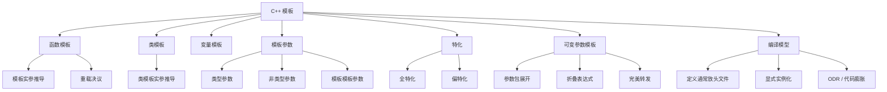

# C++ 模板与泛型编程

> 面试复习目标：掌握函数模板、类模板、模板实参推导、重载决议、特化、可变参数模板和模板编译模型，能够识别依赖名、SFINAE、完美转发及模板资源类中的常见问题。

## 1. 知识地图



模板的核心是：

> 把类型、编译期常量或模板本身参数化，让编译器根据使用方式生成具体代码。

---

## 2. 模板、实例与泛型编程

```cpp
template<class T>
T add(T lhs, T rhs) {
    return lhs + rhs;
}
```

`add` 是函数模板，不是普通函数。使用时，编译器根据模板实参形成具体特化：

```cpp
add(1, 2);       // 使用 add<int>
add(1.0, 2.0);   // 使用 add<double>
```

类模板：

```cpp
template<class T>
class Box {
public:
    explicit Box(T value)
        : value_(std::move(value)) {
    }

private:
    T value_;
};
```

```cpp
Box<int> int_box{42};
Box<std::string> string_box{"hello"};
```

`Box<int>` 和 `Box<std::string>` 是两个不同的类类型。

### 2.1 `typename` 与 `class`

声明类型模板参数时，两者作用相同：

```cpp
template<typename T>
class A;

template<class T>
class B;
```

`typename` 在依赖类型前还有另一项重要用途，后文单独说明。

### 2.2 模板不是简单文本替换

模板会经历：

- 语法解析；
- 名字查找；
- 模板实参推导；
- 约束检查或替换；
- 重载决议；
- 实例化；
- 语义检查与代码生成。

它是编译器支持的语言机制，不是 C 宏。模板理解类型、作用域和重载规则，宏则主要进行预处理文本替换。

---

## 3. 几个容易混淆的标准术语

### 3.1 显式指定模板实参

```cpp
add<int>(1, 2);
```

这里只是显式写出模板实参 `int`。它常被入门材料简称为“显式实例化”，但标准术语上并不准确。

### 3.2 隐式实例化

```cpp
add(1, 2);
```

编译器通过调用推导出 `T = int`，在需要函数定义时隐式实例化 `add<int>`。

即使写了 `add<int>(1, 2)`，对应模板实体仍通常是在使用点按需隐式实例化，只是模板实参不是推导出来的。

### 3.3 显式实例化定义

```cpp
template int add<int>(int, int);
```

这才是显式实例化定义：要求当前翻译单元实例化并生成 `add<int>`。

类模板：

```cpp
template class Box<int>;
```

### 3.4 显式实例化声明

```cpp
extern template int add<int>(int, int);
```

它告诉当前翻译单元不要重复实例化，定义应由其他翻译单元提供。

### 3.5 显式特化

```cpp
template<>
int add<int>(int lhs, int rhs) {
    return lhs + rhs;
}
```

显式特化是为特定模板实参提供专门实现，与显式实例化不是一回事。

> [!IMPORTANT]
> 面试中要区分：显式模板实参、隐式实例化、显式实例化、显式特化。

---

## 4. 函数模板实参推导

```cpp
template<class T>
void print(T value);

print(42);    // T = int
print(3.14);  // T = double
```

推导主要根据函数实参和对应参数类型进行，不会为了让推导成功而任意执行用户定义转换。

### 4.1 同一个 `T` 必须推导一致

```cpp
template<class T>
T max_value(T lhs, T rhs);

max_value(1, 2);     // T = int
// max_value(1, 2.0); // 错误：分别推导出 int 和 double
```

可以显式指定类型，让普通参数转换在之后发生：

```cpp
max_value<double>(1, 2.0);
```

或允许两个类型并推导结果：

```cpp
template<class T, class U>
std::common_type_t<T, U> add(T lhs, U rhs) {
    return lhs + rhs;
}
```

C++14 起还可使用返回类型推导：

```cpp
template<class T, class U>
auto add(T lhs, U rhs) {
    return lhs + rhs;
}
```

### 4.2 返回类型通常不能参与推导

```cpp
template<class T>
T make();

// auto value = make(); // 无法从返回目标推导 T
auto value = make<int>();
```

函数模板实参推导主要从函数参数列表和实参发生；赋值目标类型通常不会反向推导模板参数。

---

## 5. 按值参数的推导规则

```cpp
template<class T>
void inspect(T value);
```

按值推导时：

- 忽略实参引用性；
- 去掉顶层 `const/volatile`；
- 数组通常退化为指针；
- 函数通常退化为函数指针。

```cpp
const int value = 42;
inspect(value); // T = int

const char text[] = "hello";
inspect(text);  // T = const char*
```

底层 `const` 会保留，例如 `const char*` 中被指向字符的 `const`。

按值会复制或移动实参。大对象只读参数通常不应机械写成 `T value`。

---

## 6. 引用参数的推导规则

### 6.1 左值引用

```cpp
template<class T>
void inspect(T& value);
```

```cpp
int a{};
const int b{};

inspect(a); // T = int，参数为 int&
inspect(b); // T = const int，参数为 const int&
```

引用参数不会发生数组到指针退化：

```cpp
template<class T, std::size_t N>
constexpr std::size_t array_size(T (&)[N]) noexcept {
    return N;
}
```

### 6.2 `const T&`

```cpp
template<class T>
void inspect(const T& value);
```

既可绑定左值，也可绑定右值，且通常不复制。这里推导出的 `T` 一般不含顶层 `const`。

### 6.3 转发引用

```cpp
template<class T>
void relay(T&& value);
```

当 `T` 由调用实参推导时，`T&&` 是转发引用：

| 实参 | 推导出的 `T` | 折叠后的参数类型 |
|---|---|---|
| `Widget` 左值 | `Widget&` | `Widget&` |
| `const Widget` 左值 | `const Widget&` | `const Widget&` |
| `Widget` 右值 | `Widget` | `Widget&&` |

有名字的 `value` 在函数体中是左值，需要用：

```cpp
std::forward<T>(value)
```

恢复调用方原来的值类别。

> [!NOTE]
> `Widget&&` 不是转发引用；只有形如 `T&&` 且 `T` 在该调用点参与推导时才是。

---

## 7. 数组推导与安全接口

本章练习使用：

```cpp
template<class T>
T sumArray(T arr[], int len);
```

函数参数中的 `T arr[]` 实际调整为 `T* arr`，数组长度已经丢失，调用者可能传错 `len`。

编译期固定数组可写成：

```cpp
template<class T, std::size_t N>
T sum_array(const T (&array)[N]) {
    T result{};
    for (const auto& value : array) {
        result += value;
    }
    return result;
}
```

动态范围可使用：

- 迭代器区间；
- `std::vector<T>`；
- C++20 `std::span<const T>`；
- C++20 ranges 算法。

`T result{}` 比 `T result = 0` 更通用，但仍要求 `T` 可值初始化且支持 `+=`。

---

## 8. 普通函数与函数模板的重载决议

```cpp
void print(int);

template<class T>
void print(T);
```

```cpp
print(42); // 两者同为精确匹配，非模板函数胜出
```

但“普通函数永远优先”是错误的：

```cpp
void show(long);

template<class T>
void show(T);

show(42); // 模板 show<int> 精确匹配，普通函数需要 int -> long
```

简化理解顺序：

1. 收集候选；
2. 模板进行实参推导和替换；
3. 删除不可行候选；
4. 比较隐式转换序列；
5. 模板之间进行偏序，选择更特化者；
6. 若模板与非模板其他条件相同，非模板通常胜出。

不要先套“普通函数优先”口诀，应先比较匹配质量。

---

## 9. 函数模板之间的偏序

```cpp
template<class T>
void process(T, T);       // 两个参数必须是同一类型

template<class T, class U>
void process(T, U);       // 可为不同类型
```

```cpp
process(1, 2);   // 第一版通常更特化
process(1, 2.0); // 只能选择第二版
```

模板偏序比较的是哪个模板接受的类型集合更受限制，而不是简单比较“模板参数数量更少”。

过度相似的重载容易造成二义性：

```cpp
template<class T, class U>
T convert(T, U);

template<class T, class U>
T convert(U, T);
```

对某些实参，两者可以同样精确匹配，而返回类型不能参与普通函数重载区分，于是调用二义。

设计建议：

- 让重载的职责和形状明显不同；
- 使用清晰约束；
- C++20 优先用 Concepts 表达候选适用范围；
- 不要依赖晦涩的偏序技巧增加维护成本。

---

## 10. 类模板

```cpp
template<class T>
class Box {
public:
    explicit Box(T value)
        : value_(std::move(value)) {
    }

    const T& get() const noexcept {
        return value_;
    }

private:
    T value_;
};
```

模板参数可以用于：

- 数据成员类型；
- 成员函数参数和返回值；
- 类型别名；
- 基类；
- 编译期表达式；
- 内部嵌套模板。

每个类模板特化都是独立类型：

```cpp
static_assert(!std::is_same_v<Box<int>, Box<double>>);
```

它们的静态数据成员也通常彼此独立：

```cpp
template<class T>
class Counter {
public:
    inline static std::size_t count = 0; // C++17
};
```

`Counter<int>::count` 和 `Counter<double>::count` 不是同一个对象。

---

## 11. 类模板成员的类外定义

```cpp
template<class T>
class Box {
public:
    void print() const;

private:
    T value_;
};

template<class T>
void Box<T>::print() const {
    std::cout << value_;
}
```

要点：

1. 类外定义前重新写模板头；
2. 作用域是 `Box<T>::`，不是单独的 `Box::`；
3. 默认模板实参通常只在首次声明处提供，不能在同一作用域重复定义；
4. 定义在被实例化的使用点通常必须可见。

如果类模板的成员函数从未使用，编译器通常不必实例化它：

```cpp
template<class T>
class Lazy {
public:
    void requires_plus() {
        T value{};
        value + value;
    }
};

Lazy<NoPlus> object; // 只要不调用 requires_plus，通常仍可成立
```

这使类模板可以对不同成员施加按需要求。

---

## 12. 成员函数模板

普通类可以拥有成员函数模板：

```cpp
class Printer {
public:
    template<class T>
    void print(const T& value) {
        std::cout << value;
    }
};
```

类模板也可以拥有额外模板参数的成员函数模板：

```cpp
template<class T>
class Box {
public:
    template<class U>
    void assign(U&& value) {
        data_ = std::forward<U>(value);
    }

private:
    T data_;
};
```

类外定义需要两层模板头：

```cpp
template<class T>
template<class U>
void Box<T>::assign(U&& value) {
    data_ = std::forward<U>(value);
}
```

成员函数模板不能是虚函数，因为虚表需要一组在类层级上确定的函数入口，而成员模板可能产生任意多实例。

---

## 13. 类模板实参推导 CTAD

C++17 起，构造对象时可以从构造函数参数推导类模板实参：

```cpp
template<class T>
class Box {
public:
    explicit Box(T value);
};

Box box{42}; // 推导为 Box<int>
```

### 13.1 推导指引

编译器生成的隐式指引不满足需求时可提供 deduction guide：

```cpp
template<class T>
class Holder {
public:
    Holder(T value);
};

Holder(const char*) -> Holder<std::string>;

Holder holder{"hello"}; // Holder<std::string>
```

推导指引不是函数，没有函数体，只描述构造参数到类模板实参的映射。

### 13.2 CTAD 的限制

- 它只帮助推导对象声明处的模板实参；
- 函数形参等位置仍经常需要写完整类型；
- `Box<>` 只有在模板参数都有合适默认值时才合法；
- C++17 聚合类模板的 CTAD 支持比后续标准更有限；
- 推导结果可能与期望的衰减、引用保存语义不同，应检查。

---

## 14. 模板参数的三大类别

### 14.1 类型模板参数

```cpp
template<class Key, class Value>
class Map;
```

### 14.2 非类型模板参数

```cpp
template<class T, std::size_t N>
class FixedArray;
```

`N` 是编译期值，不同 `N` 形成不同类型：

```cpp
FixedArray<int, 4> a;
FixedArray<int, 8> b;
```

在 C++17 中还可使用 `auto`：

```cpp
template<auto Value>
struct Constant {
    static constexpr auto value = Value;
};
```

可作为非类型模板参数的类型范围随标准版本扩展。C++17 常用整数、枚举、指针、引用等满足规则的值；C++20 引入更广的结构化类型支持。所有值都必须满足对应标准的编译期和链接性要求。

### 14.3 模板模板参数

```cpp
template<class T, template<class...> class Container>
class Collection {
    Container<T> values_;
};
```

```cpp
Collection<int, std::vector> values;
```

实际模板的参数列表必须与模板模板参数要求兼容。分配器等默认参数及标准版本规则会影响匹配。

---

## 15. 默认模板实参

```cpp
template<class T = int, std::size_t Capacity = 10>
class Stack;
```

```cpp
Stack<> a;             // Stack<int, 10>
Stack<double> b;       // Stack<double, 10>
Stack<double, 32> c;
```

默认模板实参与默认函数实参类似，可减少常见配置的重复书写。

函数模板：

```cpp
template<class T, int Scale = 10>
T scale(T value) {
    return value * Scale;
}
```

```cpp
scale(3);          // T 推导为 int，Scale 使用 10
scale<double>(3);  // T = double
```

不能从没有出现在可推导函数参数上下文中的值自动推导非类型参数：

```cpp
template<class T, int N>
void repeat(T value);

// repeat(3); // N 无法推导
repeat<int, 10>(3);
```

---

## 16. 全特化与偏特化

### 16.1 主模板

```cpp
template<class T>
struct TypeName {
    static constexpr std::string_view value = "other";
};
```

### 16.2 全特化

所有模板参数都被确定：

```cpp
template<>
struct TypeName<int> {
    static constexpr std::string_view value = "int";
};
```

### 16.3 类模板偏特化

只限定一部分形态：

```cpp
template<class T>
struct TypeName<T*> {
    static constexpr std::string_view value = "pointer";
};

template<class T>
struct TypeName<const T> {
    static constexpr std::string_view value = "const";
};
```

匹配时选择最特化且唯一的版本。

> [!IMPORTANT]
> 类模板和变量模板可以偏特化；函数模板不能偏特化。函数模板需要用重载、SFINAE 或 Concepts 表达不同类型分支。

---

## 17. 函数模板特化与重载

主模板：

```cpp
template<class T>
bool equal(const T& lhs, const T& rhs) {
    return lhs == rhs;
}
```

显式全特化：

```cpp
template<>
bool equal<const char*>(const char* const& lhs,
                        const char* const& rhs) {
    return std::strcmp(lhs, rhs) == 0;
}
```

函数模板特化存在容易误判的选择规则：先进行普通重载决议，选择主模板或非模板重载，再考虑所选主模板是否有匹配特化。特化不是独立参与普通重载集的普通函数模板。

工程中通常更推荐重载：

```cpp
bool equal(const char* lhs, const char* rhs) {
    return std::strcmp(lhs, rhs) == 0;
}
```

重载更自然地参与重载决议，也更容易处理数组、指针限定和隐式转换。

---

## 18. 本章 `const char*` 特化的问题

`05_template_special.cc` 为 `const char*` 的 `add` 特化申请动态字符数组并返回：

```cpp
template<>
const char* add<const char*>(const char* lhs, const char* rhs);
```

这存在明显接口问题：

- 返回 `const char*` 却要求调用者 `delete[]`，所有权不直观；
- 任一参数为 `nullptr` 时 `strlen` 会产生未定义行为；
- 调用者容易泄漏；
- 异常和资源管理需要额外考虑；
- C 风格字符串拼接没有必要绕过 `std::string`。

更安全的普通重载：

```cpp
std::string add(const char* lhs, const char* rhs) {
    return std::string(lhs ? lhs : "")
         + std::string(rhs ? rhs : "");
}
```

或者直接让调用方使用 `std::string`。

`practice/04_Set.cc` 中标注为“函数模板重载”的代码：

```cpp
template<>
std::set<int> add(std::set<int>, std::set<int>);
```

实际是函数模板的**显式全特化**，不是重载。

---

## 19. 可变参数模板

```cpp
template<class... Args>
void function(Args... args);
```

- `Args`：类型模板参数包；
- `args`：函数参数包；
- `sizeof...(Args)`：类型参数个数；
- `sizeof...(args)`：函数参数个数；
- `args...`：包展开。

```cpp
template<class... Args>
void count(Args&&... args) {
    static_assert(sizeof...(Args) == sizeof...(args));
}
```

参数包可以为空，也可以包含重复类型。`<int, int>` 的大小是 2，不会合并。

---

## 20. 递归展开参数包

C++11 常见递归写法：

```cpp
void print() {
    std::cout << '\n';
}

template<class First, class... Rest>
void print(const First& first, const Rest&... rest) {
    std::cout << first << ' ';
    print(rest...);
}
```

每次拆出第一个参数，将剩余包递归展开，最后落到无参重载。

本章 `08_variable_params.cc` 的参数按值传递：

```cpp
void show(First first, Args... args);
```

这会复制每个参数，也会丢失引用和值类别。只读打印可使用 `const&`；需要转发则使用转发引用和 `std::forward`。

---

## 21. C++17 折叠表达式

折叠表达式可以替代很多递归模板。

### 21.1 一元右折叠

```cpp
template<class... Args>
auto sum(Args... args) {
    return (args + ...);
}
```

概念上：

```text
a1 + (a2 + (a3 + ...))
```

### 21.2 一元左折叠

```cpp
return (... + args);
```

概念上：

```text
((... + a1) + a2) + a3
```

运算不满足结合律时，左右折叠可能结果不同，例如浮点加法、字符串拼接、减法。

### 21.3 带初始值的二元折叠

```cpp
template<class... Args>
auto sum(Args... args) {
    return (0 + ... + args);
}
```

初始值让空包也有结果，但固定的 `0` 可能限制泛型性或改变结果类型。

打印：

```cpp
template<class... Args>
void print(const Args&... args) {
    ((std::cout << args << ' '), ...);
    std::cout << '\n';
}
```

> [!NOTE]
> 只有 `&&`、`||`、`,` 等少数运算符的一元空包折叠有内建结果；其他运算符处理空包通常需要初始值或约束为至少一个参数。

---

## 22. 完美转发

通用工厂：

```cpp
template<class T, class... Args>
std::unique_ptr<T> make_object(Args&&... args) {
    return std::make_unique<T>(
        std::forward<Args>(args)...);
}
```

这里同时发生：

1. `Args&&...` 声明一组转发引用；
2. `args...` 展开函数参数包；
3. `std::forward<Args>(args)...` 对每个参数分别保持原值类别。

如果直接写：

```cpp
T(args...);
```

有名字的 `args` 都是左值表达式，会丢失调用者传入的右值属性。

不要无条件使用 `std::move(args)...`，否则调用方传入的左值也会被移动。

---

## 23. `if constexpr`

C++17 的编译期分支：

```cpp
template<class T>
void print_value(const T& value) {
    if constexpr (std::is_pointer_v<T>) {
        if (value) {
            std::cout << *value;
        }
    } else {
        std::cout << value;
    }
}
```

未选择分支不会为当前特化实例化，但代码仍需满足模板定义阶段的基本语法要求。

它适合：

- 根据类型性质选择实现；
- 递归参数包终止；
- 减少简单 SFINAE 重载；
- 针对不同接口形态生成代码。

```cpp
template<class First, class... Rest>
void print(First&& first, Rest&&... rest) {
    std::cout << std::forward<First>(first);

    if constexpr (sizeof...(Rest) > 0) {
        std::cout << ' ';
        print(std::forward<Rest>(rest)...);
    }
}
```

---

## 24. SFINAE

SFINAE：Substitution Failure Is Not An Error，替换失败不是错误。

模板候选的直接替换上下文中出现无效类型或表达式时，该候选可从重载集合移除，而不是让整个编译立即失败。

C++17 示例：

```cpp
template<class T,
         std::enable_if_t<std::is_integral_v<T>, int> = 0>
T twice(T value) {
    return value * 2;
}
```

只有整数类型能形成该候选。

检测类型是否支持成员：

```cpp
template<class, class = void>
struct has_size : std::false_type {};

template<class T>
struct has_size<T,
    std::void_t<decltype(std::declval<const T&>().size())>>
    : std::true_type {};
```

```cpp
static_assert(has_size<std::vector<int>>::value);
```

SFINAE 只保护替换的直接上下文。模板函数体内部的任意错误并不会自动优雅地移除候选。

---

## 25. Concepts：更清晰的约束

C++20 Concepts 可以直接表达模板所需能力：

```cpp
template<class T>
concept Addable = requires(T a, T b) {
    { a + b } -> std::convertible_to<T>;
};

template<Addable T>
T add(T lhs, T rhs) {
    return lhs + rhs;
}
```

优势：

- 接口直接显示要求；
- 重载排序更清晰；
- 错误信息通常更友好；
- 可复用语义约束。

当前仓库主要按 C++17 学习，因此应掌握 `enable_if`、`void_t`、类型萃取和 `if constexpr`；面试中同时知道 C++20 Concepts 是现代替代方向。

---

## 26. 依赖名与 `typename`

模板中某个名字的含义依赖模板参数时，编译器在实例化前可能无法知道它是类型还是值。

```cpp
template<class Container>
void iterate(Container& container) {
    typename Container::iterator it = container.begin();
}
```

`Container::iterator` 是依赖限定名，需要 `typename` 告诉编译器它是类型。

不写时，编译器通常按非类型名字解析：

```cpp
// Container::iterator* ptr;
// 可能被解析为乘法表达式，而非指针声明
```

本章 `practice/04_Set.cc` 中：

```cpp
typename std::set<int>::iterator
```

`std::set<int>` 不依赖模板参数，因此这里不需要 `typename`。真正典型的是：

```cpp
typename std::set<T>::iterator
```

现代范围 `for` 和 `auto` 往往能简化：

```cpp
for (const auto& value : set) {
}
```

---

## 27. 依赖模板与 `template` 消歧义符

若依赖对象后面的成员名是模板，需要显式写 `template`：

```cpp
template<class T>
void call(T& object) {
    object.template convert<int>();
}
```

否则编译器可能把 `<` 当成小于运算符。

组合示例：

```cpp
template<class T>
void use() {
    typename T::template Rebind<int>::type value;
}
```

- `template`：说明 `Rebind` 是模板；
- `typename`：说明最终的 `type` 是类型。

---

## 28. 两阶段名字查找

模板名字大致分为：

- 非依赖名：模板定义阶段查找；
- 依赖名：实例化阶段结合模板实参查找。

典型继承陷阱：

```cpp
template<class T>
class Base {
protected:
    void func();
};

template<class T>
class Derived : public Base<T> {
public:
    void run() {
        // func();       // 可能查找不到
        this->func();    // 使名字依赖于当前实例
        Base<T>::func(); // 或显式限定
    }
};
```

因为 `Base<T>` 是依赖基类，定义阶段不会自动从中查找非依赖名字 `func`。

这也是模板代码在不同编译器严格模式下表现差异较多的历史来源之一。

---

## 29. 模板定义为什么通常放在头文件

编译器在实例化模板时通常必须看到完整定义：


若头文件只有声明：

```cpp
template<class T>
void print(T);
```

而定义藏在另一个普通 `.cc` 中，使用它的翻译单元无法为任意 `T` 实例化，最终可能链接失败。

常见组织方式：

### 29.1 全部写在头文件

```cpp
// print.hpp
template<class T>
void print(const T& value) {
    std::cout << value;
}
```

### 29.2 头文件包含 `.tpp`

```cpp
// print.hpp
#pragma once

template<class T>
void print(const T& value);

#include "print.tpp"
```

`.tpp` 仍是头文件的一部分，不应作为独立普通源文件重复编译。

### 29.3 显式实例化有限类型

```cpp
// print.hpp
template<class T>
void print(const T&);

extern template void print<int>(const int&);
```

```cpp
// print.cpp
#include "print.hpp"

template<class T>
void print(const T& value) {
    std::cout << value;
}

template void print<int>(const int&);
```

这种方式只支持明确列出的实例，适合控制编译时间、ABI 或隐藏部分实现。

---

## 30. 本章 `print.hpp` / `print.cc` 的组织方式

源码在 `print.hpp` 末尾：

```cpp
#include "print.cc"
```

它能让模板定义在使用点可见，因此 `test.cc` 可以实例化 `print<int>`。但把 `.cc` 当头文件包含容易让构建系统误把它再次作为独立源文件编译。

更清晰的做法：

- 定义直接放进 `.hpp`；
- 或把实现文件命名为 `.tpp/.ipp` 并仅由头文件包含；
- 不把被包含的模板实现文件单独加入编译列表。

头文件保护宏：

```cpp
#ifndef __PRINT_HH__
```

以双下划线开头的标识符保留给实现，用户代码不应定义。可改成：

```cpp
#ifndef CPP_BASIC_PRINT_HPP
#define CPP_BASIC_PRINT_HPP
```

或使用：

```cpp
#pragma once
```

---

## 31. 模板与 ODR

多个翻译单元包含同一模板定义是正常用法。模板实例和类内定义通常受 ODR 的合并规则支持，但要求各翻译单元看到的定义等价。

常见问题：

- 头文件中的非模板普通函数未声明 `inline`，造成多重定义；
- 不同宏让同一模板定义在不同翻译单元产生差异；
- 模板定义不可见造成未定义引用；
- 显式特化放头文件却未 `inline`，造成多重定义；
- 同一实体在不同地方提供不一致特化。

显式函数模板特化本身更像普通函数定义，放入头文件时通常应使用 `inline`，或只在一个源文件中定义。

---

## 32. 模板代码膨胀与编译成本

每组模板实参可能生成独立代码：

```cpp
algorithm<int>();
algorithm<long>();
algorithm<double>();
```

可能造成：

- 编译时间增长；
- 目标文件变大；
- 链接耗时增加；
- 错误信息冗长；
- ABI 边界暴露更多实现。

编译器和链接器可合并相同实例或未使用代码，但不能完全依赖。

缓解方法：

- 把与类型无关的逻辑移到非模板函数；
- 使用显式实例化；
- 减少无意义的类型组合；
- 使用 PImpl 或类型擦除稳定接口；
- 开启合理的 LTO/链接器去重；
- 保持约束和错误信息靠近接口。

---

## 33. 模板错误为什么通常在使用处出现

```cpp
template<class T>
T add(T lhs, T rhs) {
    return lhs + rhs;
}
```

模板定义本身可能通过解析，但 `T` 是否支持 `+` 要到具体实例化时才知道：

```cpp
add(NoPlus{}, NoPlus{}); // 实例化处报错
```

可用以下方式改善：

```cpp
template<class T>
T add(T lhs, T rhs) {
    static_assert(has_plus_v<T>,
                  "T must support operator+");
    return lhs + rhs;
}
```

更好的是让不满足要求的函数不成为候选：

- C++17：SFINAE / detection idiom；
- C++20：Concepts / requires。

---

## 34. 类模板资源管理陷阱

本章 `Stack` 练习直接拥有动态数组：

```cpp
T* data;
```

只实现析构函数而未实现/禁止复制，会让编译器生成浅复制：

```cpp
Stack<int> a;
Stack<int> b = a; // 两者持有同一指针，最终重复 delete[]
```

这是 Rule of Three/Five 问题。

更合理的实现：

```cpp
template<class T>
class Stack {
public:
    explicit Stack(std::size_t capacity) {
        values_.reserve(capacity);
    }

    void push(const T& value) {
        values_.push_back(value);
    }

    void push(T&& value) {
        values_.push_back(std::move(value));
    }

    template<class... Args>
    T& emplace(Args&&... args) {
        return values_.emplace_back(
            std::forward<Args>(args)...);
    }

    void pop() {
        if (values_.empty()) {
            throw std::out_of_range("empty stack");
        }
        values_.pop_back();
    }

    T& top() {
        if (values_.empty()) {
            throw std::out_of_range("empty stack");
        }
        return values_.back();
    }

    const T& top() const {
        if (values_.empty()) {
            throw std::out_of_range("empty stack");
        }
        return values_.back();
    }

private:
    std::vector<T> values_;
};
```

使用 `vector` 后：

- 自动管理资源；
- 复制、移动语义自然正确；
- 不要求提前默认构造整段容量的 `T`；
- `pop` 会及时析构被移除元素；
- 遵循 Rule of Zero。

---

## 35. 固定容量栈的额外要求

若使用：

```cpp
template<class T, int Capacity>
class Stack {
    T data_[Capacity];
};
```

应至少验证：

```cpp
static_assert(Capacity > 0,
              "Capacity must be positive");
```

并认识到：

- 每个不同容量都是不同类型；
- `T data_[Capacity]` 会在栈对象构造时构造全部 `T`；
- 因而要求 `T` 可默认构造；
- `pop()` 只减计数可能不会立即析构逻辑栈顶对象；
- `top()` 在空栈时不能直接访问 `size - 1`；
- 容量属于编译期配置，不适合运行时变化。

标准库已有：

- `std::array<T, N>`：编译期固定容量；
- `std::vector<T>`：动态连续存储；
- `std::stack<T, Container>`：容器适配器。

---

## 36. 练习：`mySwap`

源码：

```cpp
template<class T>
void mySwap(T& lhs, T& rhs) {
    T temp = lhs;
    lhs = rhs;
    rhs = temp;
}
```

它要求 `T` 可复制构造、可复制赋值。现代版本可移动：

```cpp
template<class T>
void my_swap(T& lhs, T& rhs)
    noexcept(std::is_nothrow_move_constructible_v<T> &&
             std::is_nothrow_move_assignable_v<T>) {
    T temp = std::move(lhs);
    lhs = std::move(rhs);
    rhs = std::move(temp);
}
```

但工程中应优先使用：

```cpp
using std::swap;
swap(lhs, rhs);
```

这种写法允许 ADL 找到类型自定义的高效 `swap`，并以 `std::swap` 作为后备。

---

## 37. 练习：`sum`

递归版本：

```cpp
template<class T>
T sum(T value) {
    return value;
}

template<class T, class... Args>
auto sum(T first, Args... rest) {
    return first + sum(rest...);
}
```

问题：

- 参数按值传递，可能产生多次复制；
- 不接受空参数；
- 混合类型的结果取决于每层 `auto` 推导；
- 加法结合顺序固定；
- 要求每一层结果能与前一项相加。

C++17 折叠：

```cpp
template<class First, class... Rest>
decltype(auto) sum(First&& first, Rest&&... rest) {
    return (std::forward<First>(first)
            + ...
            + std::forward<Rest>(rest));
}
```

实际接口是否应该完美转发，取决于运算符是否可能消费实参；数值求和往往直接按值更清晰。

还应注意整数溢出、浮点误差和运算顺序。

---

## 38. 练习：`myMax` / `myMin`

```cpp
template<class T>
T my_max(T lhs, T rhs) {
    return lhs > rhs ? lhs : rhs;
}
```

它要求：

- 两个实参推导为同一 `T`；
- `T` 支持比较；
- `T` 可复制或移动返回。

若返回 `const T&` 可以避免复制，但对临时对象调用可能产生悬空引用，接口需要谨慎。

现代代码优先使用 `std::max/std::min`，并注意：

```cpp
const auto& ref = std::max(std::string("a"),
                           std::string("b"));
// 完整表达式结束后 ref 悬空
```

泛型比较最好允许自定义比较器，而不是假设 `operator>` 一定代表业务顺序。

---

## 39. 练习：`Pair`、`Info` 与构造效率

`Pair<T>` 只能保存同类型的两项，而标准 `std::pair<T1, T2>` 支持不同类型。

构造函数应优先初始化列表：

```cpp
template<class T1, class T2>
class Info {
public:
    Info(T1 name, T2 score)
        : name_(std::move(name))
        , score_(std::move(score)) {
    }

private:
    T1 name_;
    T2 score_;
};
```

相比“先默认构造成员，再在函数体赋值”：

- 少一次默认构造/赋值；
- 支持不可默认构造类型；
- 更符合对象初始化语义。

只读成员函数应加 `const`：

```cpp
const T1& name() const noexcept;
```

---

## 40. 练习：集合合并

`practice/04_Set.cc` 的特化只支持 `set<int>`，并按值复制两个集合。

更通用的普通函数模板：

```cpp
template<class T, class Compare, class Allocator>
std::set<T, Compare, Allocator>
set_union_copy(
    const std::set<T, Compare, Allocator>& lhs,
    const std::set<T, Compare, Allocator>& rhs) {
    auto result = lhs;
    result.insert(rhs.begin(), rhs.end());
    return result;
}
```

也可使用标准算法 `std::set_union`，输出到目标迭代器。C++17 节点合并 `merge` 会转移不冲突节点并修改源容器，语义不同。

接口命名比把集合并集也叫 `add` 更清晰。

---

## 41. tinyxml2 中的模板实例

`tinyXml2_practice/tinyxml2.h` 包含真实工程模板，例如：

```cpp
template<class T, int INITIAL_SIZE>
class DynArray;

template<int ITEM_SIZE>
class MemPoolT;
```

它们展示：

- 类型参数与非类型参数组合；
- 编译期固定初始容量；
- 模板用于生成特定元素/块大小的容器和内存池；
- 模板可以与继承、虚接口共同使用。

阅读第三方库时应区分：

- 语言层模板机制；
- 库为性能和兼容性作出的特定设计；
- 当前标准库中是否已有更适合的替代方案。

---

## 42. 源码中的问题与纠正

### 42.1 “显式实例化”的术语

源码把：

```cpp
add<int>(1, 2);
```

称为显式实例化。更准确的说法是“显式指定模板实参”。标准意义的显式实例化是：

```cpp
template int add<int>(int, int);
```

### 42.2 `note/01_template_intro_note.cc`

文件只前向声明：

```cpp
class Point;
```

随后在函数中定义：

```cpp
std::vector<Point> values;
```

该局部 `vector<Point>` 销毁时需要完整的 `Point` 类型，当前 C++17/libstdc++ 编译失败。应在实例化相关操作前提供 `Point` 的完整定义。

### 42.3 `Stack` 的复制控制

主示例和练习栈都直接拥有裸数组，却没有定义或删除复制操作，复制后可能双重释放。应使用 `vector`，或完整实现 Rule of Five。

### 42.4 空栈 `top()`

主示例 `top()` 直接访问 `m_p[m_size - 1]`，空栈调用会越界。练习版本返回 `T()` 又额外要求 `T` 可默认构造，并把错误与合法默认值混淆。推荐抛异常、断言或使用明确的可选结果。

### 42.5 模板头文件保护宏

`__PRINT_HH__` 以双下划线开头，属于实现保留标识符，用户代码不应使用。

---

## 43. 高频面试问题

### 43.1 模板和宏有什么区别？

模板是类型安全、遵循作用域和重载规则的编译期语言机制；宏主要是预处理文本替换，不理解 C++ 类型系统。

### 43.2 函数模板和模板函数有什么区别？

函数模板是生成函数的模板；模板函数常指由函数模板针对具体实参形成的函数特化。日常交流中术语可能混用，但应理解模板本体与具体实例的区别。

### 43.3 `typename` 和 `class` 在模板参数中有区别吗？

声明类型模板参数时基本等价；`typename` 还用于指出依赖限定名是类型。

### 43.4 为什么模板定义通常放头文件？

使用点实例化模板时编译器需要看到完整定义。只有声明而定义藏在其他普通源文件中，通常无法为任意实参生成代码。

### 43.5 `add<int>(1, 2)` 是显式实例化吗？

严格说是显式指定模板实参。显式实例化定义写作 `template int add<int>(int, int);`。

### 43.6 模板推导会执行隐式类型转换吗？

推导阶段一般不会为了统一冲突类型而执行普通转换。推导成功后，形成候选函数时可以再进行正常转换。显式指定模板实参也可让函数参数随后转换。

### 43.7 普通函数一定比函数模板优先吗？

不一定。先比较匹配质量；只有其他条件相当时，非模板函数通常胜出。

### 43.8 函数模板能偏特化吗？

不能。可以全特化，但通常更推荐使用函数重载；条件分支可用 SFINAE、`if constexpr` 或 Concepts。

### 43.9 类模板实参推导是什么？

C++17 CTAD 可根据构造参数推导类模板实参，必要时使用 deduction guide 自定义映射。

### 43.10 什么是非类型模板参数？

它把编译期值作为模板参数，不同值形成不同特化类型，例如 `array<int, 4>` 与 `array<int, 8>`。

### 43.11 什么是 SFINAE？

模板候选直接替换过程中出现无效类型或表达式时，该候选被移出重载集合，而不是立即让整个程序报错。

### 43.12 `typename` 什么时候必须写？

当依赖限定名需要被解析为类型且不处于少数可推定为类型的上下文时，例如 `typename T::value_type`。

### 43.13 为什么依赖基类成员常写 `this->`？

模板定义阶段不会自动从依赖基类查找非依赖名字。`this->func()` 使名字依赖于当前实例，延迟到实例化阶段查找。

### 43.14 参数包如何展开？

把包含参数包名字的模式后接 `...`，编译器对包中每个元素重复该模式。C++17 可用折叠表达式简化递归展开。

### 43.15 模板有哪些代价？

编译时间、代码膨胀、复杂错误信息、头文件实现暴露和 ABI 管理成本。应通过约束、显式实例化及合理抽象控制。

---

## 44. 易错结论速查

| 易错说法 | 正确理解 |
|---|---|
| 模板就是更安全的宏替换 | 模板参与完整的 C++ 类型和重载机制 |
| `add<int>()` 就是显式实例化 | 它是显式指定模板实参 |
| 函数返回类型能自动推导模板参数 | 通常不能从调用目标反向推导 |
| 模板推导会自动统一 `int` 和 `double` | 同一 `T` 推导冲突通常失败 |
| 按值推导保留顶层 `const` | 顶层 cv 和引用通常被去掉 |
| `T&&` 永远是右值引用 | 推导语境下可能是转发引用 |
| 普通函数永远优先于模板 | 先比较匹配质量 |
| 模板参数更少就一定更特化 | 偏序比较接受集合和约束关系 |
| 函数模板可以偏特化 | 只能全特化，通常改用重载 |
| 特化与重载是一回事 | 特化依附主模板，重载是独立候选 |
| `Box<int>` 与 `Box<double>` 是同一类 | 它们是不同类型 |
| 类模板所有成员都会立即实例化 | 通常按需实例化使用到的成员 |
| 所有嵌套类型前都写 `typename` | 主要用于依赖类型；非依赖名通常不需要 |
| 模板实现可像普通函数一样随意放 `.cc` | 使用点通常必须看到定义 |
| `.hpp` 包含 `.cc` 是最佳实践 | 可工作，但更推荐头文件或 `.tpp` |
| 参数包只能用递归处理 | C++17 可用折叠表达式 |
| `args...` 会保留值类别 | 有名字的参数是左值，需 `std::forward` |
| 模板资源类有析构就安全 | 还必须处理复制、移动和异常安全 |

---

## 45. 源码阅读索引

| 文件 | 主题 |
|---|---|
| `01_template_intro.cc` | 模板动机、函数模板与类模板 |
| `02_func_template.cc` | 函数模板声明、定义与推导 |
| `03_template_func_overload.cc` | 普通函数和模板重载 |
| `04_priority.cc` | 重载匹配与模板偏序 |
| `05_template_special.cc` | 函数模板全特化 |
| `06_template_params.cc` | 类型和非类型模板参数 |
| `07_template_member_func.cc` | 成员函数模板 |
| `08_variable_params.cc` | 可变参数模板与递归展开 |
| `09_template_class.cc` | 类模板、默认参数与栈练习 |
| `print.hpp` / `print.cc` / `test.cc` | 模板定义可见性 |
| `practice/01_sum.cc` | 可变参数求和 |
| `practice/02_*.cc` | 基础函数模板与类模板练习 |
| `practice/03_Stack.cc` | 模板资源类及复制控制风险 |
| `practice/04_Set.cc` | `set<int>` 函数模板全特化 |
| `tinyXml2_practice/` | 第三方库中的模板与非类型参数 |
| `note/*.cc` | 对应主题的详细源码注释 |

---

## 46. 复习清单

- [ ] 能区分模板、特化和实例
- [ ] 能区分显式模板实参与显式实例化
- [ ] 能说明按值、引用、转发引用的推导规则
- [ ] 能解释同一 `T` 的推导冲突
- [ ] 能分析普通函数与函数模板的重载决议
- [ ] 能解释函数模板偏序
- [ ] 能写类模板及其类外成员定义
- [ ] 能使用 C++17 CTAD 和推导指引
- [ ] 能区分三类模板参数
- [ ] 能写类模板全特化和偏特化
- [ ] 知道函数模板不能偏特化
- [ ] 能展开可变参数包
- [ ] 能使用 C++17 折叠表达式和 `if constexpr`
- [ ] 能用 `std::forward` 完美转发参数包
- [ ] 能解释 SFINAE 和 `void_t`
- [ ] 能识别依赖类型并正确使用 `typename`
- [ ] 能使用 `template` 消歧义符和 `this->`
- [ ] 能解释模板定义为何通常放头文件
- [ ] 能说明显式实例化声明/定义的用途
- [ ] 能识别模板资源类的浅复制和空栈访问问题
- [ ] 了解 Concepts 是现代模板约束方式
