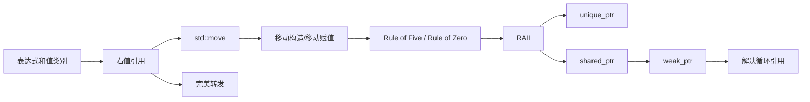
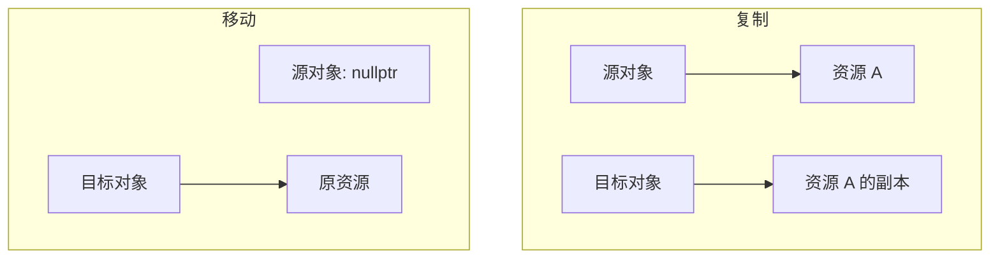
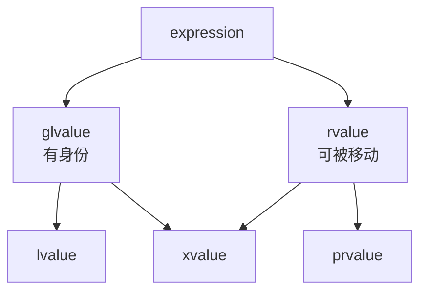
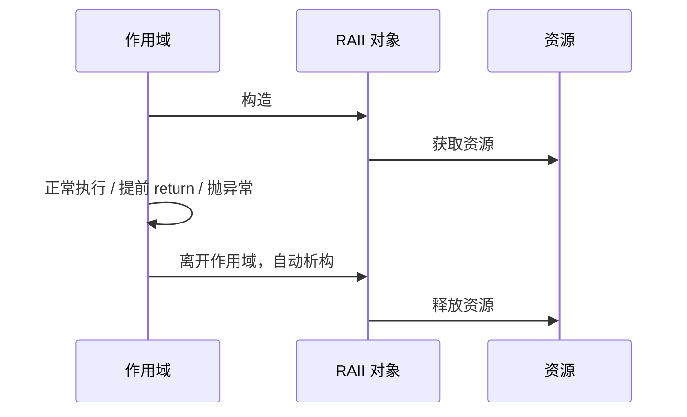
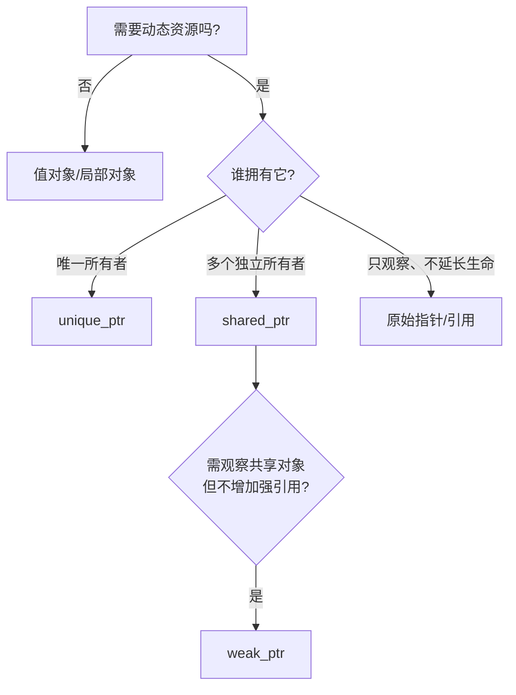
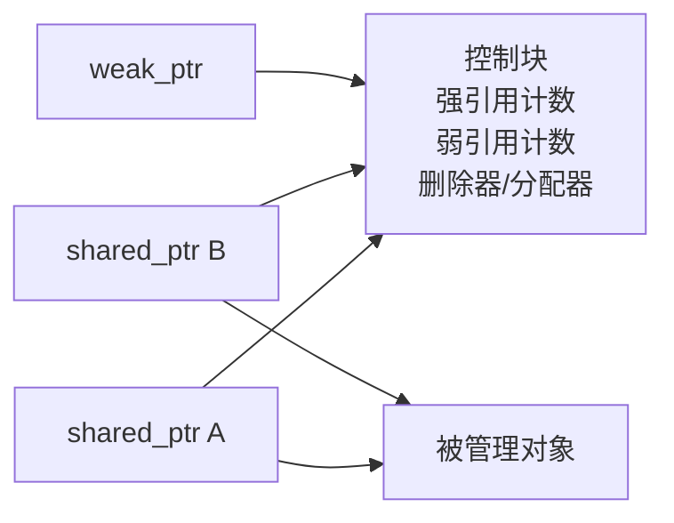

# 移动语义、RAII 与智能指针

> 面试复习目标：理解“值类别 → 移动语义 → 资源所有权 → RAII → 智能指针”这条主线，能够解释对象何时复制、何时移动，以及如何安全地管理资源。

## 1. 本章知识地图



核心思想只有一句话：

> 复制会创建一份独立资源；移动会转移资源所有权；RAII 则把资源的生命周期绑定到对象生命周期。

---

## 2. 为什么需要移动语义

管理堆内存的类在复制时通常需要：

1. 申请新内存；
2. 复制原有数据；
3. 让两个对象各自拥有一份资源。

如果源对象是一个马上就要销毁的临时对象，这次深拷贝通常没有必要。移动操作可以直接“窃取”源对象持有的指针，再把源对象置于可析构状态。



| 对比项 | 复制 | 移动 |
|---|---|---|
| 语义 | 创建独立副本 | 转移所有权 |
| 典型参数 | `const T&` | `T&&` |
| 资源开销 | 申请资源并复制内容 | 通常只交换指针/句柄 |
| 源对象 | 保持原值 | 保持有效，但值通常未指定 |

> [!IMPORTANT]
> 移动不是浅拷贝。浅拷贝会让两个对象错误地拥有同一资源；正确的移动操作必须转移所有权，并解除源对象对资源的所有权。

---

## 3. 表达式的值类别

### 3.1 C++11 之后的分类



- **lvalue（左值）**：有身份、通常可在后续继续访问的表达式。
- **prvalue（纯右值）**：用于初始化对象或计算操作数值的纯值。
- **xvalue（将亡值）**：有身份，但资源可以被复用的对象。
- **glvalue**：`lvalue + xvalue`，强调对象身份。
- **rvalue**：`prvalue + xvalue`，强调资源可被移动。

常见示例：

```cpp
int a = 1;
int b = 2;

a;               // lvalue
++a;             // lvalue
a++;              // prvalue
a + b;            // prvalue
std::move(a);     // xvalue
"hello";          // lvalue，类型是 const char[6]
```

> [!NOTE]
> “能不能取地址”只能帮助初步判断，不能作为值类别的严格定义。例如字符串字面量是左值，某些右值也可能通过其他方式观察其地址。

### 3.2 类型和值类别不是一回事

值类别属于**表达式**，不是变量的类型。最典型的面试题：

```cpp
void consume(std::string&& value) {
    // value 的类型是 std::string&&，
    // 但表达式 value 是左值，因为它是有名字的变量。
    sink(value);            // 按左值传递
    sink(std::move(value)); // 显式转成 xvalue
}
```

> [!IMPORTANT]
> **有名字的右值引用变量，在表达式中是左值。**

---

## 4. 引用绑定与临时对象生命周期

```cpp
int value = 10;

int&       r1 = value; // 非 const 左值引用绑定左值
const int& r2 = 42;    // const 左值引用可以绑定右值
int&&      r3 = 42;    // 右值引用绑定右值
```

引用绑定规则：

| 引用类型 | 左值 | const 左值 | 右值 |
|---|---:|---:|---:|
| `T&` | ✅ | ❌ | ❌ |
| `const T&` | ✅ | ✅ | ✅ |
| `T&&` | ❌ | ❌ | ✅ |

直接绑定到临时对象的局部 `const T&` 或 `T&&` 可以把临时对象的生命周期延长到该引用的作用域末尾：

```cpp
const std::string& a = std::string("hello");
std::string&& b = std::string("world");
```

但生命周期延长不会任意传递：

```cpp
const std::string& bad() {
    return std::string("temporary"); // 返回悬空引用
}
```

函数参数绑定到临时对象时，临时对象只存活到包含该函数调用的完整表达式结束，不能通过返回这个引用继续延长。

---

## 5. 移动构造函数与移动赋值运算符

### 5.1 手写资源类

```cpp
#include <cstring>
#include <utility>

class String {
public:
    String() : data_(new char[1]{}) {}

    explicit String(const char* text) {
        if (text == nullptr) {
            data_ = new char[1]{};
            return;
        }
        data_ = new char[std::strlen(text) + 1];
        std::strcpy(data_, text);
    }

    String(const String& other) {
        const char* source = other.c_str();
        data_ = new char[std::strlen(source) + 1];
        std::strcpy(data_, source);
    }

    String(String&& other) noexcept
        : data_(std::exchange(other.data_, nullptr)) {}

    String& operator=(const String& other) {
        if (this != &other) {
            String temp(other); // 先复制，失败时 *this 不变
            swap(temp);
        }
        return *this;
    }

    String& operator=(String&& other) noexcept {
        if (this != &other) {
            delete[] data_;
            data_ = std::exchange(other.data_, nullptr);
        }
        return *this;
    }

    ~String() {
        delete[] data_; // delete[] nullptr 安全
    }

    void swap(String& other) noexcept {
        std::swap(data_, other.data_);
    }

    const char* c_str() const noexcept {
        return data_ == nullptr ? "" : data_;
    }

private:
    char* data_{};
};
```

移动构造和移动赋值的区别：

```cpp
String a("A");
String b(std::move(a)); // b 正在创建：移动构造

String c("C");
c = std::move(b);      // c 已存在：移动赋值
```

移动赋值必须先释放目标对象原本拥有的资源，并考虑自移动：

```cpp
obj = std::move(obj);
```

自移动后的具体值不应成为程序逻辑的依赖，但类至少不能因此发生双重释放或资源泄漏。

### 5.2 移动后对象的状态

C++ 对一般移动后对象的要求是：

- 对象仍然有效；
- 可以安全析构；
- 可以重新赋值；
- 除非类型另有承诺，其值通常处于**有效但未指定状态**。

因此下面的用法可靠：

```cpp
std::string source = "data";
std::string target = std::move(source);
source = "reused"; // 可以重新赋值
```

但不要依赖 `source` 一定为空。标准库只对部分类型或操作提供更具体的移动后保证。

---

## 6. `std::move` 到底做了什么

`std::move` 本质上是一次类型转换，它把表达式转换为可匹配移动操作的 xvalue；它自身既不搬数据，也不清空对象。

概念化实现：

```cpp
template<class T>
constexpr std::remove_reference_t<T>&& move(T&& value) noexcept {
    return static_cast<std::remove_reference_t<T>&&>(value);
}
```

是否真的移动，取决于后续重载解析：

```cpp
std::string a = "hello";
std::string b = std::move(a); // 调用 string 的移动构造
```

### 6.1 `const` 对象通常移动不了

```cpp
const std::string source = "hello";
std::string target = std::move(source); // 通常调用复制构造
```

`std::move(source)` 的类型是 `const std::string&&`，而常见移动构造接收 `std::string&&`，不能去掉 `const`；最终只能匹配 `const std::string&` 复制构造。

### 6.2 不要滥用 `std::move`

```cpp
std::string make_string() {
    std::string result = "hello";
    return result;             // 推荐：允许 NRVO 或隐式移动
    // return std::move(result); // 可能阻止 NRVO
}
```

不需要使用 `std::move` 的典型情况：

- 返回局部对象；
- 对已经是纯右值的表达式再次 `std::move`；
- 移动后仍需要依赖对象的原值；
- 只为了“看起来更高效”而破坏代码语义。

> [!TIP]
> 判断是否应使用 `std::move`：从这一行以后，是否愿意放弃该对象当前保存的值？如果不愿意，就不要移动。

---

## 7. 复制消除、返回值优化与隐式移动

```cpp
Widget make_widget() {
    Widget value;
    return value;       // NRVO 候选；未执行 NRVO 时可隐式移动
}

Widget make_prvalue() {
    return Widget{};    // C++17 同类型 prvalue 场景保证复制消除
}
```

- **RVO/NRVO**：在返回值位置直接构造对象，可能完全不调用复制/移动构造。
- C++17 的部分 prvalue 初始化属于保证复制消除。
- `return local;` 会给编译器最大优化空间。
- `return std::move(local);` 通常不是优化，反而可能让 NRVO 失效。

因此不能仅靠构造函数打印次数推断语言语义，还需考虑编译器版本和复制消除。

---

## 8. `noexcept` 为什么对移动操作重要

```cpp
String(String&& other) noexcept;
String& operator=(String&& other) noexcept;
```

`std::vector` 扩容时需要把旧元素迁移到新内存。如果元素的移动构造可能抛异常，移动一半失败后，旧元素可能已经被修改，难以提供强异常保证。

因此标准容器通常会采取类似 `std::move_if_noexcept` 的策略：

- 移动构造为 `noexcept`：优先移动；
- 移动可能抛异常且对象可复制：可能退回复制；
- 只能移动：仍可能移动，但容器能提供的异常保证会受限制。

```cpp
static_assert(std::is_nothrow_move_constructible_v<String>);
```

> [!IMPORTANT]
> 对仅交换指针、句柄且不会抛异常的移动操作，应明确标记 `noexcept`。

---

## 9. 特殊成员函数与 Rule of Five / Rule of Zero

五个资源管理相关的特殊成员函数：

1. 析构函数；
2. 复制构造函数；
3. 复制赋值运算符；
4. 移动构造函数；
5. 移动赋值运算符。

### 9.1 Rule of Five

如果类直接拥有裸资源，并需要自定义其中一个资源管理函数，通常需要审视全部五个函数。

编译器隐式声明移动操作的条件很严格：类不能有用户声明的复制构造、移动构造、复制赋值、移动赋值和析构函数。用户声明析构函数会抑制隐式移动操作；声明移动操作也会影响隐式复制操作。

可显式表达意图：

```cpp
class Owner {
public:
    Owner(const Owner&) = delete;
    Owner& operator=(const Owner&) = delete;
    Owner(Owner&&) noexcept = default;
    Owner& operator=(Owner&&) noexcept = default;
    ~Owner() = default;
};
```

### 9.2 Rule of Zero

优先让标准 RAII 类型负责资源：

```cpp
class User {
private:
    std::string name_;
    std::vector<int> scores_;
    std::unique_ptr<Resource> resource_;
};
```

这样通常无需自己编写析构、复制或移动操作。编译器生成的行为由成员类型自然组合而成，更安全、更易维护。

> [!TIP]
> 面试中先回答 Rule of Zero：业务类不要直接管理裸资源。只有实现底层资源包装器时，才重点讨论 Rule of Five。

---

## 10. 完美转发

移动语义解决“资源转移”，完美转发解决“中间函数如何保持实参原本的值类别”。

```cpp
template<class T>
void wrapper(T&& arg) {           // T&& 位于类型推导语境：转发引用
    target(std::forward<T>(arg)); // 保持调用方的左值/右值属性
}
```

引用折叠规则可以概括为：只要组合中出现左值引用，结果就是左值引用；只有 `&& + &&` 才是右值引用。

| 实参 | 推导出的 `T` | `T&&` 折叠结果 |
|---|---|---|
| 左值 `Widget` | `Widget&` | `Widget&` |
| 右值 `Widget` | `Widget` | `Widget&&` |

```cpp
Widget w;
wrapper(w);        // forward 后仍为左值
wrapper(Widget{}); // forward 后仍为右值
```

区别：

- `std::move(x)`：无条件把 `x` 转成 xvalue；
- `std::forward<T>(x)`：根据 `T` 有条件地恢复调用者的值类别。

> [!NOTE]
> `T&&` 只有在 `T` 需要由调用实参推导时才是转发引用。`Widget&&`、类模板中已确定的 `T&&` 都只是普通右值引用。

---

## 11. RAII：资源获取即初始化

RAII（Resource Acquisition Is Initialization）把资源的获取放进构造过程，把释放放进析构函数：



RAII 管理的不只是内存：

- `new/delete`：`std::unique_ptr`、`std::shared_ptr`；
- 文件：`std::fstream`、带 `fclose` 删除器的智能指针；
- 互斥锁：`std::lock_guard`、`std::unique_lock`；
- 文件描述符、套接字、数据库连接、事务等自定义包装器。

一个资源包装器通常应做到：

- 构造成功后立即拥有有效资源；
- 析构自动释放；
- 明确复制是禁止、共享还是深复制；
- 支持安全移动；
- 析构函数不抛异常；
- 提供 `get`、`reset`、`release` 等接口时准确表达所有权。

> [!IMPORTANT]
> RAII 的价值不只是“少写 `delete`”，而是保证正常返回、提前返回和异常传播三条路径都能确定性释放资源。

---

## 12. 智能指针的选择



默认选择顺序：

1. 值语义；
2. `std::unique_ptr`；
3. 确实需要共享所有权时才使用 `std::shared_ptr`；
4. `std::weak_ptr` 表示共享对象的非拥有观察者。

原始指针和引用并未被淘汰，它们适合表达“不拥有，只借用”。

---

## 13. `std::unique_ptr`

### 13.1 独占所有权

```cpp
auto p = std::make_unique<Widget>();

// auto copy = p;              // 错误：禁止复制
auto target = std::move(p);    // 转移所有权
assert(p == nullptr);
```

主要操作：

| 操作 | 含义 |
|---|---|
| `get()` | 获取借用的裸指针，不转移所有权 |
| `release()` | 放弃所有权并返回裸指针，不销毁对象 |
| `reset(p)` | 销毁原对象，接管新指针 |
| `swap()` | 交换所有权 |
| `operator bool` | 判断是否持有对象 |

```cpp
auto ptr = std::make_unique<int>(42);
int* borrowed = ptr.get(); // borrowed 不能 delete

int* released = ptr.release();
delete released;           // 接收者必须负责释放或再次交给 RAII 对象
```

### 13.2 推荐 `make_unique`

```cpp
auto object = std::make_unique<Widget>(arg1, arg2);
auto array  = std::make_unique<int[]>(100); // C++14
```

相比直接写 `new`，它：

- 减少裸指针暴露；
- 避免重复写类型；
- 在复杂表达式中更容易保持异常安全。

动态连续序列通常优先使用 `std::vector`，而不是智能指针数组。

### 13.3 函数接口如何表达所有权

```cpp
void consume(std::unique_ptr<Widget> value); // 接收所有权
Widget* observe(Widget* value);              // 借用，可为空
void use(Widget& value);                     // 借用，不为空

std::unique_ptr<Widget> create_widget();      // 返回所有权
```

调用接收所有权的函数时必须明确移动：

```cpp
consume(std::move(ptr));
```

返回局部 `unique_ptr` 时直接 `return ptr;`，无需写 `std::move`。

### 13.4 常见错误

```cpp
std::unique_ptr<int> a(new int(1));
std::unique_ptr<int> b(a.get()); // 两个 owner 管同一地址：双重释放

delete a.get();                  // a 仍认为自己拥有对象：双重释放

int* leaked = a.release();       // 若没有后续接管或 delete：泄漏
```

移动后原指针通常为空，不能继续解引用：

```cpp
auto b = std::move(a);
// *a; // 未定义行为
```

---

## 14. `std::shared_ptr` 与控制块

`shared_ptr` 采用共享所有权。每组共同拥有对象的 `shared_ptr` 共享同一个控制块。



- 复制 `shared_ptr`：强引用计数增加；
- 销毁/重置一个 `shared_ptr`：强引用计数减少；
- 最后一个强引用消失：销毁被管理对象；
- 弱引用也全部消失后：控制块才可释放。

```cpp
auto a = std::make_shared<Widget>();
auto b = a;         // 共享同一控制块
b.reset();          // 不一定销毁对象，a 仍拥有它
```

### 14.1 推荐 `make_shared`

`make_shared` 通常把控制块和对象放在一次分配中，具有：

- 分配次数较少；
- 更好的局部性；
- 表达式级异常安全；
- 更简洁的代码。

但也有权衡：

- 不能直接指定任意自定义删除器；
- 对象和控制块合并分配时，即使强引用归零，仍存在的 `weak_ptr` 也可能使整块内存暂不释放，虽然对象本身已经析构。

### 14.2 最危险的错误：重复控制块

```cpp
Widget* raw = new Widget;
std::shared_ptr<Widget> a(raw);
std::shared_ptr<Widget> b(raw); // 错误：独立控制块，最终重复 delete
```

从已有智能指针的 `get()` 再构造 `shared_ptr` 同样错误：

```cpp
auto a = std::make_shared<Widget>();
std::shared_ptr<Widget> b(a.get()); // 错误
```

正确做法是复制已有 `shared_ptr`：

```cpp
auto b = a;
```

### 14.3 别用 `use_count()` 写业务同步

`use_count()` 适合调试和观察，不适合判断“现在只有我一个拥有者”再做并发决策。计数读取之后，其他线程可能立即复制或销毁所有者。

共享控制块的不同 `shared_ptr` 实例可以并发复制和销毁，但这不代表：

- 被指向的对象自动线程安全；
- 同一个 `shared_ptr` 变量可在无同步下被多个线程同时修改。

### 14.4 别为了方便而共享所有权

接口语义建议：

```cpp
void retain(std::shared_ptr<Widget> p);       // 函数要保留一份所有权
void inspect(const Widget& value);            // 只访问对象
void maybe_inspect(const Widget* value);      // 可空借用
```

只有被调用者确实需要延长对象生命周期时，才按值传递 `shared_ptr`。

---

## 15. `std::weak_ptr` 与循环引用

### 15.1 循环引用为何泄漏


外部所有者已经销毁后，A 和 B 仍互相贡献一个强引用，计数永远无法归零。

解决方法是把不代表所有权的一条边改成 `weak_ptr`：

```cpp
class Child;

class Parent {
public:
    std::shared_ptr<Child> child; // Parent 拥有 Child
};

class Child {
public:
    std::weak_ptr<Parent> parent; // Child 只观察 Parent
};
```

应根据领域中的所有权方向决定哪条边是弱引用，而不是机械地“随便改一边”。

### 15.2 安全访问

`weak_ptr` 不提供 `operator*` 或 `operator->`。必须先调用 `lock()`：

```cpp
if (auto owner = weak.lock()) {
    owner->work();
}
```

不要先 `expired()` 再 `lock()`：

```cpp
if (!weak.expired()) {
    // 到这里对象仍可能已被其他线程释放
}
```

一次 `lock()` 会原子地尝试获得临时强引用，并返回有效或空的 `shared_ptr`。

典型用途：

- 双向关系中的反向引用；
- 观察者；
- 不应延长对象生命周期的缓存；
- 异步回调中的生命周期探测。

---

## 16. `enable_shared_from_this`

成员函数有时需要取得“与现有所有者共享同一控制块”的 `shared_ptr`。不能直接从 `this` 构造：

```cpp
class Bad {
public:
    std::shared_ptr<Bad> self() {
        return std::shared_ptr<Bad>(this); // 错误：创建新控制块
    }
};
```

正确方式：

```cpp
class Session : public std::enable_shared_from_this<Session> {
public:
    std::shared_ptr<Session> self() {
        return shared_from_this();
    }

    std::weak_ptr<Session> weak_self() noexcept {
        return weak_from_this(); // C++17
    }
};

auto session = std::make_shared<Session>();
auto same_owner = session->self();
```

使用前提：

- 对象已经由某个 `shared_ptr` 管理；
- 不能在对象刚进入构造函数、尚未建立共享所有权时调用；
- 栈对象或由 `unique_ptr` 单独管理的对象调用 `shared_from_this()` 会抛出 `std::bad_weak_ptr`；
- `weak_from_this()` 不抛异常，但可能得到空的 `weak_ptr`。

若需要在创建后执行依赖 `shared_from_this()` 的初始化，可使用工厂函数：

```cpp
class Service : public std::enable_shared_from_this<Service> {
public:
    static std::shared_ptr<Service> create() {
        auto result = std::shared_ptr<Service>(new Service);
        result->init();
        return result;
    }

private:
    Service() = default;
    void init() {
        auto self = shared_from_this();
    }
};
```

> [!NOTE]
> 私有构造函数与 `make_shared` 经常产生访问控制问题，因为真正调用构造函数的是标准库内部代码。可使用受控 token/enabler 模式，或在工厂内部谨慎采用 `shared_ptr(new T)`。

---

## 17. 自定义删除器

不同资源必须使用与获取方式匹配的释放操作：

| 获取 | 释放 |
|---|---|
| `new T` | `delete` |
| `new T[]` | `delete[]` |
| `malloc` | `free` |
| `fopen` | `fclose` |
| `open` | `close` |

管理 `FILE*`：

```cpp
struct FileCloser {
    void operator()(std::FILE* file) const noexcept {
        if (file != nullptr) {
            std::fclose(file);
        }
    }
};

using FilePtr = std::unique_ptr<std::FILE, FileCloser>;
FilePtr file(std::fopen("data.txt", "w"));

if (!file) {
    throw std::runtime_error("fopen failed");
}
```

差异：

- `unique_ptr<T, Deleter>`：删除器属于指针类型的一部分；
- `shared_ptr<T>`：删除器类型擦除后存于控制块中，不属于 `shared_ptr<T>` 的静态类型。

析构路径不能通过抛异常报告 `fclose` 等操作的失败。如果调用方必须处理关闭错误，应提供可显式调用的 `close()`，同时让析构函数承担兜底清理。

---

## 18. 数组、多态与别名所有权

### 18.1 智能指针数组

```cpp
auto unique_array = std::make_unique<int[]>(100); // C++14
std::shared_ptr<int[]> shared_array(new int[100]);// 数组特化：C++17
```

`std::make_shared<T[]>(n)` 到 C++20 才支持。大多数动态数组场景优先选择 `std::vector<T>`。

### 18.2 多态基类必须有虚析构函数

```cpp
class Base {
public:
    virtual ~Base() = default;
    virtual void run() = 0;
};

class Derived : public Base {
public:
    void run() override {}
};

std::unique_ptr<Base> p = std::make_unique<Derived>();
```

如果通过 `Base*` 删除 `Derived`，而 `Base` 析构函数不是虚函数，则行为未定义。本章 `14_expand.cc` 中的 `Father` 应补充虚析构函数。

### 18.3 `shared_ptr` 的别名构造

需要共享整个对象的生命周期，但只暴露其中一个子对象时：

```cpp
struct Record {
    int value;
};

auto owner = std::make_shared<Record>();
std::shared_ptr<int> alias(owner, &owner->value);
```

`alias` 保存的是成员地址，但共享 `owner` 的控制块；只要 `alias` 存活，整个 `Record` 就仍然存活。

---

## 19. 异常安全

异常安全通常分为：

- **无异常保证**：失败后仅保证程序基础不变量，可能有副作用；
- **基本保证**：失败后对象仍有效、资源不泄漏；
- **强保证**：失败时状态像操作从未发生；
- **不抛异常保证**：操作承诺不抛异常。

不安全的复制赋值：

```cpp
delete[] data_;
data_ = new char[n]; // 若 new 抛异常，原资源已丢失
```

更安全的策略是“先成功获取，再提交修改”：

```cpp
String& operator=(const String& other) {
    String temp(other); // 此处失败，*this 完全不变
    swap(temp);
    return *this;
}
```

这就是 copy-and-swap，通常能自然提供强异常保证和自赋值安全。

RAII 是异常安全的基础：每一份已经成功获得的资源，都应立即交给一个栈上对象管理。

---

## 20. `auto_ptr` 为什么被淘汰

`std::auto_ptr` 的“复制”会偷偷转移所有权：

```cpp
// 历史代码，不要使用
std::auto_ptr<int> a(new int(1));
std::auto_ptr<int> b = a; // a 被置空
```

这违反普通复制语义的直觉，也不满足标准容器对元素复制行为的要求。

- C++11 已弃用；
- C++17 已从标准中移除；
- 某些标准库仍可能以兼容扩展提供并给出警告。

本章 `07_smart_pointer.cc` 中移动所有权后继续解引用原 `auto_ptr` 会产生未定义行为。现代代码应使用 `unique_ptr`。

---

## 21. 综合案例：文本查询中的共享所有权

本章练习 `practice/04_text_query_smart_ptr.cc` 使用：

- `shared_ptr<vector<string>>` 保存原始文本；
- `map<string, shared_ptr<set<int>>>` 保存单词对应的行号；
- 查询结果按值返回，并通过 `shared_ptr` 与查询对象共享数据。

它体现了一个合理需求：即使查询对象的局部工作完成，返回的查询结果仍能延长底层数据的生命周期。

可进一步改进：

- 重复读文件前清空旧状态，避免数据累积；
- 检查文件打开失败并返回明确错误；
- 使用 `std::size_t` 表示行号与计数；
- 统一大小写、清理标点；
- 用 `make_shared` 代替 `reset(new ...)`；
- 查询结果持有 `shared_ptr<const ...>`，表达只读共享；
- 避免每次 `std::endl` 强制刷新；
- 用一个结构体统一管理单词的频次和行号，避免两张表状态不一致。

> [!NOTE]
> 不是所有共享数据都需要 `shared_ptr`。如果所有权清晰、结果不会独立于查询对象存在，值成员或引用可能更简单。

---

## 22. 高频面试问题

### 22.1 `std::move` 是否真的执行移动？

不执行。它只是把表达式转换为 xvalue。最终是复制还是移动，由目标类型的重载、`const` 属性及可访问性决定。

### 22.2 移动构造为什么通常要 `noexcept`？

容器扩容时需要异常安全。若移动可能抛异常且对象可复制，容器可能选择复制，从而失去移动带来的性能收益。

### 22.3 移动后的对象还能用吗？

能析构、能重新赋值，也能调用不依赖具体值的操作；但除非类型有明确保证，不应依赖其具体内容。

### 22.4 `unique_ptr` 和 `shared_ptr` 如何选择？

默认使用 `unique_ptr`。只有多个对象确实需要独立地延长同一资源生命周期时才使用 `shared_ptr`。只观察共享对象用 `weak_ptr`、指针或引用。

### 22.5 `shared_ptr` 是否线程安全？

共享控制块的不同 `shared_ptr` 对象可以并发复制和销毁；同一个 `shared_ptr` 变量的并发写入、以及被管理对象本身的并发访问仍需同步。

### 22.6 `weak_ptr` 如何解决循环引用？

它不增加强引用计数。把所有权图中的非拥有边改为 `weak_ptr` 后，外部强引用消失时对象可以正常析构。

### 22.7 为什么不能 `shared_ptr<T>(this)`？

它通常会创建独立控制块，多个控制块最终对同一地址重复删除。应使用 `enable_shared_from_this`，且对象必须已由 `shared_ptr` 管理。

### 22.8 `make_shared` 和 `shared_ptr(new T)` 的区别？

`make_shared` 通常一次分配对象与控制块，效率和异常安全更好；后者可用于自定义删除器、某些私有构造工厂等特殊情形。

### 22.9 `push_back` 与 `emplace_back` 是否一定有性能差距？

不一定。`push_back(T{...})` 在移动廉价且编译器优化充分时也很高效。`emplace_back(args...)` 直接用参数构造元素，但不意味着在所有场景都更快，还应注意显式构造和重载选择。

### 22.10 Rule of Five 和 Rule of Zero 谁更重要？

Rule of Zero 更适合业务代码：用标准 RAII 成员组合资源。Rule of Five 主要用于必须亲自实现底层资源所有权的类。

---

## 23. 易错结论速查

| 易错说法 | 正确理解 |
|---|---|
| 右值引用变量是右值 | 有名字的右值引用变量表达式是左值 |
| `std::move` 会移动对象 | 它只做类型转换 |
| 移动后的对象一定为空 | 通常仅保证有效但值未指定 |
| `const` 对象也能高效移动 | 通常因 `const T&&` 无法匹配 `T&&` 而复制 |
| 返回局部对象要写 `std::move` | 直接返回，让 NRVO/隐式移动工作 |
| 有移动构造就一定会移动 | 还受值类别、`const`、可访问性、复制消除影响 |
| `shared_ptr` 能避免所有泄漏 | 循环强引用仍会泄漏 |
| 从同一裸指针构造多个 `shared_ptr` | 会形成独立控制块，可能重复释放 |
| `shared_ptr` 让对象线程安全 | 它只解决部分所有权计数并发问题 |
| `weak_ptr::expired()` 后再访问安全 | 存在竞态，应直接 `lock()` |
| 基类有虚函数就能多态删除 | 基类还必须有虚析构函数 |
| `get()` 返回的指针可以手动删除 | `get()` 只借用，所有权仍在智能指针 |
| `release()` 会释放对象 | 它只放弃所有权，不调用删除器 |
| RAII 只负责内存 | 任何成对获取/释放的资源都适用 |

---

## 24. 源码阅读索引

| 文件 | 主题 |
|---|---|
| `01_move_intro.cc` | 深拷贝成本与移动语义动机 |
| `02_left_right.cc` | 左值、右值与引用绑定 |
| `03_move_constructor.cc` | 移动构造与移动赋值 |
| `04_std_move.cc` | `std::move` 的使用 |
| `05_copy_constructor.cc` | 参数传递、返回值与复制/移动 |
| `06_RAII.cc` | 自定义 RAII 管理器 |
| `07_smart_pointer.cc` | `auto_ptr` 的历史问题 |
| `08_unique_ptr.cc` | 独占所有权 |
| `09_shared_ptr.cc` | 共享所有权与常见误用 |
| `10_circle_ref.cc` | 循环引用 |
| `11_weak_ptr.cc` | 非拥有观察与 `lock()` |
| `12_deleter.cc` | 自定义删除器 |
| `13_error_case.cc` | `shared_ptr(this)` 错误与 `shared_from_this` |
| `14_expand.cc` | 智能指针、多态与数组 |
| `practice/04_text_query_smart_ptr.cc` | 智能指针综合案例 |
| `practice/05_unique_ptr_misuse.cpp` | `unique_ptr` 误用 |
| `practice/06_shared_ptr_misuse.cpp` | `shared_ptr` 误用 |
| `practice/07_circle_reference.cc` | 循环引用修复 |

---

## 25. 复习清单

- [ ] 能画出 C++11 表达式值类别关系图
- [ ] 能解释“右值引用变量本身是左值”
- [ ] 能手写异常安全的复制赋值
- [ ] 能手写 `noexcept` 移动构造与移动赋值
- [ ] 能解释 `std::move` 与 `std::forward` 的区别
- [ ] 能说明 NRVO 与 `return std::move(local)` 的关系
- [ ] 能说明 Rule of Five 和 Rule of Zero
- [ ] 能用 RAII 处理异常和提前返回
- [ ] 能根据所有权选择值、引用、裸指针或智能指针
- [ ] 能解释 `shared_ptr` 控制块及重复控制块问题
- [ ] 能使用 `weak_ptr::lock()` 打破循环引用
- [ ] 能正确使用 `enable_shared_from_this`
- [ ] 能为文件等非内存资源编写删除器
- [ ] 能解释多态基类为何需要虚析构函数
