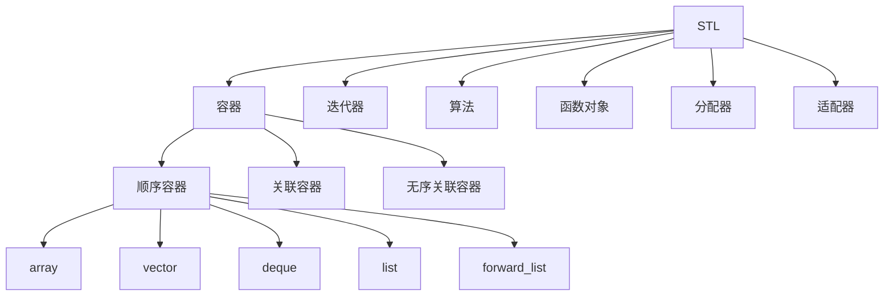
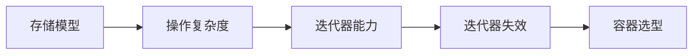
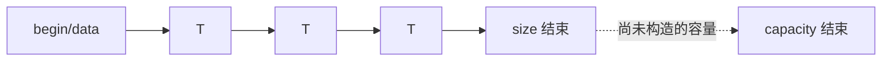
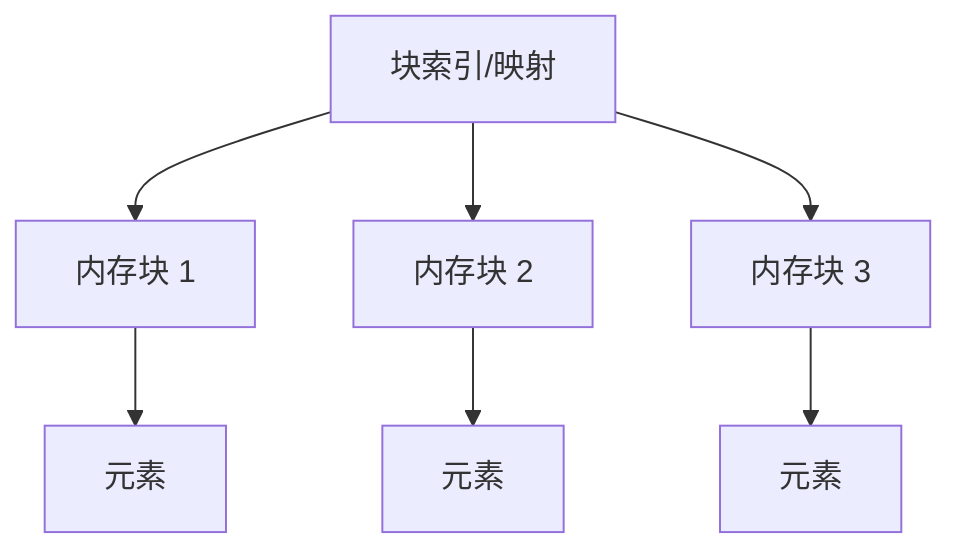
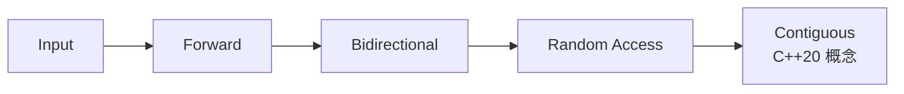
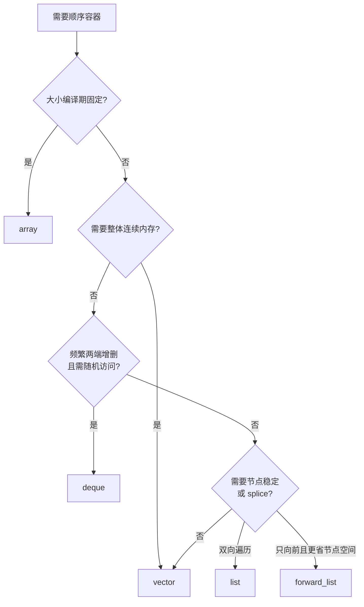

# STL 顺序容器

> 面试复习目标：理解 STL 的基本组成，掌握 `array`、`vector`、`deque`、`list`、`forward_list` 的存储特点、复杂度和迭代器失效规则，并能正确使用插入、删除、容量管理及链表专属操作。

## 1. 知识地图



本章主线：



> [!IMPORTANT]
> 容器选型不能只看某一个操作的大 O。还要同时考虑访问模式、缓存局部性、内存开销、迭代器稳定性和实际数据规模。

---

## 2. STL 的六个常见组成

| 组成 | 作用 | 示例 |
|---|---|---|
| 容器 | 存放元素 | `vector`、`list`、`map` |
| 迭代器 | 表示位置和遍历能力 | `begin()`、`end()` |
| 算法 | 对迭代器区间执行操作 | `sort`、`find` |
| 函数对象 | 定制算法行为 | `std::less<>`、lambda |
| 分配器 | 抽象内存分配策略 | `std::allocator<T>` |
| 适配器 | 在已有组件上提供新接口 | `stack`、`queue` |

STL 的关键设计是让算法主要依赖迭代器，而不是依赖某个具体容器：

```cpp
std::sort(values.begin(), values.end());
```

但算法对迭代器能力有要求，例如 `std::sort` 需要随机访问迭代器，因此不能直接用于 `std::list`。

---

## 3. 什么是顺序容器

顺序容器按**位置**组织元素。元素次序由插入位置和后续操作决定，并不意味着永远保持插入时间顺序：

```cpp
std::vector<int> values{1, 3};
values.insert(values.begin() + 1, 2); // 1, 2, 3
```

与关联容器的区别：

- 顺序容器：位置是主要组织方式；
- 有序关联容器：比较器定义的键顺序；
- 无序关联容器：哈希桶和键等价关系。

---

## 4. 五种顺序容器对比

| 容器 | 存储结构 | 大小 | 随机访问 | 头部增删 | 尾部增删 | 中间增删 |
|---|---|---|---:|---:|---:|---:|
| `array` | 连续固定数组 | 编译期固定 | `O(1)` | 不支持改变大小 | 不支持改变大小 | 不支持改变大小 |
| `vector` | 连续动态数组 | 可变 | `O(1)` | `O(n)`，无 `push_front` | 均摊 `O(1)` | `O(n)` |
| `deque` | 分段连续结构 | 可变 | `O(1)` | `O(1)` | `O(1)` | `O(n)` |
| `list` | 双向链表 | 可变 | 不支持 | `O(1)` | `O(1)` | 已知位置时 `O(1)` |
| `forward_list` | 单向链表 | 可变 | 不支持 | `O(1)` | 无 `push_back` | 已知前驱时 `O(1)` |

复杂度中的“已知位置”非常重要：

```cpp
auto it = std::find(list.begin(), list.end(), target); // O(n)
list.insert(it, value);                                // O(1)
```

完整操作仍是 `O(n)`。不能笼统地说“链表插入永远比 vector 快”。

---

## 5. `std::array`

```cpp
std::array<int, 5> values{1, 2, 3, 4, 5};
```

特点：

- 元素数量属于类型的一部分；
- 连续存储；
- 没有动态分配；
- 支持随机访问；
- 支持标准容器接口，如 `begin/end/size/front/back/data`；
- 不能 `push_back`、`insert`、`erase` 或 `resize`。

```cpp
static_assert(!std::is_same_v<
    std::array<int, 4>,
    std::array<int, 5>>);
```

访问：

```cpp
values[0];    // 不检查越界
values.at(0); // 检查越界，失败抛 std::out_of_range
```

相比原生数组：

- 可以复制、赋值；
- 知道自身大小；
- 容易与标准算法配合；
- 不会在普通按值传参时自动退化为指针。

### 5.1 零长度 `array`

`std::array<T, 0>` 合法，但：

- `begin() == end()`；
- `empty()` 为真；
- `front()`、`back()` 不可调用；
- `data()` 的具体指针值不能用于解引用。

---

## 6. `std::vector`

`vector` 是最常用的顺序容器，元素连续存储：



主要优势：

- `O(1)` 随机访问；
- 可通过 `data()` 与需要连续内存的接口交互；
- 顺序遍历缓存局部性好；
- 尾部插入均摊常数复杂度；
- 每个元素不需要额外节点指针。

主要代价：

- 扩容时重新分配并搬迁全部元素；
- 中间插入/删除需要移动后续元素；
- 扩容会使所有指针、引用和迭代器失效。

> [!TIP]
> 不确定选什么顺序容器时，通常先选 `vector`，再用测量和明确需求证明需要其他容器。

---

## 7. `std::deque`

`deque` 是 double-ended queue，通常由一组固定大小内存块加索引结构组成：



特点：

- 头尾插入和删除都是常数复杂度；
- 支持 `operator[]` 和随机访问迭代器；
- 元素总体不保证连续，不能把整个 `deque` 当成一段数组；
- 中间插入/删除仍是线性复杂度；
- 迭代器失效规则比 `vector/list` 更复杂。

适合：

- 频繁在两端增删；
- 同时需要随机访问；
- 不要求整体连续内存。

`std::queue` 默认通常以 `deque` 作为底层容器。

---

## 8. `std::list`

`list` 是双向链表，每个元素通常位于独立节点：

```mermaid
flowchart LR
    N1[prev | value | next] <--> N2[prev | value | next]
    N2 <--> N3[prev | value | next]
```

优势：

- 已知迭代器位置时插入、删除为常数复杂度；
- 插入通常不使已有迭代器、指针和引用失效；
- 删除只使被删除元素的迭代器、指针和引用失效；
- `splice` 可在链表间转移节点而不复制元素；
- 元素地址稳定。

代价：

- 不支持随机访问；
- 每个节点有前后指针和分配开销；
- 元素分散，缓存局部性差；
- 遍历通常明显慢于 `vector`；
- 查找位置仍是 `O(n)`。

适合节点稳定性、频繁节点转移等明确场景，而不是“中间插入看起来是 `O(1)`”就直接选择。

---

## 9. `std::forward_list`

`forward_list` 是单向链表：

```mermaid
flowchart LR
    H[before_begin] --> N1[value | next]
    N1 --> N2[value | next]
    N2 --> N3[value | null]
```

特点：

- 只支持向前遍历；
- 没有 `back()`、`push_back()`；
- 使用 `before_begin()`、`insert_after()`、`erase_after()`；
- 标准接口没有 `size()`，以维持最小空间和某些常数复杂度承诺；
- 节点通常只需一个链接指针，比 `list` 更轻。

```cpp
std::forward_list<int> values{2, 3};
values.push_front(1);

auto before = values.before_begin();
values.insert_after(before, 0);
```

删除当前节点通常需要保存前驱迭代器，这与双向链表不同。

---

## 10. 初始化方式与括号陷阱

```cpp
std::vector<int> a;                  // 空
std::vector<int> b{1, 2, 3};         // 初始化列表
std::vector<int> c(b);               // 拷贝
std::vector<int> d(b.begin(), b.end());// 迭代器区间
std::vector<int> e(3, 100);          // 3 个 100
```

圆括号和花括号含义可能完全不同：

```cpp
std::vector<int> x(3, 100); // {100, 100, 100}
std::vector<int> y{3, 100}; // {3, 100}
```

范围通常采用半开区间 `[first, last)`：

- 包含 `first`；
- 不包含 `last`；
- 空区间可以表示为 `first == last`；
- 区间长度可以自然表示为 `distance(first, last)`。

> [!IMPORTANT]
> 面试和编码时看到容器构造，先判断调用的是“元素个数构造”还是 `initializer_list` 构造。

---

## 11. 遍历方式

### 11.1 范围 `for`

```cpp
for (const auto& value : container) {
    std::cout << value;
}
```

选择：

- `auto value`：复制元素；
- `auto& value`：可修改元素；
- `const auto& value`：只读且避免复制；
- `auto&& value`：泛型范围中保留代理引用等特殊返回类型。

### 11.2 迭代器

```cpp
for (auto it = container.cbegin();
     it != container.cend();
     ++it) {
    std::cout << *it;
}
```

只读遍历使用 `cbegin/cend` 可以明确意图。

### 11.3 下标

只适合随机访问容器：

```cpp
for (std::size_t i = 0; i < values.size(); ++i) {
    std::cout << values[i];
}
```

本章源码使用 `int i < container.size()`，会触发有符号/无符号比较警告。索引通常使用容器的 `size_type` 或 `std::size_t`。

---

## 12. 迭代器类别与容器能力



| 容器 | 典型迭代器能力 |
|---|---|
| `forward_list` | Forward |
| `list` | Bidirectional |
| `deque` | Random Access |
| `vector` | Random Access；连续存储 |
| `array` | Random Access；连续存储 |

能力示例：

```cpp
++it;       // Forward 支持
--it;       // Bidirectional 支持
it += n;    // Random Access 支持
it[n];      // Random Access 支持
```

`std::sort` 依赖随机访问迭代器：

```cpp
std::sort(vector.begin(), vector.end()); // 正确
std::sort(deque.begin(), deque.end());   // 正确
// std::sort(list.begin(), list.end());  // 错误
```

`list` 使用自己的成员 `sort()`。

---

## 13. 元素访问

| 接口 | 适用范围 | 空/越界行为 |
|---|---|---|
| `operator[]` | `array/vector/deque` | 不检查越界 |
| `at()` | `array/vector/deque` | 越界抛 `out_of_range` |
| `front()` | 本章所有顺序容器 | 空容器调用行为未定义 |
| `back()` | 除 `forward_list` | 空容器调用行为未定义 |
| `data()` | 连续容器 | 返回底层连续区域指针 |

```cpp
if (!values.empty()) {
    use(values.front());
}
```

`pop_back/pop_front` 也不返回被删除值，且对空容器调用行为未定义：

```cpp
auto value = std::move(values.back());
values.pop_back();
```

先读取，再删除。

---

## 14. `size`、`capacity` 与内存

对 `vector`：

- `size()`：已经构造的元素个数；
- `capacity()`：无需重新分配即可容纳的元素上限；
- 始终有 `size() <= capacity()`。

```cpp
std::vector<int> values;
values.reserve(100);

values.size();     // 0
values.capacity(); // 至少 100
```

容量区间中的内存尚未包含已构造的 `T`，不能通过 `operator[]` 访问：

```cpp
values.reserve(10);
// values[0] = 1; // 错误：size 仍为 0，越界
```

### 14.1 扩容策略

标准没有规定 `vector` 每次必须增长 1.5 倍或 2 倍，只要求相关复杂度保证。具体增长因实现而异。

扩容一般包含：

1. 分配更大内存；
2. 移动或复制原元素；
3. 析构旧元素；
4. 释放旧内存；
5. 更新内部指针。

移动构造为 `noexcept` 有助于容器在扩容时选择移动并维持异常保证。

---

## 15. `reserve`、`resize`、`shrink_to_fit`

### 15.1 `reserve`

```cpp
values.reserve(n);
```

- 只影响容量，不改变元素个数；
- 若 `n <= capacity()`，通常无效果；
- 若发生重新分配，所有迭代器、引用和指针失效；
- 已知大致元素数量时可减少多次扩容。

不要在每次 `push_back` 前都 `reserve(size + 1)`，这可能破坏几何增长策略，使总搬迁成本退化。

### 15.2 `resize`

```cpp
values.resize(n);
values.resize(n, value);
```

- 缩小：析构尾部多余元素；
- 扩大：构造新元素；
- 会改变 `size()`；
- 扩大可能触发重新分配。

`resize` 不是“只预留空间”，`reserve` 也不是“创建元素”。

### 15.3 `shrink_to_fit`

```cpp
values.shrink_to_fit();
```

它是非绑定请求，标准不保证一定减少容量。若实现执行重新分配，相关迭代器、引用和指针会失效。

需要强制释放全部存储时，可让容器销毁，或根据所有权语义构造新容器再交换；不要仅为追求 `capacity == size` 频繁收缩。

---

## 16. 尾部和头部操作

| 操作 | `vector` | `deque` | `list` | `forward_list` |
|---|---:|---:|---:|---:|
| `push_back` | ✅ | ✅ | ✅ | ❌ |
| `pop_back` | ✅ | ✅ | ✅ | ❌ |
| `push_front` | ❌ | ✅ | ✅ | ✅ |
| `pop_front` | ❌ | ✅ | ✅ | ✅ |

`vector` 虽没有 `push_front`，仍可：

```cpp
values.insert(values.begin(), value);
```

但这是 `O(n)`，所有后续元素都需移动。若频繁在头部操作，应考虑 `deque`。

---

## 17. `insert` 的常见重载

```cpp
auto it1 = container.insert(pos, value);
auto it2 = container.insert(pos, count, value);
auto it3 = container.insert(pos, {v1, v2});
auto it4 = container.insert(pos, first, last);
```

对这些顺序容器，插入位置通常表示“在 `pos` 之前插入”。返回值通常指向第一个新插入元素；具体重载和标准版本应查对应接口。

使用返回值：

```cpp
auto it = values.begin() + 1;
it = values.insert(it, 42);
```

这不仅处理可能的迭代器失效，也清楚地让 `it` 指向新元素。

### 17.1 范围插入注意事项

- 区间必须有效；
- 来源区间和目标位置的自插入规则取决于具体容器和重载，不能盲目假设安全；
- 输入迭代器可能只能单遍读取；
- 插入大量元素前，`vector` 可提前 `reserve`；
- 移动元素可使用移动迭代器或其他移动接口。

---

## 18. `emplace` 与 `insert`

```cpp
container.insert(pos, Point{1, 2});
container.emplace(pos, 1, 2);

container.push_back(Point{1, 2});
container.emplace_back(1, 2);
```

`emplace` 使用传入参数在容器元素位置构造对象，内部通常使用完美转发。

可能的优势：

- 避免显式创建临时对象；
- 支持不可复制/不可移动但能原位构造的类型（仍受容器其他操作要求限制）；
- 参数直接匹配元素构造函数。

但 `emplace` 不保证永远更快：

- `push_back(T{...})` 的移动可能很廉价；
- 编译器和语言规则可能消除临时对象成本；
- `vector` 扩容仍需搬迁已有元素；
- 若已经有一个 `T` 对象，`push_back` 往往语义更直接；
- `emplace` 可能调用意外的显式构造函数。

```cpp
std::vector<std::vector<int>> rows;
rows.emplace_back(10, 20); // 构造含 10 个 20 的 vector
```

并不是插入两个元素 `10` 和 `20`。

> [!NOTE]
> 已经有对象时用 `push_back/insert`；手中是构造参数且意图明确时考虑 `emplace_back/emplace`。

---

## 19. 本章 `Point` 与移动语义

`05_emplace.cc` 中的 `Point` 自定义了：

- 复制构造函数；
- 析构函数；

却没有移动构造函数。用户声明析构函数会抑制隐式移动生成，因此即使传入右值，某些插入路径也可能复制。

若类型只含两个 `int`，默认特殊成员即可：

```cpp
class Point {
public:
    Point(int x, int y)
        : x_(x), y_(y) {
    }

private:
    int x_;
    int y_;
};
```

遵循 Rule of Zero 后，编译器会生成合理复制/移动行为。

---

## 20. `erase` 的返回值

```cpp
it = container.erase(it);
```

返回被删元素之后的位置；若删的是最后一个元素，则返回 `end()`。

因此不能无条件解引用：

```cpp
it = container.erase(it);
if (it != container.end()) {
    std::cout << *it;
}
```

范围删除：

```cpp
auto next = container.erase(first, last);
```

删除 `[first, last)`，返回原 `last` 对应元素的新位置。

> [!WARNING]
> 被删除元素的迭代器一定失效。源码 `04_basic_operation_erase.cc` 中的 `test1/test3/test5` 故意在删除后继续解引用或使用旧迭代器，属于未定义行为，不应运行或模仿。

---

## 21. 遍历时安全删除

```cpp
for (auto it = values.begin(); it != values.end();) {
    if (should_remove(*it)) {
        it = values.erase(it);
    } else {
        ++it;
    }
}
```

关键点：

- 删除时使用 `erase` 返回值；
- 不删除时才 `++it`；
- `for` 的递增部分留空；
- 每次循环先保证 `it != end()` 再解引用。

适用于 `vector/deque/list` 等提供相应 `erase` 返回值的容器。

对 `forward_list` 需要维护前驱：

```cpp
auto prev = values.before_begin();
auto curr = values.begin();

while (curr != values.end()) {
    if (should_remove(*curr)) {
        curr = values.erase_after(prev);
    } else {
        prev = curr;
        ++curr;
    }
}
```

---

## 22. erase-remove 惯用法

通用算法 `std::remove` 不会改变容器大小。它把保留元素移动到前部，并返回新的逻辑结尾：

```cpp
auto new_end = std::remove(
    values.begin(), values.end(), target);

values.erase(new_end, values.end());
```

合写：

```cpp
values.erase(
    std::remove(values.begin(), values.end(), target),
    values.end());
```

条件删除：

```cpp
values.erase(
    std::remove_if(values.begin(), values.end(), pred),
    values.end());
```

适合 `vector/deque/string`。对 `list`，成员函数更直接高效：

```cpp
items.remove(value);
items.remove_if(pred);
```

C++20 提供统一辅助：

```cpp
std::erase(values, target);
std::erase_if(values, pred);
```

---

## 23. `vector` 迭代器失效规则

### 23.1 插入

若发生重新分配：

- 所有迭代器、引用和指针失效，包括旧 `end()`。

若没有重新分配：

- 插入位置之前的迭代器、引用和指针保持有效；
- 插入位置及其后的失效；
- 旧 `end()` 失效。

### 23.2 删除

```cpp
values.erase(pos);
```

- 被删除位置及其后的迭代器、引用和指针失效；
- 删除位置之前的保持有效；
- 旧 `end()` 失效。

### 23.3 `push_back`

- 扩容：全部失效；
- 未扩容：已有元素的引用/指针和此前元素迭代器保持有效，旧 `end()` 失效。

### 23.4 `reserve`

- 真正增加容量并重分配：全部失效；
- 请求不超过当前容量：不重分配，不失效。

永远不要通过观察“这次好像没有崩溃”判断迭代器是否有效，应依据接口规则。

---

## 24. `list` / `forward_list` 失效规则

节点式容器通常具有强稳定性：

- 插入不使已有元素的迭代器、引用和指针失效；
- 删除只使被删除元素对应的迭代器、引用和指针失效；
- `splice` 后指向被转移节点的迭代器和引用仍有效，但节点属于目标容器；
- `sort/reverse/merge` 通过重连节点完成，元素引用和迭代器通常保持有效。

```cpp
auto it = items.begin();
items.insert(it, value);
// it 仍指向原来的元素，不会自动改为新元素
```

若希望指向新元素，仍需接收 `insert` 返回值。

稳定不代表可使用被删除节点的迭代器：

```cpp
items.erase(it);
// *it; // 未定义行为
```

---

## 25. `deque` 失效规则

`deque` 规则更细，不应简单记成“和 vector 一样”或“引用永远稳定”。

常见规则概括：

- 中间插入：使所有迭代器和引用失效；
- 两端插入：使迭代器失效，但已有元素的引用通常保持有效；
- 中间删除：可能使所有迭代器和引用失效；
- 仅删除首元素：主要使被删元素对应的迭代器/引用失效；
- 仅删除尾元素：被删元素以及旧尾后迭代器失效；
- 具体边界操作应按所用标准版本查对应接口规定。

最稳妥的代码习惯：

```cpp
it = deque.insert(it, value);
it = deque.erase(it);
```

操作后不要继续使用未被规则明确保证有效的旧迭代器。

本章 `03_basic_operation_insert.cc::test4` 和 `04_basic_operation_erase.cc::test3` 故意展示错误用法，继续使用旧迭代器属于未定义行为。

---

## 26. 失效规则速查表

| 容器/操作 | 插入 | 删除 |
|---|---|---|
| `array` | 无结构修改 | 无结构修改 |
| `vector` | 扩容全部失效；否则插入点及之后失效 | 删除点及之后失效 |
| `deque` | 中间通常全部失效；两端也会使迭代器失效 | 中间可能全部失效；端点规则较宽松 |
| `list` | 已有迭代器/引用保持有效 | 仅被删元素失效 |
| `forward_list` | 已有迭代器/引用保持有效 | 仅被删元素失效 |

> [!IMPORTANT]
> 迭代器、指针和引用的失效规则可能不同，尤其是 `deque`。需要保存其中任何一种时都要分别确认。

---

## 27. `clear`、`assign` 与 `swap`

### 27.1 `clear`

```cpp
container.clear();
```

- 析构全部元素；
- `size()` 变为 0；
- 指向被删除元素的迭代器、指针和引用全部失效；
- 对 `vector`，通常不会降低 `capacity()`。

### 27.2 `assign`

```cpp
container.assign(count, value);
container.assign(first, last);
container.assign({v1, v2});
```

它替换容器原有内容，原元素相关迭代器、引用和指针不可继续使用。

### 27.3 `swap`

```cpp
left.swap(right);
// 或
using std::swap;
swap(left, right);
```

对大多数标准容器，符合分配器条件时交换是常数复杂度，通常只交换内部管理状态，而非逐元素复制。

一般元素迭代器和引用仍指向原来的元素，但这些元素现在属于另一个容器；尾后迭代器需要重新获取。`std::array::swap` 是逐元素交换，复杂度为 `O(n)`。

分配器传播和是否相等可能影响交换的合法性、复杂度和异常说明，高级接口设计需关注 allocator traits。

---

## 28. `list::sort`

```cpp
std::list<int> values{3, 1, 2};
values.sort();
```

`list` 没有随机访问迭代器，不能使用 `std::sort`，因此提供成员 `sort`。

特点：

- 复杂度约为 `O(n log n)` 次比较；
- 稳定排序，相等元素保持原相对顺序；
- 主要通过节点重连，不移动元素值；
- 迭代器和引用保持有效；
- 默认使用 `<`；
- 可传入严格弱序比较器。

```cpp
values.sort(std::greater<int>{});
```

自定义类型：

```cpp
students.sort([](const Student& lhs,
                 const Student& rhs) {
    return std::tie(lhs.age, lhs.id)
         < std::tie(rhs.age, rhs.id);
});
```

比较器不能使用 `<=`，必须满足严格弱序。

---

## 29. `list::reverse` 与 `list::unique`

### 29.1 `reverse`

```cpp
values.reverse();
```

反转节点顺序，线性复杂度，迭代器和引用仍指向原元素。

### 29.2 `unique`

```cpp
values.unique();
```

只删除**连续相等**的后续元素：

```text
1 2 2 3 2
  unique
1 2 3 2
```

如果目标是不保留任何重复值，且允许改变顺序：

```cpp
values.sort();
values.unique();
```

自定义相邻等价关系：

```cpp
values.unique([](const Item& lhs, const Item& rhs) {
    return lhs.id == rhs.id;
});
```

谓词应表达相邻元素是否视为重复。

---

## 30. `list::merge`

```cpp
std::list<int> left{1, 3, 5};
std::list<int> right{2, 4, 6};

left.merge(right);
```

结果：

- `left` 变为有序合并结果；
- 节点从 `right` 转移到 `left`；
- 通常不复制或移动元素；
- `right` 中已转移元素被移走，示例中最终为空；
- 指向元素的迭代器/引用保持有效，但所属容器改变。

前提：

- 两个链表已按同一比较规则排序；
- 自定义比较器必须与已有顺序一致；
- 分配器必须满足节点转移要求。

违反有序前提不能期待 `merge` 帮忙排序，应先分别 `sort`。

```cpp
left.sort(comp);
right.sort(comp);
left.merge(right, comp);
```

---

## 31. `list::remove` 与 `remove_if`

```cpp
values.remove(3);
values.remove_if([](int value) {
    return value > 3;
});
```

成员函数会真正删除节点、改变 `size()`：

- `remove(value)`：删除所有等于 `value` 的元素；
- `remove_if(pred)`：删除谓词返回 `true` 的元素；
- 只使被删除元素对应迭代器/引用失效。

它们与 `<algorithm>` 中的 `std::remove/std::remove_if` 不同。算法版本不删除容器节点，只重新排列保留值并返回逻辑结尾。

---

## 32. `list::splice`

`splice` 在链表间转移节点：

```cpp
target.splice(pos, source);                // 全部
target.splice(pos, source, it);            // 单个节点
target.splice(pos, source, first, last);   // 区间
```

特点：

- 不复制、不移动元素值；
- 主要修改链接关系；
- 指向被转移节点的迭代器和引用保持有效；
- 节点转移后属于目标链表；
- 可在同一 `list` 内调整顺序。

```cpp
std::list<int> values{1, 2, 3, 4};
values.splice(values.begin(),
              values,
              std::prev(values.end()));
// 4 1 2 3
```

复杂度要区分：

- 整表转移通常为常数时间；
- 单节点转移通常为常数时间；
- 跨不同链表的区间转移可能需要计算数量，因此可能为线性时间；
- 精确保证取决于重载和是否为同一容器。

若两个链表的分配器不兼容，节点不能安全直接转移；标准接口对分配器相等有前置要求。

### 32.1 同一链表 splice 的边界

目标位置不能违反对应重载的区间前置条件，例如把一个区间 splice 到它自己的内部会造成不合法调用。写复杂节点移动前应确认 `pos`、`first`、`last` 的关系。

---

## 33. `std::sort` 与 `list::sort`

| 对比项 | `std::sort` | `list::sort` |
|---|---|---|
| 接口 | 通用算法 | 成员函数 |
| 迭代器要求 | 随机访问 | `list` 自身 |
| 典型实现 | introsort | 链表归并排序 |
| 稳定性 | 不稳定 | 稳定 |
| 数据处理 | 交换/移动元素 | 重连节点 |
| 适用 | `vector/deque/array` | `list` |

需要稳定排序的随机访问范围：

```cpp
std::stable_sort(values.begin(), values.end(), comp);
```

`std::sort` 的比较器同样必须满足严格弱序。

---

## 34. 为什么 `vector` 常比 `list` 快

即使理论上 `list` 中间插入为 `O(1)`，实际程序中 `vector` 常胜出：

- 连续内存便于 CPU 预取；
- 缓存命中率高；
- 每个元素没有两个链接指针；
- 分配次数少；
- 遍历和批量移动高度优化；
- 对 trivially copyable 类型可使用高效内存操作。

`list` 的每节点分配和指针追逐常带来较大常数开销。

选择 `list` 的充分理由通常是：

- 已经持有插入/删除位置；
- 必须保持其他元素地址稳定；
- 高频 `splice` 节点转移；
- 元素移动代价极高且无法间接存储；
- 性能测量证实它更合适。

---

## 35. 容器选择决策



简化建议：

- 默认：`vector`；
- 固定大小：`array`；
- 两端队列：`deque`；
- 节点稳定、链表拼接：`list`；
- 极简前向链表需求：`forward_list`。

若只是栈或队列语义，优先使用容器适配器 `stack/queue/priority_queue`，让接口约束意图。

---

## 36. 异常安全与元素类型

容器操作的异常保证受以下因素影响：

- 分配器是否抛异常；
- 元素构造、复制、移动、赋值是否抛异常；
- 移动构造是否为 `noexcept`；
- 操作是否需要搬迁已有元素；
- 容器能否通过节点操作回滚。

`vector` 扩容时：

```cpp
static_assert(
    std::is_nothrow_move_constructible_v<T> ||
    std::is_copy_constructible_v<T>);
```

不是通用硬性要求，但能说明为何标准容器常借助 `std::move_if_noexcept` 在移动和复制之间选择，以尽可能提供强异常保证。

容器中的元素类型通常需要满足具体操作要求，而不是一个笼统的“必须可复制”：

- `emplace_back`：需能由给定参数构造；
- 重新分配：需可移动或可复制构造；
- 某些插入/删除：需可移动赋值；
- `sort`：需满足交换、移动和比较要求；
- 要求随容器、操作和标准版本变化。

---

## 37. 不要缓存不稳定位置

危险：

```cpp
auto it = values.begin();
int* ptr = &values.front();

values.push_back(42); // 可能扩容

// it、ptr 可能已失效
```

更稳妥：

- 操作后重新获取迭代器；
- 使用插入/删除返回值；
- 提前 `reserve`，但仍理解其他操作的失效规则；
- 保存索引而非迭代器时，也要考虑插入/删除会改变元素位置；
- 真正需要地址稳定时选择合适节点容器或间接存储。

```cpp
std::vector<std::unique_ptr<T>> values;
```

即使 `vector` 扩容导致 `unique_ptr` 元素自身迭代器失效，它们所拥有的堆对象地址仍可保持稳定；所有权和迭代位置是两个不同问题。

---

## 38. 源码练习复盘

### 38.1 `practice/01_operation_insert.cc`

正确使用 `insert` 返回值更新 `vector/deque` 迭代器。仍需牢记：

- 返回值只保证指向本次新插入元素；
- 其他旧迭代器是否有效取决于容器规则；
- `list` 原迭代器虽稳定，但仍指向原元素，而非自动指向新元素。

### 38.2 `practice/02_deque.cc`

从输入流读取字符串到 `deque`：

```cpp
while (std::cin >> word) {
    words.push_back(word);
}
```

若只在尾部追加并顺序遍历，`vector<string>` 通常更简单、缓存更友好；只有需要前端操作或其他 `deque` 特性时才选择 `deque`。

### 38.3 `practice/03_vector_string.cc`

使用迭代器区间构造字符串：

```cpp
std::string text(chars.begin(), chars.end());
```

这是标准半开区间接口的典型组合。若原始数据已经是字符序列，直接使用 `string` 可能更自然。

### 38.4 `practice/04_deque_list.cc`

把链表中的奇偶数分别复制进两个 `deque`。这能练习容器遍历，但若只需一次分类，也可：

- 预估数量后使用两个 `vector`；
- 使用算法和输出迭代器；
- 若需从原链表零复制地分离节点，可使用两个 `list` 配合 `splice`。

选型应由后续访问方式决定，而不是为练习而固定容器。

---

## 39. 源码中的问题与纠正

### 39.1 故意使用失效迭代器

以下函数包含未定义行为演示：

- `03_basic_operation_insert.cc::test4`
- `04_basic_operation_erase.cc::test1`
- `04_basic_operation_erase.cc::test3`
- `04_basic_operation_erase.cc::test5`

虽然当前 `main` 没有调用这些危险版本，但不应取消注释运行。调试模式标准库可能直接检测并终止，发布模式也可能表现为“偶尔正常”，都不能说明代码合法。

### 39.2 `size()` 的有符号比较

`02_basic_operations.cc` 使用：

```cpp
for (int i = 0; i < box.size(); ++i)
```

`size()` 返回无符号 `size_type`，会产生编译警告。应使用：

```cpp
for (std::size_t i = 0; i < box.size(); ++i)
```

或范围 `for`。

### 39.3 “顺序容器按插入顺序存储”

更准确的说法是“顺序容器按位置组织元素”。因为可以在任意支持的位置插入、删除、排序和反转。

### 39.4 `emplace` 并非必然零拷贝

它能在目标位置直接构造新元素，但容器扩容或移动其他元素仍可能产生搬迁；若传入的本身就是同类型对象，也可能执行复制/移动构造。

---

## 40. 高频面试问题

### 40.1 `vector` 的 `size` 和 `capacity` 有何区别？

`size` 是已构造元素个数；`capacity` 是当前分配空间无需扩容可容纳的元素上限。`reserve` 改容量，`resize` 改元素个数。

### 40.2 `vector` 如何扩容？

通常分配更大连续空间，移动或复制已有元素，销毁并释放旧区域。增长倍率由实现决定，不是标准固定的 2 倍。

### 40.3 `reserve` 会创建元素吗？

不会，只预留存储。`size()` 不变，不能访问容量中尚未构造的元素。

### 40.4 `shrink_to_fit` 一定释放内存吗？

不一定，它只是非绑定请求。

### 40.5 `vector` 插入后哪些迭代器失效？

若重分配则全部失效；若不重分配，插入点及之后失效，之前保持有效。

### 40.6 `vector` 删除后哪些迭代器失效？

删除点及之后失效，之前保持有效。应使用 `erase` 返回值继续遍历。

### 40.7 `deque` 是连续内存吗？

整体不保证连续。它通常分段存储，但仍提供常数复杂度随机访问。

### 40.8 为什么 `list` 不能使用 `std::sort`？

`std::sort` 需要随机访问迭代器，而 `list` 只有双向迭代器。`list::sort` 通过节点重连排序。

### 40.9 `list::unique` 是否删除所有重复值？

只删除连续重复值。若要全局去重，通常先按相同等价规则排序再 `unique`。

### 40.10 `std::remove` 为什么不改变容器大小？

它是基于迭代器的通用算法，不拥有容器结构修改接口，只把保留元素移动到前部并返回逻辑结尾。之后需要调用容器 `erase`。

### 40.11 `emplace_back` 一定比 `push_back` 快吗？

不一定。手中是构造参数时可能避免临时对象；已有对象时 `push_back` 更直观，移动也可能非常廉价。扩容成本两者都无法避免。

### 40.12 `list::splice` 会复制元素吗？

通常不复制或移动元素值，只重连节点；迭代器和引用保持有效，但节点所属容器改变，并有分配器兼容前提。

### 40.13 为什么通常默认选择 `vector`？

连续存储、低额外开销、优秀缓存局部性和均摊常数尾插使它在大量实际场景中表现最好。

### 40.14 `front/back/pop_*` 对空容器会怎样？

调用前置条件不满足，行为未定义。应先检查 `empty()`。

### 40.15 `vector<int>(10, 1)` 与 `vector<int>{10, 1}` 有何区别？

前者创建 10 个值为 1 的元素；后者创建两个元素 10 和 1。

---

## 41. 易错结论速查

| 易错说法 | 正确理解 |
|---|---|
| 顺序容器永远保持插入时间顺序 | 它按位置组织，可中间插入、排序、反转 |
| `vector` 扩容一定翻倍 | 增长策略由实现决定 |
| `reserve(100)` 后可以访问 `[0]` | `size` 仍可能为 0，元素尚未构造 |
| `resize` 和 `reserve` 等价 | 前者改变元素数，后者只改容量 |
| `shrink_to_fit` 保证容量等于大小 | 只是请求 |
| `deque` 和 `vector` 一样连续 | `deque` 通常分段存储 |
| `list` 插入一定比 `vector` 快 | 找位置、分配和缓存成本可能占主导 |
| `list` 所有迭代器永远有效 | 被删除节点的迭代器必然失效 |
| `erase(it)` 后可以继续 `++it` | 应使用返回的下一迭代器 |
| `std::remove` 会删除容器元素 | 它只移动元素并返回逻辑结尾 |
| `list::unique` 自动全局去重 | 只删除连续重复值 |
| `merge` 会自动给无序链表排序 | 输入必须已按同一规则有序 |
| `splice` 会复制节点值 | 主要重连节点，不复制元素 |
| `emplace` 永远比 `insert` 快 | 优势取决于调用形态和容器操作 |
| `front/back` 空容器返回默认值 | 空容器调用行为未定义 |
| 保存索引能避免一切失效问题 | 插入删除仍会改变逻辑位置 |

---

## 42. 源码阅读索引

| 文件 | 主题 |
|---|---|
| `01_order_containers.cc` | STL 容器分类、`array`、`forward_list` |
| `02_basic_operations.cc` | 初始化、遍历及头尾操作 |
| `03_basic_operation_insert.cc` | `vector/list/deque` 插入与失效 |
| `04_basic_operation_erase.cc` | 删除、返回迭代器与安全遍历 |
| `05_emplace.cc` | `emplace` 与 `insert/push_back` |
| `06_other_operations.cc` | `size/clear/swap/resize/reserve` |
| `07_list_operations.cc` | `sort/reverse/unique/merge/remove/splice` |
| `practice/01_operation_insert.cc` | 三种容器插入练习 |
| `practice/02_deque.cc` | 输入字符串到 `deque` |
| `practice/03_vector_string.cc` | 迭代器区间构造字符串 |
| `practice/04_deque_list.cc` | 链表遍历与奇偶分类 |
| `note/*.cc` | 对应主题的详细源码注释 |

---

## 43. 复习清单

- [ ] 能说出 STL 的主要组成
- [ ] 能比较五种顺序容器的存储模型
- [ ] 能解释为什么默认优先选择 `vector`
- [ ] 能区分 `vector` 的 `size` 与 `capacity`
- [ ] 能区分 `reserve`、`resize`、`shrink_to_fit`
- [ ] 能分析圆括号和初始化列表构造差异
- [ ] 能按迭代器能力选择算法
- [ ] 能准确说明 `vector` 插入和删除的失效规则
- [ ] 能说明 `deque` 迭代器与引用规则不同
- [ ] 能说明 `list` 的节点稳定性边界
- [ ] 能使用 `erase` 返回值安全遍历删除
- [ ] 能写 erase-remove 惯用法
- [ ] 能比较 `insert/push_back` 与 `emplace`
- [ ] 能解释 `list::sort` 为何是成员函数
- [ ] 能解释 `list::unique` 只处理连续重复
- [ ] 能说明 `merge` 的有序前提
- [ ] 能用 `remove/remove_if` 真正删除链表节点
- [ ] 能解释 `splice` 的语义、复杂度和迭代器稳定性
- [ ] 能识别空容器访问和失效迭代器造成的未定义行为
