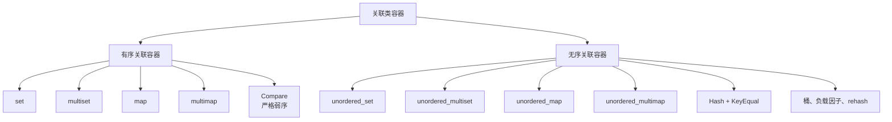
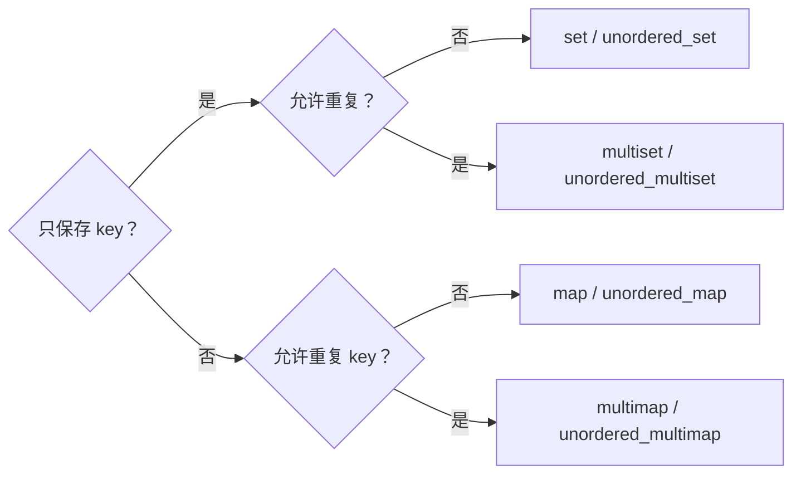
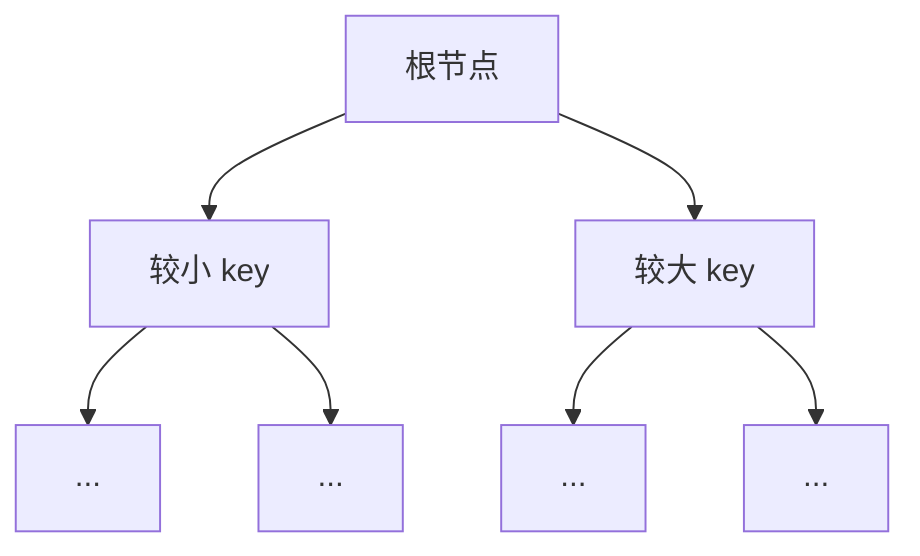
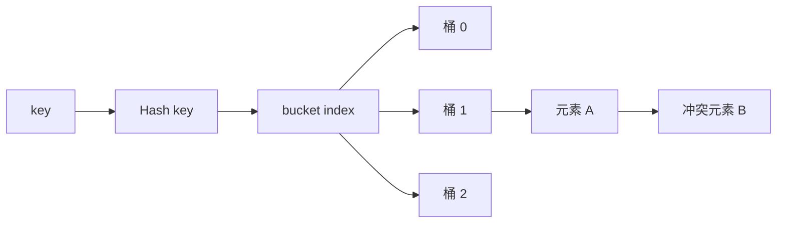
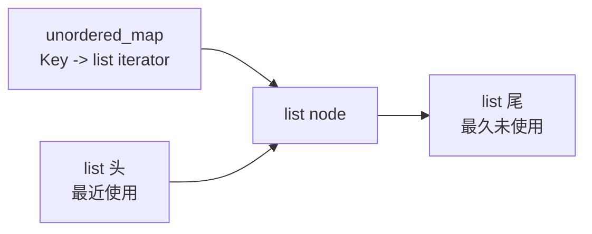

# STL 关联容器与无序关联容器

> 面试复习目标：掌握 `set`、`map`、`multiset`、`multimap` 以及对应无序容器的语义、底层模型、复杂度、查找接口、重复键处理、自定义比较与哈希规则，并能根据业务需求正确选型。

## 1. 知识地图



容器选择主要回答两个问题：



确定容器族以后，再判断是否需要有序遍历、范围查询和稳定的最坏复杂度。

> [!IMPORTANT]
> “有序”与“无序”描述的是容器如何组织 key，不是元素能否按插入顺序遍历。无序容器既不保证排序顺序，也不保证插入顺序。

---

## 2. 八种容器总览

| 容器 | 元素形式 | key 是否唯一 | 组织方式 | 查找复杂度 |
|---|---|---:|---|---|
| `set<Key>` | `Key` | 是 | 按比较器有序 | `O(log n)` |
| `multiset<Key>` | `Key` | 否 | 按比较器有序 | `O(log n)` |
| `map<Key, T>` | `pair<const Key, T>` | 是 | 按 key 有序 | `O(log n)` |
| `multimap<Key, T>` | `pair<const Key, T>` | 否 | 按 key 有序 | `O(log n)` |
| `unordered_set<Key>` | `Key` | 是 | 哈希桶 | 平均 `O(1)`，最坏 `O(n)` |
| `unordered_multiset<Key>` | `Key` | 否 | 哈希桶 | 平均 `O(1)`，最坏 `O(n)` |
| `unordered_map<Key, T>` | `pair<const Key, T>` | 是 | 哈希桶 | 平均 `O(1)`，最坏 `O(n)` |
| `unordered_multimap<Key, T>` | `pair<const Key, T>` | 否 | 哈希桶 | 平均 `O(1)`，最坏 `O(n)` |

组合记忆：

- `set`：只有 key；
- `map`：key 映射到 value；
- `multi`：允许等价 key 重复；
- `unordered`：用哈希组织，不提供排序语义。

---

## 3. 有序关联容器的底层模型

标准只规定语义和复杂度，并不强制具体实现。主流标准库通常使用红黑树等平衡搜索树。



平衡搜索树让树高保持 `O(log n)`，因此：

- `find`、`insert`、`erase(key)` 通常为 `O(log n)`；
- `lower_bound`、`upper_bound` 为 `O(log n)`；
- 按迭代器顺序遍历得到比较器定义的有序序列；
- 节点单独分配，插入通常不会搬动已有元素。

> [!NOTE]
> 面试时可以说“主流实现通常是红黑树”，不要说“标准规定必须使用红黑树”。

---

## 4. 哈希容器的底层模型

哈希容器先计算 key 的哈希值，再映射到某个桶；发生哈希冲突时，同一桶中会保存多个元素。



查找大致分两步：

1. 通过 `Hash` 找到候选桶；
2. 在桶中用 `KeyEqual` 判断 key 是否相等。

哈希分布均匀、负载合理时，查找/插入/删除平均为 `O(1)`；大量 key 落入同一桶时，最坏会退化为 `O(n)`。

---

## 5. `set`：唯一 key 的有序集合

```cpp
#include <set>

std::set<int> values{3, 1, 2, 2};
// 遍历结果：1 2 3
```

特点：

- key 唯一；
- 默认使用 `std::less<Key>`；
- 遍历按比较器顺序；
- 不支持下标；
- 元素不能通过迭代器直接修改。

插入唯一键容器返回 `pair<iterator, bool>`：

```cpp
auto [it, inserted] = values.insert(2);

if (!inserted) {
    // *it 是容器中原来已经存在的等价元素
}
```

`insert` 遇到等价 key 不会覆盖旧元素。

---

## 6. `multiset`：可重复 key 的有序集合

```cpp
std::multiset<int> values{3, 1, 3, 2};
// 遍历结果：1 2 3 3
```

与 `set` 的关键差别：

- 等价 key 可以保存多份；
- 单元素 `insert` 返回新元素的迭代器，而不是 `pair<iterator, bool>`；
- `count(key)` 可能大于 1；
- `erase(key)` 会删除所有等价 key。

只删除其中一个：

```cpp
auto it = values.find(3);
if (it != values.end()) {
    values.erase(it);
}
```

处理全部等价元素：

```cpp
auto [first, last] = values.equal_range(3);
for (auto it = first; it != last; ++it) {
    // 处理每一个 3
}
```

---

## 7. `map`：唯一 key 到 value 的映射

```cpp
#include <map>
#include <string>

std::map<std::string, int> ages{
    {"Alice", 20},
    {"Bob", 22}
};
```

每个元素的逻辑类型是：

```cpp
std::pair<const Key, T>
```

因此：

```cpp
auto it = ages.find("Alice");
it->second = 21;       // 可以修改 value
// it->first = "Amy";  // 错误：key 是 const
```

key 不能直接修改，因为这会破坏树的顺序；value 不参与排序，可以修改。

### 7.1 结构化绑定遍历

```cpp
for (const auto& [name, age] : ages) {
    std::cout << name << ": " << age << '\n';
}
```

需要修改 value：

```cpp
for (auto& [name, age] : ages) {
    ++age;
}
```

---

## 8. `multimap`：一个 key 对应多项记录

```cpp
std::multimap<std::string, int> scores{
    {"Alice", 90},
    {"Alice", 95},
    {"Bob", 88}
};
```

`multimap` 适用于天然的一对多关系，例如：

- 部门到员工；
- 标签到文档；
- 时间点到事件；
- 学生到多次考试成绩。

它不提供 `operator[]` 和 `at()`，因为一个 key 可能对应多个 value。

```cpp
auto [first, last] = scores.equal_range("Alice");
for (auto it = first; it != last; ++it) {
    std::cout << it->second << '\n';
}
```

> [!IMPORTANT]
> 多重容器中不要依赖 `find(key)` 返回“第一个”匹配项。需要完整等价区间时使用 `equal_range`，或使用 `lower_bound` 到 `upper_bound`。

---

## 9. 比较器决定排序，也决定“重复”

有序关联容器通常不使用 `operator==` 判断 key 是否重复。比较器 `comp` 认为两个 key 等价的条件是：

```cpp
!comp(a, b) && !comp(b, a)
```

例如只按年龄比较：

```cpp
struct Student {
    int id;
    std::string name;
    int age;
};

struct ByAge {
    bool operator()(const Student& lhs, const Student& rhs) const {
        return lhs.age < rhs.age;
    }
};

std::set<Student, ByAge> students;
```

此时两个学生只要年龄相同，就属于等价 key；即使 `id/name` 不同，第二次插入也会失败。

若业务要求按年龄排序、但学生仍以 `id` 区分，应补充次级字段：

```cpp
struct ByAgeThenId {
    bool operator()(const Student& lhs, const Student& rhs) const {
        if (lhs.age != rhs.age) {
            return lhs.age < rhs.age;
        }
        return lhs.id < rhs.id;
    }
};
```

也可使用元组简化：

```cpp
return std::tie(lhs.age, lhs.id)
     < std::tie(rhs.age, rhs.id);
```

---

## 10. 严格弱序

比较器必须形成严格弱序（strict weak ordering）。面试中重点记住：

- 非自反：`comp(a, a)` 必须为 `false`；
- 非对称：若 `comp(a, b)` 为 `true`，则 `comp(b, a)` 必须为 `false`；
- 传递：若 `a < b` 且 `b < c`，则必须有 `a < c`；
- 比较等价关系也要保持传递性。

错误示例：

```cpp
return lhs.age <= rhs.age; // 错误：a <= a 为 true
```

另一个常见错误是比较器依赖会变化的外部状态，使同一对对象在容器生命周期内得到不同结果。这会破坏容器不变量。

---

## 11. 自定义有序 key 的三种方式

### 11.1 重载 `operator<`

```cpp
struct Point {
    int x;
    int y;

    bool operator<(const Point& rhs) const {
        return std::tie(x, y) < std::tie(rhs.x, rhs.y);
    }
};

std::set<Point> points;
```

适合该顺序是类型自然且通用的顺序。

### 11.2 传入比较器

```cpp
struct ByY {
    bool operator()(const Point& a, const Point& b) const {
        return std::tie(a.y, a.x) < std::tie(b.y, b.x);
    }
};

std::set<Point, ByY> points;
```

优点：

- 不侵入类型；
- 同一类型可以有多种排序规则；
- 语义在容器声明处清晰可见。

### 11.3 特化 `std::less`

源码演示了对用户自定义类型的 `std::less<T>` 特化。实际工程通常优先使用前两种方式，因为显式比较器更直观，也更容易维护和复用。

> [!TIP]
> “自然顺序”使用运算符；“业务视角的顺序”使用命名比较器，是更容易解释的设计。

---

## 12. 查找接口

| 接口 | 含义 |
|---|---|
| `find(key)` | 找到一个等价 key，找不到返回 `end()` |
| `count(key)` | 等价 key 的数量 |
| `contains(key)` | 是否存在，C++20 |
| `lower_bound(key)` | 第一个不小于 key 的位置 |
| `upper_bound(key)` | 第一个大于 key 的位置 |
| `equal_range(key)` | 等价区间 `[lower_bound, upper_bound)` |

唯一键容器存在性判断：

```cpp
if (auto it = ages.find("Alice"); it != ages.end()) {
    std::cout << it->second;
}
```

C++20：

```cpp
if (ages.contains("Alice")) {
    // 只关心是否存在
}
```

### 12.1 范围查询

有序关联容器独有的强项是范围语义：

```cpp
std::set<int> values{1, 3, 5, 7, 9};

auto first = values.lower_bound(3); // 指向 3
auto last  = values.upper_bound(7); // 指向 9

// [first, last) 对应 3、5、7
```

成员版本能利用树结构达到 `O(log n)` 定位。对树容器使用通用 `std::lower_bound`，虽然比较次数是对数级，但迭代器移动可能是线性的，因此应优先成员函数。

---

## 13. `map::operator[]` 的隐式插入

```cpp
std::map<std::string, int> counts;
++counts["apple"];
```

若 `"apple"` 不存在，`operator[]` 会先插入：

```cpp
{"apple", int{}} // int{} 为 0
```

然后返回 value 的引用。

因此下面的“查询”会修改容器：

```cpp
std::cout << counts["missing"]; // 插入 missing -> 0
```

这可能造成：

- 意外增加元素；
- 额外分配；
- `unordered_map` 发生 rehash；
- mapped type 必须能按此方式默认构造；
- 只读逻辑出现副作用。

> [!WARNING]
> 只查询时用 `find`、`contains` 或 `at`，不要习惯性使用 `operator[]`。

---

## 14. `at`、`find` 与 `operator[]`

| 接口 | key 不存在 | 是否插入 | 可用于 `const map` |
|---|---|---:|---:|
| `operator[]` | 返回新元素的 value 引用 | 是 | 否 |
| `at(key)` | 抛出 `std::out_of_range` | 否 | 是 |
| `find(key)` | 返回 `end()` | 否 | 是 |

```cpp
try {
    std::cout << ages.at("Nobody");
} catch (const std::out_of_range&) {
    // key 不存在
}
```

接口选择：

- 明确要“没有就创建”：`operator[]` 或 `try_emplace`；
- 不存在属于错误：`at`；
- 正常分支判断：`find`/`contains`。

---

## 15. 插入与更新：不要混淆语义

### 15.1 `insert`

```cpp
std::map<std::string, int> ages{{"Alice", 20}};
auto [it, inserted] = ages.insert({"Alice", 99});
// inserted == false，原值仍为 20
```

### 15.2 `emplace`

```cpp
ages.emplace("Bob", 22);
```

原地构造不等于必然更快；若 key 已存在，参数求值以及部分实现细节仍需考虑。

### 15.3 `try_emplace`（C++17）

```cpp
ages.try_emplace("Carol", 23);
```

只有 key 不存在时才用参数构造 mapped value，特别适合构造成本高或不可复制的 value。

### 15.4 `insert_or_assign`（C++17）

```cpp
ages.insert_or_assign("Alice", 21);
```

- 不存在：插入；
- 已存在：覆盖 value。

语义速查：

| 需求 | 推荐接口 |
|---|---|
| 只插入，不覆盖 | `insert` / `emplace` |
| 不存在才构造 value | `try_emplace` |
| 插入或覆盖 | `insert_or_assign` |
| 默认值后继续修改 | `operator[]` |

---

## 16. 删除

```cpp
container.erase(key);          // 按 key 删除
container.erase(iterator);     // 删除一个位置
container.erase(first, last);  // 删除区间
```

按 key 删除的返回值是删除数量：

```cpp
std::multiset<int> values{1, 2, 2, 2};
auto removed = values.erase(2); // removed == 3
```

遍历删除：

```cpp
for (auto it = values.begin(); it != values.end();) {
    if (should_remove(*it)) {
        it = values.erase(it);
    } else {
        ++it;
    }
}
```

`erase(iterator)` 返回被删元素之后的位置。

---

## 17. 有序关联容器的迭代器失效

对于 `set/map/multiset/multimap`：

- 插入不会使已有迭代器、引用和指针失效；
- 删除只使指向被删元素的迭代器、引用和指针失效；
- 其他节点仍保持有效。

这来自节点式存储的特性，也是它们相对 `vector` 的重要优势。

```cpp
auto it = values.find(3);
values.insert(4); // it 仍有效
values.erase(1);  // 只要 it 不指向 1，仍有效
```

---

## 18. 为什么 key 是只读的

`set` 中整个元素就是 key；`map` 元素是 `pair<const Key, T>`。

直接修改 key 会造成：

- 有序容器中的树位置与比较顺序不一致；
- 无序容器中的桶位置与哈希值不一致。

因此标准接口禁止通过普通迭代器修改 key。要更改 key，传统方式是删除后重新插入；C++17 还可以使用节点句柄。

---

## 19. C++17 节点句柄：`extract`

```cpp
std::map<std::string, int> ages{{"Alice", 20}};

auto node = ages.extract("Alice");
if (!node.empty()) {
    node.key() = "Alicia";
    ages.insert(std::move(node));
}
```

`extract` 将节点从容器中取出，可在容器外安全修改 key，再插回容器。

还可以在兼容容器间转移节点：

```cpp
destination.merge(source);
```

通常不复制/移动元素对象，只转移可接收的节点。唯一键目标容器中已存在的等价 key 会留在源容器。

---

## 20. `unordered_set`

```cpp
#include <unordered_set>

std::unordered_set<int> values{3, 3, 1, 2};
// 保存 1、2、3，但遍历顺序不确定
```

特性：

- key 唯一；
- 默认使用 `std::hash<Key>` 与 `std::equal_to<Key>`；
- 平均常数复杂度查找；
- 没有排序遍历和范围查询；
- 元素不可直接修改。

唯一键插入同样返回：

```cpp
std::pair<iterator, bool>
```

---

## 21. `unordered_multiset`

允许相等 key 重复：

```cpp
std::unordered_multiset<int> values{3, 3, 1, 2};
std::cout << values.count(3); // 2
```

按 key 删除会删除所有相等元素：

```cpp
values.erase(3);
```

若只删除一个，先 `find` 再按迭代器删除。若要访问完整等价组，使用 `equal_range`。

---

## 22. `unordered_map`

```cpp
#include <unordered_map>

std::unordered_map<std::string, int> ages;
ages.try_emplace("Alice", 20);
ages.insert_or_assign("Bob", 22);
```

接口语义与 `map` 很相似：

- 唯一 key；
- 支持 `operator[]`、`at`；
- `insert` 不覆盖；
- C++17 支持 `try_emplace`、`insert_or_assign`；
- 区别主要是无排序、平均 `O(1)` 和 rehash 行为。

---

## 23. `unordered_multimap`

```cpp
std::unordered_multimap<std::string, int> scores{
    {"Alice", 90},
    {"Alice", 95}
};
```

它允许重复 key，因此：

- 不支持 `operator[]`；
- 不支持 `at()`；
- `count` 可能大于 1；
- 使用 `equal_range` 访问某个 key 的全部映射。

```cpp
auto [first, last] = scores.equal_range("Alice");
for (auto it = first; it != last; ++it) {
    std::cout << it->second << '\n';
}
```

---

## 24. 自定义类型的哈希与相等判断

```cpp
struct Student {
    int id;
    std::string name;

    bool operator==(const Student& rhs) const {
        return id == rhs.id && name == rhs.name;
    }
};

struct StudentHash {
    std::size_t operator()(const Student& s) const noexcept {
        const auto h1 = std::hash<int>{}(s.id);
        const auto h2 = std::hash<std::string>{}(s.name);
        return h1 ^ (h2 << 1);
    }
};

std::unordered_set<Student, StudentHash> students;
```

默认的 `std::equal_to<Student>` 会调用可用的 `operator==`，因此源码中的 `StudentEqual` 或 `std::equal_to<Student>` 特化并非必需。

也可以为用户自定义类型特化 `std::hash`：

```cpp
namespace std {
template<>
struct hash<Student> {
    size_t operator()(const Student& s) const noexcept {
        return StudentHash{}(s);
    }
};
}
```

此后可直接使用 `std::unordered_set<Student>`。

> [!NOTE]
> `h1 ^ (h2 << 1)` 适合教学演示，但不是对所有数据分布都理想的通用组合公式。工程中应评估哈希质量。

---

## 25. Hash 与 KeyEqual 的一致性

必须满足：

```text
KeyEqual(a, b) == true  =>  Hash(a) == Hash(b)
```

反向不要求成立：哈希值相同可能只是碰撞。

错误例子：

- 相等判断只比较 `id`；
- 哈希却同时计算 `id` 和 `name`；
- 两个 `id` 相同、`name` 不同的对象会被认为相等，却可能得到不同哈希值。

正确做法是让哈希使用相等关系所依据的同一组字段。

---

## 26. 桶与负载因子

常用观察接口：

```cpp
table.bucket_count();      // 桶数量
table.bucket_size(i);      // 第 i 个桶的元素数
table.bucket(key);         // key 所在桶
table.load_factor();       // size / bucket_count
table.max_load_factor();   // 允许的最大负载因子
```

负载因子：

```text
load_factor = size / bucket_count
```

负载越高，平均每个桶的元素越多，冲突概率和桶内查找成本通常越大，但桶数组的内存开销可能更低。

---

## 27. `reserve`、`rehash` 与迭代器失效

```cpp
std::unordered_map<int, std::string> table;
table.reserve(1000); // 为大约 1000 个元素预先安排桶
```

- `reserve(n)`：按至少容纳约 `n` 个元素的目标调整桶数；
- `rehash(n)`：要求桶数至少达到指定规模并满足负载要求；
- 插入可能因负载超过阈值自动触发 rehash。

无序容器失效规则：

- 插入未触发 rehash：已有迭代器保持有效；
- 插入触发 rehash：所有迭代器失效；
- 显式 `rehash/reserve` 若实际发生 rehash：所有迭代器失效；
- rehash 不使已有元素的引用和指针失效；
- 删除只使被删元素的迭代器、引用和指针失效。

> [!WARNING]
> 不要跨越可能插入元素的操作长期缓存 `unordered_map` 迭代器；即使插入的是另一个 key，也可能因为 rehash 而失效。

---

## 28. 有序容器与无序容器对比

| 维度 | `map/set` | `unordered_map/set` |
|---|---|---|
| 组织结构 | 平衡搜索树类结构 | 哈希表 |
| 遍历顺序 | 比较器顺序 | 不确定 |
| 单点查找 | `O(log n)` | 平均 `O(1)`，最坏 `O(n)` |
| 范围查询 | 支持 | 不支持有序范围 |
| 最小/最大 key | `begin/rbegin` 直接得到 | 需要线性扫描 |
| 自定义要求 | `Compare` | `Hash` + `KeyEqual` |
| 插入导致已有迭代器失效 | 否 | rehash 时全部失效 |
| 额外结构开销 | 树节点与链接 | 桶数组与节点 |
| 性能稳定性 | 对数级上界稳定 | 依赖哈希质量和负载 |

### 28.1 优先选择有序容器的场景

- 需要按 key 排序遍历；
- 需要 `lower_bound/upper_bound`；
- 需要区间统计或最近 key；
- 需要稳定的对数复杂度；
- 已经有自然比较规则，但缺少合适哈希函数。

### 28.2 优先选择无序容器的场景

- 主要做精确匹配；
- 不关心遍历顺序；
- 哈希质量可靠；
- 可接受偶发 rehash 和最坏线性复杂度；
- 经基准测试确有收益。

> [!IMPORTANT]
> `unordered_map` 不保证一定比 `map` 快。小数据量、哈希成本高、冲突严重、内存局部性差或需要排序语义时，`map` 可能更合适。

---

## 29. 透明比较与异构查找

使用透明比较器可避免为查找临时构造完整 key：

```cpp
std::map<std::string, int, std::less<>> table;
const char* key = "Alice";

auto it = table.find(key);
```

`std::less<>` 是透明比较器；只要两种参数可以正确比较，就能进行异构查找。对字符串等构造有成本的 key 很有价值。

无序容器的透明异构查找需要哈希器和相等比较器都声明透明能力，并从 C++20 起获得相应标准接口支持。

---

## 30. 复杂度细节

### 30.1 `count` 在 multi 容器中

有序多重容器：

```text
O(log n + count(key))
```

因为先定位等价范围，再遍历匹配元素。

无序多重容器平均：

```text
O(count(key))
```

最坏仍可能为 `O(n)`。

### 30.2 带提示插入

有序容器的：

```cpp
container.insert(hint, value);
container.emplace_hint(hint, args...);
```

若提示恰当，可能达到摊还常数复杂度；提示错误仍能正确插入，但通常回到对数级查找。

### 30.3 遍历

无论树还是哈希容器，完整遍历都是 `O(n)`。

---

## 31. 常见业务模式

### 31.1 词频统计

```cpp
std::unordered_map<std::string, std::size_t> frequency;
for (const auto& word : words) {
    ++frequency[word];
}
```

这里 `operator[]` 的“缺失时插入 0”正好符合需求。

### 31.2 去重并排序

```cpp
std::set<int> result(input.begin(), input.end());
```

### 31.3 只去重，不要求有序

```cpp
std::unordered_set<int> seen;
```

### 31.4 一对多查询

```cpp
std::multimap<int, Event> events;
auto [first, last] = events.equal_range(timestamp);
```

若还需要按 value 高频更新，也可考虑：

```cpp
std::unordered_map<Key, std::vector<Value>>
```

容器组合有时比 `multimap` 更符合数据的所有权和访问模式。

---

## 32. `map` 与 `unordered_map` 实现 LRU

本章练习用 `list` 独立实现了 LRU，但每次通过 `std::find` 查找页面是 `O(n)`。

生产中常组合：

```text
list<pair<Key, Value>>
unordered_map<Key, list<pair<Key, Value>>::iterator>
```



- 哈希表：平均 `O(1)` 定位节点；
- 链表：`O(1)` `splice` 到头部；
- 链表尾：`O(1)` 淘汰最久未使用项。

这也是面试中“不同 STL 容器协作”的经典题。

---

## 33. 源码练习复盘

### 33.1 `practice/01_vector_deque.cc`

使用 `vector<Person>` 保存选手，用 `deque<double>` 排序后删除最高分和最低分。

`deque` 支持随机访问，因此可使用 `std::sort`。不过数据固定为 10 个分数且只做一次处理，`std::array<double, 10>` 或 `vector<double>` 也很自然。

### 33.2 `practice/02_list.cc`

演示 `list::sort` 自定义排序：

1. 总成绩降序；
2. 总成绩相同时语文成绩降序。

比较函数使用严格的 `>`，没有错误地使用 `>=`，满足严格弱序。

### 33.3 `practice/03.set.cc`

把两个整数集合都插入 `set`，一次完成去重和升序输出。

若输入本身已经排序且规模很大，使用双指针线性合并可能更高效；通用情况下 `set` 写法清晰，复杂度约为 `O((n+m) log(n+m))`。

### 33.4 `practice/04_set_Point.cc`

演示：

- 成员 `operator<`；
- 自定义函数对象；
- 特化 `std::less<Point>`。

当前成员 `operator<` 被注释，`set<Point>` 实际使用特化后的 `std::less<Point>`。工程代码通常优先显式比较器，避免阅读者难以发现全局特化。

### 33.5 `practice/05_list_splice.cc`

用链表模拟 LRU 顺序，`splice` 移动命中节点本身为 `O(1)`，但前面的线性 `find` 使一次访问总体仍为 `O(n)`。加入 `unordered_map<Key, iterator>` 才能实现平均 `O(1)` 完整访问。

---

## 34. 源码中的问题与纠正

### 34.1 `find` 不等于“等价区间的第一项”

`05_multiset.cc`、`07_multimap.cc` 等注释把 `find` 描述为“通常返回第一个匹配位置”。可移植代码不应依赖该表述：

- 有序多重容器需要第一项：使用 `lower_bound`；
- 需要全部匹配项：使用 `equal_range`；
- 无序多重容器需要全部匹配项：同样使用 `equal_range`。

### 34.2 `07_multimap.cc::test6` 实际使用 `map`

```cpp
map<Student, int, StudentCompare> box;
```

因此该函数没有验证 `multimap` 的重复 key。如果要符合文件主题，应声明：

```cpp
multimap<Student, int, StudentCompare> box;
```

### 34.3 `std::equal_to<Student>` 特化不是必需

`Student` 已经定义 `operator==`，默认 `std::equal_to<Student>` 可以调用它。无序容器最关键的补充是适用的 `std::hash<Student>`，或在模板参数中传入自定义哈希器。

### 34.4 `rusult` 只是拼写错误

`10_unorder_multiset.cc`、`11_unorder_map.cc`、`12_unorder_multimap.cc` 中的 `rusult` 应为 `result`，不影响语义，但会降低可读性；变量当前未使用，也触发编译器告警。

### 34.5 文件名中的 `unorder`

标准容器名称是 `unordered_*`，部分源码文件名写作 `unorder_*`，面试和代码中应使用准确名称。

### 34.6 底层实现措辞

“有序容器底层是红黑树”应准确表达为“标准要求对数复杂度，主流实现通常使用红黑树等平衡树”；标准没有规定必须采用某一种树。

---

## 35. 高频面试问题

### 35.1 `set` 如何判断两个对象重复？

不是必须调用 `==`。若 `comp(a,b)` 和 `comp(b,a)` 都为 `false`，两者就是比较等价 key。

### 35.2 为什么不能修改 `set` 元素或 `map` 的 key？

修改后可能破坏树的排序关系或哈希桶位置。`map` 的 value 不参与组织结构，所以可以修改。

### 35.3 `map[key]` 在 key 不存在时发生什么？

插入一个该 key 对应的新元素，mapped value 进行值初始化，然后返回它的引用。

### 35.4 如何只查询而不插入？

使用 `find`、C++20 `contains` 或 `at`；不要使用 `operator[]`。

### 35.5 `insert` 会覆盖已有 value 吗？

不会。唯一键容器插入等价 key 失败并保留旧元素。需要覆盖可用 `insert_or_assign` 或显式修改 `it->second`。

### 35.6 `try_emplace` 与 `emplace` 的关键差别？

`try_emplace` 在 key 已存在时不会构造 mapped value，更适合构造昂贵或仅移动的 value。

### 35.7 `map` 与 `unordered_map` 如何选择？

需要排序、范围查询、最小/最大 key 或稳定对数复杂度时选 `map`；主要做精确查找、无需顺序且哈希可靠时考虑 `unordered_map`。

### 35.8 无序容器为何最坏是 `O(n)`？

如果大量 key 冲突到同一桶，查找可能需要扫描桶内所有元素。

### 35.9 rehash 会使什么失效？

所有迭代器失效；指向元素的引用和指针仍有效。删除则只使被删元素对应对象失效。

### 35.10 相等 key 必须有相同哈希值吗？

必须。相同哈希值却不相等是允许的，这叫哈希碰撞。

### 35.11 `multimap` 如何获取一个 key 的所有 value？

使用 `equal_range` 得到半开区间并遍历。

### 35.12 `erase(key)` 在 multi 容器中删除几个？

删除所有等价 key，并返回删除数量。若只删除一个，应传入具体迭代器。

### 35.13 `lower_bound` 与 `upper_bound` 的区别？

默认升序语义下，前者找第一个“不小于”目标的位置，后者找第一个“大于”目标的位置。

### 35.14 为什么 `unordered_map` 不一定更快？

哈希计算、冲突、桶数组、节点分配、缓存行为和 rehash 都有成本；小数据或需要有序操作时树容器可能更合适。

### 35.15 红黑树为什么适合关联容器？

它通过较弱的平衡约束保持对数树高，插入删除所需旋转和重着色成本可控，查找、插入、删除性能稳定。

---

## 36. 易错结论速查

| 易错说法 | 正确理解 |
|---|---|
| `set` 用 `==` 去重 | 它使用比较器定义的等价关系 |
| 比较器写 `<=` 更完整 | 会破坏严格弱序，应使用严格关系 |
| `map[key]` 只负责查询 | key 不存在时会插入 |
| `insert` 会覆盖旧 value | 唯一键冲突时插入失败 |
| `multimap.find` 保证得到第一项 | 用 `lower_bound/equal_range` 表达需求 |
| `multimap` 可以使用 `[]` | 重复 key 无法对应唯一 value |
| `unordered_map` 按插入顺序遍历 | 遍历顺序不受保证 |
| 无序容器操作始终为 `O(1)` | 平均 `O(1)`，最坏 `O(n)` |
| 哈希相同就表示对象相等 | 哈希碰撞允许不同对象哈希相同 |
| 相等对象可以有不同哈希 | 不可以，会违反容器要求 |
| rehash 使元素引用全部失效 | 迭代器失效，元素引用/指针保持有效 |
| `reserve` 只属于 `vector` | 无序容器也用它预留元素容量目标 |
| 有序容器标准规定使用红黑树 | 标准规定语义和复杂度，不强制实现 |
| `set` 中所有迭代器永不失效 | 被删除元素的迭代器必然失效 |
| `unordered_map` 一定比 `map` 快 | 必须结合访问模式和实测判断 |

---

## 37. 源码阅读索引

| 文件 | 主题 |
|---|---|
| `01_set.cc` | `set` 构造、插入、查找、删除 |
| `02_set_Student.cc` | 自定义类型重载 `operator<` |
| `03_set_Student.cc` | 自定义函数对象比较器 |
| `04_set_Student.cc` | 特化 `std::less` |
| `05_multiset.cc` | 重复 key 集合 |
| `06_map.cc` | `map` 键值对与 `operator[]` |
| `07_multimap.cc` | 重复 key 映射 |
| `08_unordered_set.cc` | 无序唯一集合 |
| `09_unordered_set_Student.cc` | 自定义哈希与相等规则 |
| `10_unorder_multiset.cc` | 无序重复集合 |
| `11_unorder_map.cc` | 无序唯一映射 |
| `12_unorder_multimap.cc` | 无序重复映射 |
| `practice/01_vector_deque.cc` | 选手评分 |
| `practice/02_list.cc` | 学生成绩多字段排序 |
| `practice/03.set.cc` | 集合并集、去重和排序 |
| `practice/04_set_Point.cc` | `Point` 三种比较方式 |
| `practice/05_list_splice.cc` | 链表版 LRU 与复杂度分析 |
| `note/*.cc` | 各主题的详细源码注释 |

---

## 38. 复习清单

- [ ] 能从 key/value、是否重复、是否有序三个维度选择容器
- [ ] 能解释有序容器为何是 `O(log n)`
- [ ] 能解释无序容器平均 `O(1)`、最坏 `O(n)`
- [ ] 能区分比较相等与 `operator==`
- [ ] 能写出满足严格弱序的多字段比较器
- [ ] 能说明 `set` 元素和 `map` key 为何不能修改
- [ ] 能正确处理唯一容器 `insert` 的返回值
- [ ] 能区分 `insert`、`try_emplace`、`insert_or_assign`
- [ ] 能解释 `operator[]` 的隐式插入副作用
- [ ] 能选择 `find`、`contains`、`at` 或 `operator[]`
- [ ] 能使用 `lower_bound`、`upper_bound`、`equal_range`
- [ ] 能说明 `erase(key)` 在 multi 容器中的行为
- [ ] 能说明树型关联容器的迭代器失效规则
- [ ] 能说明 rehash 对迭代器、引用和指针的不同影响
- [ ] 能解释桶、哈希冲突和负载因子
- [ ] 能保证 Hash 与 KeyEqual 规则一致
- [ ] 能为自定义类型编写哈希函数
- [ ] 能比较 `map` 与 `unordered_map` 的适用场景
- [ ] 能使用节点句柄安全修改 key
- [ ] 能说明哈希表加链表如何实现平均 `O(1)` LRU
