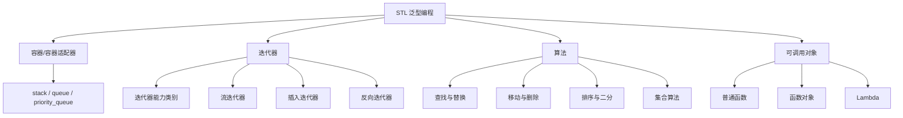
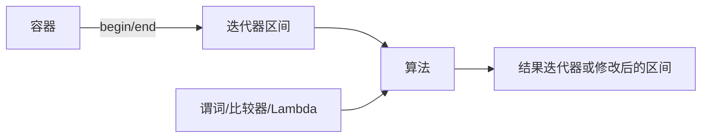
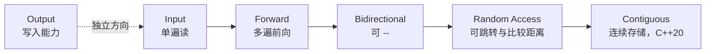
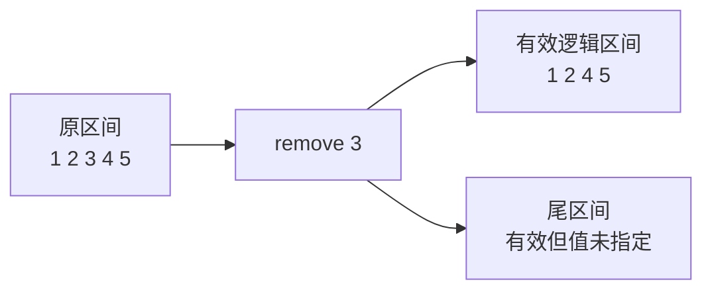

# STL 容器适配器、迭代器、算法与 Lambda

> 面试复习目标：理解 STL 如何通过“迭代器区间 + 算法 + 可调用对象”解耦数据结构与处理逻辑，掌握容器适配器、迭代器类别与适配器、Lambda 捕获、查找替换、排序、二分、集合算法及 erase-remove 惯用法。

## 1. 知识地图



STL 算法的核心协作关系：



> [!IMPORTANT]
> 算法通常不知道自己处理的是哪一种容器，只依赖迭代器提供的能力。这是理解“为什么某些算法不能用于某些容器”的关键。

---

## 2. 容器适配器是什么

容器适配器不是新的底层容器，而是包装已有容器并限制接口，使其呈现特定数据结构语义。

| 适配器 | 语义 | 默认底层容器 | 访问位置 |
|---|---|---|---|
| `stack<T>` | LIFO，后进先出 | `deque<T>` | `top()` |
| `queue<T>` | FIFO，先进先出 | `deque<T>` | `front()` / `back()` |
| `priority_queue<T>` | 每次取最高优先级 | `vector<T>` | `top()` |

适配器刻意不提供：

- `begin/end`；
- 随机位置访问；
- 任意位置插入删除；
- 直接遍历底层容器。

这不是功能缺失，而是为了维护数据结构抽象。

---

## 3. `stack`

```cpp
#include <stack>

std::stack<int> stack;
stack.push(1);
stack.emplace(2);

while (!stack.empty()) {
    std::cout << stack.top() << '\n';
    stack.pop();
}
```

常用接口：

| 接口 | 含义 |
|---|---|
| `push(value)` | 压入栈顶 |
| `emplace(args...)` | 在栈顶原地构造 |
| `top()` | 返回栈顶元素引用 |
| `pop()` | 删除栈顶，不返回元素 |
| `empty()` | 是否为空 |
| `size()` | 元素数量 |

底层容器至少要满足 `back/push_back/pop_back`。因此 `deque`、`vector`、`list` 均可作为传统 `stack` 的底层容器：

```cpp
std::stack<int, std::vector<int>> s1;
std::stack<int, std::list<int>> s2;
```

> [!WARNING]
> 对空栈调用 `top()` 或 `pop()` 的前置条件不成立，行为未定义。

---

## 4. `queue`

```cpp
#include <queue>

std::queue<std::string> queue;
queue.push("A");
queue.emplace("B");

while (!queue.empty()) {
    std::cout << queue.front() << '\n';
    queue.pop();
}
```

底层容器需要支持：

- `front()`；
- `back()`；
- `push_back()`；
- `pop_front()`。

`deque` 和 `list` 可以满足；`vector` 没有 `pop_front()`，不能作为 `queue` 的合适底层容器。

`pop()` 只删除，不返回值。需要元素时：

```cpp
auto value = queue.front();
queue.pop();
```

同样必须先保证非空。

---

## 5. `priority_queue`

默认是大顶堆：

```cpp
std::priority_queue<int> max_heap;
max_heap.push(2);
max_heap.push(5);
max_heap.push(1);

std::cout << max_heap.top(); // 5
```

小顶堆：

```cpp
std::priority_queue<
    int,
    std::vector<int>,
    std::greater<int>
> min_heap;
```

底层容器需要提供随机访问迭代器以及 `front/push_back/pop_back`，通常使用 `vector` 或 `deque`，不能使用 `list`。

### 5.1 比较器为何看起来“反了”

`priority_queue<T, Container, Compare>` 中，如果 `Compare(a, b)` 为 `true`，可理解为 `a` 的优先级低于 `b`，因此：

- `std::less<T>`：较大的元素位于堆顶；
- `std::greater<T>`：较小的元素位于堆顶。

自定义任务优先级：

```cpp
struct Task {
    int priority;
    std::string name;
};

struct LowerPriority {
    bool operator()(const Task& lhs, const Task& rhs) const {
        return lhs.priority < rhs.priority;
    }
};

std::priority_queue<Task, std::vector<Task>, LowerPriority> tasks;
```

比较器必须满足严格弱序。

---

## 6. 适配器复杂度与使用场景

| 操作 | `stack` | `queue` | `priority_queue` |
|---|---:|---:|---:|
| `push/emplace` | `O(1)`，取决于底层 | `O(1)`，取决于底层 | `O(log n)` |
| `pop` | `O(1)` | `O(1)` | `O(log n)` |
| `top/front` | `O(1)` | `O(1)` | `O(1)` |

典型场景：

- `stack`：括号匹配、表达式求值、DFS、撤销栈；
- `queue`：BFS、任务流水线、消息缓冲；
- `priority_queue`：Top K、Dijkstra、任务调度、合并有序序列。

若需要遍历但不破坏原适配器，可以复制后弹出；代价是复制整个结构。

---

## 7. 迭代器是“广义指针”

迭代器抽象了“当前位置”和“如何移动”，常见操作：

```cpp
*it;          // 解引用，访问元素
it->member;   // 访问成员
++it;         // 前进
it == end;    // 比较位置
```

并非所有迭代器都支持：

```cpp
--it;
it += 3;
it[2];
it1 < it2;
```

算法会通过迭代器类别约束所需能力。例如 `std::sort` 需要随机访问，`std::find` 只需输入迭代能力。

---

## 8. 迭代器能力分类

传统迭代器类别的主要关系：



> [!IMPORTANT]
> 输出迭代器不是“输入 → 前向 → 双向 → 随机访问”能力链的起点。它描述写入能力，传统分类中与只读输入能力基本正交。源码把五类简单排成强弱链便于入门，但面试应使用更准确的模型。

| 类别 | 关键能力 | 典型例子 |
|---|---|---|
| Output | 写入一次，`*it = value` | `ostream_iterator`、插入迭代器 |
| Input | 单遍读取，`*it`、`++it` | `istream_iterator` |
| Forward | 多遍前向读取 | `forward_list`、无序关联容器 |
| Bidirectional | 增加 `--it` | `list`、`set/map` |
| Random Access | `+n`、`-n`、下标、距离比较 | `deque` |
| Contiguous | 随机访问且元素物理连续 | `array`、`vector`、`string` |

“单遍”意味着输入迭代器的副本不保证能独立、反复遍历同一数据源；流迭代器就是典型例子。

---

## 9. 容器与迭代器能力

| 容器 | 迭代器类别 |
|---|---|
| `array/vector/string` | 随机访问；C++20 概念下连续 |
| `deque` | 随机访问，但不连续 |
| `list` | 双向 |
| `forward_list` | 前向 |
| `set/map/multiset/multimap` | 双向 |
| `unordered_*` | 至少前向 |
| `stack/queue/priority_queue` | 不提供迭代器 |

注意：随机访问描述迭代器操作能力，不等于内存连续。`deque` 支持 `it + n`，但整体不保证连续存储。

---

## 10. `iterator` 与 `const_iterator`

```cpp
std::vector<int> values{1, 2, 3};

auto it = values.begin();
*it = 10; // 可以修改

auto cit = values.cbegin();
// *cit = 10; // 错误：只读
```

当函数只读容器时，优先接收 `const` 引用并使用 `cbegin/cend` 或范围 `for` 的 `const auto&`：

```cpp
void print(const std::vector<int>& values) {
    for (const auto& value : values) {
        std::cout << value;
    }
}
```

`const_iterator` 表示不能通过它修改元素；`const iterator` 则是“迭代器对象本身不能移动”，两者不同：

```cpp
const auto it = values.begin();
*it = 20; // 元素仍可修改
// ++it;  // 迭代器对象是 const，不能移动
```

---

## 11. 通用迭代器操作

`<iterator>` 提供：

```cpp
std::advance(it, n);      // 原地移动
auto next = std::next(it, n);
auto prev = std::prev(it, n);
auto n = std::distance(first, last);
```

复杂度取决于迭代器类别：

- 随机访问迭代器：移动/求距离通常 `O(1)`；
- 双向或前向迭代器：需要逐步移动，为 `O(n)`。

因此 `std::next(list.begin(), 1000)` 不是常数时间。

---

## 12. 半开区间 `[first, last)`

STL 算法普遍使用左闭右开区间：

```text
[first, last)
```

优点：

- 空区间自然表示为 `first == last`；
- 区间长度可表示为 `distance(first, last)`；
- 相邻区间 `[a,b)` 与 `[b,c)` 无重叠；
- `end()` 无须指向真实元素。

> [!WARNING]
> `end()` 是尾后位置，不能解引用。任何算法返回迭代器后，都应先判断是否等于对应的 `last/end()`。

---

## 13. 输出流迭代器

`ostream_iterator<T>` 把赋值转换为流输出：

```cpp
#include <iterator>

std::ostream_iterator<int> out(std::cout, " ");
*out = 1;
++out;     // 为满足输出迭代器接口；不表示移动到某个存储位置
*out = 2;
```

与算法组合：

```cpp
std::copy(
    values.begin(),
    values.end(),
    std::ostream_iterator<int>(std::cout, " ")
);
```

也可输出到文件：

```cpp
std::ofstream file("result.txt");
std::copy(values.begin(), values.end(),
          std::ostream_iterator<int>(file, "\n"));
```

分隔字符串是在每次写入元素后输出，因此最后一个元素后也会出现分隔符。

---

## 14. 输入流迭代器

`istream_iterator<T>` 把格式化输入视为迭代器序列：

```cpp
std::istream_iterator<int> first(std::cin);
std::istream_iterator<int> last; // 默认构造表示流结束

std::vector<int> values(first, last);
```

读取结束条件包括：

- 到达 EOF；
- 输入格式不符合 `T`；
- 流进入失败状态。

使用算法读取到空容器：

```cpp
std::vector<int> values;
std::copy(
    std::istream_iterator<int>(std::cin),
    std::istream_iterator<int>(),
    std::back_inserter(values)
);
```

`istream_iterator` 是单遍输入迭代器，不要期待复制它以后得到两个互不影响的输入游标。

---

## 15. 为什么不能复制到空容器的 `begin()`

错误：

```cpp
std::vector<int> destination;
std::copy(source.begin(), source.end(), destination.begin()); // UB
```

`copy` 只负责写入已有位置，不会自动扩容。空 `vector` 没有可写元素，`begin() == end()`。

两种正确方式：

```cpp
std::vector<int> destination(source.size());
std::copy(source.begin(), source.end(), destination.begin());
```

或：

```cpp
std::vector<int> destination;
destination.reserve(source.size());
std::copy(source.begin(), source.end(),
          std::back_inserter(destination));
```

`reserve` 只预留容量，真正创建元素的是 `back_inserter` 间接调用的 `push_back`。

---

## 16. 三种插入迭代器

| 辅助函数 | 实际操作 | 容器要求 | 顺序特点 |
|---|---|---|---|
| `back_inserter(c)` | `c.push_back(value)` | 支持 `push_back` | 保持源顺序 |
| `front_inserter(c)` | `c.push_front(value)` | 支持 `push_front` | 通常反转源顺序 |
| `inserter(c, pos)` | `c.insert(pos, value)` | 支持 `insert` | 保持源顺序 |

```cpp
std::copy(source.begin(), source.end(),
          std::back_inserter(destination));
```

头插为何反序：

```text
依次输入：1 2 3
push_front(1) -> 1
push_front(2) -> 2 1
push_front(3) -> 3 2 1
```

`insert_iterator` 每次插入后会更新内部位置，使下一项插在刚插入元素之后，因此保持输入顺序。

---

## 17. 反向迭代器

```cpp
for (auto it = values.rbegin(); it != values.rend(); ++it) {
    std::cout << *it << ' ';
}
```

对反向迭代器执行 `++it`，逻辑上前进到反向序列下一项，物理位置则向容器前方移动。

### 17.1 `base()` 的错位关系

反向迭代器 `r` 与 `r.base()` 指向的不是同一个元素：

```text
正向：  1   2   3   4   5
                         ^ r 解引用为 5
                             ^ r.base() 是正向 end
```

恒等关系：

```cpp
&*r == &*(r.base() - 1); // 对随机访问迭代器示意
```

这样设计使反向区间 `[rbegin, rend)` 能与正向半开区间规则一致。

使用反向查找到的分隔符切割字符串时，这个“一位偏移”是高频陷阱。

---

## 18. STL 算法的三类输入

一个典型算法调用：

```cpp
auto it = std::find_if(
    values.begin(),
    values.end(),
    [](int value) { return value > 10; }
);
```

包含：

1. 迭代器区间：处理哪些元素；
2. 算法：做什么；
3. 可调用对象：按什么规则做。

可调用对象可以是：

- 普通函数；
- 函数指针；
- 重载 `operator()` 的函数对象；
- Lambda 表达式。

---

## 19. 谓词与比较器

谓词是返回可转为 `bool` 的可调用对象：

```cpp
auto is_even = [](int value) {
    return value % 2 == 0;
};
```

- 一元谓词：接收一个元素，如 `find_if/remove_if`；
- 二元谓词：接收两个元素，如自定义相等判断；
- 排序比较器：接收两个元素，表示第一个是否应排在第二个之前。

排序比较器必须是严格弱序：

```cpp
return lhs.score > rhs.score;  // 合法：降序
// return lhs.score >= rhs.score; // 错误：不满足非自反
```

算法可能复制谓词，不应依赖某个副本中不可见的外部副作用；状态统计场景要理解算法的返回值或显式使用引用。

---

## 20. `for_each`

```cpp
std::for_each(values.begin(), values.end(),
              [](int value) {
                  std::cout << value << ' ';
              });
```

C++11 起也常直接使用范围 `for`：

```cpp
for (int value : values) {
    std::cout << value << ' ';
}
```

选择建议：

- 单纯遍历执行一段命令：范围 `for` 通常更直观；
- 已经处于迭代器子区间，或需要与算法管线组合：`for_each` 合适；
- 需要生成新序列：考虑 `transform`，不要滥用带副作用的 `for_each`。

经典 `for_each` 会返回执行后的函数对象，可用于取回函数对象内部累计的状态；Lambda 捕获引用通常更直接。

---

## 21. Lambda 语法与本质

```cpp
[captures](parameters) mutable noexcept -> return_type {
    body
}
```

常见简写：

```cpp
auto add = [](int a, int b) {
    return a + b;
};
```

Lambda 表达式会生成一个匿名闭包类型，其对象称为闭包对象。可近似理解为编译器生成：

```cpp
class CompilerGeneratedClosure {
public:
    int operator()(int a, int b) const {
        return a + b;
    }
};
```

每个 Lambda 表达式都有唯一类型，即使两个 Lambda 的代码完全相同，类型也不同，通常使用 `auto` 保存。

---

## 22. Lambda 捕获方式

| 捕获 | 含义 |
|---|---|
| `[]` | 不捕获 |
| `[a]` | `a` 按值捕获 |
| `[&a]` | `a` 按引用捕获 |
| `[=]` | 使用到的自动变量默认按值捕获 |
| `[&]` | 使用到的自动变量默认按引用捕获 |
| `[=, &a]` | 默认按值，`a` 按引用 |
| `[&, a]` | 默认按引用，`a` 按值 |
| `[this]` | 捕获当前对象指针 |
| `[*this]` | 复制当前对象，C++17 |

按值捕获发生在闭包对象创建时：

```cpp
int value = 1;
auto f = [value] { return value; };
value = 2;
std::cout << f(); // 1
```

按引用捕获访问调用时的原对象：

```cpp
auto g = [&value] { return value; };
std::cout << g(); // 2
```

---

## 23. 捕获生命周期是高频风险

```cpp
auto make_bad_lambda() {
    int local = 42;
    return [&local] { return local; }; // 错误：返回后引用悬空
}
```

闭包对象可能比被引用变量活得更久，常见于：

- 返回 Lambda；
- 注册回调；
- 异步任务；
- 存入容器；
- 跨线程执行。

此时应按值捕获所需数据，或使用有明确共享所有权的对象：

```cpp
auto make_lambda() {
    int local = 42;
    return [local] { return local; };
}
```

> [!WARNING]
> `[&]` 写起来短，但不能替你管理生命周期。只要 Lambda 可能逃离当前作用域，就要逐项审查引用捕获。

---

## 24. `this` 与 `*this`

成员函数中访问数据成员，本质上通过 `this`：

```cpp
class Counter {
public:
    auto callback() {
        return [this] {
            ++value;
        };
    }

private:
    int value = 0;
};
```

`[this]` 复制的是指针，不是对象。若回调执行时原对象已析构，指针悬空。

C++17 可用 `[*this]` 捕获对象副本：

```cpp
return [*this] {
    return value;
};
```

它避免依赖原对象生命周期，但会复制整个对象，并且默认只修改闭包中的副本。

源码中的 `[=]` 或 `[&]` 在成员函数内使用成员时，本质仍会涉及 `this`；不要误以为 `[=]` 自动复制了整个对象。

---

## 25. `mutable`、初始化捕获与泛型 Lambda

### 25.1 `mutable`

值捕获生成的闭包成员默认在 `operator() const` 中只读：

```cpp
int value = 1;
auto f = [value]() mutable {
    return ++value;
};

f(); // 2
f(); // 3，闭包中的副本保持状态
// 外部 value 仍为 1
```

### 25.2 初始化捕获（C++14）

```cpp
auto ptr = std::make_unique<int>(42);
auto task = [resource = std::move(ptr)] {
    return *resource;
};
```

这允许重命名、计算初值以及把仅移动对象转入闭包。

### 25.3 泛型 Lambda（C++14）

```cpp
auto add = [](const auto& a, const auto& b) {
    return a + b;
};
```

其调用运算符本质上是模板，可用于多种兼容类型。

---

## 26. `find` 与 `find_if`

```cpp
auto it = std::find(values.begin(), values.end(), 3);
if (it != values.end()) {
    std::cout << *it;
}
```

`find` 使用相等比较，从前向后返回第一个匹配位置；复杂度为线性 `O(n)`。

```cpp
auto it = std::find_if(
    values.begin(),
    values.end(),
    [](int value) { return value > 3; }
);
```

相关接口：

- `find_if_not`：第一个不满足谓词的元素；
- `count/count_if`：统计数量；
- `all_of/any_of/none_of`：整体条件判断。

对于 `set/map/unordered_map` 等关联容器，按 key 查找应优先成员 `find`，以利用树或哈希结构；通用 `std::find` 会线性遍历。

---

## 27. `replace` 与 `replace_if`

```cpp
std::replace(values.begin(), values.end(), 3, 100);

std::replace_if(
    values.begin(),
    values.end(),
    [](int value) { return value < 0; },
    0
);
```

它们会原地赋值，因此要求迭代器指向的元素可写。

若希望保留原序列并生成新序列，使用复制版本：

```cpp
std::replace_copy(...);
std::replace_copy_if(...);
```

或使用 `std::transform` 表达映射。

---

## 28. `remove` 为什么不真正删除

```cpp
auto new_end = std::remove(
    values.begin(),
    values.end(),
    target
);
```

算法只拿到两个迭代器，不知道容器对象，也没有权限改变容器的 `size()`。它会把“保留元素”向前移动，并返回新的逻辑结尾。



完成真正删除：

```cpp
values.erase(
    std::remove(values.begin(), values.end(), target),
    values.end()
);
```

条件删除：

```cpp
values.erase(
    std::remove_if(values.begin(), values.end(),
                   [](int value) { return value > 5; }),
    values.end()
);
```

C++20：

```cpp
std::erase(values, target);
std::erase_if(values, predicate);
```

> [!IMPORTANT]
> `remove/remove_if` 返回值到旧 `end()` 之间的元素仍属于容器对象，但其值处于有效但未指定状态，不应打印、解引用结果来猜测其内容，或依赖源码示例中的某一次输出。

---

## 29. 不同容器如何删除

| 容器 | 推荐方式 |
|---|---|
| `vector/deque/string` | erase-remove，C++20 可用 `std::erase_if` |
| `list/forward_list` | 成员 `remove/remove_if`，C++20 也可用 `std::erase_if` |
| `set/map` | 按 key/迭代器 `erase`，不能对只读 key 做 `std::remove` |
| `unordered_*` | 按 key/迭代器 `erase` |

`std::remove` 需要向前赋值/移动元素。`set` 元素和 `map` 的整个 `pair<const Key,T>` 不可赋值，因此 erase-remove 不适用。

---

## 30. `sort`

```cpp
std::sort(values.begin(), values.end());

std::sort(values.begin(), values.end(),
          std::greater<int>{});
```

复杂度保证通常表述为 `O(n log n)` 次比较。`sort` 要求随机访问迭代器：

- 可用于 `vector/deque/array`；
- 不可用于 `list/forward_list`；
- `list/forward_list` 使用成员 `sort()`；
- 关联容器本身已经按 key 组织，不能用 `sort` 重排。

自定义排序：

```cpp
std::sort(students.begin(), students.end(),
          [](const Student& lhs, const Student& rhs) {
              if (lhs.total != rhs.total) {
                  return lhs.total > rhs.total;
              }
              return lhs.chinese > rhs.chinese;
          });
```

比较器必须与希望的排序方向一致，并满足严格弱序。

---

## 31. `sort`、`stable_sort`、`partial_sort`、`nth_element`

| 算法 | 目的 | 典型复杂度 |
|---|---|---|
| `sort` | 完整排序，不保证等价元素原顺序 | `O(n log n)` |
| `stable_sort` | 完整稳定排序 | 通常 `O(n log n)`，依赖内存条件 |
| `partial_sort` | 得到有序的前 K 项 | 约 `O(n log k)` |
| `nth_element` | 第 K 项就位，两边分区但不各自有序 | 平均线性级别 |

Top K 场景不一定需要完整排序：

```cpp
std::partial_sort(values.begin(),
                  values.begin() + k,
                  values.end());
```

“稳定”指比较等价的元素在排序后仍保持原相对顺序。

---

## 32. `min/max` 相关接口

```cpp
auto larger = std::max(a, b);
auto smaller = std::min(a, b);

auto it = std::max_element(values.begin(), values.end());
```

区别：

- `min/max` 比较少量直接参数并返回引用；
- `min_element/max_element` 遍历区间并返回迭代器；
- 空区间时 `max_element` 返回 `last`，解引用前必须检查。

注意 `std::max` 返回参数的 `const T&`。不要让引用绑定到函数调用结束后已销毁的临时对象并继续使用。

---

## 33. 二分查找算法

对升序且使用默认比较的区间：

| 算法 | 返回 |
|---|---|
| `binary_search` | 是否存在 |
| `lower_bound` | 第一个 `>= value` |
| `upper_bound` | 第一个 `> value` |
| `equal_range` | `[lower_bound, upper_bound)` |

```cpp
auto [first, last] =
    std::equal_range(values.begin(), values.end(), 3);
```

不存在时，`first == last`，两者指向目标可以插入且仍保持顺序的位置。

> [!WARNING]
> 二分算法的前置条件不是简单的“看起来排过序”，而是区间必须按照与本次查询兼容的比较规则完成分区/排序。降序数据必须传入同一个降序比较器。

### 33.1 迭代器类别与真实成本

传统 `lower_bound` 只要求前向迭代器，比较次数可为 `O(log n)`；但对 `list` 等非随机访问迭代器，移动迭代器可能达到 `O(n)`。

对 `set/map` 应使用成员 `lower_bound`，它能利用树结构真正按 `O(log n)` 定位节点。

---

## 34. 四种集合算法

输入区间必须按照相同规则有序：

```cpp
std::set_union(...);                // 并集
std::set_intersection(...);         // 交集
std::set_difference(...);           // A - B
std::set_symmetric_difference(...); // 对称差
```

典型写法：

```cpp
std::vector<int> result;
std::set_union(
    a.begin(), a.end(),
    b.begin(), b.end(),
    std::back_inserter(result)
);
```

算法不改变输入区间，结果写入输出迭代器。

### 34.1 它们具有多重集合语义

若某个值在两个输入中分别出现 `m` 次和 `n` 次：

| 运算 | 结果中的次数 |
|---|---:|
| 并集 | `max(m, n)` |
| 交集 | `min(m, n)` |
| `A - B` | `max(m - n, 0)` |
| 对称差 | `abs(m - n)` |

这与数学上只记录“是否存在”的集合略有不同。

---

## 35. `copy` 与重叠区间

普通复制：

```cpp
std::copy(first, last, destination);
```

目标必须有足够空间或使用插入迭代器。

当同一序列中的源、目标重叠时要谨慎：

- 向较低位置移动通常可用 `copy`；
- 向较高位置移动通常用 `copy_backward`；
- 对仅移动类型使用 `move/move_backward`。

更常见的容器内插入场景，应直接使用容器成员 `insert`，由容器处理扩容和失效。

---

## 36. 算法通常不改变容器结构

算法能修改元素值、交换元素或移动元素，但通常不能：

- 改变容器 `size()`；
- 增加/删除节点；
- 调用容器专属结构操作。

因此出现了：

- 输出到 `back_inserter` 来增加元素；
- `remove + container.erase` 两阶段删除；
- `list::sort`、`list::remove` 等成员算法；
- 关联容器自己的 `find/lower_bound`。

这体现了通用算法与容器专属能力之间的边界。

---

## 37. 算法选择速查

| 需求 | 算法 |
|---|---|
| 找一个值 | `find` |
| 按条件找第一个 | `find_if` |
| 判断任一/全部/均不满足 | `any_of/all_of/none_of` |
| 统计 | `count/count_if` |
| 原地替换 | `replace/replace_if` |
| 映射为新值 | `transform` |
| 删除顺序容器中的值 | erase-remove |
| 完整排序 | `sort/stable_sort` |
| 前 K 项 | `partial_sort` |
| 第 K 项及分区 | `nth_element` |
| 有序区间是否包含值 | `binary_search` |
| 有序区间等价范围 | `equal_range` |
| 复制到动态容器 | `copy + back_inserter` |
| 累加/归约 | `accumulate`（`<numeric>`） |

面试中先说清前置条件、返回值和复杂度，再写调用代码。

---

## 38. 迭代器失效与算法

算法正确不代表调用后旧迭代器仍有效。失效规则由容器操作决定：

- 纯读取算法通常不改变迭代器有效性；
- `sort/replace/remove` 不改变容器大小，位置迭代器仍指向位置，但元素值可能改变；
- `back_inserter(vector)` 可能触发扩容，使原 `vector` 迭代器全部失效；
- `erase` 后按具体容器规则失效；
- `unordered_*` 插入可能 rehash。

不要在算法运行时让谓词或比较器修改同一个容器的结构，这很容易使算法正在使用的迭代器失效，并违反算法要求。

---

## 39. 练习复盘

### 39.1 `practice/01_vector_insert.cc`

遍历 `vector`，在每个原偶数后插入其两倍：

```cpp
it = vec.insert(it + 1, *it * 2);
```

正确使用了 `insert` 返回的新迭代器，避免扩容后的旧迭代器失效。循环末尾再 `++it`，跳过刚插入的元素，继续处理下一个原元素。

更易读的写法可以先保存值：

```cpp
const int doubled = *it * 2;
it = vec.insert(std::next(it), doubled);
```

### 39.2 `practice/02_stack_queue.cc`

验证 `list` 满足 `stack` 与 `queue` 的底层接口。弹出式“遍历”会清空适配器，这是使用受限接口的直接结果。

### 39.3 `practice/03_word_conversion.cc`

组合使用：

- `map<string,string>` 保存转换规则；
- `ifstream/getline` 保留行结构；
- `istringstream` 拆分单词；
- `find` 查询且避免 `operator[]` 意外插入；
- 返回 `const string&` 避免复制。

`transform()` 返回的引用要么指向 `map` 中的 value，要么指向参数 `s`。当前调用期间二者生命周期都有效；若把返回引用长期保存，则必须重新审查生命周期。

### 39.4 `practice/04_reverse_iterator.cc`

使用：

```cpp
copy(src.rbegin(), src.rend(), back_inserter(dst));
```

把 `5 4 3 2 1` 反向读取为 `1 2 3 4 5`，再尾插到 `list`，结果保持该读取顺序。

### 39.5 `practice/05_remove_if_lambda.cc`

正确展示 erase-remove 两阶段结构。但 `remove_if` 后旧尾区间的具体数值没有保证，注释中给出的某个输出只能代表一次实现结果，不能作为标准语义。

---

## 40. 源码中的问题与纠正

### 40.1 迭代器类别不是单一的五级继承链

源码把输出、输入、前向、双向、随机访问排列为能力递增。准确说法是：

- 读取能力链：Input → Forward → Bidirectional → Random Access；
- Output 描述写入能力，是另一维度；
- 一个具体迭代器可以同时具备读写能力。

### 40.2 不要解引用 `remove` 返回位置来观察尾区间

`08_find.cc::test5/test6` 解引用新的逻辑结尾用于演示。只要它不等于旧 `end()`，位置仍可解引用，但尾区间中的值为有效但未指定状态，业务代码不应读取或依赖。

### 40.3 二分查找的表述依赖比较器

“第一个大于等于”和“第一个大于”是默认升序 `std::less` 下的直观说法。更一般地：

- `lower_bound`：第一个“不排在 value 前面”的位置；
- `upper_bound`：第一个“value 排在它前面”的位置。

降序比较器下不能继续机械套用数值上的 `>=`/`>`。

### 40.4 `priority_queue` 比较器语义容易写反

源码正确演示了 `greater<int>` 得到小顶堆。自定义类型时要以“希望谁成为 `top()`”验证比较器，而不是只凭 `less/greater` 名称猜测。

### 40.5 算法结果都要检查尾后迭代器

`08_find.cc::test2` 因数据中确定存在目标而直接解引用。通用代码必须判断：

```cpp
if (it != box.end()) {
    // 才能使用 *it
}
```

### 40.6 原始源码均可编译

本章主源码、`note` 与练习均通过 C++17 语法检查。现有告警主要是未使用的 `argc/argv` 和 Lambda 演示中的未使用局部变量。

---

## 41. 高频面试问题

### 41.1 容器适配器和容器有什么区别？

适配器包装底层容器，只暴露符合栈、队列或优先队列语义的受限接口，不提供普通容器式迭代。

### 41.2 `priority_queue` 默认为何是大顶堆？

默认比较器是 `std::less<T>`，较大的元素具有更高优先级并位于 `top()`。

### 41.3 为什么 `priority_queue` 不能使用 `list`？

内部堆算法需要随机访问迭代器；`list` 只有双向迭代器。

### 41.4 输入迭代器与前向迭代器的关键区别？

输入迭代器只保证单遍读取；前向迭代器支持多遍遍历，同一位置的迭代器副本可独立前进。

### 41.5 为什么 `std::sort` 不能用于 `list`？

`sort` 需要随机访问迭代器；`list` 只有双向迭代器，应使用 `list::sort()`。

### 41.6 为什么 `copy` 到空 `vector.begin()` 错误？

算法只覆盖已有元素，不创建空间。应先 `resize`，或使用 `back_inserter`。

### 41.7 `front_inserter` 为什么反转顺序？

每个新元素都插到当前头部，后读取的元素会出现在先读取元素之前。

### 41.8 反向迭代器的 `base()` 指向哪里？

指向反向迭代器当前元素在正向顺序中的后一个位置；`rbegin().base() == end()`。

### 41.9 Lambda 的本质是什么？

编译器生成的匿名闭包类型对象，捕获值成为其数据成员，并提供 `operator()`。

### 41.10 `[=]` 与 `[&]` 有何风险差异？

值捕获有复制成本且看到创建时的值；引用捕获可修改原变量，但闭包逃离作用域时可能产生悬空引用。

### 41.11 `mutable` 会修改外部变量吗？

不会。它让闭包的非引用捕获副本可以修改；引用捕获修改的仍是外部对象。

### 41.12 `[this]` 是复制对象吗？

不是，只复制指针。原对象析构后回调再访问成员会悬空；C++17 `[*this]` 才复制对象。

### 41.13 `remove` 为什么不改变 `size()`？

通用算法只有迭代器，不持有容器结构接口；它移动保留元素并返回逻辑结尾，真正缩容由容器 `erase` 完成。

### 41.14 `sort` 与 `stable_sort` 有何区别？

两者都完整排序；`stable_sort` 保留比较等价元素的原相对顺序，通常可能需要额外内存。

### 41.15 `lower_bound` 的前置条件是什么？

区间必须按与查询兼容的比较规则完成分区/排序，否则结果不符合算法契约。

### 41.16 集合算法会去掉所有重复值吗？

不会，它们按有序多重集合的计数语义产生结果。

### 41.17 `std::find` 和 `map::find` 有什么差别？

通用 `find` 线性遍历元素；`map::find` 利用树按 key 进行 `O(log n)` 查找。

### 41.18 `partial_sort` 与 `nth_element` 如何选择？

需要前 K 项且这 K 项有序用 `partial_sort`；只需第 K 项就位或按第 K 项分区用 `nth_element`。

---

## 42. 易错结论速查

| 易错说法 | 正确理解 |
|---|---|
| `stack.pop()` 返回栈顶值 | `pop` 返回 `void`，先 `top` 再 `pop` |
| 空适配器访问会返回默认值 | `top/front/pop` 前置条件不满足会产生未定义行为 |
| `priority_queue` 的 `greater` 是大顶堆 | `greater` 使较小值位于堆顶 |
| 所有容器都有迭代器 | 三种容器适配器不公开迭代器 |
| 输出迭代器比输入迭代器更弱 | 两者描述不同方向的能力 |
| 随机访问就代表连续内存 | `deque` 随机访问但不整体连续 |
| `end()` 指向最后一个元素 | 它指向尾后位置，不能解引用 |
| `copy` 会自动扩容目标容器 | 普通输出位置必须已有空间 |
| `reserve` 后 `begin()` 就可写 | `reserve` 不改变 `size` |
| `front_inserter` 保持源顺序 | 连续头插通常反转顺序 |
| `r.base()` 与 `r` 指向同一元素 | `base()` 对应正向的后一位置 |
| `[=]` 在成员函数中复制整个对象 | 访问成员通常仍通过捕获的 `this` 指针 |
| `mutable` 修改值捕获的外部原变量 | 只修改闭包中的副本 |
| `[&]` 总比值捕获高效 | 可能产生悬空引用和并发生命周期问题 |
| `remove` 真正删除元素 | 只移动并返回逻辑结尾 |
| `remove` 后尾部值有固定规律 | 尾区间值有效但未指定 |
| `sort` 可用于任意容器 | 需要随机访问迭代器 |
| 二分查找只需“曾经排序过” | 必须与当前查询比较规则兼容 |
| 集合算法输入可以无序 | 两个输入区间必须按同一规则有序 |

---

## 43. 源码阅读索引

| 文件 | 主题 |
|---|---|
| `01_container_adapter.cc` | `stack/queue/priority_queue` |
| `02_iterator_intro.cc` | 迭代器类别与容器能力 |
| `03_ostream_iterator.cc` | 输出流迭代器 |
| `04_istream_iterator.cc` | 输入流迭代器 |
| `05_iterator_adapter.cc` | 插入迭代器与反向迭代器 |
| `06_for_each.cc` | 函数、函数对象和 Lambda |
| `07_lambda.cc` | Lambda 语法与捕获 |
| `08_find.cc` | 查找、替换与 remove |
| `09_sort.cc` | 排序、二分和集合算法 |
| `practice/01_vector_insert.cc` | 插入时处理迭代器失效 |
| `practice/02_stack_queue.cc` | `list` 作为适配器底层容器 |
| `practice/03_word_conversion.cc` | 文本转换与 `map::find` |
| `practice/04_reverse_iterator.cc` | 反向读取与尾插 |
| `practice/05_remove_if_lambda.cc` | erase-remove 惯用法 |
| `note/*.cc` | 各主题的详细源码注释 |

---

## 44. 复习清单

- [ ] 能解释容器适配器为什么不提供迭代器
- [ ] 能说出三种适配器的默认底层容器
- [ ] 能写大顶堆、小顶堆和自定义优先级队列
- [ ] 能准确描述输入到连续迭代器的能力关系
- [ ] 能说明输出迭代器与读取能力链的关系
- [ ] 能按迭代器能力判断算法是否可用
- [ ] 能区分 `iterator`、`const_iterator` 和 `const iterator`
- [ ] 能分析 `advance/distance` 在不同迭代器上的复杂度
- [ ] 能解释半开区间和尾后迭代器
- [ ] 能使用输入/输出流迭代器
- [ ] 能说明复制到空容器为何需要插入迭代器
- [ ] 能比较三种插入迭代器的顺序效果
- [ ] 能解释反向迭代器的 `base()` 偏移
- [ ] 能说出普通函数、函数对象和 Lambda 的共同点
- [ ] 能解释 Lambda 的闭包类型本质
- [ ] 能写出各种值捕获、引用捕获和混合捕获
- [ ] 能识别引用捕获及 `this` 捕获的生命周期风险
- [ ] 能解释 `mutable`、初始化捕获与泛型 Lambda
- [ ] 能正确检查 `find/find_if` 返回值
- [ ] 能写 erase-remove 惯用法
- [ ] 能说明 `remove` 后尾区间的标准语义
- [ ] 能比较 `sort/stable_sort/partial_sort/nth_element`
- [ ] 能说明二分算法的排序前置条件
- [ ] 能写四种集合算法并解释重复元素计数语义
- [ ] 能优先选择关联容器的成员查找算法
