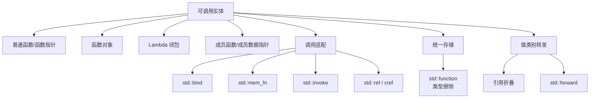
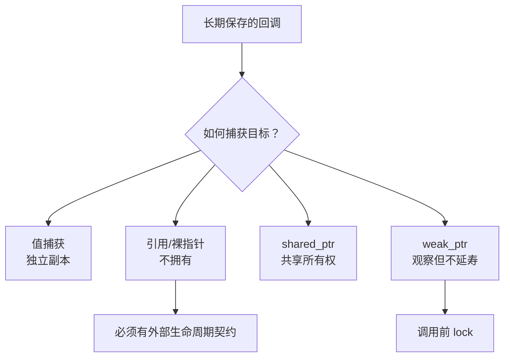

# STL 可调用对象、绑定与类型擦除

> 面试复习目标：掌握函数指针、函数对象、Lambda、成员指针的统一调用模型，理解 `std::bind`、占位符、`std::ref/cref`、引用折叠与完美转发、`std::function` 类型擦除、`std::mem_fn` 和 `std::invoke`，并能识别回调中的对象生命周期与性能问题。

## 1. 知识地图



本章核心关系：


> [!IMPORTANT]
> `std::bind` 解决“改变调用形态”，`std::function` 解决“用统一类型保存不同可调用对象”，`std::invoke` 解决“用统一语法执行不同可调用实体”。三者职责不同。

---

## 2. 什么是可调用对象

只要能出现在类似 `callable(args...)` 的调用语境中，就可视为可调用实体。

| 类别 | 示例 |
|---|---|
| 普通函数 | `int add(int, int)` |
| 函数指针/引用 | `int (*p)(int,int)` |
| 函数对象 | 重载 `operator()` 的类对象 |
| Lambda | 编译器生成的闭包对象 |
| 成员函数指针 | `&Calculator::add` |
| 成员数据指针 | `&Student::age` |
| 绑定结果 | `std::bind(...)` 返回的函数对象 |

```cpp
int add(int a, int b) {
    return a + b;
}

struct Add {
    int operator()(int a, int b) const {
        return a + b;
    }
};

auto lambda = [](int a, int b) {
    return a + b;
};
```

三者都可以表现出 `int(int,int)` 的调用形式，但具体类型不同。

---

## 3. 函数类型、函数指针与函数引用

给定：

```cpp
int add(int, int);
```

相关类型：

```cpp
using FunctionType = int(int, int);
using FunctionPtr  = int(*)(int, int);
using FunctionRef  = int(&)(int, int);

FunctionPtr p = add;
FunctionRef r = add;
```

调用：

```cpp
p(1, 2);
r(1, 2);
```

函数名在很多表达式中会退化为函数指针，但函数类型、函数指针类型和函数引用类型仍是不同概念。

普通函数指针的优点：

- 结构简单；
- 通常无动态分配；
- 调用开销较低；
- 可与 C 接口交互。

局限：

- 不能携带状态；
- 捕获型 Lambda 不能转换为普通函数指针；
- 不能直接保存一般函数对象或 `std::bind` 结果；
- 单个指针类型要求固定签名。

无捕获 Lambda 在签名兼容时可以转换为函数指针：

```cpp
int (*p)(int, int) = [](int a, int b) {
    return a + b;
};
```

---

## 4. 函数对象与 Lambda

函数对象通过 `operator()` 工作：

```cpp
struct Multiplier {
    int factor;

    int operator()(int value) const {
        return value * factor;
    }
};

Multiplier times3{3};
times3(10); // 30
```

它可以携带状态，并允许编译器看见具体类型，便于内联优化。

Lambda 本质上也是匿名函数对象：

```cpp
int factor = 3;
auto times3 = [factor](int value) {
    return value * factor;
};
```

新代码中，简单的参数绑定和重排通常优先使用 Lambda，因为表达关系更直观。

---

## 5. 旧式 `bind1st/bind2nd`

旧式适配器把二元函数对象变为一元函数对象：

```cpp
// bind1st(std::less<int>{}, 3) => 3 < value
// bind2nd(std::less<int>{}, 3) => value < 3
```

历史状态：

- C++11 起弃用；
- C++17 从标准库中移除；
- 某些标准库仍以兼容扩展形式提供，因此源码可能继续编译；
- 新代码不应使用。

现代替代：

```cpp
values.erase(
    std::remove_if(values.begin(), values.end(),
                   [](int value) { return value < 3; }),
    values.end()
);
```

Lambda 直接表达业务条件，不需要记忆“绑定第一个还是第二个参数”。

---

## 6. `std::bind` 的作用

`std::bind` 接收一个可调用对象和一组绑定参数，返回新的函数对象。

```cpp
#include <functional>

int add(int a, int b) {
    return a + b;
}

auto fixed = std::bind(add, 10, 20);
fixed(); // add(10, 20)
```

它可以：

- 固定部分或全部参数；
- 调整参数顺序；
- 绑定对象与成员函数；
- 把多参数调用适配成算法所需的一元调用；
- 组合其他绑定表达式。

返回类型由标准库实现定义，通常用 `auto` 接收。

---

## 7. 占位符

```cpp
using namespace std::placeholders;

auto same = std::bind(add, _1, _2);
same(10, 20); // add(10, 20)

auto reversed = std::bind(add, _2, _1);
reversed(10, 20); // add(20, 10)

auto add10 = std::bind(add, _1, 10);
add10(5); // add(5, 10)
```

`_1`、`_2` 描述的是新函数对象被调用时的第一个、第二个实参。

映射思路：

```text
bind(原可调用对象, 原参数1如何取得, 原参数2如何取得, ...)
```

例如：

```cpp
auto f = std::bind(add, _2, 100);
f(1, 5); // add(5, 100)
```

`f` 的第一个调用参数没有被任何占位符使用，但仍会求值后被忽略。这种行为是 `bind` 可读性较差的原因之一。

---

## 8. `std::bind` 默认保存副本

```cpp
int value = 1;
auto f = std::bind(print_value, value);
value = 2;
f(); // 使用绑定时保存的副本 1
```

绑定的普通参数通常经过 `std::decay` 后存入绑定对象：

- 去掉引用；
- 去掉顶层 `const/volatile`；
- 数组和函数发生退化；
- 对参数执行复制或移动构造。

因此“目标函数形参是引用”不等于 `bind` 自动引用外部变量。普通绑定值会作为绑定对象内部保存的数据参与调用。

> [!IMPORTANT]
> 判断 `bind` 的生命周期时，要先区分绑定的是对象副本、裸指针，还是 `reference_wrapper`。

---

## 9. `std::ref` 与 `std::cref`

```cpp
void increment(int& value) {
    ++value;
}

int value = 1;
auto f = std::bind(increment, std::ref(value));
f();
// value == 2
```

- `std::ref(x)` 返回 `std::reference_wrapper<T>`；
- `std::cref(x)` 返回 `std::reference_wrapper<const T>`；
- 包装器可复制，但内部仍引用原对象；
- 调用适配器会把它解包为 `T&` 或 `const T&`。

```cpp
auto print = std::bind(consume_read_only, std::cref(data));
```

`reference_wrapper` 还能放入标准容器，而 `vector<T&>` 这样的引用容器类型不成立：

```cpp
std::vector<std::reference_wrapper<int>> refs;
refs.push_back(std::ref(value));
refs.front().get() = 10;
```

> [!WARNING]
> `std::ref/cref` 不延长对象生命周期。若绑定对象已销毁，包装器同样悬空；标准接口也禁止用 `std::ref` 包装临时对象来假装延长其生命。

---

## 10. 绑定成员函数

非静态成员函数需要一个对象：

```cpp
class Calculator {
public:
    int add(int x, int y) {
        return x + y;
    }
};

Calculator calc;
using namespace std::placeholders;

auto f = std::bind(&Calculator::add, &calc, 10, _1);
f(5); // calc.add(10, 5)
```

对象的绑定方式决定语义：

```cpp
auto by_value = std::bind(&Calculator::add, calc, _1, _2);
auto by_ptr   = std::bind(&Calculator::add, &calc, _1, _2);
auto by_ref   = std::bind(&Calculator::add, std::ref(calc), _1, _2);
```

| 方式 | 保存内容 | 是否作用于原对象 | 生命周期风险 |
|---|---|---:|---|
| 对象值 | 对象副本 | 否 | 副本由绑定对象管理 |
| 裸指针 | 地址 | 是 | 原对象可能先析构 |
| `std::ref` | 引用包装器 | 是 | 原对象可能先析构 |

简单场景用 Lambda 更清楚：

```cpp
auto f = [&calc](int y) {
    return calc.add(10, y);
};
```

---

## 11. 重载函数与 `bind`

若函数或成员函数存在重载，仅写函数名无法确定要绑定哪一个：

```cpp
void print(int);
void print(std::string);

auto f = std::bind(
    static_cast<void(*)(int)>(&print),
    std::placeholders::_1
);
```

成员函数还要区分 `const`、引用限定和 `noexcept` 等签名：

```cpp
using Getter = int (Widget::*)() const;
Getter getter = &Widget::get;
```

Lambda 常能把重载解析推迟到调用表达式中：

```cpp
auto f = [](auto&& value) {
    print(std::forward<decltype(value)>(value));
};
```

---

## 12. 为什么现代代码常优先 Lambda

以下 `bind`：

```cpp
auto f = std::bind(process, _2, 10, _1);
```

改写为：

```cpp
auto f = [](auto&& first, auto&& second) {
    return process(
        std::forward<decltype(second)>(second),
        10,
        std::forward<decltype(first)>(first)
    );
};
```

Lambda 的优势：

- 参数名字携带语义；
- 类型推导和重载错误更容易定位；
- 捕获方式清晰；
- `noexcept`、`mutable`、返回类型更直接；
- 不存在嵌套绑定表达式的隐式组合规则；
- 更便于断点调试和代码审查。

`std::bind` 仍可用于维护旧代码或少量接口适配，但不是现代 C++ 的默认首选。

相关现代接口：

- `std::not_fn`：C++17，逻辑取反可调用对象；
- `std::bind_front`：C++20，从左侧绑定参数；
- `std::bind_back`：C++23，从右侧绑定参数。

---

## 13. 引用折叠

引用折叠只产生两种最终引用：

| 组合 | 结果 |
|---|---|
| `T&  &` | `T&` |
| `T&  &&` | `T&` |
| `T&& &` | `T&` |
| `T&& &&` | `T&&` |

记忆：

```text
只要出现 &，结果就是 &；
只有 && 与 && 组合才得到 &&。
```

引用折叠常出现在：

- 模板参数推导；
- 类型别名；
- `decltype`；
- `auto&&`；
- 完美转发。

---

## 14. 转发引用的准确条件

源码使用传统术语“万能引用”，标准面试表述通常称为 forwarding reference（转发引用）。

```cpp
template<class T>
void wrapper(T&& value);
```

这里是转发引用，因为：

1. `T` 由本次调用推导；
2. 形参正好是 `T&&`；
3. `T` 不是被额外 `const` 修饰或包在其他类型中。

传入左值：

```cpp
int value = 1;
wrapper(value);
// T 推导为 int&
// T&& => int& && => int&
```

传入右值：

```cpp
wrapper(1);
// T 推导为 int
// T&& => int&&
```

以下不是转发引用：

```cpp
void f(int&&);                    // 普通右值引用

template<class T>
void f(const T&&);                // 带 const，不是转发引用

template<class T>
void f(std::vector<T>&&);         // 不是精确的 T&&
```

`auto&&` 在发生类型推导的常见语境下也具有相同机制。

---

## 15. 命名右值引用是左值表达式

```cpp
void consume(std::string&&);

template<class T>
void wrapper(T&& value) {
    consume(value); // value 有名字，表达式是左值
}
```

即使 `value` 的类型是 `std::string&&`，表达式 `value` 本身仍是左值。需要使用：

```cpp
consume(std::forward<T>(value));
```

`std::forward<T>` 根据最初推导结果有条件地恢复值类别：

- 最初传入左值 → 继续作为左值；
- 最初传入右值 → 恢复为右值。

---

## 16. `std::move` 与 `std::forward`

| 工具 | 含义 | 典型位置 |
|---|---|---|
| `std::move(x)` | 无条件转换为可作为右值处理的表达式 | 确定不再需要 `x` 的所有权转移 |
| `std::forward<T>(x)` | 按模板推导结果有条件转发 | 转发引用包装函数 |

```cpp
template<class F, class... Args>
decltype(auto) call(F&& f, Args&&... args) {
    return std::invoke(
        std::forward<F>(f),
        std::forward<Args>(args)...
    );
}
```

这就是完美转发的典型结构。

> [!NOTE]
> `std::move` 自身不移动任何数据，只进行类型转换；真正是否移动取决于后续重载解析是否选择移动构造/移动赋值。

---

## 17. `std::function` 是什么

```cpp
#include <functional>

std::function<int(int, int)> operation;
```

它是拥有型、多态的通用函数包装器。只要可调用对象与目标签名兼容，就能存入：

```cpp
operation = add;                // 普通函数
operation = &add;               // 函数指针
operation = Add{};              // 函数对象
operation = [](int a, int b) {  // Lambda
    return a + b;
};
operation = std::bind(add, _1, _2);
```

这依赖类型擦除：调用方只看见统一签名，不需要知道内部保存的具体类型。

```mermaid
flowchart LR
    FP[函数指针] --> F[function<int(int,int)>]
    FO[函数对象] --> F
    LM[Lambda] --> F
    BD[bind 结果] --> F
    F --> CALL[operation 1,2]
```

---

## 18. 函数签名兼容

语法：

```cpp
std::function<Return(Args...)>
```

要求目标能用 `Args...` 调用，结果能按 `Return` 的要求处理。

例如返回 `int` 的函数对象可以存入：

```cpp
std::function<void(int, int)> f = Add{};
```

调用产生的 `int` 返回值会被丢弃。

但签名不是“越宽松越好”。它同时是接口文档：

```cpp
using Handler = std::function<void(const Request&)>;
```

阅读者一眼就能知道回调输入与输出约定。

---

## 19. 空 `std::function`

默认构造或赋值 `nullptr` 会得到空包装器：

```cpp
std::function<void()> callback;

if (callback) {
    callback();
}
```

直接调用空对象会抛出：

```cpp
std::bad_function_call
```

回调执行点通常应：

```cpp
if (callback) {
    callback();
}
```

或由接口契约明确保证它必定非空。

---

## 20. `std::function` 的复制要求

C++17 的 `std::function` 自身可复制，因此它保存的函数对象也必须满足可复制要求。

下面的 Lambda 捕获 `unique_ptr` 后仅可移动，不能存入 C++17 `std::function`：

```cpp
auto ptr = std::make_unique<int>(42);
auto task = [ptr = std::move(ptr)] {
    return *ptr;
};

// std::function<int()> f = std::move(task); // C++17 不成立
```

处理方式：

- 改为共享/可复制状态，如谨慎使用 `shared_ptr`；
- 用模板保存具体可调用类型；
- 使用适合仅移动可调用对象的自定义包装器；
- C++23 使用 `std::move_only_function`。

---

## 21. 类型擦除的代价

`std::function` 带来统一运行时多态，但不是零成本抽象：

- 间接调用可能阻碍内联；
- 需要保存类型操作信息；
- 复制包装器会复制目标；
- 较大目标可能触发动态内存分配；
- 小对象优化常见，但具体容量与是否采用由实现决定。

选择：

| 需求 | 适合方式 |
|---|---|
| 编译期已知类型、追求内联 | 模板参数、`auto` |
| 只接收一次并立即调用 | 模板或函数参数模板 |
| 需要长期保存不同类型回调 | `std::function` |
| 只接受普通函数/C ABI | 函数指针 |
| 仅移动回调 | C++23 `move_only_function` 或其他方案 |

> [!IMPORTANT]
> 不要因为“写起来统一”就在所有热路径使用 `std::function`。先看是否真正需要类型擦除和可替换存储。

---

## 22. `std::function` 的目标检查

```cpp
std::function<int(int,int)> f = add;

if (auto p = f.target<int(*)(int,int)>()) {
    // *p 是内部保存的函数指针
}
```

`target<T>()` 只有在内部保存的具体类型与 `T` 精确匹配时才返回非空指针。

还可使用：

```cpp
f.target_type();
```

业务代码很少应依赖目标具体类型；若频繁判断，可能说明类型擦除接口设计不合适。

---

## 23. 成员函数指针

```cpp
class Number {
public:
    void print() const;
    bool is_even() const;
};

void (Number::*printer)() const = &Number::print;
```

调用语法：

```cpp
Number object;
Number* pointer = &object;

(object.*printer)();
(pointer->*printer)();
```

成员函数指针不是普通函数指针，因为调用需要：

- 成员函数地址；
- 具体对象；
- 成员函数自身的参数。

可以近似把：

```cpp
Return (Class::*)(Args...)
```

理解为调用时还需要额外提供一个 `Class` 对象，但它并不真的等同于普通的 `Return(Class*, Args...)` 函数指针。

---

## 24. `std::function` 保存成员函数指针

```cpp
class Calculator {
public:
    int add(int x, int y);
};

std::function<int(Calculator&, int, int)> f =
    &Calculator::add;

Calculator calc;
f(calc, 1, 2);
```

对象也可以表现为指针形式：

```cpp
std::function<int(Calculator*, int, int)> f =
    &Calculator::add;

f(&calc, 1, 2);
```

若先绑定对象：

```cpp
std::function<int(int, int)> f =
    std::bind(&Calculator::add, &calc, _1, _2);
```

调用签名不再暴露对象参数，但绑定对象的生命周期成为包装器的隐含前置条件。

---

## 25. `std::mem_fn`

`std::mem_fn` 把成员指针包装成普通函数调用形式的对象：

```cpp
auto print = std::mem_fn(&Number::print);

Number n;
print(n);
print(&n);
```

与算法组合：

```cpp
std::for_each(
    numbers.begin(),
    numbers.end(),
    std::mem_fn(&Number::print)
);
```

成员函数带参数时：

```cpp
auto setter = std::mem_fn(&Widget::set);
setter(widget, 42);
```

`mem_fn` 也能包装成员数据指针：

```cpp
auto get_age = std::mem_fn(&Student::age);
int age = get_age(student);
```

只需要把成员指针转换成可调用对象时，`mem_fn` 比 `bind(member, _1, ...)` 更直接。

---

## 26. `std::invoke`：统一调用入口

C++17 的 `std::invoke` 能统一调用：

- 普通函数；
- 函数对象；
- Lambda；
- 成员函数指针；
- 成员数据指针。

```cpp
std::invoke(add, 1, 2);
std::invoke(&Calculator::add, calc, 1, 2);
std::invoke(&Calculator::add, &calc, 1, 2);
std::invoke(&Student::age, student);
```

它还能识别 `std::reference_wrapper` 以及适当的指针式对象。

泛型调用包装器：

```cpp
template<class F, class... Args>
decltype(auto) invoke_and_log(F&& f, Args&&... args) {
    std::cout << "invoke\n";
    return std::invoke(
        std::forward<F>(f),
        std::forward<Args>(args)...
    );
}
```

相关类型特征：

```cpp
std::is_invocable_v<F, Args...>
std::is_invocable_r_v<R, F, Args...>
std::invoke_result_t<F, Args...>
```

它们可在编译期检查调用是否合法以及推导结果类型。

---

## 27. 回调与基于对象的多态

```cpp
class FigureService {
public:
    using AreaCallback = std::function<double()>;

    void set_callback(AreaCallback callback) {
        callback_ = std::move(callback);
    }

    double area() const {
        if (!callback_) {
            throw std::logic_error("callback not set");
        }
        return callback_();
    }

private:
    AreaCallback callback_;
};
```

不同类型不必继承共同基类：

```cpp
Rectangle rectangle{3, 4};
Circle circle{2};

service.set_callback([&rectangle] {
    return rectangle.area();
});

service.set_callback([&circle] {
    return circle.area();
});
```

统一的是行为签名 `double()`，不是对象继承层次。

```mermaid
flowchart LR
    R[Rectangle::area] --> S[function<double()>]
    C[Circle::area] --> S
    L[任意 Lambda] --> S
    S --> H[统一调用方]
```

这种方式也称回调、策略注入或基于类型擦除的运行时多态。“函数式多态”可作教学描述，但不是唯一或最严格的术语。

---

## 28. 继承式多态与回调式多态

| 维度 | 虚函数/继承 | `std::function` 回调 |
|---|---|---|
| 统一接口 | 基类虚函数 | 函数签名 |
| 类型关系 | 必须存在继承关系 | 类型可以互不相关 |
| 状态归属 | 对象自身 | 闭包或被绑定对象 |
| 调用开销 | 通常虚调用 | 类型擦除间接调用 |
| 接口数量 | 适合一组相关虚函数 | 适合较小的行为回调 |
| 生命周期 | 基类指针/引用管理对象 | 捕获与绑定对象必须保持有效 |

不是“组合永远优于继承”，而是：

- 对象具有稳定的 `is-a` 层次和多项相关行为：虚函数自然；
- 只需注入一两个可替换行为：回调更轻量；
- 编译期可确定策略：模板可能更高效。

---

## 29. 回调生命周期

危险源码模式：

```cpp
std::vector<std::function<void()>> callbacks;

void register_callback() {
    int local = 42;
    callbacks.push_back([&] {
        std::cout << local;
    });
} // local 销毁
```

之后调用回调会访问悬空引用，行为未定义。

安全的值捕获：

```cpp
callbacks.push_back([local] {
    std::cout << local;
});
```

绑定对象指针也有同样问题：

```cpp
auto callback = std::bind(&Widget::run, &widget);
```

若 `callback` 比 `widget` 活得久，就会悬空。可根据所有权关系选择：

- 值捕获/绑定对象副本；
- `shared_ptr` 值捕获表达共享所有权；
- `weak_ptr` 捕获，调用前 `lock()`；
- 由外部契约保证对象寿命；
- 提供取消注册机制。

> [!WARNING]
> 能通过 `std::function` 安全复制回调对象，不代表回调内部引用或指针指向的对象仍然存活。

---

## 30. 回调中的所有权模型



选择原则：

- 小而可复制的快照：值捕获；
- 同步且回调不逃逸：引用可接受；
- 回调必须让对象存活：`shared_ptr`；
- 不应延长对象寿命：`weak_ptr`；
- 高性能/底层接口：可用裸指针，但必须明确所有权不在回调。

---

## 31. 计算器：命令表模式

```cpp
using Operation = std::function<int(int, int)>;

std::map<std::string, Operation> operations{
    {"+", [](int a, int b) { return a + b; }},
    {"-", [](int a, int b) { return a - b; }},
    {"*", [](int a, int b) { return a * b; }}
};
```

调用：

```cpp
if (auto it = operations.find(op); it != operations.end()) {
    std::cout << it->second(lhs, rhs);
}
```

优势：

- 避免不断增长的 `if/else` 或 `switch`；
- 新操作只需注册；
- 每项可保存函数、函数对象或有状态 Lambda；
- 映射结构与行为接口解耦。

练习使用 `bind(&add, _1, _2)`，但它没有改变参数，直接存函数指针或 Lambda 更简洁。

---

## 32. `mem_fn + bind` 的组合

练习将：

```cpp
void Printer::print(const std::string&) const;
```

适配为 `for_each` 所需的一元调用：

```cpp
std::for_each(
    printers.begin(),
    printers.end(),
    std::bind(
        std::mem_fn(&Printer::print),
        std::placeholders::_1,
        "Hello"
    )
);
```

更简单的 `bind`：

```cpp
std::for_each(
    printers.begin(),
    printers.end(),
    std::bind(&Printer::print,
              std::placeholders::_1,
              "Hello")
);
```

现代 Lambda：

```cpp
std::for_each(printers.begin(), printers.end(),
              [](const Printer& printer) {
                  printer.print("Hello");
              });
```

Lambda 最清楚地表达了“对每个 printer 打印 Hello”。

---

## 33. 接口设计建议

### 33.1 只调用，不保存

避免强制类型擦除：

```cpp
template<class F>
void run_now(F&& f) {
    std::invoke(std::forward<F>(f));
}
```

### 33.2 需要长期保存

```cpp
void set_callback(std::function<void(int)> callback) {
    callback_ = std::move(callback);
}
```

按值接收再移动，调用者可选择复制或移动进来。

### 33.3 允许空回调

明确空值含义，并在调用前检查。

### 33.4 不允许空回调

在构造或注册时验证，把错误尽早暴露。

### 33.5 高频调用路径

考虑模板、函数指针、静态多态或专用非拥有型函数视图，避免无必要的分配与间接调用。

---

## 34. 源码练习复盘

### 34.1 `practice/01_function_bind.cc`

演示无继承类型通过统一 `function<double()>` 注册面积回调，并把危险的引用捕获改为值捕获。回调在局部变量销毁后仍可安全执行。

但面积回调绑定的是 `&r`、`&c`，只因 `handleAreaCall()` 在局部对象析构前立即执行才安全；若 `figure` 或回调逃逸当前作用域，仍需解决对象生命周期。

### 34.2 `practice/02_Calculator_basic.cc`

分别固定成员函数第一个、第二个普通参数：

```cpp
bind(&Calculator::add, &calc, 10, _1);
bind(&Calculator::add, &calc, _1, 20);
```

重点是第一个绑定参数用于提供成员函数所属对象，不属于 `add(x,y)` 的显式参数。

### 34.3 `practice/03_Calculator.cc`

使用 `map<string,function<int(int,int)>>` 建立命令表。这里 `bind` 只是原样转发两个参数，可直接写：

```cpp
calculator["+"] = add;
calculator["-"] = substract;
calculator["*"] = multiply;
```

另有拼写 `substract`，标准英文通常为 `subtract`，不影响程序行为。

### 34.4 `practice/04_for_each_mem_fn.cc`

展示 `mem_fn + bind + for_each` 的组合适配过程。面试应能解释每一步，但工程代码可优先使用 Lambda，减少嵌套适配层。

---

## 35. 源码中的问题与纠正

### 35.1 `bind1st/bind2nd` 已不属于 C++17 标准

`01_bind1st_2nd.cc` 在当前 libstdc++ 环境仍能编译，是实现提供的兼容扩展，不能据此认为 C++17 标准仍保证它们存在。

### 35.2 “万能引用”应准确称为转发引用

并非所有 `T&&` 都能接收左值。只有 `T` 在该位置被推导且形式满足条件时，才发生转发引用和引用折叠。

### 35.3 函数指针并非只能接收普通函数

无捕获 Lambda 在签名兼容时也能隐式转换为函数指针；捕获型 Lambda、一般函数对象和 `bind` 结果不能。

### 35.4 `07_function_use.cc::test2` 存在未定义行为

`func()` 把按引用捕获局部变量的 Lambda 存入全局 `vector<function<void()>>`，函数返回后引用悬空。当前 `main` 默认调用 `test2()`，因此不应运行该危险版本。

安全修复：

```cpp
functions.push_back([num1, num2] {
    std::cout << num1 << ' ' << num2;
});
```

练习 `practice/01_function_bind.cc` 已采用值捕获修复。

### 35.5 多态基类应有虚析构函数

`06_function_use.cc` 的 `Figure` 含虚函数，却未声明虚析构函数。当前示例没有通过基类指针删除对象，因此未触发问题；可作为多态基类时应写：

```cpp
virtual ~Figure() = default;
```

### 35.6 `M_PI` 不是标准保证

某些平台提供 `<cmath>` 的 `M_PI` 扩展，但 ISO C++ 不保证。可使用项目常量；C++20 可使用：

```cpp
std::numbers::pi_v<double>
```

### 35.7 `std::function` 注册函数可减少一次复制

源码：

```cpp
void setAreaCall(AreaCall areaCall) {
    m_areaCall = areaCall;
}
```

可改为：

```cpp
void setAreaCall(AreaCall areaCall) {
    m_areaCall = std::move(areaCall);
}
```

按值接收已产生本地对象，移动到成员更合适。

### 35.8 编译检查结论

全部主源码、注释版和练习在当前环境通过 C++17 语法检查。警告主要来自未使用形参；`bind1st/bind2nd` 的成功依赖当前标准库兼容扩展。

---

## 36. 高频面试问题

### 36.1 什么是可调用对象？

能以函数调用语义被执行的实体，包括函数、函数指针、函数对象、Lambda，以及结合对象调用的成员指针等。

### 36.2 `std::bind` 与 `std::function` 有何区别？

`bind` 生成新可调用对象并改变参数绑定关系；`function` 通过类型擦除统一保存签名兼容的可调用对象。

### 36.3 `std::bind` 默认按值还是按引用保存参数？

普通绑定参数经衰减后按值保存。要绑定外部引用使用 `std::ref/cref`，并自行保证生命周期。

### 36.4 为什么 `bind` 返回值不能赋给普通函数指针？

它是具有实现定义类型的函数对象，可能携带绑定状态，不是代码地址形式的普通函数指针。

### 36.5 为什么更推荐 Lambda 而不是 `bind`？

Lambda 的参数名、捕获、转发和调用逻辑显式，可读性、错误信息和可维护性通常更好。

### 36.6 引用折叠规则是什么？

只要组合中出现左值引用，结果就是左值引用；只有 `&& + &&` 得到右值引用。

### 36.7 `T&&` 一定是转发引用吗？

不一定。要求 `T` 在该函数调用中发生推导，并且形参形式正好是未额外修饰的 `T&&`。

### 36.8 为什么转发引用参数内部需要 `std::forward`？

任何有名字的变量表达式都是左值；`forward<T>` 才能按最初实参恢复左值或右值类别。

### 36.9 `std::move` 会执行移动吗？

不会，它只把表达式转换为可被当作右值处理；是否真正移动由后续选择的构造/赋值函数决定。

### 36.10 `std::function` 的本质是什么？

拥有型类型擦除包装器，用统一函数签名保存并调用不同具体类型的可调用对象。

### 36.11 空 `std::function` 被调用会怎样？

抛出 `std::bad_function_call`；调用前可通过布尔转换检查。

### 36.12 `std::function` 有哪些成本？

类型擦除间接调用、目标复制、可能的动态分配以及可能阻碍内联；小对象优化是常见实现策略但不应依赖具体阈值。

### 36.13 C++17 `std::function` 能保存仅移动 Lambda 吗？

不能，其目标需可复制。C++23 提供 `std::move_only_function`。

### 36.14 成员函数指针为什么需要对象？

非静态成员函数操作某个具体对象的状态，调用时必须提供对象、对象指针或兼容包装。

### 36.15 `mem_fn` 与 `invoke` 有何区别？

`mem_fn` 把成员指针包装成可长期保存的函数对象；`invoke` 是立即统一执行任意受支持可调用实体的函数。

### 36.16 `std::ref` 会延长对象生命周期吗？

不会，只保存引用语义。原对象销毁后包装器悬空。

### 36.17 回调中捕获局部变量引用有什么风险？

回调若被保存并在作用域结束后执行，会访问悬空引用并产生未定义行为。

### 36.18 虚函数与 `std::function` 多态如何选择？

稳定的对象层次及多项相关行为适合虚函数；少量可替换行为和无继承类型适合回调；编译期可知策略可考虑模板。

---

## 37. 易错结论速查

| 易错说法 | 正确理解 |
|---|---|
| `bind1st/bind2nd` 是现代 C++17 接口 | 已从 C++17 标准移除 |
| `bind` 会自动引用所有实参 | 默认衰减复制 |
| 目标函数形参为 `T&` 就能修改外部绑定变量 | 普通绑定修改的是内部副本，外部引用用 `ref` |
| `ref` 能保证对象一直存活 | 它不拥有也不延长生命周期 |
| `_1` 表示原函数的第一个参数 | 表示新绑定对象调用时的第一个参数 |
| `bind` 结果是函数指针 | 它是函数对象 |
| 函数指针只能指向具名普通函数 | 无捕获 Lambda 也可兼容转换 |
| 所有 `T&&` 都是万能引用 | 必须满足转发引用的推导条件 |
| 右值引用变量表达式仍是右值 | 有名字后表达式是左值 |
| `move` 会立即移动对象 | 只执行转换 |
| `function` 是零开销包装 | 有类型擦除和潜在分配成本 |
| `function` 可以保存任意仅移动对象 | C++17 目标必须可复制 |
| 空 `function` 调用什么也不做 | 会抛出 `bad_function_call` |
| 复制回调就复制了它引用的所有对象 | 内部引用/指针仍可能悬空 |
| `[&]` 保存进 `function` 总是安全 | 被引用局部变量可能先销毁 |
| 成员函数指针可以脱离对象调用 | 必须提供对象语境 |
| `mem_fn` 只能包装成员函数 | 也可包装成员数据指针 |
| 回调多态一定优于继承 | 应按对象关系、行为数量和生命周期选择 |

---

## 38. 源码阅读索引

| 文件 | 主题 |
|---|---|
| `01_bind1st_2nd.cc` | 旧式二元到一元函数适配 |
| `02_bind.cc` | `bind`、占位符、成员函数绑定 |
| `03_referenc_collapsing.cc` | 引用折叠与转发引用 |
| `04_ref.cc` | `ref/cref` 引用包装器 |
| `05_function.cc` | `function` 保存各种可调用对象 |
| `06_function_use.cc` | 继承多态与回调多态 |
| `07_function_use.cc` | 回调注册与悬空捕获 |
| `08_mem_fn.cc` | 成员函数指针与 `mem_fn` |
| `practice/01_function_bind.cc` | 回调多态及安全值捕获 |
| `practice/02_Calculator_basic.cc` | 绑定成员函数部分参数 |
| `practice/03_Calculator.cc` | `map + function` 命令表 |
| `practice/04_for_each_mem_fn.cc` | `for_each + mem_fn + bind` |
| `note/*.cc` | 对应主题的详细源码注释 |

---

## 39. 复习清单

- [ ] 能列举普通函数、函数对象、Lambda 和成员指针
- [ ] 能区分函数类型、函数指针和函数引用
- [ ] 能说明无捕获 Lambda 与函数指针的关系
- [ ] 知道 `bind1st/bind2nd` 已从 C++17 移除
- [ ] 能用 `bind` 固定参数和调整参数顺序
- [ ] 能正确解释 `_1/_2` 相对哪一次调用
- [ ] 能说明 `bind` 对普通参数的衰减复制
- [ ] 能使用 `ref/cref` 并分析生命周期
- [ ] 能比较对象值、裸指针和引用包装器绑定
- [ ] 能处理重载函数绑定的消歧
- [ ] 能说明为什么现代代码通常优先 Lambda
- [ ] 能默写四条引用折叠规则
- [ ] 能判断某个 `T&&` 是否为转发引用
- [ ] 能解释命名右值引用为何是左值表达式
- [ ] 能区分 `move` 与 `forward`
- [ ] 能写完美转发的统一调用包装器
- [ ] 能解释 `std::function` 的类型擦除
- [ ] 能说明空 `function` 的行为
- [ ] 能分析 `function` 的复制要求和运行时成本
- [ ] 能写成员函数指针的类型和调用语法
- [ ] 能使用 `mem_fn` 调用成员函数与成员数据
- [ ] 能使用 `std::invoke` 统一调用
- [ ] 能比较虚函数、回调类型擦除和模板策略
- [ ] 能识别长期回调中的悬空引用/指针
- [ ] 能为回调选择值、引用、`shared_ptr` 或 `weak_ptr`
- [ ] 能用 `map<string,function<...>>` 实现命令表
