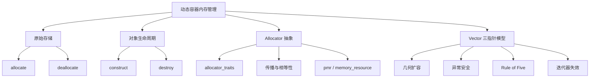
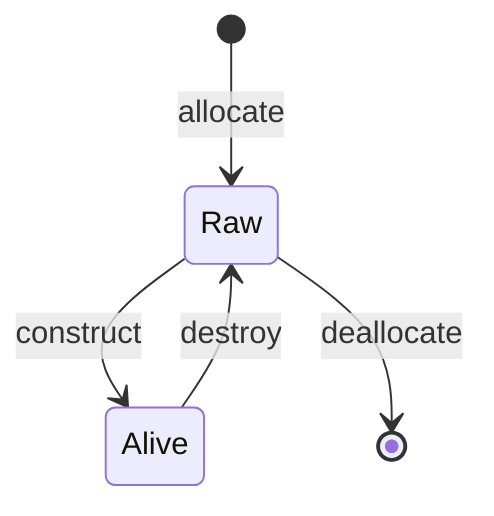
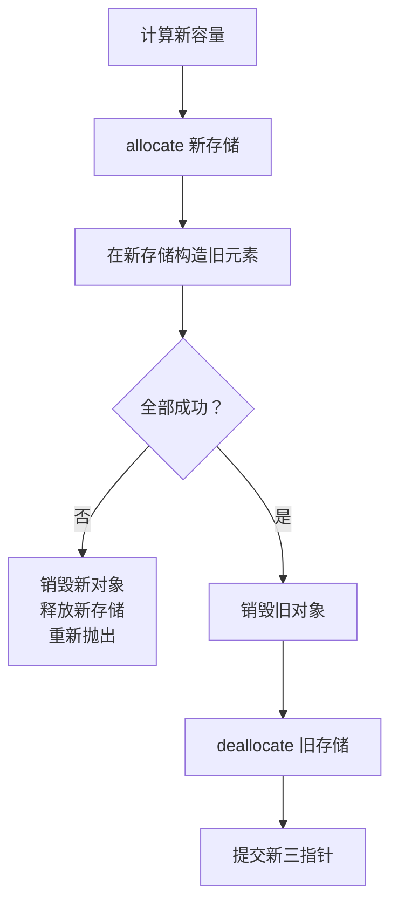

# STL Allocator 与简化版 Vector

> 面试复习目标：理解“原始存储”与“对象生命周期”的分离，掌握 `std::allocator`、`allocator_traits`、未初始化内存算法和 `vector` 三指针模型，并能分析自定义动态数组的扩容、均摊复杂度、异常安全、拷贝移动语义及迭代器失效。

## 1. 知识地图



本章最重要的分层：


> [!IMPORTANT]
> “有一块足够大的内存”不等于“这块内存中已经存在 `T` 对象”。内存分配和对象生命周期是两个不同层次。

---

## 2. `new/delete` 做了什么

```cpp
Widget* pointer = new Widget(args...);
delete pointer;
```

概念上：

```text
new 表达式
  = 获取足够且对齐正确的存储
  + 在存储上构造对象

delete 表达式
  = 调用对象析构函数
  + 释放对应存储
```

如果构造函数抛出异常，`new` 表达式会自动释放刚获得的存储。

需要区分：

- `new` 表达式：分配并构造；
- `operator new`：底层存储分配函数；
- placement new：在给定地址上构造，不负责申请存储；
- `delete` 表达式：析构并释放；
- `operator delete`：底层存储释放函数。

容器不能简单地对整个容量执行 `new T[capacity]`，因为那会立即构造所有 `T`，而 `vector` 只应构造 `size()` 个有效元素。

---

## 3. 为什么容器要分离存储与对象

假设：

```cpp
std::vector<std::string> values;
values.reserve(100);
```

此时：

- 容器拥有可容纳至少 100 个 `string` 的存储；
- `size()` 仍为 0；
- 100 个位置上并没有已经构造好的 `string`；
- 不能访问 `values[0]`。

好处：

- 容量可以大于有效元素数；
- `push_back` 只在需要的位置构造；
- `pop_back` 只销毁对象，不必立即释放整块存储；
- 避免为备用容量执行无意义的默认构造和析构；
- 支持没有默认构造函数的元素类型。

---

## 4. `std::allocator`

经典接口：

```cpp
std::allocator<T> allocator;

T* pointer = allocator.allocate(count);
// 此时只有原始存储，没有 T 对象

allocator.construct(pointer, args...);
// pointer 位置上开始存在 T 对象

allocator.destroy(pointer);
// T 对象生命周期结束，存储仍在

allocator.deallocate(pointer, count);
// 存储归还
```

`allocate(count)` 的参数是可容纳的 `T` 元素数量，不是字节数。

重要契约：

- 分配失败通常抛出 `std::bad_alloc`；
- 返回存储满足 `T` 的大小和对齐要求；
- 只在已分配且尚未构造的位置构造对象；
- 每个已构造对象恰好销毁一次；
- `deallocate` 的指针必须来自兼容 allocator 的对应分配；
- 释放时的数量必须匹配分配契约；
- 所有对象销毁以后才能释放其底层存储。

---

## 5. C++17/20 的接口演进

源码使用：

```cpp
allocator.construct(pointer, value);
allocator.destroy(pointer);
```

这些成员函数：

- C++17 已弃用；
- C++20 已从 `std::allocator` 移除。

泛型容器应通过 `std::allocator_traits`：

```cpp
using Alloc = std::allocator<T>;
using Traits = std::allocator_traits<Alloc>;

Alloc allocator;
T* pointer = Traits::allocate(allocator, 1);

Traits::construct(allocator, pointer, value);
Traits::destroy(allocator, pointer);

Traits::deallocate(allocator, pointer, 1);
```

C++20 直接管理对象生命周期还可使用：

```cpp
std::construct_at(pointer, args...);
std::destroy_at(pointer);
```

> [!NOTE]
> `allocator_traits` 是编写 allocator-aware 泛型容器的首选入口；它能统一默认 allocator 与用户自定义 allocator 的差异。

---

## 6. `allocator_traits` 提供什么

```cpp
using Traits = std::allocator_traits<Allocator>;
```

常见成员：

```cpp
Traits::pointer
Traits::const_pointer
Traits::size_type
Traits::difference_type

Traits::allocate(allocator, n)
Traits::deallocate(allocator, p, n)
Traits::construct(allocator, p, args...)
Traits::destroy(allocator, p)
Traits::max_size(allocator)
```

还有与容器拷贝、移动、交换相关的策略：

```cpp
Traits::propagate_on_container_copy_assignment
Traits::propagate_on_container_move_assignment
Traits::propagate_on_container_swap
Traits::is_always_equal
Traits::select_on_container_copy_construction(...)
```

这也是“写一个真正支持任意 allocator 的容器”远比调用四个函数复杂的原因。

---

## 7. 原始存储上的对象生命周期



非法状态转换示例：

- 对原始存储直接按 `T` 对象读取；
- 在同一位置重复构造而不先结束旧对象生命周期；
- 对从未构造的位置调用析构；
- 对仍有活对象的存储直接释放；
- 重复销毁或重复释放；
- 用不匹配的 allocator 或数量释放。

对于 `int` 等平凡类型，错误可能暂时“看不出来”；换成管理文件、锁或堆内存的类就会暴露资源泄漏、双重释放等问题。

---

## 8. 未初始化内存算法

已初始化目标区间使用赋值类算法；原始存储使用构造类算法。

| 原始存储算法 | 作用 |
|---|---|
| `uninitialized_copy` | 复制构造一段对象 |
| `uninitialized_move` | 移动构造一段对象 |
| `uninitialized_fill` | 复制构造为指定值 |
| `uninitialized_default_construct` | 默认初始化 |
| `uninitialized_value_construct` | 值初始化 |
| `destroy/destroy_n` | 批量结束对象生命周期 |

```cpp
T* new_finish =
    std::uninitialized_copy(old_begin, old_end, new_begin);
```

若构造中途抛出，标准未初始化算法会销毁本次已经成功构造的目标对象；但新分配的整块原始存储仍由调用者拥有，调用者必须捕获异常并 `deallocate`，否则仍会泄漏。

---

## 9. Vector 的三指针模型

主流实现可用三根指针理解，但标准不强制必须这样实现：

```text
begin_        end_                 cap_
  |             |                   |
  v             v                   v
  [ 活对象区域   )[ 未构造备用存储    )
  |<-- size -->|
  |<----------- capacity ---------->|
```

对应源码：

| 源码字段 | 常见命名 | 含义 |
|---|---|---|
| `m_start` | `begin_` | 首元素/存储起点 |
| `m_finish` | `end_` | 最后一个活对象之后 |
| `m_endOfStorage` | `cap_` | 已分配存储末尾 |

关系：

```cpp
size     = end_ - begin_;
capacity = cap_ - begin_;
```

只有 `[begin_, end_)` 中存在活对象；`[end_, cap_)` 只有原始存储。

---

## 10. 容器不变量

一个三指针动态数组在每个公开操作结束后都应满足：

```text
begin_ <= end_ <= cap_
```

以及：

- `[begin_, end_)` 每个位置恰有一个 `T` 对象；
- `[end_, cap_)` 没有 `T` 对象；
- 三个指针属于同一分配块，或共同表示空状态；
- `size() <= capacity()`；
- 该容器独占或按明确规则拥有分配块；
- allocator 状态能正确释放该分配块。

异常发生时也必须回到某个合法不变量状态。

---

## 11. 空状态与指针运算

源码把三根指针初始化为 `nullptr`，并在 `size/capacity` 中先判断：

```cpp
return m_start ? m_finish - m_start : 0;
```

这是必要的谨慎：指针相减要求两者指向同一数组对象或尾后位置，不能依赖 `nullptr - nullptr`。

同理，实现中应避免对空状态做：

```cpp
begin_ + 0;
end_ - begin_;
```

除非实现选择了一个能合法参与这些运算的非空哨兵存储模型。

---

## 12. `size_type` 与 `difference_type`

源码返回 `int`：

```cpp
int size() const;
int capacity() const;
```

容器接口更合适的类型：

```cpp
using size_type = typename Traits::size_type;
using difference_type = typename Traits::difference_type;
```

- 元素数量用无符号的 `size_type`；
- 指针/迭代器距离用有符号的 `difference_type`；
- 从指针差转换到 `size_type` 前应保证非负；
- 扩容计算要防止整数溢出和超过 `max_size()`。

```cpp
if (old_capacity > max_size() / 2) {
    throw std::length_error("capacity overflow");
}
```

---

## 13. `push_back` 无需扩容

当：

```cpp
end_ != cap_
```

尾部还有未构造存储，只需：

```cpp
Traits::construct(allocator_, end_, value);
++end_;
```

顺序不能反：

1. 先构造；
2. 构造成功后再提交 `end_`。

若构造函数抛出，`end_` 没有变化，容器仍表示原来的有效元素区间。

移动和原地构造版本：

```cpp
void push_back(const T&);
void push_back(T&&);

template<class... Args>
reference emplace_back(Args&&... args);
```

`emplace_back` 使用完美转发直接在尾部构造。

---

## 14. `pop_back`

```cpp
--end_;
Traits::destroy(allocator_, end_);
```

先把尾后指针退到最后一个活对象，再销毁它。

效果：

- `size()` 减 1；
- `capacity()` 不变；
- 不释放整块存储；
- 被删元素的引用和迭代器失效。

标准 `vector::pop_back()` 要求容器非空；对空容器调用行为未定义。源码的 `MyVector::pop_back()` 选择静默无操作，这是自定义接口语义，与标准 `vector` 不同。

---

## 15. 为什么 `pop_back` 不缩容

若每次删除都重新分配更小空间：

- 高频尾删会不断申请和释放；
- 剩余元素反复搬迁；
- 所有迭代器频繁失效；
- 与后续再次插入形成容量抖动。

因此：

- `pop_back/erase/clear` 通常不改变 `capacity`；
- `shrink_to_fit` 也只是非绑定请求；
- 释放容量可通过销毁容器、与空容器交换或实现选择的收缩操作完成。

---

## 16. 几何扩容

教学版使用：

```text
0 → 1 → 2 → 4 → 8 → 16 ...
```

几何增长避免每次插入都重分配。若增长因子大于 1，则插入 `n` 个元素的总搬迁量形成几何级数：

```text
1 + 2 + 4 + ... + n < 2n
```

所以：

- 单次触发扩容的 `push_back` 为 `O(n)`；
- 一系列尾插的平均/均摊复杂度为 `O(1)`。

> [!IMPORTANT]
> C++ 标准不规定 `vector` 必须翻倍扩容。实现只需满足复杂度和语义要求，增长因子可以不同。

---

## 17. 扩容的基本流程



关键原则：

- 在新空间准备成功前，不破坏旧空间；
- 只销毁真正构造成功的对象；
- 新旧存储的容量分别用于各自的 `deallocate`；
- 最后一步才更新成员指针，称为 commit；
- 失败路径负责 rollback。

---

## 18. 为什么优先移动，但不能盲目移动

扩容时复制：

```cpp
std::uninitialized_copy(begin_, end_, new_begin);
```

缺点：

- 大对象复制成本高；
- 不支持仅移动类型，如 `unique_ptr`。

移动：

```cpp
std::uninitialized_move(begin_, end_, new_begin);
```

若移动构造可能抛出，已经移动过的旧元素可能进入 moved-from 状态，难以恢复强异常保证。

标准容器常用与 `std::move_if_noexcept` 相同的选择思想：

- 移动构造是 `noexcept`，优先移动；
- 移动可能抛出且可复制，优先复制以保留旧对象；
- 仅可移动且移动可能抛出时，强保证可能受到限制。

```cpp
Traits::construct(
    allocator_,
    new_end,
    std::move_if_noexcept(*old)
);
```

> [!TIP]
> 为移动构造和移动赋值在正确情况下标记 `noexcept`，会直接影响标准容器扩容时是否敢于移动对象。

---

## 19. 异常安全等级

| 保证 | 含义 |
|---|---|
| 无异常保证 | 操作不抛出 |
| 强保证 | 失败后对象状态与调用前等价 |
| 基本保证 | 失败后对象仍合法、无资源泄漏，但值可能改变 |
| 无保证 | 甚至可能破坏不变量或泄漏 |

容器扩容期望：

1. 分配失败：旧容器不变；
2. 新元素构造失败：清理新存储，旧容器尽可能不变；
3. 搬迁中失败：销毁新空间中已构造对象并释放新存储；
4. 只有全部成功才销毁旧空间并提交。

RAII 的意义是把失败路径清理交给局部守卫，而不是依赖每个 `catch` 手工完整处理。

---

## 20. 异常安全的扩容骨架

下面展示核心思想，不是完整标准容器实现：

```cpp
void reallocate(size_type new_capacity) {
    pointer new_begin = Traits::allocate(allocator_, new_capacity);
    pointer new_end = new_begin;

    try {
        for (pointer old = begin_; old != end_; ++old, ++new_end) {
            Traits::construct(
                allocator_,
                new_end,
                std::move_if_noexcept(*old)
            );
        }
    } catch (...) {
        while (new_end != new_begin) {
            Traits::destroy(allocator_, --new_end);
        }
        Traits::deallocate(allocator_, new_begin, new_capacity);
        throw;
    }

    destroy_range(begin_, end_);
    if (begin_) {
        Traits::deallocate(allocator_, begin_, capacity());
    }

    begin_ = new_begin;
    end_ = new_end;
    cap_ = new_begin + new_capacity;
}
```

实现时还需处理：

- 旧容量要在释放前保存；
- 自引用插入；
- 新增元素构造与旧元素搬迁的顺序；
- fancy pointer，而不一定是裸 `T*`；
- allocator 传播与相等性；
- 长度溢出；
- 仅移动且抛异常类型的保证边界。

---

## 21. 源码 `reallocate` 的异常泄漏

源码：

```cpp
T* newStart = m_alloc.allocate(newCapacity);
T* newFinish =
    uninitialized_copy(m_start, m_finish, newStart);
```

若元素复制构造抛出：

- `uninitialized_copy` 会处理它已成功构造的目标元素；
- `newStart` 对应的原始分配块仍未 `deallocate`；
- 函数直接异常退出；
- 新存储泄漏。

需要使用 `try/catch` 或 RAII 守卫确保新分配块一定归还。

这说明“标准算法有异常清理”不等于“调用者没有资源责任”。

---

## 22. Rule of Three/Five：当前最大缺陷

`MyVector` 拥有裸指针资源并定义了析构函数，却没有定义或删除：

- 拷贝构造；
- 拷贝赋值；
- 移动构造；
- 移动赋值。

编译器生成的拷贝操作只复制三根指针：

```text
vec1 ─┐
      ├──> 同一块存储
vec2 ─┘
```

后果：

- 两个容器误以为自己都拥有同一块内存；
- 一个析构后另一个指针悬空；
- 两次析构发生 double free；
- 修改一个容器破坏另一个容器。

> [!WARNING]
> 当前 `MyVector` 只适合教学观察单个对象。任何拷贝行为都会触发严重所有权错误。

最小止损：

```cpp
MyVector(const MyVector&) = delete;
MyVector& operator=(const MyVector&) = delete;
```

完整容器则应实现深拷贝和移动转移。

---

## 23. 拷贝构造应如何实现

目标：

- 新容器拥有独立存储；
- 逐个复制构造有效元素；
- 任一复制抛出时清理已构造对象与新存储；
- 原对象保持不变。

概念流程：


可选择：

- 容量等于源 `size()`：节省内存；
- 容量等于源 `capacity()`：保留备用空间；

标准 `vector` 的拷贝构造结果容量不应被用户依赖为某种固定策略，重要的是元素和值语义。

---

## 24. 拷贝赋值

拷贝赋值要处理：

- 自赋值；
- 目标现有容量是否足够；
- 新旧元素数量关系；
- 已构造区域使用赋值；
- 未构造区域使用构造；
- 多余旧元素需要销毁；
- allocator 是否传播；
- 中途异常时保持不变量。

教学实现可使用 copy-and-swap 获得清晰的强保证：

```cpp
MyVector& operator=(const MyVector& rhs) {
    if (this != &rhs) {
        MyVector temp(rhs);
        swap(temp);
    }
    return *this;
}
```

但真正 allocator-aware 的 `swap` 还必须考虑 allocator 是否可交换或相等，不能机械套用。

---

## 25. 移动构造与移动赋值

allocator 兼容时，移动构造可窃取三根指针：

```cpp
MyVector(MyVector&& rhs) noexcept
    : begin_(rhs.begin_),
      end_(rhs.end_),
      cap_(rhs.cap_) {
    rhs.begin_ = nullptr;
    rhs.end_ = nullptr;
    rhs.cap_ = nullptr;
}
```

移动后：

- 新对象接管存储；
- 源对象处于合法可析构状态；
- 不逐个移动元素；
- 操作通常为 `O(1)`。

对带状态 allocator 的移动赋值：

- allocator 可传播或相等时，可直接接管；
- allocator 不同且不可传播时，可能必须逐元素移动到自己的分配器所拥有的存储；
- 因此复杂度和 `noexcept` 条件会变化。

---

## 26. 为什么 allocator 通常不应是 `static`

源码：

```cpp
static std::allocator<T> m_alloc;
```

对无状态的 `std::allocator<T>`，教学中共享对象通常看不出问题；但通用 allocator 可能携带状态，例如：

- 内存池地址；
- NUMA 节点；
- 统计与追踪信息；
- arena 标识；
- 外部 `memory_resource`。

标准容器通常每个实例保存自己的 allocator 状态，并用空基类优化或 `[[no_unique_address]]` 降低无状态 allocator 的存储成本。

若不同容器误用错误 allocator 释放内存，可能直接导致未定义行为。

---

## 27. Allocator-aware 容器的模板形式

简化声明：

```cpp
template<class T, class Allocator = std::allocator<T>>
class MyVector {
    using Traits = std::allocator_traits<Allocator>;

    Allocator allocator_;
    typename Traits::pointer begin_;
    typename Traits::pointer end_;
    typename Traits::pointer cap_;
};
```

但需要注意：

- `Traits::pointer` 可能是 fancy pointer，不一定是 `T*`；
- 指针运算可通过 `std::to_address` 等机制转换/访问；
- `construct/destroy` 要通过 traits；
- 拷贝、移动、交换必须遵守传播 trait；
- `get_allocator()` 通常按值返回 allocator；
- 最大容量受 `max_size()` 限制。

教学容器只支持 `std::allocator` 和裸指针可以接受，但应明确范围。

---

## 28. `reserve` 与 `resize`

```cpp
vector.reserve(n);
```

- 保证容量至少达到目标（若目标更大）；
- 不改变 `size()`；
- 不构造新元素；
- 可能重新分配并使迭代器失效。

```cpp
vector.resize(n);
```

- 改变 `size()`；
- 变大时在未构造位置构造对象；
- 变小时销毁尾部对象；
- 可能需要扩容。

自定义 vector 若实现这两个接口，正好检验是否真正区分“存储”和“对象”。

---

## 29. `clear`、析构与释放容量

`clear()`：

```cpp
destroy_range(begin_, end_);
end_ = begin_;
```

它结束所有元素生命周期，但通常保留存储，故：

```text
size = 0
capacity 不变
```

析构：

```cpp
destroy_range(begin_, end_);
deallocate(begin_, capacity());
```

顺序必须是先销毁对象，再释放存储。

析构函数不应抛出异常；元素析构函数也应遵循通常的 `noexcept` 析构约定。

---

## 30. 扩容与迭代器失效

重分配后：

- 所有元素地址改变；
- 所有旧迭代器失效；
- 所有旧指针失效；
- 所有旧引用失效；
- 旧 `data()` 不再可用。

未重分配的尾插：

- 旧元素的迭代器和引用保持有效；
- 原来的 `end()` 失效，因为尾后位置改变。

`pop_back`：

- 指向被删元素的迭代器/引用失效；
- 旧 `end()` 失效；
- 其他元素不搬迁。

---

## 31. 自引用插入问题

标准容器要考虑：

```cpp
values.push_back(values.front());
```

若扩容流程先搬迁并销毁旧元素，`push_back` 的参数引用可能在构造新尾元素前悬空。

实现可通过：

- 在安全顺序下先保存参数副本；
- 在新存储中先构造新增元素，再搬迁旧元素；
- 仔细处理参数是否来自自身存储；
- 让事务式重分配流程保证别名安全。

这是手写 vector 从“看似能用”到“符合标准语义”的典型隐藏难点。

当前 `MyVector` 没有元素访问接口，测试暂时触发不了这一情况，但完善接口后必须考虑。

---

## 32. 内存连续性与对齐

动态数组要求元素连续：

```cpp
&vector[i + 1] == &vector[i] + 1
```

好处：

- `O(1)` 随机访问；
- 缓存局部性好；
- 可通过 `data()` 与需要连续内存的 API 协作；
- 迭代器可表现为随机访问/连续迭代器。

allocator 返回的存储必须满足 `T` 的对齐要求。不能简单使用：

```cpp
char* raw = new char[n * sizeof(T)];
```

然后假设它对任意过度对齐类型都正确；应使用标准分配设施或正确的对齐版本。

---

## 33. `std::pmr`：运行时选择内存资源

C++17 提供 polymorphic memory resource：

```cpp
#include <memory_resource>

std::byte buffer[4096];
std::pmr::monotonic_buffer_resource resource(
    buffer, sizeof buffer
);

std::pmr::vector<int> values(&resource);
```

`std::pmr::polymorphic_allocator<T>` 内部关联 `memory_resource`，允许在运行时选择策略。

常见资源：

| 资源 | 特点 |
|---|---|
| `new_delete_resource` | 使用全局 new/delete |
| `null_memory_resource` | 所有分配都失败 |
| `monotonic_buffer_resource` | 批量释放，单次 deallocate 通常不回收 |
| `unsynchronized_pool_resource` | 单线程小块池 |
| `synchronized_pool_resource` | 线程安全池 |

典型用途：

- 请求级 arena；
- 游戏帧内临时对象；
- 编译器 AST；
- 高频小对象；
- 可测试的内存失败与统计资源。

---

## 34. 自定义 allocator 不负责什么

allocator 主要解决“从哪里、如何取得/归还存储”。通常不负责：

- 容器选择多大容量；
- vector 采用何种增长因子；
- 元素放在哪个逻辑位置；
- 何时插入/删除；
- 容器如何维持迭代器语义；
- 业务对象的所有权关系。

增长策略属于容器，存储资源策略属于 allocator，不应混为一谈。

---

## 35. 性能分析

### 35.1 尾插

- 有容量：一次构造，`O(1)`；
- 无容量：分配 + 搬迁 `size` 个元素 + 构造新元素，`O(n)`；
- 几何扩容下连续尾插均摊 `O(1)`。

### 35.2 尾删

- 一次析构，`O(1)`；
- 不自动缩容。

### 35.3 内存开销

```text
capacity - size
```

对应暂未构造的备用位置。它换取减少重分配次数。

### 35.4 `reserve`

已知大致元素数时提前 `reserve`：

- 减少分配和搬迁；
- 降低迭代器失效次数；
- 但过度预留会增加峰值内存。

---

## 36. 一个更完整的实现检查表

手写动态数组至少要审查：

- [ ] 默认构造与空状态
- [ ] 析构：销毁对象后释放存储
- [ ] 深拷贝构造
- [ ] 拷贝赋值与自赋值
- [ ] `noexcept` 移动构造
- [ ] allocator-aware 移动赋值
- [ ] `push_back(const T&)`
- [ ] `push_back(T&&)`
- [ ] `emplace_back`
- [ ] `pop_back`
- [ ] `reserve/resize/clear`
- [ ] 元素访问与边界检查
- [ ] `begin/end/data`
- [ ] const 迭代器
- [ ] 容量溢出与 `max_size`
- [ ] 分配失败
- [ ] 元素构造/复制/移动失败
- [ ] rollback 不泄漏
- [ ] move-only 类型
- [ ] 自引用插入
- [ ] allocator 传播与相等性
- [ ] 迭代器失效契约

这也是面试官通过“实现简化 vector”综合考察 C++ 基础的原因。

---

## 37. 源码逐项复盘

### 37.1 `01_allocator.cc`

正确展示了四阶段：

```text
allocate → construct → destroy → deallocate
```

以及它与 `new/delete` 的区别。应补充：

- `construct/destroy` 成员接口在 C++20 已移除；
- 新代码用 `allocator_traits`，C++20 也可用 `construct_at/destroy_at`；
- 手工管理原始存储应优先使用 RAII 封装失败路径。

### 37.2 `02_MyVector.cc`

已经正确展示：

- 三指针状态模型；
- `size/capacity`；
- 几何扩容；
- 原始存储上的构造；
- `pop_back` 只销毁对象；
- 析构时销毁再释放；
- 扩容后旧地址全部改变。

但它仍是教学模型，不是可用于生产的容器。

---

## 38. 源码中的问题与纠正

### 38.1 缺少 Rule of Five

默认浅拷贝会造成共享裸指针和双重释放，这是最严重问题。至少应删除拷贝，完整版本应实现深拷贝与移动。

### 38.2 扩容异常时泄漏

新存储分配后没有 guard；若复制构造抛出，新分配块不能归还。

### 38.3 只复制、不支持 move-only 元素

`uninitialized_copy` 要求元素可复制。现代 vector 必须考虑移动构造，并以 `move_if_noexcept` 思路维护异常保证。

### 38.4 使用已移除的 allocator 成员

`allocator::construct/destroy` 在 C++17 已弃用、C++20 移除。源码以 C++17 可编译，以 C++20 编译会失败。应使用 `allocator_traits`。

### 38.5 `int` 不适合作为容量类型

大容器可能发生窄化或溢出，应使用 allocator/container 的 `size_type`，并检查增长上限。

### 38.6 2 倍增长不是标准要求

这是教学实现策略，不能据此断言所有 `std::vector` 都翻倍。

### 38.7 静态 allocator 限制泛化

`std::allocator` 无状态时问题不明显；有状态 allocator 必须作为容器状态并遵守传播规则。

### 38.8 空 `pop_back` 语义不同

源码选择不执行任何操作；标准 `vector` 要求非空，空容器调用为未定义行为。

### 38.9 缺少 const、访问和迭代器接口

当前类只能观察容量，无法验证元素值，也不满足标准容器接口。要称为 vector 类容器，还需要 `operator[]/at/front/back/data/begin/end` 等。

### 38.10 C++17/20 编译结论

- 全部源码以 C++17 通过语法检查，仅有未使用 `argc/argv` 告警；
- C++20 下因 `allocator::construct/destroy` 已移除而编译失败；
- 这与笔记中的标准版本演进结论一致。

---

## 39. 高频面试问题

### 39.1 `allocate` 与 `new` 有什么区别？

`allocate` 只获得能容纳若干 `T` 的原始存储；`new` 表达式同时取得存储并构造对象。

### 39.2 `destroy` 与 `deallocate` 有什么区别？

前者结束对象生命周期但保留存储；后者归还原始存储，调用前应确保其中活对象已销毁。

### 39.3 为什么 `vector::reserve` 不要求 `T` 可默认构造？

它只申请备用存储，不在新增容量中构造 `T` 对象。

### 39.4 Vector 三根指针分别表示什么？

存储起点、活对象区间尾后位置、整块已分配存储尾后位置。

### 39.5 `size` 与 `capacity` 的本质区别？

`size` 是活对象数量；`capacity` 是不重新分配时最多可容纳的元素数。

### 39.6 为什么 `push_back` 是均摊 `O(1)`？

扩容虽然单次 `O(n)`，但几何增长使前 `n` 次插入的总搬迁次数为 `O(n)`。

### 39.7 为什么扩容不能每次只增加 1？

会使插入 `n` 个元素累计搬迁约 `1+2+...+n = O(n²)`。

### 39.8 扩容为什么让所有迭代器失效？

元素被构造到新分配块，旧地址对应对象被销毁且存储释放。

### 39.9 为什么扩容有时复制而不是移动？

若移动可能抛出而复制可用，复制能在失败时保持旧元素不变，从而提供更强的异常保证。

### 39.10 `noexcept` 移动构造为何重要？

它让容器能够放心移动元素，同时保留扩容失败回滚能力并减少昂贵复制。

### 39.11 当前 `MyVector` 拷贝会发生什么？

编译器生成的浅拷贝复制三根指针，两个对象共同释放同一资源，最终导致悬空指针和双重释放。

### 39.12 如何保证扩容异常时不泄漏？

新存储由局部 RAII guard 管理；只跟踪已构造区间，失败时销毁该区间并释放存储，全部成功后再提交。

### 39.13 `allocator_traits` 的作用是什么？

为不同 allocator 提供统一类型和操作接口，并暴露传播、相等性及重新绑定等策略。

### 39.14 allocator 为什么可能影响移动赋值复杂度？

若源目标 allocator 不兼容且不能传播，目标不能直接接管源分配块，只能用自己的 allocator 逐元素移动。

### 39.15 `pmr` 解决什么问题？

让容器在运行时选择 `memory_resource`，便于 arena、内存池、统计、测试及批量释放。

### 39.16 `clear()` 会释放容量吗？

通常只销毁所有元素并令 `size=0`，容量保留。

### 39.17 为什么未初始化存储不能用普通 `copy`？

`copy` 执行赋值，要求目标位置已有对象；未初始化存储需要复制/移动构造。

### 39.18 手写 vector 最难的部分是什么？

不是三根指针，而是异常安全、Rule of Five、allocator 状态传播、move-only 类型、别名、自引用和完整迭代器契约。

---

## 40. 易错结论速查

| 易错说法 | 正确理解 |
|---|---|
| 分配到内存就能按 `T` 使用 | 必须先建立对象生命周期 |
| `allocate(n)` 参数是字节数 | 是 `T` 的元素数量 |
| `construct` 会申请内存 | 只在已有存储上构造 |
| `destroy` 会释放存储 | 只结束对象生命周期 |
| `deallocate` 会自动析构所有元素 | 调用前应由容器销毁活对象 |
| `reserve(100)` 构造 100 个对象 | 只提供备用存储 |
| `resize` 与 `reserve` 相同 | `resize` 改变活对象数量 |
| vector 标准规定容量翻倍 | 增长因子由实现选择 |
| `push_back` 每次都是 `O(1)` | 单次扩容 `O(n)`，均摊 `O(1)` |
| 扩容总应移动元素 | 为异常安全可能选择复制 |
| `move` 一定不会抛异常 | 取决于元素移动构造 |
| 未初始化目标可使用 `std::copy` | 需要 `uninitialized_copy/move` |
| 定义析构函数就足够管理裸资源 | 还必须处理拷贝与移动 |
| 默认拷贝会自动深拷贝 | 裸指针只被按值复制 |
| `allocator` 一定无状态 | 自定义 allocator 可以携带资源状态 |
| allocator 应作为所有实例共享的静态对象 | 有状态 allocator 通常属于容器实例 |
| `allocator::construct` 是现代 C++20 接口 | C++20 已移除 |
| `pop_back` 会缩小容量 | 通常只销毁尾元素 |
| RAII 只用于智能指针 | 也用于管理原始分配与部分构造区间 |

---

## 41. 源码阅读索引

| 文件 | 主题 |
|---|---|
| `01_allocator.cc` | `new/delete` 与 allocator 四阶段 |
| `02_MyVector.cc` | 三指针、扩容、尾插尾删与析构 |
| `note/01_allocator_note.cc` | allocator 生命周期详细注释 |
| `note/02_MyVector_note.cc` | 简化 vector 实现逐步说明 |

---

## 42. 复习清单

- [ ] 能区分存储分配与对象构造
- [ ] 能区分对象销毁与存储释放
- [ ] 能解释 new/delete 表达式的组合职责
- [ ] 能说明 placement new 不负责分配
- [ ] 能使用 `allocator_traits` 四项基本操作
- [ ] 知道 `allocator::construct/destroy` 的版本变化
- [ ] 能列举常用未初始化内存算法
- [ ] 能画出 vector 三指针模型
- [ ] 能写出三指针容器不变量
- [ ] 能区分 `size/capacity/reserve/resize`
- [ ] 能解释 `push_back/pop_back` 的对象生命周期变化
- [ ] 能证明几何扩容下尾插均摊 `O(1)`
- [ ] 知道标准不规定具体扩容倍数
- [ ] 能说明扩容导致的迭代器失效
- [ ] 能解释 `move_if_noexcept` 的选择逻辑
- [ ] 能区分基本保证与强异常保证
- [ ] 能设计扩容 rollback/commit 流程
- [ ] 能发现源码扩容失败时的内存泄漏
- [ ] 能发现源码浅拷贝导致的 double free
- [ ] 能实现或删除拷贝操作
- [ ] 能写 `noexcept` 移动构造并重置源对象
- [ ] 能解释 allocator 传播对移动/交换的影响
- [ ] 能说明 static allocator 对有状态分配器的问题
- [ ] 能识别自引用插入风险
- [ ] 能解释 `std::pmr` 的使用场景
- [ ] 能列出工程级自定义 vector 尚需实现的接口与保证
