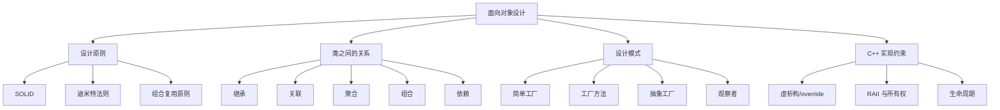
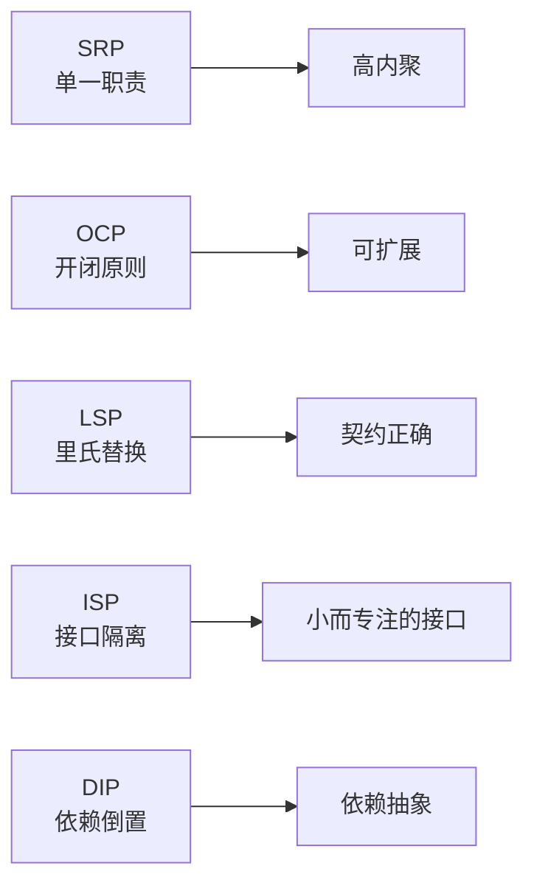
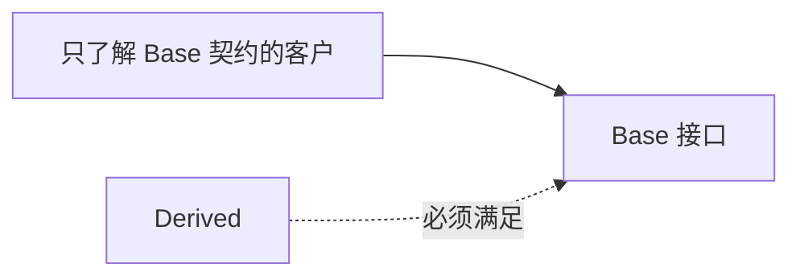
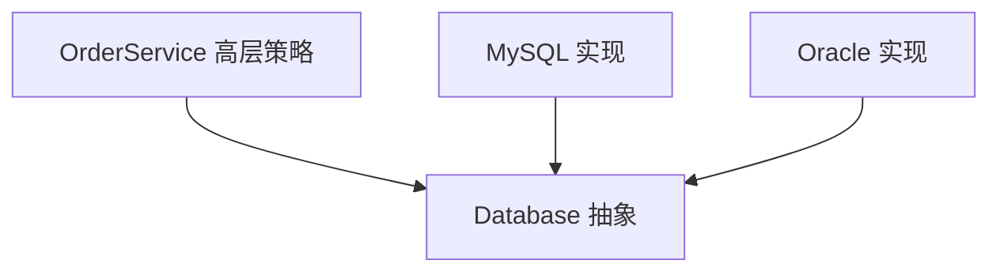
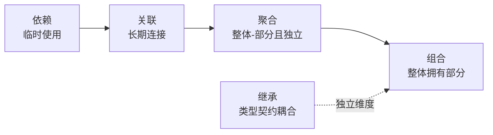
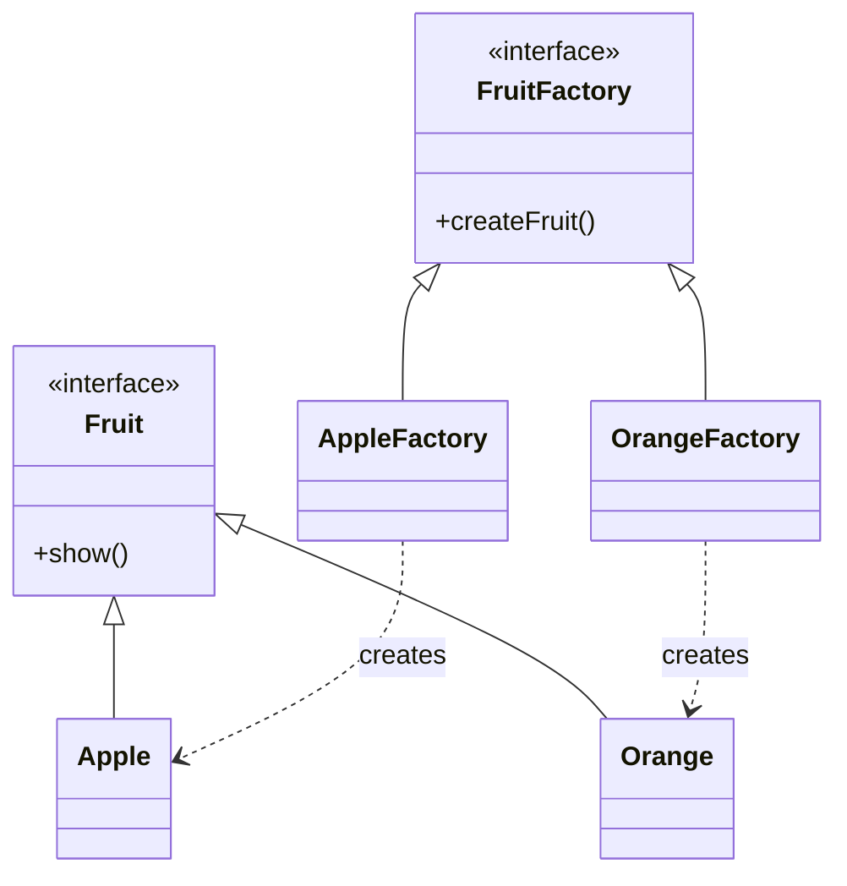
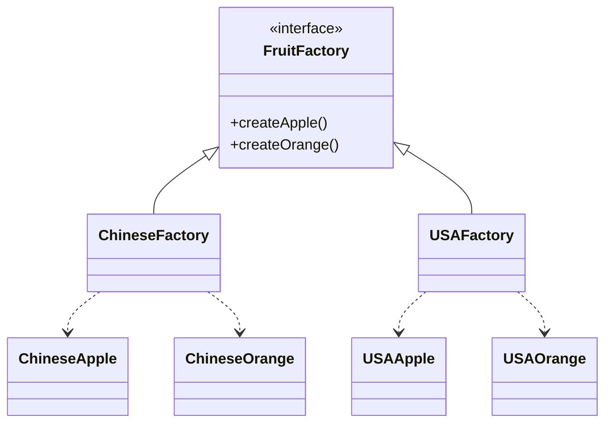
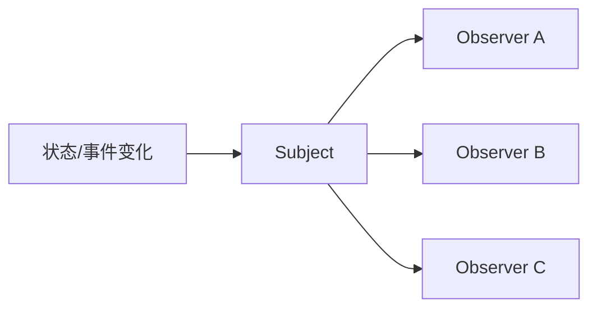

# 面向对象设计原则、类关系与设计模式

> 面试复习目标：理解 SOLID、迪米特法则和组合复用原则，准确区分继承、关联、聚合、组合与依赖，掌握简单工厂、工厂方法、抽象工厂和观察者模式，并能结合 C++ 的虚析构、RAII、智能指针和对象生命周期评价设计质量。

## 1. 知识地图



SOLID：



> [!IMPORTANT]
> 设计原则是帮助判断权衡的启发式规则，不是越多抽象层、越多类就越“面向对象”。好的设计要结合真实变化方向、团队成本和系统规模。

---

## 2. 高内聚与低耦合

面向对象设计常追求：

- 高内聚：一个模块内部的职责紧密相关；
- 低耦合：模块之间只通过必要且稳定的接口协作；
- 明确所有权：谁创建、谁持有、谁销毁；
- 明确契约：输入条件、输出保证、异常和副作用；
- 把易变化部分与稳定部分隔离。


低耦合不等于零依赖。系统中的对象必须协作，关键是依赖是否必要、方向是否合理、接口是否稳定。

---

## 3. SRP：单一职责原则

Single Responsibility Principle 的经典表述：

> 一个模块应该只有一个引起它变化的原因。

更准确地说，“职责”通常对应一类业务能力或一类利益相关者，而不是“一个类只能有一个成员函数”。

源码中的 `SmartPhone` 同时承担：

- 通话；
- 消息；
- 相机；
- 音乐。

若这些能力由不同团队维护、使用不同外部系统并独立变化，把实现全部塞进一个大类会导致：

- 修改影响范围扩大；
- 测试夹具复杂；
- 依赖越来越多；
- 发布节奏互相绑定。

拆分并组合：

```cpp
class SmartPhone {
public:
    SmartPhone(PhoneCall call,
               PhoneMessage message,
               PhonePhoto photo,
               PhoneMusic music);

private:
    PhoneCall call_;
    PhoneMessage message_;
    PhonePhoto photo_;
    PhoneMusic music_;
};
```

### 3.1 不要过度拆分

若把每一行代码都包装成一个类，会造成：

- 类数量爆炸；
- 导航和理解成本增加；
- 业务流程被切碎；
- 依赖注入和组装过于复杂。

判断依据应是“是否独立变化、是否有独立规则与依赖”，而不是机械地数方法。

---

## 4. OCP：开闭原则

Open-Closed Principle：

> 软件实体应对扩展开放，对修改相对关闭。

它不是要求“旧代码永远不能改”，而是希望在已识别的变化轴上，通过新增实现扩展稳定核心。

源码把计算器抽象为：

```cpp
class Operation {
public:
    virtual ~Operation() = default;
    virtual int evaluate(int a, int b) const = 0;
};
```

加法、减法分别实现接口，调用者只依赖 `Operation`：

```cpp
int calculate(const Operation& operation, int a, int b) {
    return operation.evaluate(a, b);
}
```

新增乘法时增加 `Multiply`，无需修改 `calculate`。

### 4.1 OCP 的成本

抽象要建立在真实变化上。若需求只有稳定的加法，提前创建复杂继承树可能是过度设计。

常见扩展机制：

- 虚函数接口；
- 模板策略；
- `std::function` 回调；
- 注册表/命令表；
- 插件接口；
- 配置驱动。

选择取决于变化发生在编译期还是运行期。

---

## 5. LSP：里氏替换原则

Liskov Substitution Principle：

> 使用基类对象的程序，在替换为任意派生类对象后，仍应保持程序的正确性和合理预期。

LSP 关注的是行为契约，不只是“语法上可以把派生类指针转成基类指针”。

派生类通常不应：

- 加强前置条件；
- 削弱后置条件；
- 破坏基类不变量；
- 引入调用方无法接受的新异常；
- 改变重要的副作用语义；
- 让原本合法的操作变得不合法。



---

## 6. Rectangle/Square 经典问题

可变矩形接口允许独立设置宽和高：

```cpp
rectangle.set_width(10);
rectangle.set_height(20);
assert(rectangle.area() == 200);
```

若 `Square` 继承 `Rectangle` 并让设置宽度同时改变高度，则调用方对 `Rectangle` 的合理预期被破坏。

问题不在数学上“正方形是不是矩形”，而在软件接口的可变行为契约：

- 数学集合关系成立；
- 当前可变 API 的行为子类型关系不成立。

改进方式：

- `Rectangle` 与 `Square` 都实现只读 `Shape::area()`；
- 构造时建立不可变尺寸；
- 把独立修改宽高的能力放进更具体接口；
- 使用组合或值类型，而不是强行继承。

```cpp
class Shape {
public:
    virtual ~Shape() = default;
    virtual int area() const = 0;
};
```

> [!NOTE]
> “使用纯虚函数”本身不会自动满足 LSP。关键仍是每个实现是否遵守抽象接口的语义契约。

---

## 7. 重写、隐藏与 LSP

虚函数重写：

```cpp
class Base {
public:
    virtual void run();
};

class Derived : public Base {
public:
    void run() override;
};
```

通过基类引用调用会动态绑定。

非虚函数同名隐藏：

```cpp
class Base {
public:
    void run();
};

class Derived : public Base {
public:
    void run(); // 隐藏
};
```

这容易造成接口困惑，但“发生名字隐藏”不必然等同于违反 LSP。LSP 是否被违反，要看通过基类契约使用派生对象时行为是否不再正确。

建议：

- 多态接口使用虚函数；
- 派生实现加 `override`；
- 不打算被重写的虚函数可加 `final`；
- 使用 `using Base::name` 恢复被重载集隐藏的基类函数；
- 避免通过非虚函数假装多态。

---

## 8. ISP：接口隔离原则

Interface Segregation Principle：

> 客户端不应依赖它不需要的方法。

源码的 `IBird` 强制每种鸟实现：

```cpp
fly();
swim();
run();
```

鸵鸟不得不用“不能飞”的实现填补接口，说明接口按“名词 Bird”分组，而没有按客户端需要的能力分组。

拆成能力接口：

```cpp
class Flyable {
public:
    virtual ~Flyable() = default;
    virtual void fly() = 0;
};

class Runnable {
public:
    virtual ~Runnable() = default;
    virtual void run() = 0;
};
```

类型只实现其真正支持的能力：

```cpp
class Ostrich : public Runnable {
public:
    void run() override;
};
```

### 8.1 ISP 不等于每个方法一个接口

接口应围绕客户端角色保持内聚。拆得过细会导致：

- 组装多个接口很繁琐；
- 调用方需要大量模板参数或多重继承；
- 一个完整操作被割裂。

判断问题是：“哪些客户端只需要其中一部分，却被迫依赖全部？”

---

## 9. DIP：依赖倒置原则

Dependency Inversion Principle：

1. 高层策略不应直接依赖低层实现；
2. 二者都依赖稳定抽象；
3. 抽象不应依赖实现细节，细节应实现抽象。

直接依赖：


倒置后：



C++ 示例：

```cpp
class Database {
public:
    virtual ~Database() = default;
    virtual void save(const Order&) = 0;
};

class OrderService {
public:
    explicit OrderService(Database& database)
        : database_(database) {}

    void process(const Order& order) {
        database_.save(order);
    }

private:
    Database& database_; // 非拥有依赖
};
```

高层模块定义它需要的抽象，具体数据库实现该抽象。

---

## 10. DIP 与依赖注入

DIP 是设计原则；Dependency Injection 是把依赖从外部提供给对象的实现手段。

常见方式：

| 注入方式 | 特点 |
|---|---|
| 构造函数注入 | 对象创建后立即完整，通常首选 |
| Setter 注入 | 可替换，但可能出现未配置状态 |
| 方法参数注入 | 依赖只在一次操作中使用 |
| 工厂/容器注入 | 集中组装对象图 |

```cpp
OrderService service(database); // 构造注入
```

优势：

- 便于测试时注入 fake/mock；
- 替换基础设施无需修改高层业务；
- 依赖显式；
- 对象创建与业务执行分离。

引用、裸指针和智能指针分别表达不同所有权，不能只为“注入”统一使用裸指针。

---

## 11. LoD：迪米特法则

Law of Demeter，也称最少知识原则：

> 一个对象只与必要的直接协作者通信，避免沿着对象图深入操作陌生对象。

坏味道：

```cpp
order.customer().address().city().tax_policy().calculate();
```

调用方知道过多内部结构，任何中间关系变化都会向外传播。

可改为：

```cpp
order.calculate_tax();
```

常被概括为“Tell, Don’t Ask”：

- 告诉对象要完成什么；
- 不要把内部数据取出来后在外部替它做决定。

### 11.1 不要机械地数点号

以下不一定违反 LoD：

```cpp
std::cout << text.size();
```

LoD 关注知识边界和耦合，不是语法点号数量。中介/Facade 可以集中复杂协作，但也不能演变成承担所有业务的“上帝对象”。

---

## 12. 组合复用原则

组合优于继承的核心：

- 继承复用固定在类型层次中；
- 组合把行为委托给协作者；
- 组合可在构造或运行时替换策略；
- 组合通常降低对基类内部实现的耦合。

```cpp
class Person {
public:
    explicit Person(Vehicle& vehicle)
        : vehicle_(vehicle) {}

    void drive() {
        vehicle_.run();
    }

private:
    Vehicle& vehicle_;
};
```

Person “使用一种交通工具”，不需要继承 Tesla/BYD。

> [!IMPORTANT]
> “优先组合”不是“禁止继承”。真正稳定的 `is-a` 关系、需要运行时替换且契约明确时，公开继承仍然合适。

---

## 13. 五种类关系总览

| 关系 | 语义 | 生命周期/所有权 | 常见 C++ 表达 |
|---|---|---|---|
| 继承 | `is-a` | 派生对象包含基类子对象 | `class D : public B` |
| 关联 | 长期“知道/连接” | 可拥有或不拥有，需另行说明 | 成员指针、引用、ID |
| 聚合 | 整体包含可独立存在的部分 | 通常非拥有/共享 | 裸观察指针、`weak_ptr`、ID |
| 组合 | 整体独占组成部分 | 生命周期绑定 | 值成员、`unique_ptr` |
| 依赖 | 临时使用 | 通常不保存 | 参数、局部变量、临时调用 |

这些关系主要是设计语义。仅看见“成员指针”不能自动断定是关联、聚合还是组合，必须看所有权和生命周期契约。

---

## 14. 继承关系

公开继承通常表达行为上的 `is-a`：

```cpp
class Animal {
public:
    virtual ~Animal() = default;
    virtual void speak() const = 0;
};

class Dog : public Animal {
public:
    void speak() const override;
};
```

客户可以通过 `Animal&` 使用 `Dog`，并要求其满足基类契约。

注意：

- private inheritance 更接近“根据……实现”，不提供公开 `is-a` 替换；
- 基类接口应避免暴露派生类无法维护的不变量；
- 多态基类需要虚析构函数；
- 值传递基类对象可能产生对象切片。

---

## 15. 对象切片

```cpp
void process(Animal animal); // 按值

Dog dog;
process(dog); // Dog 派生部分被切掉
```

切片后只剩基类子对象，动态类型信息和派生成员丢失。

多态接口通常使用：

```cpp
void process(const Animal& animal);
std::unique_ptr<Animal>;
std::shared_ptr<Animal>;
```

若需要多态值语义，可实现虚拟 `clone()` 或使用专门的类型擦除包装。

---

## 16. 关联关系

关联表示对象之间存在相对长期的业务联系：

```cpp
class Student {
public:
    void set_teacher(Teacher* teacher) {
        teacher_ = teacher;
    }

private:
    Teacher* teacher_ = nullptr; // 非拥有观察指针
};
```

需要明确：

- 指针是否可为空；
- 谁拥有 `Teacher`；
- `Teacher` 是否保证活得比 `Student` 久；
- 解除关联如何处理；
- 多线程下关联是否可并发修改。

若不能为空且初始化后不改变，可考虑构造函数注入与引用成员；若跨进程/持久化，ID 往往比裸指针更合适。

---

## 17. 聚合关系

聚合表达“整体包含部分，但部分可独立存在”：

```cpp
class Team {
public:
    void add_player(Player& player) {
        players_.push_back(&player);
    }

private:
    std::vector<Player*> players_; // 非拥有
};
```

`Team` 析构不销毁 `Player`。

风险：

- Player 先析构会留下悬空指针；
- 同一 Player 可属于多个 Team 时需要一致性规则；
- 裸指针无法自动发现对象是否已销毁。

可选方案：

- 外部生命周期契约；
- 稳定 ID + 仓库查找；
- `weak_ptr` 观察共享对象；
- `reference_wrapper`，但仍不负责生命周期。

---

## 18. 组合关系

组合表达强所有权和生命周期绑定。

最自然的 C++ 表达是值成员：

```cpp
class Person {
private:
    Heart heart_;
};
```

构造/析构顺序自动正确：

- `Person` 构造时构造 `Heart`；
- `Person` 析构时自动析构 `Heart`；
- 不需要手写 `new/delete`；
- 拷贝移动语义由成员组合而成。

若需要动态多态或延迟构造：

```cpp
class Person {
private:
    std::unique_ptr<Heart> heart_;
};
```

`unique_ptr` 明确表达独占所有权。

> [!WARNING]
> 源码 `04_composition.cc` 使用拥有型裸指针并手写析构，却未处理拷贝操作；默认浅拷贝会导致两个 `Person` 删除同一个 `Heart`。

---

## 19. 依赖关系

依赖表示某个操作临时使用另一类型：

```cpp
class User {
public:
    void print(Printer& printer,
               const std::string& text) {
        printer.print(text);
    }
};
```

`User` 不保存 `Printer`。

依赖还可能通过：

- 局部变量；
- 返回类型；
- 模板参数；
- 静态函数调用；
- 异常类型；
- `sizeof/decltype` 等编译期使用。

“没有成员变量”不代表编译依赖不存在；头文件耦合还与完整类型需求有关。

---

## 20. 关系强度与所有权

可用以下方向理解耦合强度，但不是严格数学排序：



设计评审时应问：

1. 这是 `is-a` 还是 `has-a/uses-a`？
2. 谁拥有对象？
3. 谁能为空？
4. 谁保证生命周期？
5. 是否需要共享所有权？
6. 能否运行时替换？
7. 拷贝整体时，部分应复制、共享还是禁止复制？

---

## 21. RAII 如何表达关系

| C++ 表达 | 常见语义 |
|---|---|
| `T member;` | 必存在、随整体生灭的组合 |
| `unique_ptr<T>` | 可空、独占、动态生命周期 |
| `shared_ptr<T>` | 明确共享所有权 |
| `weak_ptr<T>` | 非拥有观察共享对象 |
| `T&` | 非空非拥有，不能重新绑定 |
| `T*` | 可空非拥有，或遗留的不明确所有权 |
| `reference_wrapper<T>` | 可复制的非拥有引用 |
| ID/handle | 间接关联，可验证有效性 |

现代 C++ 中，裸指针推荐默认解释为 non-owning observer；拥有型裸指针需要额外说明，通常应改为智能指针或值成员。

---

## 22. 简单工厂

简单工厂根据参数决定创建哪种产品：

```cpp
class FruitFactory {
public:
    static std::unique_ptr<Fruit>
    create(FruitType type);
};
```

优点：

- 集中对象创建；
- 客户不直接依赖具体产品构造；
- 产品较少时简单清晰。

缺点：

- 每增加产品通常修改工厂分支；
- 工厂可能逐渐成为巨大的 `switch/if`；
- 创建逻辑耦合在一个类中。

> [!NOTE]
> “简单工厂”常被当作创建型惯用模式讲解，但不属于 GoF 23 种设计模式中的正式条目。

返回值优先使用：

```cpp
std::unique_ptr<Fruit>
```

它直接表达所有权转移，避免让调用方接收裸指针后猜测是否需要 `delete`。

---

## 23. 工厂方法

工厂方法把创建职责交给不同具体工厂：



```cpp
class FruitFactory {
public:
    virtual ~FruitFactory() = default;
    virtual std::unique_ptr<Fruit> create() const = 0;
};
```

新增一种产品通常新增：

- 具体产品；
- 对应具体工厂。

稳定客户代码不需要修改，但类数量会增加。

经典 Factory Method 还常由 Creator 基类定义一段业务流程，并把其中“创建哪个 Product”的步骤留给虚拟工厂方法。

---

## 24. 抽象工厂

抽象工厂负责创建一组相互匹配的产品：



术语：

- 产品等级结构/产品种类：Apple、Orange；
- 产品族/风格：Chinese 系列、USA 系列；
- 一个具体工厂通常生产同一产品族中的全部产品。

优点：

- 保证客户使用同一族的匹配产品；
- 新增产品族容易：增加 `JapaneseFactory` 及对应产品；
- 客户只依赖抽象产品和抽象工厂。

缺点：

- 新增产品种类困难：增加 Banana 时必须修改抽象工厂接口和所有具体工厂；
- 接口会随产品等级结构扩展。

> [!IMPORTANT]
> 源码注释把“日系苹果和橙子”说成需要修改抽象工厂，这是概念错误。日系是新增产品族，通常只新增具体工厂；真正要求修改全部工厂的是新增 Banana 这样的产品种类。

---

## 25. 三种工厂对比

| 维度 | 简单工厂 | 工厂方法 | 抽象工厂 |
|---|---|---|---|
| 核心 | 一个工厂按参数分支 | 每个具体工厂创建一种产品 | 每个具体工厂创建一族相关产品 |
| 产品维度 | 少量产品 | 单一产品等级扩展 | 多产品等级 + 多产品族 |
| 新增产品 | 修改集中工厂 | 新增产品和工厂 | 新增产品种类代价大 |
| 新增产品族 | 不突出 | 不突出 | 新增具体工厂较容易 |
| 类数量 | 少 | 较多 | 最多 |
| 一致性 | 由分支控制 | 单产品 | 能保证产品族匹配 |

选择：

- 产品少且稳定：简单工厂；
- 单类产品频繁扩展：工厂方法；
- 必须一起切换成套产品：抽象工厂；
- 构造本身很简单：直接构造可能更合适。

---

## 26. 工厂模式与所有权

现代 C++ 工厂常返回：

```cpp
std::unique_ptr<Base>
```

表示：

- 工厂创建对象；
- 所有权转移给调用方；
- 多态销毁通过基类虚析构；
- 异常路径自动清理。

若可能创建失败：

- 返回空 `unique_ptr`；
- 抛出带上下文的异常；
- 返回 `optional`/`expected` 风格结果；

应由接口契约明确，调用者不能无条件解引用可能为空的结果。

若对象被全局缓存共享，才考虑 `shared_ptr`；不要因为返回多态对象就默认共享所有权。

---

## 27. 观察者模式

观察者模式建立一对多通知：



角色：

- Subject/Publisher：维护订阅关系并发布通知；
- Observer/Subscriber：定义接收通知的接口；
- ConcreteSubject：产生状态或事件；
- ConcreteObserver：执行具体响应。

用途：

- GUI 事件；
- 消息总线；
- 模型视图同步；
- 缓存失效；
- 领域事件；
- 配置更新。

优势是发布者不依赖具体观察者类型；代价是调用链隐式、生命周期和重入更复杂。

---

## 28. 推模型与拉模型

### 28.1 推模型

```cpp
observer.on_new_video(title);
```

Subject 直接把数据发送给 Observer。

优点：

- Observer 无需再次查询；
- 适合事件数据小且明确；
- 通知时状态快照清晰。

缺点：

- 参数可能越来越大；
- 不同观察者需要不同数据；
- Subject 更了解订阅者需求。

### 28.2 拉模型

```cpp
observer.update(subject);
// observer 再从 subject 查询所需信息
```

优点：

- 通知接口稳定；
- Observer 按需读取。

缺点：

- Observer 与 Subject 查询接口耦合；
- 可能读取到通知之后变化的新状态；
- 查询次数增加。

也可推送事件 ID/轻量快照，结合两者。

---

## 29. 观察者所有权

源码 `Observer.cc` 保存：

```cpp
std::list<Observer*> observers_;
```

这通常表示 Subject 不拥有 Observer。必须保证：

- Observer 析构前主动 `detach`；
- Subject 不在 Observer 已析构后通知；
- 不重复注册，或明确允许重复通知；
- Subject 析构时不访问外部 Observer。

若 Observer 使用共享所有权，可保存：

```cpp
std::vector<std::weak_ptr<Observer>>
```

通知时：

```cpp
if (auto observer = weak.lock()) {
    observer->update(event);
}
```

这样 Subject 不会仅因订阅而延长 Observer 生命周期，也能识别已销毁订阅者。

---

## 30. RAII Subscription

更稳健的接口返回订阅令牌：

```cpp
class Subscription {
public:
    ~Subscription() {
        unsubscribe();
    }
};

auto token = subject.subscribe(callback);
```

令牌析构自动取消订阅，避免忘记 `detach`。

设计要考虑：

- token 是否可移动；
- Subject 先析构时 token 如何安全失效；
- 取消订阅是否幂等；
- 回调正在执行时能否取消；
- 跨线程取消如何同步。

这体现 RAII 不只管理内存，也管理注册关系。

---

## 31. 通知期间修改订阅列表

危险情况：

- Observer 在 `update()` 中取消自己；
- Observer 添加新 Observer；
- 回调销毁 Subject；
- 回调触发嵌套 `notify()`；
- 多线程同时订阅和通知。

直接遍历原容器可能发生迭代器失效或重入语义混乱。

常见策略：

- 通知前复制观察者快照；
- 使用稳定节点容器并谨慎推进迭代器；
- 延迟新增/删除到通知结束；
- 为每个订阅设置 active 标志；
- 明确禁止重入；
- 使用互斥锁，但调用外部回调前通常不能一直持锁；
- 定义异常策略：一个 Observer 抛异常是否中断其他通知。

观察者模式真正难点不在 `for` 循环，而在生命周期、重入和并发契约。

---

## 32. `UPerCase.cc` 的 weak_ptr 设计

优点：

- `UpLoader` 不拥有粉丝；
- 粉丝销毁后弱引用会过期；
- `notify()` 过程中自动清理过期项；
- 不会形成 `shared_ptr` 所有权环。

可以改进：

- `follow()` 防止重复订阅；
- `unfollow()` 同时清理过期项；
- 定义通知过程中取关的重入行为；
- `UpLoader` 若要作为多态基类，应增加虚析构和虚接口；
- 记录订阅 ID 通常比按 `shared_ptr` 实例比较更灵活。

---

## 33. 设计模式不是目的

使用模式前先问：

1. 当前真正变化的是什么？
2. 一个直接实现是否已经足够？
3. 模式减少了哪种耦合？
4. 引入了多少额外类和间接调用？
5. 所有权和异常边界是否更清晰？
6. 新同事能否快速理解？

模式的价值是提供共同设计语言，不是给简单代码套复杂结构。

典型过度设计：

- 只有一个实现却建立三层抽象工厂；
- 每个方法一个接口；
- 没有替换需求却全部使用运行时多态；
- 为避免一行 `if` 创建大量类；
- 使用 `shared_ptr` 掩盖所有权不清。

---

## 34. C++ 接口类的基本写法

```cpp
class Interface {
public:
    virtual ~Interface() = default;

    virtual void execute() = 0;
    virtual int query() const = 0;
};
```

建议：

- 析构函数虚化；
- 派生实现使用 `override`；
- 查询函数尽量 `const`；
- 不暴露公共可变数据成员；
- 参数使用合适的引用；
- 明确异常和线程安全；
- 接口中避免依赖不必要的具体类型；
- 若不需要 RTTI/继承，考虑模板或类型擦除。

纯虚析构也必须提供定义：

```cpp
virtual ~Interface() = 0;
Interface::~Interface() = default;
```

---

## 35. 虚析构函数

```cpp
class Base {
public:
    virtual ~Base() = default;
};

std::unique_ptr<Base> pointer =
    std::make_unique<Derived>();
```

通过基类指针删除派生对象时，基类析构必须是虚函数，否则行为未定义。

何时需要：

- 类有其他虚函数并可能被多态删除；
- 工厂返回 `unique_ptr<Base>`；
- 容器保存 `shared_ptr<Base>`；
- API 明确把它作为多态基类。

不打算多态删除的基类，可以把析构设为 protected non-virtual，阻止外部通过基类指针删除。

---

## 36. 所有权应体现在类型中

| 意图 | 推荐表达 |
|---|---|
| 独占创建结果 | `unique_ptr<T>` |
| 共享生命周期 | `shared_ptr<T>` |
| 观察共享对象 | `weak_ptr<T>` |
| 非空借用 | `T&` |
| 可空借用 | `T*` |
| 值组成部分 | `T` 成员 |

接口：

```cpp
void use(const Service&);                 // 借用
void take(std::unique_ptr<Service>);      // 接管
std::unique_ptr<Service> create();        // 转移
void share(std::shared_ptr<Service>);     // 共享
```

这比注释“这里记得 delete”更可靠。

---

## 37. 源码原则部分复盘

### 37.1 `01_SRP.cc`

正确展示大类拆分和组合。需要避免把 SRP 简化为“方法越少越好”；核心是变化原因和职责内聚。

### 37.2 `02_OCP.cc`

展示用多态操作扩展计算器。`Calculator2` 是多态基类，应补充：

```cpp
virtual ~Calculator2() = default;
```

`getResult` 可声明 `const`。

### 37.3 `03_LSP.cc`

Rectangle/Square 是很好的契约反例。后半部分把非虚函数隐藏直接判定为 LSP 违反过于绝对，应回到基类客户的行为预期判断。

### 37.4 `04_ISP.cc`

正确展示能力接口拆分。接口名称建议采用正确拼写 `ISwimmable/IRunnable`，且必需参数优先引用而非未经检查的裸指针。

### 37.5 `05_DIP.cc`

设计意图正确，但同一文件在全局作用域定义了两个 `OrderService`，造成类重定义，当前无法编译。应把“修改前/修改后”放入不同命名空间，或重命名为 `OrderServiceBefore/After`。

`Database2` 作为多态接口也应提供虚析构。

### 37.6 `06_LOD.cc`

中介封装房源选择逻辑体现最少知识原则。`Agent` 以裸指针拥有建筑并手动删除，默认拷贝会 double free，应改为：

```cpp
std::vector<std::unique_ptr<Building>> buildings_;
```

返回的 `Building*` 是非拥有观察指针，只在 `Agent` 仍存活且容器未移除对象时有效。

### 37.7 `07_Relation.cc`

组合交通工具行为是合理方向，但存在：

- `Vechicle` 拼写应为 `Vehicle`；
- 基类析构函数非虚；
- `unique_ptr<Vechicle>` 删除派生对象时行为未定义；
- `Person::m_vechicle` 未初始化；
- `drive()` 未检查是否已经注入；
- Person 保存非拥有裸指针，需明确车辆生命周期。

最关键修复：

```cpp
virtual ~Vehicle() = default;
```

---

## 38. 源码关系部分复盘

### 38.1 `01_inheritance.cc`

虚析构和 `override` 使用正确，展示标准的公开多态继承。

### 38.2 `02_association.cc`

`Student` 保存非拥有 `Teacher*`，表达单向关联。要明确 Teacher 必须比 Student 活得久，或在 Teacher 析构前解除关联。

### 38.3 `03_aggregation.cc`

`Team` 不删除 Player，体现生命周期独立；但裸指针可能悬空，生产代码需要外部契约、ID 或 `weak_ptr`。

### 38.4 `04_composition.cc`

语义上是组合，但实现应直接用 `Heart heart_;`。当前拥有型裸指针违反 Rule of Three/Five，拷贝 Person 会 double free。

### 38.5 `05_dependency.cc`

`User::doPrint(Printer&, ...)` 只在方法期间使用 Printer，是清晰的临时依赖。

### 38.6 头文件自包含

多个关系示例使用 `std::string` 却没有显式包含 `<string>`。当前编译器可能通过 `<iostream>` 的间接包含而成功，但标准可移植代码应直接包含自己使用的声明。

---

## 39. 源码模式部分复盘

### 39.1 `SampleFactory.cc`

`createFruit2()` 返回 `unique_ptr` 优于裸指针版本。调用方仍应检查未知类型返回的空指针；也可用枚举代替易拼错字符串。

### 39.2 `FactoryMethod.cc`

抽象产品与工厂都有虚析构，使用 `make_unique` 转移所有权，整体示例良好。

### 39.3 `AbstractFactory.cc`

代码正确地按 Chinese/USA 产品族创建 Apple/Orange，但扩展性注释混淆了产品族与产品种类，已在本笔记第 24 节纠正。

### 39.4 `Observer.cc`

基本一对多通知结构正确，但：

- `m_state` 未初始化，`getState()` 在首次 `setState()` 前读取会得到不确定值；
- 裸 Observer 指针需要 detach 生命周期契约；
- 重复 attach 会重复通知；
- 通知期间修改列表和异常策略未定义。

### 39.5 `UPerCase.cc`

用 `weak_ptr` 表示非拥有订阅并清理过期项，比裸指针版更安全，是本章推荐的生命周期方向。

---

## 40. 编译与安全检查结论

逐文件以 C++17 检查：

- 除 `principle/05_DIP.cc` 外均可通过语法检查；
- `05_DIP.cc` 因 `OrderService` 重复定义编译失败；
- 多数文件仅有未使用 `argc/argv` 告警。

即使可以编译，以下仍是运行期或设计期问题：

- `principle/07_Relation.cc` 通过非虚基类析构删除派生对象；
- `relationship/04_composition.cc` 拷贝后可能 double free；
- `principle/06_LOD.cc` 的 `Agent` 拷贝后可能 double free；
- Observer/聚合/关联中的非拥有裸指针可能悬空；
- 工厂返回空指针后未经检查可能被解引用。

> [!WARNING]
> “编译通过”只能证明语法和静态类型基本成立，不能证明所有权、生命周期、替换契约和设计原则正确。

---

## 41. 高频面试问题

### 41.1 SRP 中“职责”如何判断？

看模块是否因不同业务规则、不同利益相关者或不同外部依赖而独立变化，而不是简单数方法数量。

### 41.2 OCP 是否意味着永远不能修改旧代码？

不是。它要求在预期变化轴上稳定核心并通过扩展实现新行为；修复缺陷和演进错误抽象仍需修改。

### 41.3 LSP 比“子类能转成父类”多了什么？

它要求派生对象满足基类的行为契约，包括前置条件、后置条件、不变量、异常和副作用。

### 41.4 Square 为什么可能不适合继承可变 Rectangle？

Rectangle 允许宽高独立修改，Square 无法同时维持该契约和边长相等不变量。

### 41.5 ISP 与 SRP 有何区别？

SRP 关注模块自身变化原因；ISP 关注客户端是否被迫依赖不需要的接口。二者都促进内聚，但视角不同。

### 41.6 DIP 与依赖注入有何区别？

DIP 是依赖方向原则；依赖注入是从外部提供依赖的实现方法之一。

### 41.7 迪米特法则是在限制点号数量吗？

不是。它限制对象对远端内部结构的知识，目标是降低对象图耦合。

### 41.8 为什么组合通常比继承灵活？

组合可以替换协作者、分别测试和控制生命周期，不会把实现强绑定到类型层次。

### 41.9 继承和组合如何选择？

满足稳定行为契约的 `is-a` 用公开继承；`has-a/uses-a`、策略替换和代码复用优先组合。

### 41.10 关联、聚合和组合如何区分？

看语义及所有权：关联是长期联系；聚合的部分可独立存在；组合由整体拥有并控制部分生命周期。

### 41.11 为什么不能只通过指针或值成员判断 UML 关系？

同一种语法可表达不同所有权；关系由业务语义、生命周期和拷贝规则共同决定。

### 41.12 简单工厂的主要缺点是什么？

新增产品通常要修改集中分支，产品多时工厂不断膨胀。

### 41.13 工厂方法解决了什么？

把具体产品创建延迟到具体工厂，新增产品可通过增加工厂扩展。

### 41.14 抽象工厂最适合什么场景？

需要创建并整体切换一组相互匹配的产品族，例如不同平台的 UI 控件族。

### 41.15 抽象工厂增加产品族和产品种类哪个容易？

增加产品族容易，只需新具体工厂；增加产品种类困难，要修改抽象工厂及所有具体工厂。

### 41.16 观察者模式如何避免所有权环？

Subject 通常不拥有 Observer，可保存裸观察指针加契约，或对共享 Observer 保存 `weak_ptr`。

### 41.17 通知期间 Observer 取消订阅怎么办？

必须定义重入策略，可使用快照、延迟修改、稳定句柄或 active 标记，不能无条件直接遍历会失效的容器。

### 41.18 为什么多态基类需要虚析构？

通过基类指针删除派生对象时需要动态调用完整析构链，否则行为未定义。

### 41.19 什么是对象切片？

派生对象按值转换/复制为基类对象时，派生部分丢失。多态接口应使用引用或智能指针。

### 41.20 `unique_ptr<Base>` 能否保证多态删除安全？

只有 Base 析构虚化，或使用明确知道派生类型的正确自定义删除器时才安全；智能指针不会自动修复非虚析构。

---

## 42. 易错结论速查

| 易错说法 | 正确理解 |
|---|---|
| SRP 要求每个类只有一个方法 | 关注一个变化原因和职责内聚 |
| OCP 要求旧代码永远不能修改 | 在预期变化轴上通过扩展保护稳定核心 |
| 有继承语法就满足 LSP | 必须满足行为契约 |
| 纯虚接口天然满足 LSP | 实现仍可能违反语义 |
| 非虚函数隐藏必然违反 LSP | 要结合基类客户契约判断 |
| ISP 要求每个方法一个接口 | 应按客户端角色拆分内聚接口 |
| DIP 就是使用抽象类 | 关键是高层策略和细节的依赖方向 |
| 依赖注入与 DIP 完全等同 | 一个是手段，一个是原则 |
| LoD 就是不能连续调用方法 | 关注知识范围，不是点号数量 |
| 组合永远优于继承 | 稳定 `is-a` 契约仍适合继承 |
| 成员裸指针表示聚合 | 还要看所有权和生命周期 |
| 值成员总是普通关联 | 常自然表达组合 |
| `unique_ptr<Base>` 自动支持多态销毁 | Base 仍需要虚析构 |
| 简单工厂属于 GoF 23 模式 | 通常是常见创建惯用法 |
| 抽象工厂新增产品种类很容易 | 新增产品族容易，新增种类困难 |
| Observer 保存 `shared_ptr` 最安全 | 可能造成不必要延寿或所有权环 |
| `weak_ptr` 自动解决所有通知问题 | 重入、并发、异常仍需设计 |
| 智能指针可以代替所有权设计 | 必须先确定独占、共享还是借用 |
| 编译通过就说明 OOP 设计正确 | 契约和生命周期问题常在运行期出现 |

---

## 43. 源码阅读索引

### 设计原则

| 文件 | 主题 |
|---|---|
| `principle/01_SRP.cc` | 单一职责与组合 |
| `principle/02_OCP.cc` | 开闭原则与抽象操作 |
| `principle/03_LSP.cc` | 里氏替换与 Rectangle/Square |
| `principle/04_ISP.cc` | 鸟类能力接口拆分 |
| `principle/05_DIP.cc` | 数据库/银行业务依赖倒置 |
| `principle/06_LOD.cc` | 房产中介与最少知识 |
| `principle/07_Relation.cc` | 组合交通工具行为 |

### 类关系

| 文件 | 主题 |
|---|---|
| `relationship/00_introduction.txt` | 五种关系概览 |
| `relationship/01_inheritance.cc` | 公开继承与动态多态 |
| `relationship/02_association.cc` | Student 到 Teacher 关联 |
| `relationship/03_aggregation.cc` | Team 聚合 Player |
| `relationship/04_composition.cc` | Person 组合 Heart |
| `relationship/05_dependency.cc` | User 临时依赖 Printer |

### 设计模式

| 文件 | 主题 |
|---|---|
| `pattern/SampleFactory.cc` | 简单工厂 |
| `pattern/FactoryMethod.cc` | 工厂方法 |
| `pattern/AbstractFactory.cc` | 产品族与抽象工厂 |
| `pattern/Observer.cc` | 裸观察指针版观察者 |
| `pattern/UPerCase.cc` | `weak_ptr` 推模型观察者 |

---

## 44. 复习清单

- [ ] 能完整说出 SOLID 五项原则
- [ ] 能解释 SRP 的“变化原因”而不是数方法
- [ ] 能说明 OCP 的扩展轴和抽象成本
- [ ] 能从契约角度解释 LSP
- [ ] 能解释 Rectangle/Square 问题
- [ ] 能区分虚函数重写与名字隐藏
- [ ] 能按客户端角色运用 ISP
- [ ] 能区分 DIP 与依赖注入
- [ ] 能写构造函数依赖注入
- [ ] 能解释 LoD 和 Tell, Don’t Ask
- [ ] 能说明组合优于继承的适用边界
- [ ] 能区分继承、关联、聚合、组合、依赖
- [ ] 能根据所有权选择值、引用和智能指针
- [ ] 能识别对象切片
- [ ] 能说明多态基类为何需要虚析构
- [ ] 能比较简单工厂、工厂方法和抽象工厂
- [ ] 能准确区分产品族与产品种类
- [ ] 能用 `unique_ptr<Base>` 表达工厂所有权转移
- [ ] 能解释观察者模式角色
- [ ] 能比较推模型和拉模型
- [ ] 能设计 Observer 的非拥有关系
- [ ] 能使用 `weak_ptr` 避免订阅所有权环
- [ ] 能说明 RAII Subscription 的价值
- [ ] 能分析通知时取消订阅、重入和异常
- [ ] 能发现本章源码的编译、双重释放和悬空风险
- [ ] 能判断何时不应使用设计模式
