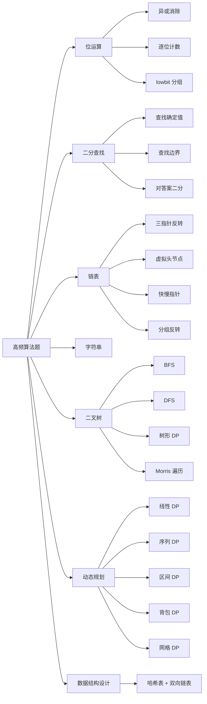
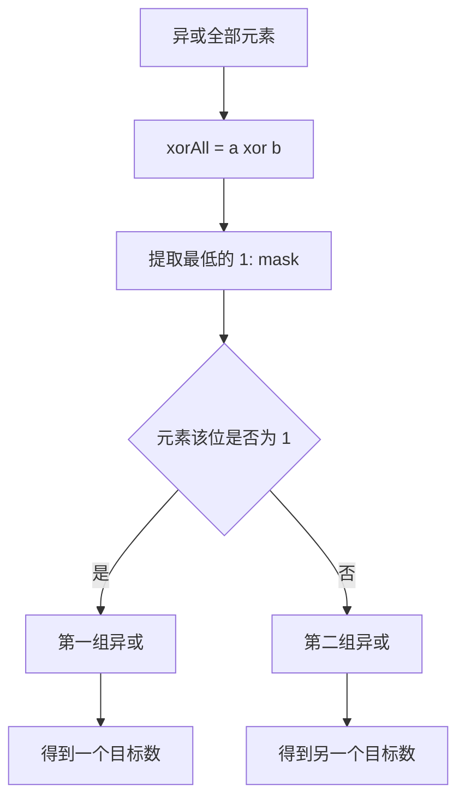
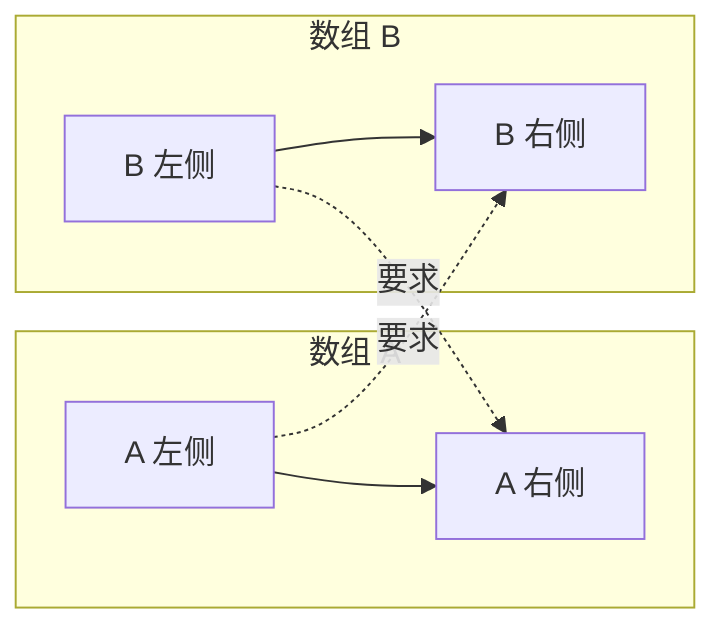
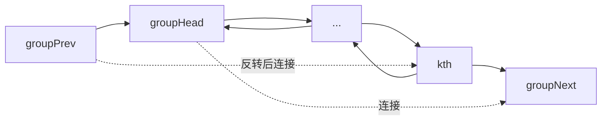
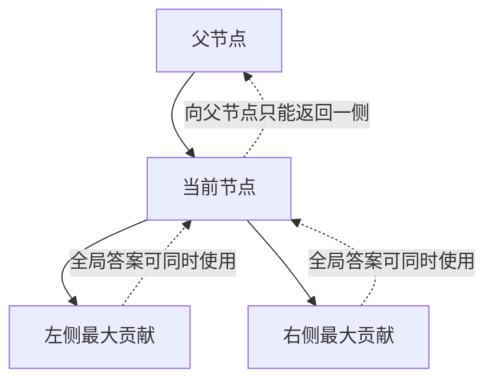
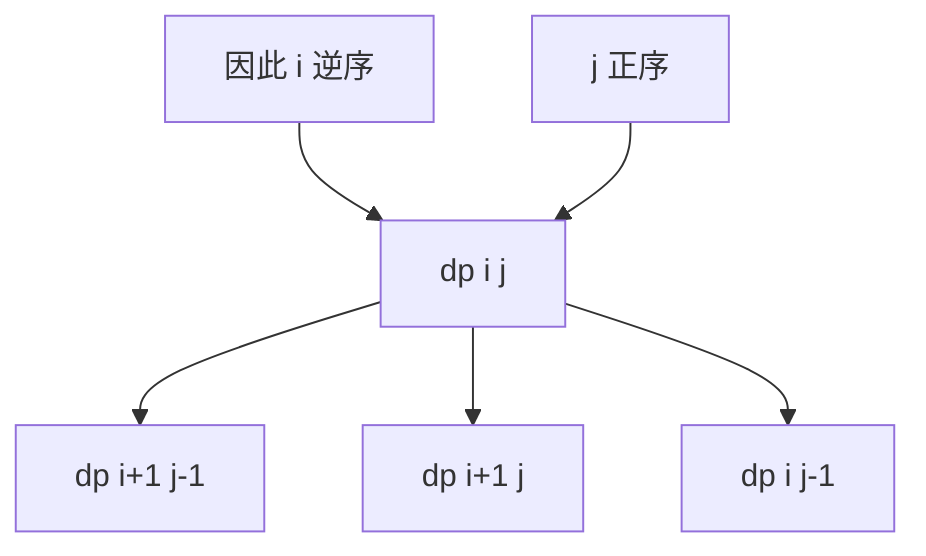
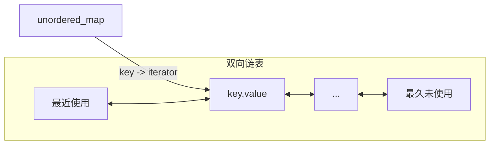

# LeetCode 高频算法面试复习

> 本章基于 `leetcode_niqiu` 目录下的 33 个 C++ 示例整理。复习时不要只记代码，应优先掌握：
>
> 1. 如何从题目特征识别算法；
> 2. 状态、区间或指针的含义；
> 3. 为什么算法正确；
> 4. 时间与空间复杂度；
> 5. 空输入、越界、溢出等边界问题。

## 1. 知识地图



### 1.1 面试中的通用解题流程

拿到题目后，可以按下面的顺序思考：

1. **确认约束**：数据规模、是否有序、元素是否重复、能否修改输入、结果是否会溢出。
2. **写出暴力解法**：先保证正确，再分析重复计算或无效搜索发生在哪里。
3. **识别结构**：
   - 有序、单调性明显：二分；
   - 链表局部重排：虚拟头节点、指针反转；
   - 树的逐层信息：BFS；
   - 子树信息决定父节点：后序 DFS / 树形 DP；
   - 最优值、计数、可行性：动态规划；
   - 要求查询和更新均为 `O(1)`：组合数据结构。
4. **定义不变量或状态**：每个变量究竟表示什么。
5. **处理边界**：空输入、单元素、重复值、极值、首尾节点。
6. **主动说明复杂度**：时间、额外空间，以及递归栈是否计入。

> [!IMPORTANT]
> 面试中“能写出代码”只完成了一半。最好主动说出循环不变量、正确性依据和边界条件，这比背诵模板更能体现算法能力。

---

## 2. 位运算

对应源码：

- [01_只出现一次的数字.cc](./01_只出现一次的数字.cc)
- [02_只出现一次的数字II.cc](./02_只出现一次的数字II.cc)
- [03_只出现一次的数字III.cc](./03_只出现一次的数字III.cc)

### 2.1 必备性质

异或 `^` 的核心性质：

```text
x ^ x = 0
x ^ 0 = x
x ^ y = y ^ x
(x ^ y) ^ z = x ^ (y ^ z)
```

因此，成对出现的数字经过异或会相互抵消。

常见位运算：

| 表达式 | 含义 |
|---|---|
| `x & 1` | 判断最低位是否为 1 |
| `x >> i` | 将第 `i` 位移到最低位 |
| `x & (x - 1)` | 清除最低的一个 1 |
| `x & -x` | 提取最低的一个 1，即 `lowbit` |
| `x \| (1U << i)` | 将第 `i` 位置为 1 |

> [!WARNING]
> 对有符号整数进行越界左移会产生未定义行为。例如在 32 位 `int` 上计算 `1 << 31` 不安全。位模式运算应优先使用 `std::uint32_t` 等无符号类型。

### 2.2 只出现一次的数字：其余元素出现两次

将所有元素异或：

```cpp
int singleNumber(const std::vector<int>& nums) {
    int answer = 0;
    for (int x : nums) {
        answer ^= x;
    }
    return answer;
}
```

正确性来自成对元素全部抵消，最终只剩目标元素。

- 时间复杂度：`O(n)`
- 额外空间：`O(1)`

### 2.3 只出现一次的数字 II：其余元素出现三次

逐位统计所有数字中 1 的数量。出现三次的数字在每一位上的贡献都是 3 的倍数，因此：

```text
目标数第 i 位 = 第 i 位的 1 的总数 mod 3
```

更稳妥的写法是使用无符号 32 位整数：

```cpp
#include <cstdint>
#include <vector>

int singleNumber(const std::vector<int>& nums) {
    std::uint32_t answer = 0;

    for (int bit = 0; bit < 32; ++bit) {
        int count = 0;
        for (int x : nums) {
            count += (static_cast<std::uint32_t>(x) >> bit) & 1U;
        }
        if (count % 3 != 0) {
            answer |= (std::uint32_t{1} << bit);
        }
    }

    return static_cast<std::int32_t>(answer);
}
```

- 时间复杂度：`O(32n)`，即 `O(n)`
- 额外空间：`O(1)`

> [!NOTE]
> 负数也可以按补码位模式逐位恢复。不过，无符号 32 位模式转换回有符号数时依赖目标平台的整数表示；算法题通常默认 32 位二进制补码。

### 2.4 只出现一次的数字 III：有两个元素各出现一次

设两个目标数为 `a`、`b`：

```text
xorAll = a ^ b
```

因为 `a != b`，`xorAll` 至少有一位是 1。取其中最低的一个 1，说明 `a` 和 `b` 在该位不同，可以据此把所有数字分成两组。相同的数字一定进入同一组，并在组内抵消。



安全提取 `lowbit`：

```cpp
std::uint32_t bits = static_cast<std::uint32_t>(xorAll);
std::uint32_t mask = bits & (0U - bits);
```

这里使用无符号整数的模运算规则，避免对 `INT_MIN` 求相反数产生溢出。

- 时间复杂度：`O(n)`
- 额外空间：`O(1)`

### 2.5 位运算面试追问

1. 为什么异或能消除成对元素？
2. 为什么第三题可以通过任意一个不同位分组？
3. `x & -x` 为什么能取得最低位的 1？
4. `1 << 31` 有什么问题？
5. 若其他数字出现 `k` 次，应如何推广逐位计数法？

---

## 3. 二分查找

对应源码：

- [04_二分查找.cc](./04_二分查找.cc)
- [05_在排序数组中查找元素的第一个和最后一个位置.cc](./05_在排序数组中查找元素的第一个和最后一个位置.cc)
- [06_找到K个最接近的元素.cc](./06_找到K个最接近的元素.cc)
- [07_寻找两个正序数组的中位数.cc](./07_寻找两个正序数组的中位数.cc)
- [08_有序矩阵中第K小的元素.cc](./08_有序矩阵中第K小的元素.cc)

### 3.1 二分的本质

二分不仅用于“查找某个值”，更一般的本质是：

> 在一个具有单调性的搜索空间中，排除一半不可能包含答案的区域。

常见类型：

| 类型 | 搜索空间 | 目标 |
|---|---|---|
| 精确查找 | 数组下标 | 找到等于 `target` 的元素 |
| 边界查找 | 数组下标 | 第一个 `>= target` 或第一个 `> target` |
| 对答案二分 | 答案值 | 找到满足条件的最小值或最大值 |
| 分割线二分 | 划分位置 | 找到使左右两侧满足条件的切分点 |

### 3.2 闭区间模板 `[left, right]`

循环不变量：答案如果存在，一定在闭区间 `[left, right]` 内。

```cpp
int search(const std::vector<int>& nums, int target) {
    int left = 0;
    int right = static_cast<int>(nums.size()) - 1;

    while (left <= right) {
        int mid = left + (right - left) / 2;

        if (nums[mid] == target) {
            return mid;
        }
        if (nums[mid] < target) {
            left = mid + 1;
        } else {
            right = mid - 1;
        }
    }
    return -1;
}
```

关键点：

- 右端点是合法下标 `size - 1`；
- 闭区间非空条件为 `left <= right`；
- 排除 `mid` 后必须使用 `mid + 1` 或 `mid - 1`；
- `left + (right - left) / 2` 比 `(left + right) / 2` 更不易溢出。

### 3.3 半开区间模板 `[left, right)`

```cpp
int search(const std::vector<int>& nums, int target) {
    int left = 0;
    int right = static_cast<int>(nums.size());

    while (left < right) {
        int mid = left + (right - left) / 2;
        if (nums[mid] < target) {
            left = mid + 1;
        } else {
            right = mid;
        }
    }

    if (left < static_cast<int>(nums.size()) && nums[left] == target) {
        return left;
    }
    return -1;
}
```

> [!CAUTION]
> `04_二分查找.cc` 中的 `Solution1` 声称使用半开区间，但将 `right` 初始化成了 `size() - 1`，并且循环结束后没有验证候选位置，因此该版本不正确。半开区间的右端点应初始化为 `size()`。

### 3.4 查找左右边界

最值得背熟的是两个标准定义：

```cpp
// 第一个 >= target 的位置
auto first = std::lower_bound(nums.begin(), nums.end(), target);

// 第一个 > target 的位置
auto afterLast = std::upper_bound(nums.begin(), nums.end(), target);
```

若手写左边界：

```cpp
int lowerBound(const std::vector<int>& nums, int target) {
    int left = 0;
    int right = static_cast<int>(nums.size()); // [left, right)

    while (left < right) {
        int mid = left + (right - left) / 2;
        if (nums[mid] < target) {
            left = mid + 1;
        } else {
            right = mid;
        }
    }
    return left;
}
```

查找目标值范围：

```text
first = lower_bound(target)
afterLast = upper_bound(target)

若 first 越界或 nums[first] != target：不存在
否则结果为 [first, afterLast - 1]
```

- 时间复杂度：`O(log n)`
- 额外空间：`O(1)`

### 3.5 找到 K 个最接近的元素

源码采用：

1. 二分找到第一个 `>= x` 的位置；
2. `left`、`right` 从分界线两侧向外扩张；
3. 每次选择与 `x` 距离更小的元素；
4. 距离相同优先选左边较小的元素；
5. 最终对选中的结果排序。

- 二分：`O(log n)`
- 扩张：`O(k)`
- 源码最后排序：`O(k log k)`

如果从左侧选择时放到结果前端、从右侧选择时放到结果后端，或者最终直接截取连续窗口，可以进一步避免排序。

更经典的“窗口左端点”二分：

```cpp
std::vector<int> findClosestElements(
    const std::vector<int>& arr, int k, int x) {
    int left = 0;
    int right = static_cast<int>(arr.size()) - k;

    while (left < right) {
        int mid = left + (right - left) / 2;
        if (static_cast<long long>(x) - arr[mid] >
            static_cast<long long>(arr[mid + k]) - x) {
            left = mid + 1;
        } else {
            right = mid;
        }
    }

    return {arr.begin() + left, arr.begin() + left + k};
}
```

- 时间复杂度：`O(log(n-k) + k)`
- 额外空间：除结果外 `O(1)`

> [!NOTE]
> 距离计算使用 `long long`，避免 `x - arr[i]` 在极端整数输入下溢出或溢出。

### 3.6 两个正序数组的中位数

#### 解法一：二分较短数组的分割位置

将两个数组分别切成左右两部分，希望满足：

```text
左半部分元素总数 == 右半部分元素总数（或多 1）
maxLeftA <= minRightB
maxLeftB <= minRightA
```



若 `A` 的分割点为 `i`，`B` 的分割点为：

```text
j = (m + n + 1) / 2 - i
```

找到合法分割后：

- 总长度为奇数：`max(maxLeftA, maxLeftB)`；
- 总长度为偶数：左右边界最大值与最小值的平均数。

- 时间复杂度：`O(log(min(m, n)))`
- 额外空间：`O(1)`

> [!WARNING]
> 计算平均值时不要先进行两个 `int` 的加法，否则可能溢出。应写成：
>
> ```cpp
> return (static_cast<double>(leftMax) + rightMin) / 2.0;
> ```

#### 解法二：求第 k 小元素

每次比较两个数组当前第 `k/2` 个候选值，排除其中一侧不可能包含第 `k` 小元素的一段。

核心边界：

- 某个数组耗尽：答案在另一个数组中；
- `k == 1`：返回当前两个首元素的较小值；
- 每轮至少排除约 `k/2` 个元素。

- 时间复杂度：`O(log(m+n))`
- 递归空间：`O(log(m+n))`

### 3.7 有序矩阵中的第 K 小元素

矩阵每行、每列均升序时，可以在“值域”上二分：

```text
left  = 矩阵最小值
right = 矩阵最大值
check(mid) = 矩阵中 <= mid 的元素个数是否至少为 k
```

从左下角统计 `<= mid` 的个数：

- 当前元素 `<= mid`：该列上方的元素都满足，一次增加 `row + 1`，然后右移；
- 当前元素 `> mid`：上移。

```mermaid
flowchart TD
    A[位于左下角] --> B{matrix[row][col] <= mid?}
    B -->|是| C[count += row + 1]
    C --> D[右移一列]
    B -->|否| E[上移一行]
    D --> F{是否越界}
    E --> F
    F -->|否| B
    F -->|是| G[返回 count]
```

若矩阵为 `n × n`：

- 单次计数：`O(n)`
- 总时间：`O(n log(maxValue - minValue))`
- 额外空间：`O(1)`

这里寻找的是：

> 最小的、使矩阵中 `<= value` 的元素数量不少于 `k` 的值。

---

## 4. 链表

对应源码：

- [09_反转链表.cc](./09_反转链表.cc)
- [10_反转链表II.cc](./10_反转链表II.cc)
- [11_K个一组翻转链表.cc](./11_K个一组翻转链表.cc)
- [12_删除链表的倒数第N个结点.cc](./12_删除链表的倒数第N个结点.cc)

### 4.1 链表题的通用原则

链表题最重要的不是记忆代码，而是：

1. 修改 `next` 前先保存后继节点；
2. 涉及头节点变化时使用虚拟头节点；
3. 明确每段链表的头、尾和下一段起点；
4. 画出指针变化，避免丢链或成环；
5. 优先使用栈上虚拟节点，避免不必要的 `new/delete`。

```cpp
ListNode dummy(0, head);
```

### 4.2 反转整个链表

三指针含义：

- `prev`：已经反转部分的头；
- `curr`：当前准备处理的节点；
- `next`：保存尚未处理部分，防止丢链。

```cpp
ListNode* reverseList(ListNode* head) {
    ListNode* prev = nullptr;
    ListNode* curr = head;

    while (curr != nullptr) {
        ListNode* next = curr->next;
        curr->next = prev;
        prev = curr;
        curr = next;
    }
    return prev;
}
```

循环不变量：

```text
prev 指向已经完成反转的链表
curr 指向尚未处理的链表
两部分节点不丢失、不重复
```

- 时间复杂度：`O(n)`
- 迭代额外空间：`O(1)`
- 递归额外空间：`O(n)`，来自调用栈

### 4.3 反转区间 `[left, right]`

两种常见方法。

#### 方法一：截断后反转

找到四个关键位置：

```text
before -> [segmentHead ... segmentTail] -> after
```

反转中间段后重新连接：

```text
before->next     = reversedHead
originalHead->next = after
```

#### 方法二：头插法

让 `pre` 始终指向反转区间前一个节点，每次把 `curr->next` 摘下并插到 `pre` 后面：

```text
初始：pre -> 2 -> 3 -> 4 -> 5
一次：pre -> 3 -> 2 -> 4 -> 5
二次：pre -> 4 -> 3 -> 2 -> 5
```

核心代码：

```cpp
ListNode* move = curr->next;
curr->next = move->next;
move->next = pre->next;
pre->next = move;
```

- 时间复杂度：`O(n)`
- 额外空间：`O(1)`

### 4.4 K 个一组翻转链表

每轮需要明确：

```text
groupPrev：上一组的尾部
kth：当前组第 k 个节点
groupNext：下一组的头
```

流程：

1. 从 `groupPrev` 向后检查是否还有 `k` 个节点；
2. 不足 `k` 个时保持原顺序并结束；
3. 将 `[groupPrev->next, kth]` 反转；
4. 连接上一组、当前组和下一组；
5. 更新 `groupPrev` 为反转前的组头，即反转后的组尾。



- 时间复杂度：`O(n)`
- 迭代额外空间：`O(1)`

> [!IMPORTANT]
> 反转当前组时可以令 `prev = groupNext`，这样反转结束后，原组头会自然指向下一组，减少一次补链操作。

### 4.5 删除倒数第 N 个节点

`12_删除链表的倒数第N个结点.cc` 目前只有节点定义，没有题解。标准方法是虚拟头节点加快慢指针：

```cpp
ListNode* removeNthFromEnd(ListNode* head, int n) {
    ListNode dummy(0, head);
    ListNode* fast = &dummy;
    ListNode* slow = &dummy;

    for (int i = 0; i < n; ++i) {
        fast = fast->next;
    }

    while (fast->next != nullptr) {
        fast = fast->next;
        slow = slow->next;
    }

    ListNode* doomed = slow->next;
    slow->next = doomed->next;
    delete doomed; // 若节点所有权由调用方管理，应遵循相应约定
    return dummy.next;
}
```

为什么快指针先走 `n` 步？

```text
fast 与 slow 保持 n 个节点的间隔。
当 fast 到达尾节点时，slow 正好位于待删除节点的前一个节点。
```

- 时间复杂度：`O(n)`
- 额外空间：`O(1)`

> [!NOTE]
> 在 LeetCode 中通常保证 `n` 合法。工程代码还应检查空链表、`n <= 0`、`n` 大于链表长度等非法输入。

### 4.6 链表面试追问

1. 为什么虚拟头节点能统一删除头节点和普通节点？
2. 递归反转链表的栈空间是多少？
3. K 组翻转时如何判断剩余节点不足 `k` 个？
4. 为什么修改 `curr->next` 前必须保存原后继？
5. `std::unique_ptr` 管理的链表应如何设计所有权？

---

## 5. 字符串拆分

对应源码：[13_按分隔符拆分字符串.cc](./13_按分隔符拆分字符串.cc)

### 5.1 `std::getline` + `std::stringstream`

```cpp
std::vector<std::string> split(const std::string& text, char delimiter) {
    std::stringstream stream(text);
    std::vector<std::string> result;
    std::string token;

    while (std::getline(stream, token, delimiter)) {
        if (!token.empty()) {
            result.push_back(token);
        }
    }
    return result;
}
```

优点是表达清晰；缺点是流对象相对较重。

### 5.2 手动扫描

维护当前 token，遇到分隔符时提交：

```cpp
for (char ch : text) {
    if (ch == delimiter) {
        if (!token.empty()) {
            result.push_back(token);
            token.clear();
        }
    } else {
        token.push_back(ch);
    }
}
if (!token.empty()) {
    result.push_back(token);
}
```

- 时间复杂度：`O(n)`
- 除返回结果外的额外空间：当前 token 最多 `O(n)`

> [!IMPORTANT]
> 拆分字符串前必须确认语义：连续分隔符是否产生空字符串？开头和结尾的分隔符是否保留空字段？源码的两个实现都会忽略空 token。

---

## 6. 二叉树

对应源码：

- [14_二叉树的序列化与反序列化.cc](./14_二叉树的序列化与反序列化.cc)
- [15_二叉树的层序遍历.cc](./15_二叉树的层序遍历.cc)
- [16_二叉树的锯齿形层序遍历.cc](./16_二叉树的锯齿形层序遍历.cc)
- [17_翻转二叉树.cc](./17_翻转二叉树.cc)
- [18_二叉树的最大深度.cc](./18_二叉树的最大深度.cc)
- [19_二叉树中的最大路径和.cc](./19_二叉树中的最大路径和.cc)
- [20_二叉树的中序遍历.cc](./20_二叉树的中序遍历.cc)
- [21_恢复二叉搜索树.cc](./21_恢复二叉搜索树.cc)

### 6.1 先确定遍历顺序

| 需求 | 常用方式 |
|---|---|
| 按层处理、最短层数 | BFS |
| 先处理父节点 | 前序 DFS |
| BST 得到有序序列 | 中序 DFS |
| 子树结果汇总到父节点 | 后序 DFS |
| `O(1)` 额外空间中序遍历 | Morris |

### 6.2 层序遍历 BFS

队列中保存下一批待访问节点。若需要按层输出，每轮先记录当前队列长度：

```cpp
while (!queue.empty()) {
    int levelSize = static_cast<int>(queue.size());
    std::vector<int> level;

    for (int i = 0; i < levelSize; ++i) {
        TreeNode* node = queue.front();
        queue.pop();
        level.push_back(node->val);

        if (node->left)  queue.push(node->left);
        if (node->right) queue.push(node->right);
    }
    result.push_back(std::move(level));
}
```

- 时间复杂度：`O(n)`
- 空间复杂度：`O(w)`，`w` 为树的最大宽度

### 6.3 锯齿形层序遍历

不必每层再调用 `reverse`，可以在写入结果时计算位置：

```cpp
int index = leftToRight ? i : levelSize - 1 - i;
level[index] = node->val;
```

每层结束后：

```cpp
leftToRight = !leftToRight;
```

复杂度仍为 `O(n)`。

### 6.4 序列化与反序列化

源码使用 BFS，并用特殊标记记录空指针：

```text
1,2,3,#,#,4,5,#,#,#,#
```

空节点标记不能省略，否则仅凭前序或层序值无法唯一恢复一般二叉树。

反序列化过程：

1. 读取第一个 token 创建根节点；
2. 队列保存等待补充左右孩子的父节点；
3. 每弹出一个父节点，依次消费两个 token；
4. 非空 token 创建节点并入队。

- 时间复杂度：`O(n)`
- 空间复杂度：`O(n)`，包括输出字符串或新建节点

> [!NOTE]
> 源码保留了末尾所有空节点标记，因此格式正确但不够紧凑。可以在序列化结束前删除末尾连续的 `#`。

> [!WARNING]
> 工程中的反序列化必须处理格式错误、数值转换失败和内存所有权。若创建一半后抛出异常，裸指针实现可能泄漏，适合使用 RAII 或统一的树销毁逻辑。

### 6.5 翻转二叉树

递归定义非常直接：

```text
翻转当前树
= 交换左右子树
+ 递归翻转两棵子树
```

```cpp
TreeNode* invertTree(TreeNode* root) {
    if (!root) return nullptr;
    std::swap(root->left, root->right);
    invertTree(root->left);
    invertTree(root->right);
    return root;
}
```

- 时间复杂度：`O(n)`
- 递归空间：`O(h)`

### 6.6 二叉树最大深度

状态定义：

```text
depth(node) = 以 node 为根的子树最大深度
```

转移：

```text
depth(node) = max(depth(node->left), depth(node->right)) + 1
depth(nullptr) = 0
```

- 时间复杂度：`O(n)`
- 递归空间：`O(h)`

平衡树中 `h = O(log n)`，极度倾斜时 `h = O(n)`。

### 6.7 二叉树中的最大路径和

这是一道典型树形 DP。最关键的是区分：

- **向父节点返回的值**：必须是一条单链，只能选择左、右中的一侧；
- **用于更新全局答案的值**：可以同时连接左子树、当前节点、右子树。

```text
leftGain  = max(0, gain(left))
rightGain = max(0, gain(right))

经过当前节点的完整路径 = node.val + leftGain + rightGain
向父节点返回的单臂路径 = node.val + max(leftGain, rightGain)
```



将负贡献截断为 0，表示不选择该子树。

- 时间复杂度：`O(n)`
- 递归空间：`O(h)`

> [!IMPORTANT]
> 树形 DP 高频模式：递归函数返回“父节点允许接收的状态”，同时用成员变量或引用更新“完整答案”。

### 6.8 中序遍历的三种实现

#### 递归

```text
访问左子树 -> 当前节点 -> 访问右子树
```

- 时间：`O(n)`
- 递归空间：`O(h)`

#### 显式栈

```cpp
while (curr != nullptr || !stack.empty()) {
    while (curr != nullptr) {
        stack.push(curr);
        curr = curr->left;
    }
    curr = stack.top();
    stack.pop();
    visit(curr);
    curr = curr->right;
}
```

- 时间：`O(n)`
- 额外空间：`O(h)`

#### Morris 中序遍历

若当前节点存在左子树，找到左子树最右节点 `predecessor`：

- `predecessor->right == nullptr`：建立临时线索指向当前节点，然后进入左子树；
- `predecessor->right == current`：说明左子树已遍历完，恢复为空，访问当前节点并进入右子树。

- 时间复杂度：`O(n)`
- 额外空间：`O(1)`

> [!CAUTION]
> Morris 遍历会临时修改树，正常流程必须恢复所有指针。若遍历中途提前返回或抛出异常，树可能处于被穿线的状态。

### 6.9 恢复二叉搜索树

BST 的中序序列严格递增。若两个节点值被交换，中序序列会出现逆序：

```text
前驱值 > 当前值
```

例一，相邻节点交换：

```text
1 3 2 4
  ^ ^
```

只有一次逆序，第一次逆序的前驱是 `first`，当前节点是 `second`。

例二，不相邻节点交换：

```text
1 5 3 4 2 6
  ^       ^
```

会出现两次逆序：

- 第一次逆序的前驱确定 `first`；
- 每次逆序的当前节点更新 `second`；
- 最终交换 `first->val` 和 `second->val`。

可用递归中序、显式栈或 Morris 遍历。

> [!WARNING]
> `21_恢复二叉搜索树.cc` 的递归版本把 `first`、`second`、`pred` 保存为成员变量，但 `recoverTree()` 开始时没有重置。若同一个 `Solution` 对象被重复调用，可能保留上次结果。应在每次入口处全部置为 `nullptr`。

### 6.10 树题面试追问

1. BFS 的空间复杂度为什么是树的最大宽度？
2. 递归 DFS 的空间为什么是 `O(h)` 而不总是 `O(log n)`？
3. 最大路径和为什么不能把左右两侧同时返回给父节点？
4. 序列化为什么需要空节点标记？
5. Morris 为什么是 `O(n)`，前驱查找是否会重复很多次？
6. 恢复 BST 时为何可能出现一次或两次逆序？

---

## 7. 动态规划

对应源码：

- [22_爬楼梯.cc](./22_爬楼梯.cc)
- [23_最大子数组和.cc](./23_最大子数组和.cc)
- [24_最长递增子序列.cc](./24_最长递增子序列.cc)
- [25_最长公共子序列.cc](./25_最长公共子序列.cc)
- [26_编辑距离.cc](./26_编辑距离.cc)
- [27_最长回文子序列.cc](./27_最长回文子序列.cc)
- [28_分割等和子集.cc](./28_分割等和子集.cc)
- [29_零钱兑换.cc](./29_零钱兑换.cc)
- [30_不同路径.cc](./30_不同路径.cc)
- [31_不同路径II.cc](./31_不同路径II.cc)
- [32_三角形最小路径和.cc](./32_三角形最小路径和.cc)

### 7.1 动态规划五步法

1. **定义状态**：`dp[i]` 或 `dp[i][j]` 表示什么；
2. **写出转移**：当前状态由哪些规模更小的状态得到；
3. **初始化边界**：空序列、起点、单元素；
4. **确定遍历顺序**：保证依赖状态已经计算；
5. **定位答案**：答案是最后一个状态还是所有状态的最值。


> [!IMPORTANT]
> 写 DP 时先用一句完整的话定义状态。若状态含义说不清，转移方程通常也不可靠。

### 7.2 爬楼梯：线性 DP

最后一步只有两种来源：

- 从第 `n-1` 阶走 1 步；
- 从第 `n-2` 阶走 2 步。

```text
dp[n] = dp[n-1] + dp[n-2]
dp[1] = 1
dp[2] = 2
```

只依赖前两个状态，可以滚动优化：

- 时间复杂度：`O(n)`
- 空间复杂度：`O(1)`

### 7.3 最大子数组和：Kadane 算法

状态定义：

```text
dp[i] = 必须以 nums[i] 结尾的最大子数组和
```

当前元素有两种选择：

```text
延续前面的子数组：dp[i-1] + nums[i]
从当前元素重新开始：nums[i]
```

转移：

```text
dp[i] = max(dp[i-1] + nums[i], nums[i])
answer = max(answer, dp[i])
```

注意答案不是必然为 `dp[n-1]`，而是所有 `dp[i]` 的最大值。

- 时间复杂度：`O(n)`
- 滚动变量空间：`O(1)`

另一种理解是前缀和：

```text
以 j 结尾的最大子数组和
= 当前前缀和 - 此前出现过的最小前缀和
```

### 7.4 最长递增子序列 LIS

#### `O(n²)` 动态规划

状态：

```text
dp[i] = 必须以 nums[i] 结尾的最长严格递增子序列长度
```

转移：

```text
dp[i] = max(dp[j] + 1)，其中 j < i 且 nums[j] < nums[i]
```

答案是所有 `dp[i]` 的最大值。

#### `O(n log n)` 贪心 + 二分

维护：

```text
tails[len - 1] = 长度为 len 的递增子序列中，可能的最小末尾值
```

对每个 `x`：

- 找到 `tails` 中第一个 `>= x` 的位置并替换；
- 若不存在，则追加到末尾。

使用 `lower_bound` 是因为题目要求**严格递增**。若求最长非递减子序列，通常改用 `upper_bound`。

- 时间复杂度：`O(n log n)`
- 空间复杂度：`O(n)`

> [!NOTE]
> `tails` 通常不是原数组中某一条真实 LIS，它保存的是不同长度下的最优末尾值。若题目要求恢复具体序列，还需要记录前驱下标。

### 7.5 最长公共子序列 LCS

状态：

```text
dp[i][j] = text1 前 i 个字符与 text2 前 j 个字符的 LCS 长度
```

转移：

```text
若 text1[i-1] == text2[j-1]:
    dp[i][j] = dp[i-1][j-1] + 1
否则:
    dp[i][j] = max(dp[i-1][j], dp[i][j-1])
```

首行和首列表示某个字符串为空，均初始化为 0。

- 时间复杂度：`O(mn)`
- 空间复杂度：`O(mn)`，可优化为 `O(min(m,n))`

> [!IMPORTANT]
> 子序列不要求字符连续；子串要求连续。看到“子串”时，状态定义和转移往往不同。

### 7.6 编辑距离

状态：

```text
dp[i][j] = word1 前 i 个字符变成 word2 前 j 个字符的最少操作数
```

边界：

```text
dp[i][0] = i  // 全部删除
dp[0][j] = j  // 全部插入
```

若末尾字符相同：

```text
dp[i][j] = dp[i-1][j-1]
```

若不同，从三种操作中选最小：

```text
替换：dp[i-1][j-1]
删除：dp[i-1][j]
插入：dp[i][j-1]

dp[i][j] = min(替换, 删除, 插入) + 1
```

- 时间复杂度：`O(mn)`
- 空间复杂度：`O(mn)`，可滚动优化

### 7.7 最长回文子序列：区间 DP

状态：

```text
dp[i][j] = s[i...j] 中最长回文子序列的长度
```

转移：

```text
若 s[i] == s[j]:
    dp[i][j] = dp[i+1][j-1] + 2
否则:
    dp[i][j] = max(dp[i+1][j], dp[i][j-1])
```

初始化：

```text
dp[i][i] = 1
```

因为当前状态依赖下一行 `i+1`，所以 `i` 必须从大到小遍历；`j` 从 `i+1` 向右遍历。



- 时间复杂度：`O(n²)`
- 二维空间：`O(n²)`
- 滚动优化：`O(n)`

一维压缩时，必须用临时变量保存覆盖前的 `dp[j]`，它将在下一轮充当原二维数组的 `dp[i+1][j-1]`。

### 7.8 分割等和子集：0-1 背包

先将问题转换为：

> 能否从数组中选出一些元素，使其和等于总和的一半？

若总和为奇数，直接返回 `false`。

一维状态：

```text
dp[j] = 当前处理过的元素能否恰好组成和 j
dp[0] = true
```

转移：

```cpp
for (int num : nums) {
    for (int j = target; j >= num; --j) {
        dp[j] = dp[j] || dp[j - num];
    }
}
```

为什么容量必须逆序？

> 每个元素只能使用一次。逆序保证 `dp[j-num]` 仍来自处理当前元素之前的旧状态。

- 时间复杂度：`O(n × target)`
- 空间复杂度：`O(target)`

### 7.9 零钱兑换：完全背包

每种硬币可使用无限次。

状态：

```text
dp[j] = 凑出金额 j 所需的最少硬币数
```

初始化：

```text
dp[0] = 0
其他状态 = INF
```

一维写法：

```cpp
std::vector<int> dp(amount + 1, amount + 1);
dp[0] = 0;

for (int coin : coins) {
    for (int value = coin; value <= amount; ++value) {
        dp[value] = std::min(dp[value], dp[value - coin] + 1);
    }
}
```

容量正序意味着本轮刚更新的状态可以再次使用当前硬币，因此是完全背包。

- 时间复杂度：`O(n × amount)`
- 空间复杂度：`O(amount)`

#### 0-1 背包与完全背包对比

| 类型 | 每件物品使用次数 | 一维容量遍历 |
|---|---:|---|
| 0-1 背包 | 最多一次 | 从大到小 |
| 完全背包 | 无限次 | 从小到大 |

> [!IMPORTANT]
> 背包题不仅要分清容量遍历方向，还要分清目标是“可行性、最大值、最小值、组合数还是排列数”。不同目标的初始化和循环顺序不同。

### 7.10 不同路径：网格 DP

无障碍版本：

```text
dp[i][j] = 到达 (i,j) 的路径数
dp[i][j] = dp[i-1][j] + dp[i][j-1]
```

第一行、第一列只有一种走法，因此初始化为 1。

一维压缩：

```cpp
for (int i = 1; i < m; ++i) {
    for (int j = 1; j < n; ++j) {
        dp[j] += dp[j - 1];
    }
}
```

此时：

- 更新前的 `dp[j]` 表示上方；
- 已更新的 `dp[j-1]` 表示左方。

- 时间复杂度：`O(mn)`
- 一维空间复杂度：`O(n)`

### 7.11 不同路径 II：障碍物

状态与无障碍版本相同，但遇到障碍物时：

```text
dp[j] = 0
```

这一步非常关键，它会阻止路径数继续向后传播。

```cpp
dp[0] = 1;
for (int i = 0; i < m; ++i) {
    for (int j = 0; j < n; ++j) {
        if (grid[i][j] == 1) {
            dp[j] = 0;
        } else if (j > 0) {
            dp[j] += dp[j - 1];
        }
    }
}
```

### 7.12 三角形最小路径和

自顶向下时，左右边界只有一个来源，需要单独判断。

更简洁的是自底向上：

```text
dp[c] = 从下一行位置 c 出发的最小路径和

dp[c] = triangle[r][c] + min(dp[c], dp[c+1])
```

从倒数第二行逐行向上更新，最终 `dp[0]` 即答案。

- 时间复杂度：`O(n²)`，其中 `n` 为行数
- 空间复杂度：`O(n)`

### 7.13 DP 题型对照表

| 题目 | 状态核心 | 转移方向 | 时间 | 优化后空间 |
|---|---|---|---:|---:|
| 爬楼梯 | 到第 `i` 阶的方法数 | 左到右 | `O(n)` | `O(1)` |
| 最大子数组和 | 以 `i` 结尾的最大和 | 左到右 | `O(n)` | `O(1)` |
| LIS | 以 `i` 结尾的最长长度 | 左到右 | `O(n²)` / `O(n log n)` | `O(n)` |
| LCS | 两个前缀的 LCS | 左上到右下 | `O(mn)` | `O(min(m,n))` |
| 编辑距离 | 两个前缀的最少操作 | 左上到右下 | `O(mn)` | `O(min(m,n))` |
| 最长回文子序列 | 区间 `[i,j]` 的最优值 | `i` 逆序、`j` 正序 | `O(n²)` | `O(n)` |
| 分割等和子集 | 能否组成容量 `j` | 容量逆序 | `O(nS)` | `O(S)` |
| 零钱兑换 | 凑出金额 `j` 的最少数量 | 容量正序 | `O(nA)` | `O(A)` |
| 不同路径 | 到达格子的路径数 | 左上到右下 | `O(mn)` | `O(n)` |
| 三角形最小路径 | 从当前位置到底部的最小和 | 自底向上 | `O(n²)` | `O(n)` |

### 7.14 动态规划面试追问

1. 最大子数组和中，为什么状态必须强调“以 `i` 结尾”？
2. LIS 的 `tails` 数组为什么单调？
3. LCS 与最长公共子串有什么区别？
4. 区间 DP 为什么常按区间长度或左端点逆序遍历？
5. 0-1 背包为什么逆序，完全背包为什么正序？
6. 二维 DP 压缩成一维后，如何判断遍历方向？
7. 如何恢复 LCS、LIS 或编辑距离的具体方案，而不只是长度？

---

## 8. LRU 缓存

对应源码：[33_LRU缓存.cc](./33_LRU缓存.cc)

### 8.1 需求分析

LRU（Least Recently Used）缓存要求：

- `get(key)`：查询值，并把该键标记为最近使用；
- `put(key, value)`：插入或更新，并标记为最近使用；
- 超过容量时淘汰最久未使用的键；
- 两个操作平均时间复杂度均为 `O(1)`。

单独使用一种常见容器无法同时满足：

| 容器 | 查找 | 移动/删除已知节点 | 维护新旧顺序 |
|---|---:|---:|---|
| `unordered_map` | 平均 `O(1)` | `O(1)` | 不支持 |
| `list` | `O(n)` | `O(1)` | 支持 |

组合后：

```text
unordered_map<key, list::iterator>
list<pair<key, value>>
```



链表约定：

- `front()`：最近使用；
- `back()`：最久未使用。

### 8.2 `get`

1. 哈希表查找键；
2. 不存在则返回 `-1`；
3. 存在则用 `list::splice` 将节点移动到表头；
4. 返回节点中的值。

`splice` 只修改链表指针：

- 时间复杂度为 `O(1)`；
- 被移动节点的迭代器仍然有效；
- 哈希表中的迭代器不需要更新。

### 8.3 `put`

键已存在：

1. 更新节点值；
2. 移动到表头。

键不存在：

1. 若已满，读取尾节点的 key；
2. 从哈希表删除该 key；
3. 从链表删除尾节点；
4. 在头部插入新节点；
5. 建立 key 到新节点迭代器的映射。

### 8.4 复杂度与失效规则

- `get`：平均 `O(1)`
- `put`：平均 `O(1)`
- 空间复杂度：`O(capacity)`

这里的 `O(1)` 是 `unordered_map` 的**平均**复杂度，极端哈希冲突时最坏可退化。

迭代器规则：

- `list::splice` 后，被移动节点的迭代器有效；
- `list::erase/pop_back` 后，仅被删除节点的迭代器失效；
- `unordered_map` rehash 会使哈希表自身的迭代器失效，但这里保存的是 `list::iterator`，链表迭代器不受影响。

> [!CAUTION]
> 源码依赖题目保证 `capacity > 0`。若容量为 0，`put` 会在空链表上调用 `back()`，行为未定义。工程实现应在构造或 `put` 中显式处理零容量。

### 8.5 LRU 面试追问

1. 为什么必须使用双向链表，单向链表有什么困难？
2. 为什么链表节点必须同时保存 key 和 value？
3. `splice` 后迭代器是否失效？
4. `unordered_map` 的 `O(1)` 是平均还是最坏复杂度？
5. 如何实现线程安全 LRU？粗粒度锁有什么瓶颈？
6. 若增加过期时间 TTL，需要额外维护什么结构？

---

## 9. 源码审阅与边界提醒

目录内所有 `.cc` 文件均可作为独立翻译单元通过 C++17 语法检查，但“能编译”不等于“逻辑和边界完全安全”。复习时重点注意：

| 文件 | 注意事项 |
|---|---|
| `02_只出现一次的数字II.cc` | `Solution1` 中 `1 << 31` 存在未定义行为；位运算建议使用 `uint32_t` |
| `03_只出现一次的数字III.cc` | 对 `INT_MIN` 直接取负会溢出；使用无符号 `lowbit` 更统一 |
| `04_二分查找.cc` | `Solution1` 的半开区间右边界错误，且结束后未验证候选值 |
| `05_...第一个和最后一个位置.cc` | 空数组时应谨慎处理 `size_t` 到 `int` 的转换 |
| `06_找到K个最接近的元素.cc` | 距离相减可能溢出；索引比较应避免混用有符号与无符号类型 |
| `07_寻找两个正序数组的中位数.cc` | 两个 `int` 相加后再转 `double` 仍可能先溢出 |
| `08_有序矩阵中第K小的元素.cc` | 默认矩阵非空且为方阵；通用实现应验证形状并使用较宽计数类型 |
| `09`～`11` 链表题 | 可使用栈上 dummy，避免为虚拟节点单独动态分配；递归版本有栈深风险 |
| `12_删除链表的倒数第N个结点.cc` | 只有 `ListNode` 定义，尚无源码题解 |
| `14_二叉树的序列化与反序列化.cc` | 默认输入格式合法；裸指针创建中途失败可能泄漏 |
| `19_二叉树中的最大路径和.cc` | 默认根非空；若数值范围更大，路径和宜使用 `long long` |
| `20_二叉树的中序遍历.cc` | 递归/栈空间准确表达为 `O(h)`；Morris 会临时修改树 |
| `21_恢复二叉搜索树.cc` | 递归版本的成员状态应在每次公开函数入口重置 |
| `23_最大子数组和.cc` | 默认数组非空；前缀和在更大约束下可能溢出 |
| `27_最长回文子序列.cc` | 两个版本都默认字符串非空，空串会造成非法下标 |
| `30`～`32` 网格/三角形题 | 默认维度非空；工程代码应先检查输入 |
| `33_LRU缓存.cc` | 默认容量为正；容量为 0 时对空链表调用 `back()` |

> [!TIP]
> 面试时发现示例代码存在问题并不可怕。清楚指出前置条件、失败用例和修改方式，往往比默写一份“看似正确”的代码更有价值。

---

## 10. 高频复杂度速查

| 算法 | 时间复杂度 | 额外空间 |
|---|---:|---:|
| 单次异或扫描 | `O(n)` | `O(1)` |
| 标准二分查找 | `O(log n)` | `O(1)` |
| K 个最近元素（窗口二分） | `O(log(n-k) + k)` | `O(1)`，不含结果 |
| 两个有序数组中位数 | `O(log(min(m,n)))` | `O(1)` |
| 有序矩阵第 K 小 | `O(n log V)` | `O(1)` |
| 反转链表 | `O(n)` | `O(1)` |
| 二叉树 DFS | `O(n)` | `O(h)` |
| 二叉树 BFS | `O(n)` | `O(w)` |
| Morris 中序遍历 | `O(n)` | `O(1)` |
| LIS（二分优化） | `O(n log n)` | `O(n)` |
| 二维序列 DP | `O(mn)` | 通常 `O(mn)`，可滚动优化 |
| 0-1 / 完全背包 | `O(n × capacity)` | `O(capacity)` |
| LRU `get/put` | 平均 `O(1)` | `O(capacity)` |

其中：

- `h`：树高；
- `w`：树的最大宽度；
- `V`：二分值域大小；
- `capacity`：背包容量或缓存容量，按上下文理解。

---

## 11. 面试前自测清单

### 位运算

- [ ] 能解释异或消除的数学依据
- [ ] 能写出逐位计数恢复只出现一次的数字
- [ ] 能安全提取 `lowbit`
- [ ] 知道有符号移位和溢出的风险

### 二分

- [ ] 能无混用地写出闭区间和半开区间模板
- [ ] 能写 `lower_bound` 与 `upper_bound`
- [ ] 能说明循环结束时 `left` 的含义
- [ ] 能识别“最小可行值”类对答案二分
- [ ] 会处理空数组、重复元素和整数溢出

### 链表

- [ ] 能在 2 分钟内写出迭代反转
- [ ] 能解释虚拟头节点的价值
- [ ] 能写区间反转和 K 组反转
- [ ] 能用快慢指针删除倒数第 N 个节点
- [ ] 修改指针前会先保存后继节点

### 二叉树

- [ ] 能根据需求选择 BFS、前序、中序或后序
- [ ] 能写递归与显式栈中序遍历
- [ ] 能解释 Morris 的建线和拆线
- [ ] 能写最大路径和的“返回值 + 全局值”模型
- [ ] 能分析平衡树和倾斜树的递归空间

### 动态规划

- [ ] 每道题先说清 `dp` 状态含义
- [ ] 能从依赖关系推出遍历顺序
- [ ] 能区分子数组、子串和子序列
- [ ] 能区分 0-1 背包与完全背包
- [ ] 能将二维 DP 安全压缩成一维
- [ ] 能解释初始化为什么正确

### 数据结构设计

- [ ] 能从 `O(1)` 查询推导出哈希表
- [ ] 能从 LRU 顺序推导出双向链表
- [ ] 能说明 `list::splice` 和迭代器有效性
- [ ] 能处理容量为 0、并发访问和异常安全等工程追问

---

## 12. 推荐复习顺序

如果时间有限，可以按下列优先级复习：

1. 二分查找的区间不变量与边界查找；
2. 链表反转、虚拟头节点、快慢指针；
3. BFS、DFS、树形 DP；
4. 最大子数组和、LIS、LCS、编辑距离；
5. 0-1 背包与完全背包；
6. LRU 的哈希表与双向链表组合；
7. 位运算细节与 Morris 遍历。

最后尝试不看源码完成以下题目：

```text
二分左右边界
K 个一组反转链表
二叉树最大路径和
最长递增子序列
编辑距离
分割等和子集
LRU 缓存
```

能独立写出代码，并完整说明状态、不变量、边界与复杂度，才算真正掌握。
